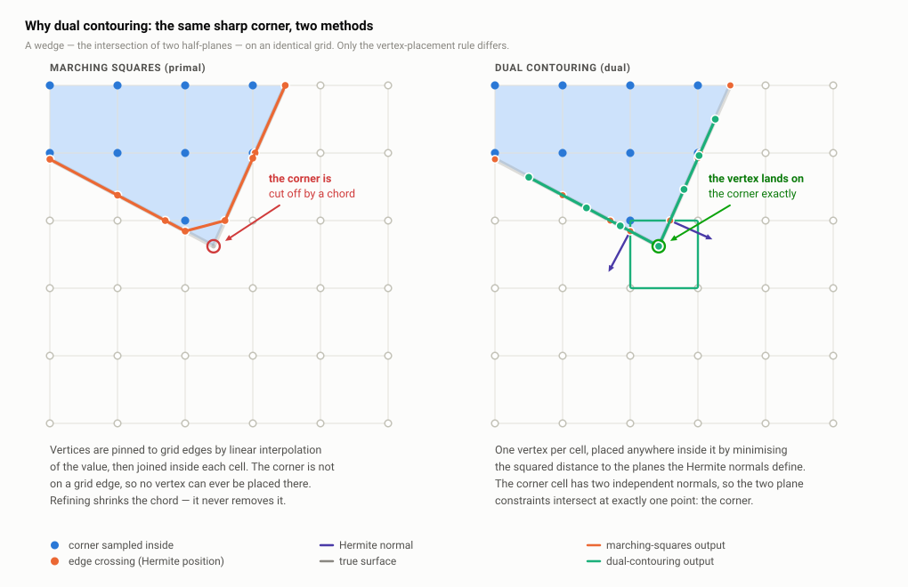
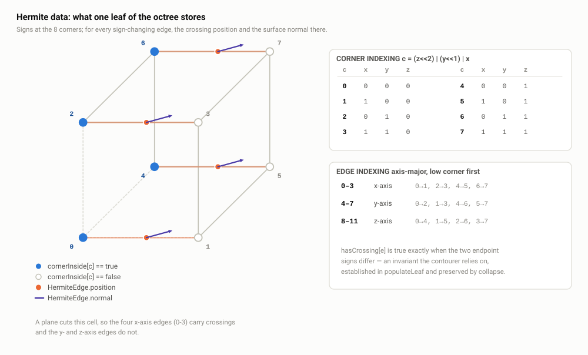
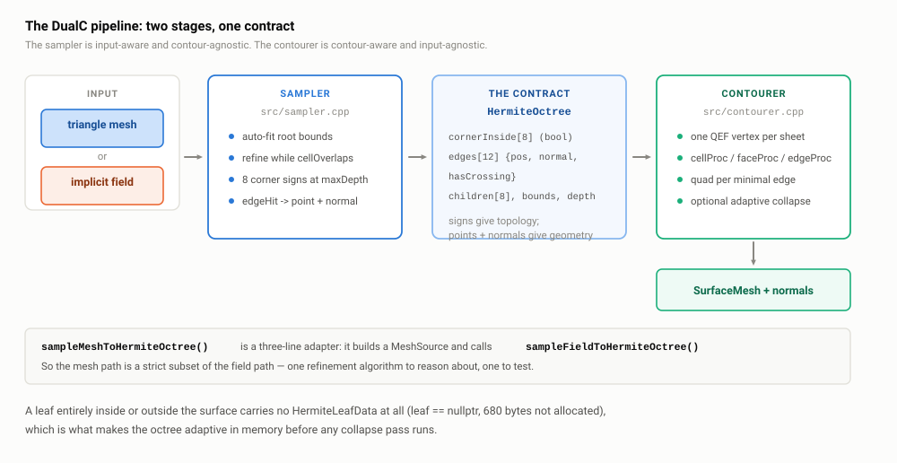

# A1 · Why dual contouring

> **In one paragraph.** Isosurfacing is the problem of turning a definition of "inside" —
> either a triangle mesh you want to re-mesh, or a scalar function `f(x,y,z)` whose zero
> level set is the surface — into a triangle mesh you can print, analyse or boolean again.
> Marching cubes solves it by putting vertices *on* grid edges, which structurally cannot
> reproduce a sharp corner at any resolution. Dual contouring puts one vertex *inside* each
> cell, free to move, and solves a small least-squares problem to place it exactly where the
> surface's tangent planes meet — so corners and creases survive. The price is that DC needs
> richer input than MC: not just corner signs, but the position **and normal** of every
> surface crossing on every cell edge. That richer input is called Hermite data, and in DualC
> it is the entire contract between the two halves of the library.

**Read this after:** nothing — this is the entry point.   **Time:** 45 min

## The problem: turning a definition of "inside" into triangles

You have one of two things.

1. A **triangle mesh** — a soup or a watertight shell — that you want to re-mesh: rebuild at
   a controlled resolution, repair, or clean up after a boolean.
2. A **scalar field** `f : R³ → R`, evaluated by code rather than stored. The surface is the
   set `{ x : f(x) = 0 }`, its *zero level set*. Convention here: `f < 0` inside, `f ≥ 0`
   outside. When `f` additionally returns the signed Euclidean distance to the surface it is
   called a **signed distance function** (SDF).

You want the same output in both cases: an indexed triangle mesh, ideally watertight and
manifold, that you can hand to a slicer, an FEA solver or another boolean.

This is not an academic exercise; it is the core loop of a CAD or additive-manufacturing
geometry kernel. Every implicit modelling tool — lattice infill, offsetting/shelling,
smooth blends, field-driven variable-thickness structures — is easy to *define* as a
function and impossible to *ship* until you can polygonise it. The polygonisation stage is
where a modelling idea either becomes a printable part or stays a picture.

The general name for the operation is **isosurfacing** (or polygonisation). Both of the
input forms above reduce to the second one: a mesh defines "inside" perfectly well, via an
inside/outside test and a ray query. DualC exploits exactly that reduction; see the
architecture section below.

## The family of solutions

### Marching cubes — the primal method

Overlay a uniform grid. At each of the 8 corners of a cell, evaluate the sign of `f`. The
8 signs form an 8-bit index into a lookup table of **256 cases**, which tells you which
triangles to emit and which grid edges their vertices sit on. Each vertex is placed on a
sign-changing edge by **linear interpolation of the corner values**:

```
t = f(a) / (f(a) - f(b));   v = a + t * (b - a)
```

MC is called *primal* because its vertices live on the primal grid's edges and its faces
live inside cells. It is simple, fast, embarrassingly parallel, and after Chernyaev's
marching cubes 33 (or Nielson's variants) it is provably topologically correct. It is the
default answer, and for smooth organic data it is the right answer.

### Dual contouring — the dual method

Same grid, same corner signs. But now:

- Emit **one vertex per cell** that contains the surface, placed *anywhere inside the cell*.
- For every grid **edge** whose two endpoint signs differ, emit a **quad** joining the four
  vertices of the four cells sharing that edge. (In 2D: one vertex per square, one segment
  per sign-changing edge.)

It is called *dual* because the output mesh is combinatorially the dual of the grid:
vertices ↔ cells, faces ↔ edges. There is no 256-case table; the connectivity rule is a
single sentence. Everything interesting moves into the question *where inside the cell does
the vertex go?* — which is answered by a quadratic error function (see **A3 · The QEF**).

### The others, in one line each

**Surface nets** (Gibson) is dual contouring with the QEF replaced by "the centroid of the
edge crossings" — cheap, robust, and it rounds every sharp feature, because the centroid
carries no directional information. **Marching tetrahedra** subdivides each cube into 5 or 6
tetrahedra and interpolates on those; a tetrahedron has no ambiguous cases, so the topology
is unconditionally consistent, at the cost of ~2× the triangles and a visible directional
bias from the tet decomposition.

### Comparison

| | Marching cubes | Surface nets | Dual contouring | Marching tetrahedra |
| --- | --- | --- | --- | --- |
| Vertex location | On grid edges (pinned) | Free in cell (centroid) | Free in cell (QEF) | On tet edges (pinned) |
| Sharp features | **Lost** at any resolution | Lost | **Preserved exactly** | Lost |
| Manifold output | Yes (with MC33) | Yes | Not automatically — needs Manifold DC | Yes, unconditionally |
| Adaptivity (octree, mixed depth) | Hard — cracks at T-junctions | Moderate | **Natural** — the JSW recursion handles it | Hard |
| Table complexity | 256 cases + tie-break rules | None | None (3 small descent tables) | 16 cases |
| Vertices per surface cell | 1–4, on edges | 1 | 1 (or 1 per surface sheet) | 1–4 |
| Input needed | Corner signs (or values) | Signs + crossing positions | Signs + crossing positions **+ normals** | Corner values |

## Why DC wins for this product

The decisive property is one sentence: **because the vertex position inside a cell is free,
DC can place it exactly at a sharp feature; MC structurally cannot.**



*Look at where the vertices are allowed to live: MC's are pinned to the grid edges, so the
corner is cut off; DC's single free vertex per cell lands on the corner itself.*

The reason MC cannot is worth stating precisely, because it is the argument you will be
asked to make. MC's vertex on a sign-changing edge is `a + t(b−a)` with `t` determined by
*linear interpolation of the value*. A true corner of a CAD part is a point where the value
function is **not** linear along the edge — it is a `min`/`max` of two or three linear
pieces, and its gradient is discontinuous there. Linear interpolation of two samples cannot
represent that; the interpolated point sits on the edge, and the corner point almost never
does. Halving the cell size halves the error but never removes it: the error is O(h) forever.
DC's vertex, by contrast, is chosen to minimise the squared distance to the *tangent planes*
recorded at the crossings, and three mutually orthogonal planes have exactly one
intersection — the corner. It is recovered exactly, at any resolution, from a single cell.

This matters for the two workloads DualC targets:

- **CAD parts.** Fillets, chamfers, bosses, counterbores, and the flat faces between them.
  A remesher that rounds every 90° edge produces a part that no longer fits its mating
  component and no longer measures as designed.
- **TPMS lattices and booleans over them.** A gyroid is smooth, but the moment you intersect
  it with a bounding box or a shell, you create a seam — a sharp crease where two surfaces
  meet at an arbitrary angle. That crease is a genuine feature of the part. MC rounds it and
  changes the wall thickness at every boundary cell.

DualC leans on this in a second, larger way. In the v2 implicit layer, a **hard boolean
returns the active operand's un-blended gradient** at the seam, so the QEF sees two
independent, correct planes and lands on the ridge automatically — no crease detection, no
feature tagging, no user annotation. That is the product claim in `CLAUDE.md` and it is only
available because the contourer is DC. See **A5 · The implicit field layer**.

The honest counter-arguments: DC is not automatically manifold (fixed here by Manifold DC,
default-on at `contourer.h:28`, covered in **A4**); DC's output vertices are less regular
than MC's; and DC needs strictly more information per cell — which is the next section.

## What DC needs that MC doesn't: Hermite data

**Hermite data** means, as in Hermite interpolation, *values plus derivatives*. For
isosurfacing, per cell it is exactly two things:

1. The **inside/outside sign** at each of the 8 corners. This determines the **topology** —
   which edges are crossed, therefore which quads exist, therefore the connectivity of the
   output mesh.
2. For every sign-changing edge, the **crossing position** and the **surface normal there**.
   This determines the **geometry** — each (position, normal) pair defines a tangent plane
   `n·(x − p) = 0`, and the cell's vertex is the least-squares intersection of those planes.

MC needs only item 1 (plus the corner values for the interpolation). Item 2's *normal* is
the entire difference, and it is the entire source of sharp-feature preservation: the normal
is the only channel through which "this surface is flat and facing this way" reaches the
solver. Take a cell straddling a cube's corner. With true face normals the three planes
carry `(1,0,0)`, `(0,1,0)`, `(0,0,1)`; `AᵀA` is the identity, condition number 1, and the
minimiser is exactly the corner (**A2** §7). Replace those with smoothed,
averaged normals and the planes become mutually inconsistent and the vertex slides off along
the bisector — which is precisely why `SamplerParams::interpolateNormals` (`sampler.h:31`)
is such a consequential default, discussed in **A2 · Sampling**.



*Look at the one sign-changing edge: it carries both a point on the surface and the surface's
normal at that point. The eight booleans give topology; the crossings give geometry.*

DualC stores this in two small structs (`include/dualc/hermite_octree.h:13-24`):

```cpp
struct HermiteEdge {
  Vector3 position{0.0, 0.0, 0.0};
  Vector3 normal{0.0, 0.0, 0.0};
  bool    hasCrossing = false;
};

struct HermiteLeafData {
  std::array<bool, 8>         cornerInside{};
  std::array<HermiteEdge, 12> edges{};
};
```

### The index conventions — know these cold

**Corner index** is a 3-bit packing of the corner's octant, documented at
`hermite_octree.h:20` and pinned by a test at `tests/test_octree.cpp:26-48`:

```
c = (z << 2) | (y << 1) | x        // x,y,z ∈ {0,1}
```

so corner 0 is the low corner `(0,0,0)`, corner 7 is the high corner `(1,1,1)`, and corner 5
is `(1,0,1)`. Flipping bit `k` of the index moves you along axis `k` — which is what makes
the edge and face tables derivable rather than magic.

**Edge index** is axis-major: edges 0–3 are X-aligned, 4–7 Y-aligned, 8–11 Z-aligned
(`src/internal/dc_tables.cpp:17-24`, `kEdgeEndpoints`), each listed low-corner first:

| Edge | 0 | 1 | 2 | 3 | 4 | 5 | 6 | 7 | 8 | 9 | 10 | 11 |
| --- | --- | --- | --- | --- | --- | --- | --- | --- | --- | --- | --- | --- |
| Axis | X | X | X | X | Y | Y | Y | Y | Z | Z | Z | Z |
| Endpoints | 0,1 | 2,3 | 4,5 | 6,7 | 0,2 | 1,3 | 4,6 | 5,7 | 0,4 | 1,5 | 2,6 | 3,7 |

Note the endpoint pairs always differ by exactly one bit — bit 0 for X edges, bit 1 for Y,
bit 2 for Z. `kEdgeAxis` (`dc_tables.cpp:26-30`) is just `e / 4`.

## The DualC architecture in one picture

Two stages, decoupled, joined by exactly one data structure.



*Look at what crosses the boundary: only signs, crossing positions and normals. No mesh, no
BVH, no field pointer, no notion of what produced the data.*

**Stage 1, the sampler** (`src/sampler.cpp`, `src/hermite_octree.cpp`). It walks an octree
adaptively over a mesh or a field, prunes cells the surface cannot reach, and populates the
surface leaves with Hermite data. Drivers: `sampleMeshToHermiteOctree` and
`sampleFieldToHermiteOctree` (`sampler.h:38-52`). It knows everything about meshes, BVHs,
ray parity, winding numbers and root finding — and nothing about dual contouring.

**Stage 2, the contourer** (`src/contourer.cpp`). It runs the Ju/Schaefer/Warren
`cellProc`/`faceProc`/`edgeProc` recursion over the octree, solves one QEF per surface
component per cell, and emits quads across minimal edges. Driver: `contourHermiteOctree`
(`contourer.h:51`). It knows everything about DC and nothing about where the data came from.

**The contract** is `HermiteOctree` (`include/dualc/hermite_octree.h`), and it is genuinely
the whole interface — three plain structs and a move-only owner:

```cpp
struct HermiteNode {
  BBox bounds{};
  int  depth  = 0;
  bool isLeaf = true;
  std::unique_ptr<HermiteLeafData> leaf{};
  std::array<std::unique_ptr<HermiteNode>, 8> children{};
};
```

`HermiteOctree` (`hermite_octree.h:34-56`) owns the root by `unique_ptr`, is move-only
(`:40-44`, copy `= delete`), and exposes `root()`, `setRoot()`, `leafCount()`, `nodeCount()`.
Ownership details are **B3**'s topic.

`src/pipeline.cpp:18-22` composes the two, with the optional collapse pass in between:

```cpp
HermiteOctree octree = sampleFieldToHermiteOctree(field, samplerParams);
if (contourerParams.simplificationError > 0.0) {
  simplifyHermiteOctree(octree, contourerParams.simplificationError);
}
return contourHermiteOctree(octree, contourerParams);
```

### Why the split earns its keep

Say this explicitly, because it is the strongest architectural point in the codebase: **the
mesh path is literally a subset of the field path.** `sampleMeshToHermiteOctree`
(`src/sampler.cpp:194-201`) has no sampling logic at all — it wraps the mesh in a
`MeshSource` (an `ImplicitField` backed by a BVH) as a stack temporary and delegates:

```cpp
MeshSource source(mesh, geometry, params.interpolateNormals,
                  params.signMethod);
return sampleFieldToHermiteOctree(source, params);
```

Three consequences worth naming:

- **One refinement algorithm** to reason about, profile and test, not two that drift apart.
- **Adding an input type never touches the contourer.** A new `ImplicitField` subclass — a
  voxel grid, a winding-number field over triangle soup, a TPMS — is sampled by the same
  code and contoured by the same code.
- **The contourer is testable in isolation** on hand-built `HermiteLeafData` with no mesh
  and no field anywhere in the fixture. The test suite does exactly this
  (`tests/test_contourer.cpp`); see **T · Testing**.

The cost of the split is real and should be conceded: the Hermite octree is a full
materialised intermediate. A populated leaf is ~680 bytes of payload
(8 bools + 12 × 56-byte `HermiteEdge`s) plus a ~128-byte node, in separate allocations (**B3** §3).
At `maxDepth = 9` on a complex part that is on the order of a gigabyte before a single
triangle exists. A fused sampler-contourer that never materialises the tree would be leaner
— and would be untestable in halves and unable to run the collapse pass. The library's
answer to the memory cost is tiling, not fusion (`dualc_field --tile-depth`, `--mem`).

## Two design consequences to notice early

**(a) The contract is sign-based, not value-based.** A leaf stores
`std::array<bool, 8> cornerInside` — booleans, *not* the corner SDF values. This is what lets
the mesh path and the field path share the contourer verbatim: a triangle mesh has no
meaningful scalar value at a corner, only an inside/outside answer from a ray-parity,
pseudonormal or winding-number oracle. Making the contract sign-based means "inside" is the
only concept both worlds must agree on.

It costs you one thing, and it is a real cost. When a cube face has **four** edge crossings,
the surface can be paired across that face in two topologically different ways — the classic
saddle ambiguity. Schaefer's **asymptotic decider** resolves it exactly, but it needs the
corner *values* to evaluate the bilinear interpolant on the face. With only booleans, DualC
falls back to a documented heuristic — pair the two crossings that share an inside corner
(`src/internal/cube_components.cpp:104-110`, honest about it at `cube_components.h:24-27`).
The fix, if you ever want it, is 8 doubles per leaf (64 B) and no algorithmic change.
Forward reference: **A4 · The contouring recursion**.

**(b) An empty leaf has `leaf == nullptr`.** A cell entirely inside or entirely outside the
surface carries no payload — the sampler calls `node.leaf.reset()` on the pruned branch
(`src/sampler.cpp:105-109`). Only leaves at exactly `maxDepth` that the surface may pass
through get the 680-byte struct. That is what makes the octree adaptive *in memory* before
any simplification runs: the tree is dense only in a thin shell around the surface, and the
interior and exterior cost one 128-byte node each at whatever depth they were pruned.
Downstream, `leaf == nullptr` is also the contourer's "nothing here" signal — `collectLeaves`
skips such nodes, and `edgeProc` bails when the finest cell has no leaf
(`contourer.cpp:571`).

## Where the rest of the library sits

The two stages above are the core, and they are ~2,000 lines. Everything else is layered on
top of the `ImplicitField` interface, not inside the core. The **v2 implicit layer**
(`src/implicit/`, public via `include/dualc/implicit.h`) is a composable tree of ~30 analytic
primitives, hard and smooth boolean combinators, decorators and domain operators, each a
node with `valueAt` / `gradientAt` / `bounds` — this is where the sharp-feature gradient
trick lives (**A5**, with the C++ design in **B2**). The **field-graph front end**
(`examples/field_graph.*`, driving `dualc_field`) parses a JSON or `--expr` description into
that tree so a whole composed model contours in one pass rather than round-tripping through
meshes (**B1** for the layering, **A5** for the semantics). The **GPU previewer**
(`examples/field_glsl.*`, `dualc_field_view`) compiles the same graph to a GLSL `sceneSDF()`
and raymarches it, with `dualc_glsl_parity` as the per-node GPU-vs-C++ acceptance gate
(**T**). None of these are inside `libdualc`'s dependency footprint (**B5**).

## A note on the stale design doc

The repo ships `docs/ARCHITECTURE.md`, and it describes a contourer that no longer exists.
Read it and you will walk into the interview with five false beliefs. Verified against the
shipped code:

| `docs/ARCHITECTURE.md` claims | Reality |
| --- | --- |
| The contourer is a flat canonical-edge enumeration over a `cellKey`-indexed hash map | No such code. `grep -rn "cellKey" src/ include/` → zero hits |
| It only works for **uniform-depth** leaves; the recursion "is the next major piece of work" | The full JSW recursion ships at `contourer.cpp:506-598`, mixed-depth-aware via `childOrSelf` (`:523`) and the finest-cell rule (`:565`) |
| `simplificationError` is "currently ignored" | Wired at `pipeline.cpp:19-21` → `simplifyHermiteOctree` (`contourer.cpp:606`) with three topology gates |
| Manifold dual contouring is "not yet implemented" | Implemented and **default-on** (`contourer.h:28`), via `partitionCubeEdges` (`cube_components.cpp:47`) |
| `SignMethod::PSEUDONORMAL` is a no-op routing to parity | Fully implemented Bærentzen–Aanæs test (`sign_oracle.cpp:31-40`) with five unit tests |
| `edgeHit` uses bisection | Mesh path is exact ray–triangle (`mesh_source.cpp:106-110`); field path is 6-step Illinois false position (`implicit_field.cpp:23-69`) |

One claim in it *is* still true: `weldEdges` (`contourer.h:23`) is a dead parameter,
referenced nowhere else in the library.

**Raise this yourself.** The doc is in the repo; an interviewer may well have read it. Being
shown "your own architecture doc says X" and not knowing is much worse than opening with "the
`ARCHITECTURE.md` in the repo is stale by two major features — here is what actually ships,
and the authoritative record is `docs/roadmap/01-core-dual-contouring.md`." It converts an
ambush into evidence that you audit your own documentation.

## Key terms

| Term | Meaning |
| --- | --- |
| Isosurface | The set `{x : f(x) = c}`; here always `c = 0`, the zero level set |
| SDF | Signed distance function — an `f` whose magnitude is the true distance to the surface and whose gradient is unit-length |
| Polygonisation / isosurfacing | Converting an isosurface into a triangle mesh |
| Primal method | Output vertices lie on the grid (MC, marching tetrahedra) |
| Dual method | Output vertices lie inside grid cells; faces correspond to grid edges (DC, surface nets) |
| Hermite data | Values *and* derivatives: here, corner signs + per-crossing (position, normal) |
| Sign-changing edge | A cube edge whose two endpoints differ in inside/outside — exactly the edges that carry crossings |
| Minimal edge | The finest grid edge shared by four cells; each one emits one quad in DC |
| QEF | Quadratic error function `E(x) = Σ (nᵢ·(x − pᵢ))²`, minimised to place a cell's vertex (**A3**) |
| Manifold DC | Placing one vertex per *surface component* in a cell rather than one per cell, to guarantee manifold output (**A4**) |
| Asymptotic decider | Schaefer's exact resolution of the face saddle ambiguity; needs corner *values*, which DualC does not store |
| Pseudo-leaf | An internal node turned into a leaf by the collapse pass, carrying merged Hermite data |
| `HermiteOctree` | The single data structure connecting sampler and contourer |

## If they ask…

**"Why not marching cubes?"**

Because MC's vertices are pinned to grid edges by linear interpolation of the corner values,
and a sharp corner is exactly the place where the value is not linear along an edge. The
interpolated point lands on the edge; the corner does not. That error is O(cell size) and
never goes away — you cannot refine your way out of it. DC places one vertex freely inside
each cell by minimising squared distance to the tangent planes recorded at the crossings, and
three orthogonal planes intersect in exactly one point: the corner. For CAD parts and for the
seams where a lattice meets its bounding solid, that is the difference between a part that
measures correctly and one that doesn't. MC would be the right choice for smooth medical or
scientific volume data, where there are no sharp features to lose.

**"Why not just use OpenVDB, libigl or CGAL?"**

Different products. OpenVDB's mesher is a marching-cubes-family surfacer over a sparse
narrow-band grid — excellent at scale, but it does not preserve sharp features, which is the
one thing this library exists to do. CGAL has the algorithms but is GPL/LGPL for the parts
that matter, and this project's vendoring policy is permissive-only — MIT/BSD/PD, no
GPL/LGPL copies, re-implement rather than copy (`THIRD_PARTY.md`); that is a hard constraint
when the output is a commercial plugin. libigl is a research toolkit rather than a kernel,
and pulling it in would drag Eigen-heavy headers through the whole build. DualC is
deliberately small: one dependency (geometry-central, a sibling checkout, not vendored), a
public surface of five headers, and one differentiating feature — sharp features preserved
automatically from composed SDFs, because hard booleans hand the QEF the active operand's
un-blended gradient.

**"What exactly is Hermite data, and why do you need the normals?"**

Hermite data is values plus derivatives. Per cell: an inside/outside sign at each of the
8 corners, and for each sign-changing edge the crossing position *and* the surface normal
there (`hermite_octree.h:13-24`). The signs give topology — they decide which edges are
crossed and therefore which quads exist. The normals give geometry: each (position, normal)
pair is a tangent plane, and the cell's single vertex is the least-squares intersection of
those planes. Without the normals you have surface nets — you can only take the centroid of
the crossings, which is the average of points *on* the surface and therefore always rounds a
corner. The normal is the only channel through which "this surface is flat and faces this
way" reaches the solver, which is also why the choice between interpolated per-vertex normals
and true face normals (`sampler.h:29-31`) decides whether sharp features survive at all.

**"Your architecture doc says the contourer only handles uniform depth — is that true?"**

No, and I'd flag that `docs/ARCHITECTURE.md` is stale before you find it. It describes a flat
canonical-edge enumeration keyed by a `cellKey` hash map; that code no longer exists — grep
for `cellKey` and you get zero hits. What ships is the real Ju/Schaefer/Warren
`cellProc`/`faceProc`/`edgeProc` recursion (`contourer.cpp:506-598`), and it is explicitly
mixed-depth: `childOrSelf` (`:523`) lets a coarse leaf stand in for its own children, and the
terminal case reads signs from the **finest** of the four cells around an edge (`:565`) —
getting that backwards was a real bug that produced thousands of boundary edges after
collapse. The same doc also wrongly says `simplificationError` is ignored, Manifold DC is
unimplemented, and `PSEUDONORMAL` is a no-op; all three are false. The authoritative record
is `docs/roadmap/01-core-dual-contouring.md`; the doc needs deleting or rewriting.

**"What guarantees do you have that the output is watertight?"**

Test-enforced invariants, not proofs. `tests/test_demo_meshes.cpp` runs the full mesh→mesh
pipeline on **8 procedurally generated meshes** and asserts, for each, both `boundaryEdges
== 0` and an **exact** Euler characteristic (`:52-101`): χ = 2 for the icosphere, UV-sphere,
cylinder and L-bracket; χ = 0 for the torus, trefoil knot and bored hex prism; χ = −2 for the
genus-2 double torus. Exact integers, not tolerances — any change that merges a neck, splits
a thin wall or leaks a hole flips χ and names the offending fixture. Manifoldness is
separately handled by Manifold DC (default-on, `contourer.h:28`), measured on a real part at
3 non-manifold edges without it and 0 with it. The honest gap: the **collapse** path
(`simplificationError`) has zero test coverage — no test in the suite sets it to a non-zero
value — so its documented topology guarantees are unverified. That is the first test I would
write. Full picture in **T · Testing**.

**"If a mesh is just another field, why have a mesh entry point at all?"**

Convenience and a slightly different default set, nothing more. `sampleMeshToHermiteOctree`
(`sampler.cpp:194-201`) is three lines: construct a `MeshSource` on the stack, forward to
`sampleFieldToHermiteOctree`. That's the design working — there is exactly one refinement
algorithm. It's also where a real bug lives that I'd volunteer: the *pipeline* overload
`dualContourMesh` (`pipeline.cpp:34`) constructs `MeshSource` without the 4th argument, so it
silently drops `SamplerParams::signMethod` and always uses the default parity oracle. A user
asking for generalized winding numbers on triangle soup gets parity on triangle soup. One-line
fix, plus a test asserting the two entry points agree — no existing test covers the pipeline
overload with a non-default sign method.

**"Isn't materialising the whole octree wasteful?"**

Yes, measurably. A populated leaf is ~680 bytes of Hermite payload plus a ~128-byte node, in
two separate allocations, and only leaves at exactly `maxDepth` carry data. At depth 9 on a
complex part that is order-of-gigabyte before any triangle exists. The defence is that the
intermediate is what makes the two halves independently testable and what makes the collapse
pass possible at all — you cannot simplify a tree you never built. The mitigation shipped is
tiling rather than fusion: `dualc_field --tile-depth D` contours in grid-aligned tiles and
streams the mesh out, with a measured ~49× lower peak RAM and bit-identical STL output, and
`--mem 4G` picks `D` automatically. A pool allocator for the nodes is the obvious remaining
win and is not there.

## One-minute recap

- Isosurfacing turns "what is inside" — a mesh or a scalar field `f` — into a triangle mesh.
  It's the core loop of any CAD/AM geometry kernel.
- **Marching cubes** is primal: vertices on grid edges, 256-case table, vertex placed by
  linear interpolation of the corner values. Sharp features are lost at every resolution.
- **Dual contouring** is dual: one free vertex per cell (QEF-placed), one quad per
  sign-changing grid edge. Sharp features recovered exactly, from a single cell.
- DC's extra requirement is **Hermite data**: 8 corner signs (topology) + per-crossing
  position **and normal** (geometry). The normal is the whole difference.
- Conventions: corner `c = (z<<2)|(y<<1)|x`; edges axis-major, 0–3 X, 4–7 Y, 8–11 Z
  (`dc_tables.cpp:17-24`).
- DualC is two decoupled stages joined by `HermiteOctree` alone (`hermite_octree.h`):
  sampler = input-aware/contour-agnostic, contourer = contour-aware/input-agnostic.
- The mesh path is a strict subset of the field path — `sampleMeshToHermiteOctree`
  (`sampler.cpp:194-201`) is a 3-line wrapper around a `MeshSource`. One algorithm, one test
  surface, new input types never touch the contourer.
- The contract stores `std::array<bool,8> cornerInside`, not corner values — which is why it
  works for meshes and fields alike, and why the saddle ambiguity uses a heuristic instead of
  Schaefer's asymptotic decider (`cube_components.h:24-27`).
- An empty leaf has `leaf == nullptr` (`sampler.cpp:105-109`): no 680-byte payload, so the tree
  is memory-adaptive before the collapse pass ever runs.
- `docs/ARCHITECTURE.md` is stale on five counts (flat enumeration, uniform depth only,
  `simplificationError` ignored, MDC missing, `PSEUDONORMAL` a no-op). Raise it first.
- Watertightness evidence: 8 procedural meshes, `boundaryEdges == 0` and exact
  χ ∈ {2, 0, −2}, in `tests/test_demo_meshes.cpp:52-101`.
