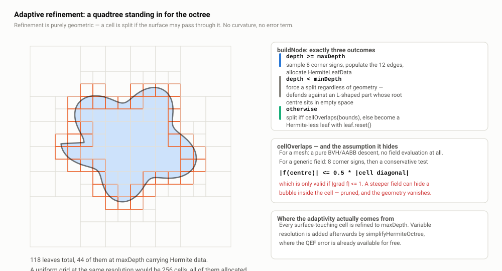
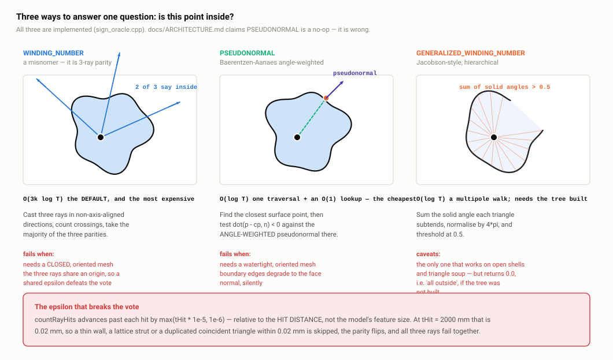
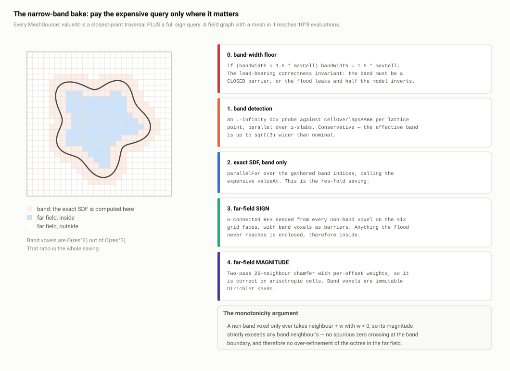

# A2 · Sampling: octree, BVH and sign oracles

> **In one paragraph.** The sampler is the input half of DualC. It takes a triangle mesh or an arbitrary implicit field and produces a `HermiteOctree`: an adaptive octree whose leaves at `maxDepth` carry eight corner inside/outside flags plus, on every sign-changing edge, the surface crossing point and the normal there. Refinement is purely geometric — split if the surface may pass through, prune otherwise — with no curvature or error term, so the tree is a deterministic function of geometry alone. The mesh path is not a special case: `sampleMeshToHermiteOctree` wraps the mesh in a `MeshSource` implicit field and calls the field path (`src/sampler.cpp:194-201`), so there is one refinement algorithm to reason about. Everything expensive underneath — inside tests, edge crossings, closest points — is served by one `MeshBVH` over packed `float` buffers.

**Read this after:** A1 · Why dual contouring   **Time:** 75 min

## 1. The job

The contourer (**A4**) needs one thing: a `HermiteOctree`. For every leaf the surface passes through it needs the **eight corner signs** (`cornerInside`), which determine topology, and for each of the twelve cube edges whose endpoints disagree, a **Hermite sample** — the crossing position plus the surface normal there. "Hermite data" means value plus derivative; here a point plus a normal, together a tangent plane. **A1** covers why that pair is what lets dual contouring recover a sharp corner.

The sampler must produce that while (a) not descending into empty space and (b) never missing surface. Those goals are in tension, and most decisions below are a position on that trade-off.

`SamplerParams`, `include/dualc/sampler.h:19-36`:

| Field | Default | What it does |
| --- | --- | --- |
| `maxDepth` | `7` | Depth at which refinement stops and a leaf is populated. Resolution is `2^maxDepth` cells per axis. Checked first and unconditionally. |
| `minDepth` | `3` | Floor: cells shallower than this always split, even if the pruning test says "no surface here". |
| `rootBounds` | unset | Explicit root box (`std::optional<BBox>`). Unset means auto-fit from `field.bounds()`, padded. |
| `padFraction` | `0.05` | Outward padding on the auto-fitted box only. Never applied to an explicit `rootBounds`. |
| `signMethod` | `WINDING_NUMBER` | Which inside/outside oracle: 3-ray parity, pseudonormal, or generalized winding number. |
| `interpolateNormals` | `true` | Mesh Hermite normal is a barycentric blend of area-weighted vertex normals (smooth) or the hit triangle's face normal (sharp). |
| `numThreads` | `0` | Workers for the build; `0` means all hardware threads. Output is bit-identical regardless (**B4**). |
| `seed` | `0` | **Dead.** `src/sampler.cpp:190` is `(void)params.seed;` and nothing else reads it. |

Volunteer the dead `seed`: harmless, but public API that does nothing is a liability. Note also that **neither depth is validated** — `minDepth > maxDepth` is not an error (`maxDepth` wins because it is tested first), a negative `maxDepth` produces an immediately-populated root leaf, and `maxDepth = 20` exhausts memory rather than failing fast.

## 2. Root bounds resolution

`src/sampler.cpp:160-172` has three outcomes, and the asymmetry is worth knowing cold.

1. **Explicit `rootBounds` is used verbatim, with no padding.** If you supply a box, you own it. `tests/test_sampler.cpp:100-109` asserts exact equality of `root()->bounds` with the supplied box, so this is a tested contract.
2. **Infinite bounds throw `std::invalid_argument`**, with a message naming the likely cause (a plane, an infinite cylinder) and the fix (set `rootBounds`). That is what an exception message should look like. `BBox::isInfinite()` (`src/hermite_octree.cpp:39-44`) is an exact `== ±inf` test on all six components — it recognises the `BBox::infinite()` *sentinel*, not a box that merely has one infinite component.
3. **Invalid bounds silently become the unit cube** `[-0.5, 0.5]³` (`:171`). An empty mesh, a NaN, or a box with one infinite component (which fails `isValid()`, `hermite_octree.cpp:29-34`, but is not the sentinel) all land here. No warning, no throw — you get nonsense output with no diagnostic. This is the rung to concede.

### `padBBox` and anisotropic cells

`src/sampler.cpp:21-28`:

```cpp
const Vector3 ext = b.extent();
const double maxDim = std::max({ext.x, ext.y, ext.z, 1e-12});
const Vector3 pad{maxDim * padFraction, maxDim * padFraction, maxDim * padFraction};
```

Padding is **isotropic in world units, derived from the largest extent** — not per-axis. The purpose is to guarantee the surface never touches the root boundary at any aspect ratio; a surface touching the root face would have crossings on cells with no neighbour, and the contourer would leave a hole.

The consequence is a likely interview question. For a 100 × 1 × 1 plate, `maxDim = 100`, so every axis is padded by 5 units — 5% on the long axis, 500% on each thin one, giving a 110 × 11 × 11 root. `internal::childBounds` (`src/internal/octree.cpp:25-37`) splits at the per-axis midpoint, so every cell inherits that aspect ratio: **octree cells are anisotropic boxes, not cubes.**

That is sound, because everything downstream is metric-free — the DC tables index corners and edges by topology, not length, and the QEF (**A3**) fits planes in world space without assuming a unit cell. But effective resolution differs per axis by the aspect ratio: `maxDepth = 7` on a thin plate gives 128 divisions along it and ~13 useful ones through its thickness. Padding is correct; the resolution consequence is real and undocumented.

Padding is also applied **twice** on the GWN path: `WindingNumberField::bounds()` already pads by 10% of the diagonal (`src/implicit/winding_field.cpp:36-38`), then the sampler pads again. `MeshSource::bounds()` returns the unpadded AABB (`src/implicit/mesh_source.cpp:98-100`) with a comment saying padding is the sampler's job. Two mesh-backed fields, two conventions — documented, but inconsistent.

## 3. The refinement recursion



*Look at the three leaf kinds: white cells pruned early, the uniform ring of forced splits down to `minDepth`, and the fine band at `maxDepth` where Hermite data actually lives.*

`buildNode` (`src/sampler.cpp:89-120`) is 32 lines with exactly three outcomes:

- **Max-depth leaf** (`:91-100`). `depth >= maxDepth` is tested first. Evaluate eight corner signs via `field.isInside(cornerPosition(...))`, mark leaf, call `populateLeaf`.
- **Pruned leaf** (`:105-109`). At or past `minDepth`, and `field.cellOverlaps(node.bounds)` says no: set `isLeaf = true` and `node.leaf.reset()` — a null `unique_ptr`. The cell exists in the tree as an empty leaf and carries no data.
- **Eight-way split** (`:111-119`). Otherwise allocate eight children via `internal::childBounds` and recurse.

Three properties to state without hesitating:

- **Only leaves at exactly `maxDepth` carry Hermite data.** The octree is therefore *uniform-depth wherever it has data*. The "adaptive" part is purely a memory optimisation over empty space, not variable surface resolution. That is added afterwards by `simplifyHermiteOctree` (`src/pipeline.cpp:19-21`).
- **The criterion never looks at curvature, feature size or error.** `src/sampler.cpp:87-88` is explicit: *"Refinement is purely geometric: the cell is split if the field's surface may pass through it. minDepth is a floor."*
- **`minDepth` is a floor, not a guarantee of data.** A cell forced to split may still have all eight children pruned.

### Why refinement is not error-driven

This is **the biggest algorithmic difference from Ju/Schaefer/Warren's adaptive scheme**, and anyone who knows the 2002 paper will ask. Concede it, then defend it three ways.

**The adaptivity was moved downstream, not dropped.** The collapse pass (**A4**) walks the finished tree bottom-up and merges eight children into their parent when the merged QEF residual stays under `simplificationError` and three topology gates pass. Same behaviour, applied where the QEF error is *already available for free* — the matrices were accumulated anyway. Estimating error during refinement would mean solving QEFs speculatively in cells you are about to split.

**A geometric criterion makes the tree a pure function of geometry**, which is what makes the parallel build trivially deterministic: every frontier subtree builds independently with no shared state and no ordering dependence, bit-identical at any thread count (**B4**). An error-driven criterion referencing a running global tolerance would not have that for free.

**The criterion is cheap and conservative in the right direction** — over-refinement costs time, under-refinement loses geometry. Except in one case, which is §4.

`minDepth`'s real purpose follows. It stops the pruning test being applied to cells so large that `cellOverlaps` is uselessly conservative or, worse, wrong: a large cell is exactly where the Lipschitz centre test is least reliable and where a small object can slip between the corners. It also guarantees a wide parallel frontier — at `minDepth = 3` the fork frontier is exactly 512 nodes (`src/sampler.cpp:180`).

## 4. `cellOverlaps` — and the Lipschitz assumption

Semantics differ radically by field type.

**For `MeshSource`** (`src/implicit/mesh_source.cpp:112-114`) it is a pure BVH-AABB descent — `impl_->bvh.cellOverlapsAABB(cell)` — with **no field evaluation at all**. It is conservative to BVH-leaf granularity: it returns `true` at the first BVH leaf whose box overlaps, so it can say yes when no triangle touches. Exactly right for a refinement predicate.

**For a generic field** it is the base implementation (`src/implicit/implicit_field.cpp:88-114`): eight corner sign tests returning `true` on the first disagreement, then, if all eight agree:

```cpp
// For non-Lipschitz fields this can under-refine; the
// corner test above still catches anything reaching a corner.
const Vector3 ext = cell.extent();
const double  halfDiag = 0.5 * ext.norm();
return std::abs(valueAt(cell.center())) <= halfDiag;
```

The reasoning: if `f` is a true signed distance, `|f|` *is* the distance to the surface, so a surface point can only be inside the cell if `|f(centre)|` is at most the distance from centre to the furthest cell point — the half diagonal. Exact and conservative for a Lipschitz-1 field.

**This is the load-bearing precondition of the whole refinement strategy, and it is not machine-checkable.** Say that plainly.

### The failure

Any field with `|∇f| > 1` breaks it. Scale a field by 3 and `f(centre) = 0.9` means the surface is 0.3 away, not 0.9 — but the test compares 0.9 against the half diagonal and prunes. Concretely: a surface bubble entirely inside a cell, touching no corner (so the sign test sees nothing) and reading large at the centre (so the Lipschitz test prunes). **The cell becomes an empty leaf and geometry silently vanishes**, with no way to detect it short of eyeballing the output.

The violators are not exotic: **TPMS trig fields** (gradient magnitude up to `√3·k = √3·2π/λ` — about 22 at `λ = 0.5 mm` — and multiple sheets per cell), **any scaled SDF** (domain scale by *s* multiplies the gradient by 1/*s*), **`WindingNumberField::valueAt`** (a pseudo-SDF bounded by 0.5, not a metric), and most **smooth-blend** outputs.

### The escape hatches, and where they run out

- **TPMS primitives override `cellOverlaps` to return `true` unconditionally** — `src/implicit/primitives_tpms.cpp:54`, `:70`, `:93`, `:113`, `:143`, `:162`. Never prune a periodic field. Blunt and correct.
- **Combinators forward**: `a_->cellOverlaps(c) || b_->cellOverlaps(c)` (`src/implicit/combinators.cpp:67-68`, `:93-96`), with the smooth variants expanding the cell by the blend radius first (`:201-203`) and the case that can bulge into a cell touching neither operand returning `true` outright (`:304`).
- **Decorators forward the child's answer**, expanding where they thicken: `child_->cellOverlaps(expandBBox(cell, std::max(t_, 0.0)))` for offset (`src/implicit/decorators.cpp:68-69`), likewise shell and onion (`:109-110`, `:161-162`), plain pass-through at `:301-302`.
- **The domain operators do not.** `src/implicit/domain_ops.cpp` has no override at all. So `mirror`, `repeat`, `repeat-limited`, `twist`, `bend`, `displace` — every one of which can change the effective Lipschitz constant, and `twist`/`bend` provably do — fall back to the base test. That is the live gap; see **A5**.

**The fix:** a `virtual double lipschitzBound() const { return 1.0; }` on `ImplicitField`, with the test becoming `|f(centre)| <= K * halfDiag`. Every library field knows its own scaling — a scaled primitive returns `1/s`, a TPMS its analytic bound, `WindingNumberField` infinity (never prune). Roughly fifteen lines plus per-field overrides, and it makes the assumption *declared* rather than implicit. The heavier alternative is interval arithmetic for a genuinely conservative test.

## 5. Capturing the Hermite edge crossing

`populateLeaf` (`src/sampler.cpp:39-85`) walks the twelve edges, reading endpoint pairs from `tables::kEdgeEndpoints` (`src/internal/dc_tables.cpp:17-24`; 0–3 X-aligned, 4–7 Y, 8–11 Z) and skipping edges whose endpoints agree (`:49`).

### The direction convention

```cpp
// Always query from the outside endpoint towards the inside one, so the
// reported crossing is the surface entry point.
const bool hit = sa ? field.edgeHit(b, a, outP, outN)
                    : field.edgeHit(a, b, outP, outN);
```

`sa` is the low corner's sign. Both `MeshSource::edgeHit` and `WindingNumberField::edgeHit` resolve to a **first-hit** ray query, so this normalisation is not cosmetic: on a thin feature or a self-intersecting region an edge can cross three times, and first-hit-from-outside deterministically yields the **entry** point. Without the flip, which of the three you record would depend on the arbitrary edge orientation baked into the table.

### Mesh path — exact, no iteration

`MeshSource::edgeHit` (`src/implicit/mesh_source.cpp:106-110`) forwards straight to `MeshBVH::segmentFirstHit`. **There is no root-finding on the mesh path.** The crossing is the analytic ray/triangle intersection from nanort (`src/internal/mesh_bvh.cpp:395-453`), with `min_t = 0`, `max_t = |b - a|`.

Why that is right: for a triangle mesh the crossing is *exactly computable in closed form*, so root-finding on `valueAt` would be both **less accurate** (iterating towards something solvable) and **far slower** — each `MeshSource::valueAt` costs a closest-point traversal *plus* a full sign query (§11), so a six-step solver would be a dozen traversals instead of one.

### Generic field path — Illinois false position, not bisection

`ImplicitField::edgeHit` (`src/implicit/implicit_field.cpp:23-69`). **Flag the doc drift immediately:** `include/dualc/implicit.h:48` says the default "brackets by endpoint sign and bisects on valueAt", and `docs/ARCHITECTURE.md:274` says "default: bisection". Both are wrong against shipped code; the comment in the implementation file (`implicit_field.cpp:9-12`) is correct.

1. Evaluate both endpoints; **return `false` if they do not straddle** — `if ((va < 0.0) == (vb < 0.0)) return false;` (`:29`).
2. Seed with the linear regula-falsi estimate `tStar = va / (va - vb)` (`:38`).
3. Up to **six** Illinois-modified false-position steps: when the same bracket end is retained twice running, its stored value is halved (`:49`, `:53`), breaking the classic false-position stall where one end never moves on a convex function.
4. Early exit on `|f| ≤ 1e-9` (`:45`) or bracket ≤ 1e-6 (`:56`).
5. **Final answer is the bracket midpoint**, `tStar = 0.5 * (tLo + tHi)` (`:63`).
6. Normal is normalised `gradientAt(outP)` (`:65-67`), zero vector below `1e-12`.

Constants at `implicit_field.cpp:13-15`. Cost: **2 + at most 6 = 8 `valueAt` calls plus 1 `gradientAt`**.

**Why six is enough.** An implicit field is close to a signed distance, so along a *short cube edge* — at `maxDepth = 7`, 1/128 of the root box — it is near-linear. The linear seed is therefore already nearly exact and the six steps are corrections, not a search. False position converges superlinearly on a smooth function, so six steps push the residual far below the geometric error of the cell itself. More steps would add digits to a number whose leading error is the cell size.

**Where it degrades.** A hard boolean produces a C0 kink: `max(a, b)` is V-shaped at the seam. False position on a V is **no better than bisection**, and six bisections shrink the bracket only 64×, so on an edge of length `h` the worst-case positional error is `h/64` — visible on a seven-level octree. The guarantee is bisection-quality, not superlinear, and you should say so rather than claim uniform accuracy.

**The wart.** Step 5 returns the bracket midpoint rather than `tStar`, the superlinear estimate from the last accepted step — throwing away up to a full order of accuracy. It is the conservative choice (the answer is guaranteed inside the bracket, so you never report a point off the edge), but `tStar` is almost always better and is also inside the bracket by construction, since the loop re-bisects if it is not (`:42`).

### The normal comes from `gradientAt(outP)`

`implicit_field.cpp:65-67`. **This is the single line that makes sharp-feature preservation work on the implicit path.** The QEF (**A3**) has exactly one channel through which sharpness reaches it: the normals. Because a hard boolean's `gradientAt` returns the *active operand's un-blended gradient* — not an average, not a smoothed derivative — two samples either side of a union seam carry genuinely independent plane normals, and the minimiser lands on the ridge where those planes meet. That mechanism is **A5**'s subject; here, note only that the sampler asks for the gradient and records it verbatim.

## 6. The miss fallback ladder

`src/sampler.cpp:60-81`. The subtlest part of the sampler and a strong "why did you do that?" question.

### Why a miss is possible at all

It sounds like a contradiction: the corner signs *disagree*, so there is definitely a crossing — how can the query fail? Because **the sign and the crossing come from two independent oracles**. The sign is `field.isInside` — on the mesh path a `SignOracle` ray-parity or pseudonormal test, computed in `double` from `double` corner positions. The crossing is `segmentFirstHit`, a **`float`** BVH ray query. Different algorithms, different precisions. They disagree at grazing incidence, at T-junctions, on sliver triangles lost to single precision, or when the parity ray's advance epsilon skips a coincident surface (§8). The signs are authoritative for topology because they drive the DC tables, so the sampler must produce *something*.

The ladder: use the ray hit; else substitute `closestSurfacePoint(midpoint)`; else `(midpoint, zero normal)`.

### `hasCrossing = true` in all three branches — deliberately

The contourer keys topology entirely off `hasCrossing`. Dropping the edge would leave the four cells around it without their quad and **tear the mesh**. So the flag is always set and the degenerate case is filtered one level down, at the QEF specifically — `src/contourer.cpp:92-93` (and again `:257-258`):

```cpp
if (!he.hasCrossing) continue;
if (he.normal.x == 0.0 && he.normal.y == 0.0 && he.normal.z == 0.0) continue;
```

A degenerate edge therefore contributes **connectivity but no plane constraint**. This split — **topology from signs, geometry from planes** — is genuinely good design and is the strongest thing to lead with about the sampler. A failure in the geometric query degrades the *position* of one vertex, locally, while the mesh stays watertight and manifold. The naive alternatives are worse: dropping the edge tears the mesh, and inserting a zero normal as a real constraint feeds a zero row into the QEF's normal matrix, which is not merely useless but biases the mass point.

### The weak rung

`field.closestSurfacePoint(mid, ...)` returns the closest surface point **to the edge midpoint** — for `MeshSource` an exact BVH query (`mesh_source.cpp:116-120`), but the answer may be nowhere near the edge. If the miss was a grazing hit, the closest point is a fraction of a cell away and the substitution is excellent. If the *sign oracle was simply wrong* — a parity error from the advance epsilon — there is no crossing on this edge at all, the closest surface point could be a full cell away, and it is fed to the QEF as a **full-weight plane constraint** that drags the vertex with it.

There is **no distance sanity check**. The guard is one line: `if ((cpP - mid).norm() > cellDiagonal)` fall through to the zero-normal branch. That converts an unbounded geometric error into a locally-degraded but topologically sound cell. Raise it yourself.

For a generic field, `ImplicitField::closestSurfacePoint` (`implicit_field.cpp:71-86`) is a **single Newton step**, `outP = q - g * (f / m)`, plus one gradient re-evaluation: 1 `valueAt` + 2 `gradientAt`. Exact for a true SDF, arbitrarily wrong for a non-metric field.

## 7. `interpolateNormals` — the sharp/smooth switch

`MeshBVH::segmentFirstHit`, `src/internal/mesh_bvh.cpp:430-451`: either a barycentric blend `n0*w + n1*u + n2*v` of the three vertex normals, or `triFaceNormal(tri)`. The per-vertex normals are **area-weighted normals recomputed by geometry-central** in `packMesh` (`:127-140`) — not the file's `vn` block, which `SimplePolygonMesh` discards (`:128-130`). "Interpolated" means "area-weighted smooth", full stop; you cannot round-trip an authored crease.

### Why this decides sharp-feature preservation

Take the cell straddling a cube's corner — three samples, one per incident face.

- **With face normals** they carry exactly `(1,0,0)`, `(0,1,0)`, `(0,0,1)`. The QEF's normal matrix `AᵀA` is the **identity**: rank 3, condition number 1, and the minimiser is *exactly* the cube corner. This is what lets `sampler.h:29-30` claim "the cube comes out perfectly axis-aligned".
- **With barycentric-interpolated area-weighted normals**, a sample on the +x face near a shared edge carries something like `(0.7, 0.7, 0)`, because the shared vertex's normal is the average of two faces. The three constraints are now mutually inconsistent with the true faces, `AᵀA` becomes ill-conditioned, and the minimiser is pulled off the corner along the bisector. **The corner rounds over by roughly one cell.**

The critical part: **no amount of refinement fixes it.** The error is proportional to `h`, and the sample normals are wrong at *every* scale — halving `h` halves the absolute error, but the fillet where there should be an edge never goes away.

### The attackable default

`interpolateNormals = true` (`include/dualc/sampler.h:31`, mirrored at `include/dualc/implicit.h:88`). The headline claim is *automatic sharp-feature preservation*, and **the default on the mesh path defeats it**: a CAD user calling `dualContourMesh` on a bracket gets rounded corners and has to know to flip a flag.

The honest defence: **two products share one engine.** Sharpness is claimed, and is automatic and unconditional, on the *implicit* path, where hard booleans return the active operand's un-blended analytic gradient with no user configuration (**A5**). The mesh→mesh path is a *remesher*, whose dominant real input is scanned or organic geometry, where face normals produce visible faceting. Both defaults are locally right.

But the flag is a **blunt global switch**, and that is the real criticism. The correct answer is per-edge, thresholded on **dihedral angle**: above ~30° use the face normal, below it interpolate. That is roughly ten lines inside `segmentFirstHit`, and the per-edge adjacency it needs is *already built* by `buildPseudoNormalTopology` (`mesh_bvh.cpp:190-271`), unconditionally, on every construction. The fix removes the choice entirely.

## 8. Sign oracles



*Look at the failure drawn under each: the parity ray skipping a thin wall, the wrong answer in the Voronoi wedge when a naive face normal is used, and the GWN's smooth cap across an open boundary.*

`SignOracle::isInside` (`src/internal/sign_oracle.cpp:30-57`) is a three-way dispatch on a stored enum. **All three methods are really implemented.** `docs/ARCHITECTURE.md:216` and `:248` claim `PSEUDONORMAL` is a no-op routed through parity — **false against shipped code**, and the doc predates `GENERALIZED_WINDING_NUMBER` entirely. Flag it yourself; being told "your own architecture doc says this is a no-op" and not knowing is far worse.

### `WINDING_NUMBER` — a misnomer, and the default

Not a winding number, and `include/dualc/types.h:21-24` says so (*"NOT a winding number despite the name -- kept for backwards compatibility"*), which pre-empts the objection.

```cpp
int votes = 0;
for (const Vector3& d : kProbeDirs) {
  if ((bvh_.countRayHits(p, d) & 1) != 0) ++votes;
}
return votes >= 2;
```

Three-ray majority parity — the Jordan-curve argument: cast a ray to infinity, count crossings, odd means inside. The probe directions (`sign_oracle.cpp:18-23`) are three normalised permutations of `{1, 0.7320508, 0.5773503}` built once in a lambda-initialised `const std::array` in an anonymous namespace. **No axis-aligned component** (so an axis-aligned CAD face is never hit exactly edge-on), no two parallel, no runtime cost after static init.

**Cost: O(3k · log T)** for `k` crossings — each `countRayHits` is itself `k` full root-to-leaf traversals. **The most expensive of the three, and the default.**

**Failure modes:** requires closed, consistently oriented input; on an open shell the parity is meaningless and the majority vote merely makes it *consistently* meaningless. No handling of a point exactly on the surface. And the three rays are not independent samples — same origin, all in the positive octant, and they share the epsilon defect below.

### The `countRayHits` advance-epsilon defect

`src/internal/mesh_bvh.cpp:455-491` is **repeated first-hit with an advancing `min_t`**, not an any-hit accumulating traversal:

```cpp
const float tHit = isect.intersection.t;
const float advance = std::max(tHit * 1e-5f, 1e-6f);
ray.min_t = tHit + advance;
```

The epsilon is **relative to the hit distance, not to the model's feature size**. At `tHit = 2000` (a query on the far side of a 1 m part, in mm) the advance is **0.02 mm**. Any second surface within 0.02 mm of the first — a thin wall, a lattice strut, a shelled part, a duplicated coincident triangle — is skipped, the parity flips, and the point is classified inside-out.

**The three-ray vote does not protect against this.** All three rays share an origin, therefore the same `tHit` scale, therefore the same absolute epsilon; they fail together. This is the most concrete correctness bug in the BVH. Fix it either by making the epsilon relative to the model (`max(tHit * 1e-6f, bboxDiagonal * 1e-7f)`) or, better, by replacing the re-traversal loop with a single any-hit traversal that dedups on `prim_id` — which removes the epsilon *and* takes the cost from O(k · log T) to O(log T). Two further hard-coded constants live here: a `4096` iteration cap (`:480`) that silently truncates to garbage parity, and `max_t = 1e10f` (`:469`), an absolute world limit that is itself a `float`.

### `PSEUDONORMAL` — the cheapest by a wide margin

```cpp
if (!bvh_.closestPointWithPseudoNormal(p, cp, n, tri)) return false;
return dot(p - cp, n) < 0.0;
```

Find the closest surface point, take the normal there; if the vector from surface to query points *against* it, you are inside. **Cost: one `findClosest` traversal, O(log T), plus an O(1) lookup** — against 3(k+1) traversals for parity, so 3–10× faster.

**Why the pseudonormal and not just the face normal.** If the closest point falls in a triangle's *interior*, the face normal is correct. But it very often falls **on an edge or a vertex**, and then "the normal" is ambiguous. Take a convex edge of a cube and a query point in the wedge of space whose closest point is that edge: pick either adjacent face's normal and `dot(p − cp, n)` gives the wrong sign for roughly half the wedge. Bærentzen and Aanæs' result is that there is a **unique** normal assignment making the test exact for *every* query point — the **angle-weighted pseudonormal**, where a vertex's normal is `Σ (face normal × interior angle at that corner)` and an edge's is the mean of its two adjacent face normals.

`buildPseudoNormalTopology` (`mesh_bvh.cpp:190-271`) builds both tables at construction. Two details worth showing off: edge identity uses `packEdgeKey = (max(a,b) << 32) | min(a,b)` (`:143-147`), a canonical allocation-free 64-bit key for an unordered index pair; and the corner angle is `atan2(|a×b|, a·b)` (`:235-237`) rather than `acos(dot/norms)`, numerically robust at both 0° and 180° — exactly what the sliver triangles in real meshes need.

**Failure modes:** requires watertight, consistently oriented input. Edge pseudonormals are computed only when the incident-face count is exactly 2 (`:262`); boundary and non-manifold edges keep a **zero sentinel** (`:268`) and the query silently falls back to the face normal (`:701`) — wrong sign in the wedge, no diagnostic. The missed opportunity: this pass already counts incident faces per edge, so **it knows whether the mesh is watertight and throws that away**. A `bool isWatertight_` surfaced to `MeshSource` is about four lines. Separately, the whole build runs **unconditionally** (`:384`) even for parity and GWN users, justified by a comment claiming "a few MB even on big meshes" — at 10⁷ triangles the two `Vector3` (double) tables are ~480 MB and the transient `unordered_map` costs roughly a gigabyte. A stale estimate from a 10⁵-triangle target.

### `GENERALIZED_WINDING_NUMBER` — the only one that survives open shells

`return bvh_.windingNumberFast(p) > 0.5;`

The generalized winding number is the total signed solid angle the mesh subtends at `q`, over 4π: `w(q) = (1/4π) Σ_T Ω(q; a_T, b_T, c_T)`. Each term uses the **Van Oosterom–Strackee** formula (`mesh_bvh.cpp:166-175`), with `A = a − q`, `B = b − q`, `C = c − q`:

```
Ω = 2 · atan2( A · (B × C),
               |A||B||C| + (A·B)|C| + (B·C)|A| + (C·A)|B| )
```

Two-argument `atan2` is the correct choice: it covers the full (−2π, 2π) range without quadrant ambiguity and stays accurate as the denominator crosses zero, which a single-argument `atan` does not.

**Why 0.5 is the right threshold.** For watertight oriented input `w` is exactly 1 inside and 0 outside — a step function — so any threshold in between works and 0.5 is maximally far from both. That is the trivial case. The important case is **non-watertight** input: near an open boundary `w` does not jump, it varies *continuously*, sweeping from ~1 to ~0 as you pass across the hole. The 0.5 level set is therefore a well-defined **closed** surface that seals holes with a smooth cap, sitting symmetrically in the hole. That is why GWN alone works on open shells, triangle soup, self-intersections and non-manifold input: it needs no consistent inside/outside topology, only consistent triangle orientation.

The convention is used consistently — `sign_oracle.cpp:46`, `WindingNumberField::isInside` (`winding_field.cpp:73`), and `valueAt` (`:69`, `return 0.5 - bvh.windingNumberFast(p);`). That last is a **sign-correct pseudo-SDF, explicitly not a metric** (`:67-68`), which is precisely why `WindingNumberField` must override `cellOverlaps` to omit the Lipschitz centre test (`:119-141`) and override `edgeHit` (`:99-113`). Those are correctness requirements, not optimisations, and the `edgeHit` reasoning is worth reciting: the GWN **jumps by exactly 1 across a triangle**, so wherever real geometry exists the 0.5-isosurface *coincides with the triangles* and the BVH gives an exact crossing with a true face normal; only on the smooth cap sealing an open boundary is `w` differentiable, and only there is the generic finite-difference root-finder legitimate. Running it everywhere would produce garbage normals from finite-differencing a step function.

**Cost:** O(log T) with the multipole tree. **Fail-silent hazard:** `windingNumberFast` returns `0.0` — "everything is outside" — if the tree was not built (`mesh_bvh.cpp:720`), and it is built only when `MeshSource` is constructed with `signMethod == GENERALIZED_WINDING_NUMBER`. Any wiring mistake yields a completely empty mesh with no error — and there *is* such a mistake: **`dualContourMesh` silently ignores `SamplerParams::signMethod`.** `src/pipeline.cpp:34` omits the fourth `MeshSource` argument, so the defaulted `WINDING_NUMBER` is always used, while `sampler.cpp:198-199` passes it correctly. Ask for GWN on triangle soup through the one-call API and you get parity — on exactly the input parity cannot handle. One-line fix; no test catches it because every `signMethod` test goes through the other entry point.

## 9. The `MeshBVH`


*Look at the closest-point panel: the `bestD2` sphere shrinking as leaves are tested, and the sibling boxes it prunes.*

A **bounding volume hierarchy** is a binary tree of nested axis-aligned boxes over the triangles: each node's box contains its children's, so a query missing a node's box skips that whole subtree. DualC uses **nanort**'s SAH (surface-area-heuristic) builder over packed `float` buffers — positions, indices, vertex normals, all at a 12-byte stride (`mesh_bvh.cpp:52-93`, `:371`). nanort arrives transitively through geometry-central rather than being vendored. The public API is `double`, the BVH is `float`; that seam is **B3**'s subject and is the direct cause of the sign/crossing disagreements in §6.

| Query | Complexity | Cost |
| --- | --- | --- |
| `segmentFirstHit` | O(log T) | 1 traversal, exact ray/triangle intersection |
| `countRayHits` | O(k · log T) | k+1 traversals; the advance-epsilon defect lives here |
| `cellOverlapsAABB` | O(log T), early-out | ≤ 1 traversal; conservative to BVH-leaf granularity |
| `findClosest` | O(log T) avg, O(T) worst | 1 branch-and-bound traversal |
| `windingNumberFast` | O(log T) avg | 1 multipole walk; needs the tree built |

Two things worth showing off.

**The branch-and-bound closest-point search** (`findClosest`, `mesh_bvh.cpp:591-654`) is a plain LIFO DFS with a `bestD2` prune tested at *pop* time:

```cpp
if (aabbDist2(q, n.bmin, n.bmax) >= bestD2) continue;   // <-- the bound
if (n.flag == 1) { /* test every triangle in the leaf */ }
else { stack.push_back(n.data[0]); stack.push_back(n.data[1]); }
```

`aabbDist2` is the standard squared point-to-AABB distance (zero inside). The per-triangle kernel is **Ericson's Voronoi-region closest-point-on-triangle** (`closestPtPointTriangle`, `:544-585`, *Real-Time Collision Detection* §5.1.5) — a branch cascade over the seven Voronoi regions (three vertices, three edges, the interior) using only dot products, with no division until the final barycentric normalisation. It returns the **region tag** alongside the point, and that tag is exactly what makes the pseudonormal path possible: it says whether to look up a vertex, edge or face normal.

**The non-recursive post-order sweep** that builds the multipole tree (`buildWindingNumberTree`, `:295-311`). Post-order is required — a parent's aggregates depend on its children's — but recursion on a deep BVH risks stack depth. The trick: collect node indices in **pre-order** by iterative DFS, then iterate that vector **back to front** (`for (std::size_t k = order.size(); k-- > 0;)`). Because pre-order always places a parent before its children, reversing it visits every child before its parent. O(N), one vector, no recursion. Have this ready as a "show me something you're pleased with" answer.

**The two honest criticisms.** First, **children are never distance-ordered** — `findClosest` pushes `data[0]` then `data[1]` in fixed index order. Computing `aabbDist2` for both and pushing the *farther* first, so the *nearer* is popped first, establishes a tight `bestD2` immediately and often prunes the sibling outright. Two lines, typically **1.5–3× fewer nodes visited**; best-first with a priority queue would be optimal but captures little more at real allocation cost. Second, **the traversal stack heap-allocates on every query** — `stack.reserve(64)` at `:615`, and the same pattern at `:507` and `:730`. A `bakeToGrid` doing 10⁷ closest-point queries is 10⁷ malloc/free pairs. A `std::array<unsigned, 64>` with an integer depth, or a `thread_local` scratch vector, removes it. This is the most easily-fixed performance criticism in the codebase, and it lands on the routine the whole v2 composability story depends on being fast.

## 10. The multipole winding tree

The exact GWN is O(T) per query — fine as ground truth (`windingNumber`, `mesh_bvh.cpp:709-717`), useless as an oracle. `windingNumberFast` (`:719-777`) accelerates it with a **first-order multipole expansion**, one aggregate per BVH node (`Impl::GwnNode`, `:84-92`, 128 B): area-weighted `centroid`, `areaNormalSum` = Σ area·n̂ (the dipole strength), `area`, and a 9-element `moment` M[i·3+j] = Σ area·n̂ᵢ·(c_T − centroid)ⱼ.

The idea: from far enough away a cluster of triangles looks like a point source, so instead of summing solid angles triangle by triangle you evaluate a truncated Taylor expansion of the kernel `K(r) = r/|r|³` about the centroid:

```
∫ n̂ · K dA  ≈  (R · Σ a n̂)/s³  +  tr(M)/s³  −  3 Rᵀ M R / s⁵
```

with `R = centroid − q`, `s = |R|`. Interior nodes merge children with the correct **expansion-point translation operator** (`:350-355`): `M_ij(p) = M_ij(p_child) + (Σ a n̂)_i · (p_child − p)_j`. Getting that shift right is the non-trivial part of the structure, and it is right.

The query is a DFS with a far-field test at `:748`: if `d² > β² r²` use the expansion, else if leaf sum exactly, else descend. `β` defaults to **2.0** (`mesh_bvh.h:104`); larger β means the far test passes less often, more exact work, tighter approximation. Note the far test precedes the leaf test, so a distant leaf is approximated rather than summed — correct, intended, and where most of the speedup comes from.

**The criticism.** The test mixes two centres. `d²` is measured from `q` to the **area-weighted centroid**; `r²` is the squared half-diagonal of the **AABB**, a radius about the *box centre*. The truncation error depends on the ratio of `|q − centroid|` to the spread of triangles *about the centroid*, and `r` bounds that spread only if the centroid roughly coincides with the box centre. For an L-shaped or one-sided node — which SAH trees produce constantly — the centroid can sit near a box corner and the true spread approaches `2r`; then `β = 2` admits an expansion at `d ≈ 1 × spread`, where the first-order truncation error is O(1), not small. **The stated bound is not the one enforced.**

It passes anyway, and say why: the consumer is a `> 0.5` threshold on a value that is 1 inside and 0 outside, so an absolute error up to ~0.4 in `w` is harmless. The margin is enormous, which is why the tests at `tests/test_mesh_bvh.cpp:201` pass. Jacobson's formulation uses `r = max_T |c_T − centroid|` — a radius genuinely about the expansion point — computed in the same sweep for eight bytes and a few flops per node, which is strictly better and makes `β` mean what the header says. Separately, `β` is not plumbed through `SamplerParams`, so users cannot trade accuracy for speed at all.

## 11. Grid baking



*Look at the band: it must be a closed barrier at least 1.5 cells thick, or the flood fill leaks and the far-field sign inverts on one side.*

### Why it exists

`MeshSource::valueAt` (`src/implicit/mesh_source.cpp:69-77`) is `closestPoint(p, ...)` for the magnitude and `oracle.isInside(p)` for the sign. **Every single evaluation is a closest-point BVH traversal plus a full sign query.** With the default parity oracle that is one branch-and-bound DFS plus three ray-stabbing sequences, each itself `k` traversals — 5 to 15 root-to-leaf traversals, 1–10 µs. `gradientAt` (`:79-96`) repeats both, so a combinator needing value and gradient pays twice.

Now put a `MeshSource` in a field graph. A smooth boolean against a TPMS lattice calls `valueAt` on both operands at every root-finder step; `edgeHit` needs up to eight of those; the sampler calls `edgeHit` on up to twelve edges and `isInside` on eight corners of every leaf. A 10⁶-leaf octree is comfortably **10⁸ mesh SDF evaluations — hours**.

`bakeToGrid` collapses that to **one trilinear lookup, a few dozen flops**. It is the enabling optimisation for the entire v2 composability story: without it, "compose a mesh with a lattice at field level" never finishes. Memory is documented honestly at `include/dualc/implicit.h:200` — `4·rx·ry·rz` bytes, so 129³ ≈ 8 MB.

### The narrow-band bake, in five phases

The generic `bakeToGrid` (`src/implicit/grid_field.cpp:153-189`) is brute force: `rx·ry·rz` calls to `src.valueAt`, parallel over z-slabs. The mesh-specific narrow band (`MeshSource::bakeToGrid`, `mesh_source.cpp:122-203`) is the interesting one.

**Phase 0 — the band-width floor** (`:133-136`):

```cpp
// Correctness floor: the band must be a closed shell at least ~1 voxel
// thick, or the far-field sign flood could leak across the surface.
if (bandWidth < 1.5 * maxCell) bandWidth = 1.5 * maxCell;
```

**This is the load-bearing correctness invariant of the whole scheme**, and the code states it as such. The band must be a 6-connected *closed barrier*; through a one-voxel gap the phase-3 flood leaks and half the model **inverts** — not degrades, inverts.

**Phase 1 — band detection** (`:142-162`): per lattice point, a `bandWidth`-half-width **box** probe against `cellOverlapsAABB`, parallel over z-slabs. This is an L∞ ball, so the effective band is up to √3 ≈ 1.73× wider than the nominal Euclidean one — conservative in the safe direction, at ~73% more band voxels than needed.

**Phase 2 — exact SDF on the band only** (`:164-186`): gather band indices, `parallelFor` over that list calling the expensive `valueAt`. Band voxels are O(res²) out of O(res³), which is the ~res× saving that justifies the apparatus.

**Phase 3 — far-field sign by flood fill** (`internal::floodFarSign`, `src/internal/distance_grid.h:33-85`): 6-connected BFS seeded from all non-band voxels on the six grid faces, propagating only through non-band voxels, band voxels as **barriers**. Anything never reached is enclosed, therefore inside. Implementation note: a grow-only `std::vector` with a `head` index rather than `std::queue` — one contiguous allocation, `reserve(n)` up front, no deque block churn.

**Phase 4 — far-field magnitude by chamfer** (`internal::chamferGrow`, `distance_grid.h:96-154`): two-pass forward/backward chamfer over the 26-neighbourhood, per-offset weights `√((ox·cell.x)² + …)` computed once so it is correct on anisotropic cells. Band voxels are **immutable Dirichlet seeds**; non-band voxels start at a cap equal to the grid diagonal.

**Phase 5 — assemble** (`:196-200`): `samples[i] = band[i] ? value[i] : farSign[i] * dist[i]`.

### The monotonicity argument

The real content of phase 4, and it is correct (`distance_grid.h:88-95`). A non-band voxel only ever takes `neighbour + w` with `w > 0`, so **its magnitude strictly exceeds any band neighbour's**. That makes trilinear interpolation across the band boundary monotone: **no spurious zero crossing at the band edge**, and no over-refinement in the far field. Consider the alternative — set the far field to `±cap` and every band-boundary cell shows an enormous gradient, so the sampler's Lipschitz test fails to prune anywhere near the boundary and you refine the entire shell of the grid, turning the optimisation into a pessimisation.

### The honest weakness

The chamfer distance is **path-constrained, so it over-estimates** true Euclidean distance — typically 2–4% with 26 neighbours. The far field is sign-correct and monotone but **not a metric**. Bake, then do a smooth boolean whose blend radius reaches outside the band, and the blend is subtly wrong. `implicit.h:110-111` documents exactly this: *"pick it >= the boolean blend radius so a later smooth blend stays exact."*

Two more: the flood's correctness depends *entirely* on the 1.5-cell floor and there is **no verification** that the band is closed — a post-check (does any flood-labelled-outside voxel neighbour a negative band voxel?) would turn a silent catastrophe into a diagnosable one. And `bandIdx` is built by a serial O(res³) scan between two parallel phases: the only Amdahl floor in an otherwise parallel routine.

### `GridField::gradientAt` is analytic, not finite differences

People assume grids imply finite differences. `grid_field.cpp:108-145` computes the **exact analytic gradient of the trilinear interpolant** — the partial with respect to one in-cell fraction is itself a *bilinear* blend of the four corner differences along that axis (hence a shared `bilerp` lambda), multiplied by `1/cell` to convert a per-fraction rate to a world-space one.

Strictly better than central differences on three counts: **no extra fetches** (the same eight corners are already loaded for `valueAt`), **no epsilon to choose**, and it is **consistent with `valueAt`** — the returned gradient is exactly the derivative of the function the sampler is root-finding on, which is what the Illinois solver's convergence assumes.

Two caveats. It **normalises before returning** (`:143-144`), falling back to `(0,0,1)` below 1e-12, so it is a *direction*, not a true gradient — any consumer expecting `|∇f|`, notably `closestSurfacePoint`'s Newton step, is implicitly assuming Lipschitz-1. And the gradient is **discontinuous across cell boundaries**, because trilinear is only C0, so contoured normals show faint grid-aligned faceting at low bake resolution. Inherent; the alternative is tricubic at 64 fetches.

## Key terms

| Term | Meaning |
| --- | --- |
| **Hermite data** | Value plus derivative. Here: an edge crossing *point* plus the surface *normal* there — together a tangent plane. |
| **Isosurface** | Where a scalar field equals a constant (here zero). What the sampler is looking for. |
| **SDF** | Signed distance function: negative inside, positive outside, magnitude equal to distance. Implies `\|∇f\| = 1`. |
| **Lipschitz-1** | `\|f(x) − f(y)\| ≤ \|x − y\|`, i.e. `\|∇f\| ≤ 1`. The precondition of the cell-overlap centre test. |
| **BVH / SAH** | Bounding volume hierarchy: nested AABBs over triangles, so a missed box skips a subtree. SAH is the standard split-plane cost model. |
| **Ray parity** | Jordan-curve inside test: count crossings along a ray to infinity; odd means inside. |
| **Pseudonormal** | Bærentzen–Aanæs angle-weighted normal at a vertex or edge, the unique one making `dot(p − cp, n) < 0` exact at any query point. |
| **GWN** | Generalized winding number: total signed solid angle at a point, over 4π. Continuous, so it survives open shells. |
| **Solid angle** | The sphere analogue of a 2D angle; a triangle's is computed by Van Oosterom–Strackee. |
| **Multipole expansion** | Approximating a distant cluster of sources by a truncated Taylor series about its centroid. Here first-order (dipole). |
| **Illinois false position** | Regula falsi with a halving correction on a stale bracket end, restoring two-sided convergence. |
| **Narrow band** | The shell of voxels near the surface where an exact SDF is computed; the rest is flood fill plus chamfer. |
| **Chamfer distance** | Distance via shortest weighted path over a fixed neighbourhood; an over-estimate of Euclidean distance. |

## If they ask…

**"How do you decide whether a point is inside a mesh?"**

Three interchangeable oracles behind one enum (`src/internal/sign_oracle.cpp:30-57`). The default is three-ray parity — cast rays in three non-axis-aligned directions, count crossings, take the majority of the parities; Jordan curve theorem, odd means inside. The second is the Bærentzen–Aanæs angle-weighted pseudonormal: find the closest surface point, take the pseudonormal there, test `dot(p − cp, n) < 0`. That is one closest-point traversal, by far the cheapest. The third is the generalized winding number, summing the signed solid angle every triangle subtends and thresholding at 0.5. Parity and pseudonormal both need watertight, consistently oriented input; GWN does not, which is why it is the one for scanned data.

**"What happens if the input mesh isn't watertight?"**

Badly and silently with the first two. Parity is meaningless on an open shell and the majority vote just makes it consistently meaningless. The pseudonormal path degrades quietly: edge pseudonormals are only assigned when the incident-face count is exactly 2 (`mesh_bvh.cpp:262`), so boundary edges keep a zero sentinel and fall back to a face normal (`:701`) — wrong sign in the Voronoi wedge, no diagnostic. The right answer is `GENERALIZED_WINDING_NUMBER`, whose 0.5 level set is a closed surface capping holes smoothly; there is an end-to-end test contouring an open tetrahedron and asserting zero boundary edges (`tests/test_sampler.cpp:158+`). Two things I would fix: the topology pass already knows whether the mesh is watertight and discards it, and `dualContourMesh` currently ignores `signMethod` entirely (`src/pipeline.cpp:34`), so the one-call API cannot even select GWN — a real bug, one-line fix.

**"Why is the sampler's refinement not error-driven?"**

Because the adaptivity moved downstream, not away. Refinement is purely geometric — split if the surface may pass through (`src/sampler.cpp:87-88`) — so the tree is a pure function of geometry, which is what makes the parallel build bit-identical at any thread count. Variable surface resolution is then added by the collapse pass, which merges eight children into a parent when the merged QEF residual stays under tolerance (**A4**). Doing it there is strictly cheaper: the QEF error is already computed, whereas error-driven refinement would solve QEFs speculatively in cells it is about to split. I will concede this is the biggest difference from Ju/Schaefer/Warren, and that the consequence is a uniform-depth octree wherever it has data — the sampler's adaptivity is purely a memory optimisation over empty space.

**"Your default sign method is the slowest one — why?"** *(attack)*

It is, and I would change it. Parity costs O(3k · log T) — three ray casts, each `k` full traversals — against O(log T) for the pseudonormal, so 3–10× more on a typical solid. Parity was first and has the fewest preconditions to explain. But the honest version is worse than slow: `countRayHits` advances past each hit by `max(tHit * 1e-5, 1e-6)` (`mesh_bvh.cpp:486`), which at `tHit = 2000 mm` is 0.02 mm, so any second surface within that distance is skipped and the parity flips — and the three-ray vote does not help, because all three rays share an origin and the same relative epsilon. The pseudonormal avoids the problem entirely, is cheaper, and its tables are already built unconditionally on every construction. `PSEUDONORMAL` as the default for watertight input, GWN for anything else, is the correct configuration.

**"Your cell-overlap test assumes the field is Lipschitz-1. What happens when it isn't?"** *(attack)*

Geometry silently disappears. The pruning test is eight corner signs and then, if they agree, `|f(centre)| <= halfDiagonal` (`src/implicit/implicit_field.cpp:107-113`) — exact only if `|f|` really is distance-to-surface. With `|∇f| > 1` a bubble can sit entirely inside a cell, touch no corner and read large at the centre; the cell is pruned to an empty leaf and the feature is gone, with no warning. The code documents the limitation, and the library patches what it knows about: TPMS primitives override `cellOverlaps` to return `true` unconditionally (`primitives_tpms.cpp:54` and five siblings), combinators and decorators forward the child's answer and expand where they thicken (`decorators.cpp:68-69`). But the **domain operators do not override it at all**, and twist and bend provably change the Lipschitz constant — that is the live gap. The fix is a `virtual double lipschitzBound()` defaulting to 1.0, making the test `|f| <= K · halfDiag`; every library field knows its own scaling, so ~15 lines plus overrides closes it. `minDepth` is today's mitigation: it forces refinement below the depth where the test is least reliable.

**"Why bake to a grid at all?"**

Because every `MeshSource::valueAt` is a closest-point BVH traversal *plus* a full sign query (`mesh_source.cpp:69-77`) — with the default parity oracle, 5 to 15 root-to-leaf traversals, one to ten microseconds — and `gradientAt` repeats both. Put a mesh inside a field graph and the sampler calls `isInside` on eight corners and `edgeHit` on up to twelve edges of every leaf, with each generic `edgeHit` costing eight `valueAt` calls; a million-leaf octree is comfortably 10⁸ mesh evaluations, which is hours. `bakeToGrid` turns that into one trilinear lookup for 4 bytes a voxel — about 8 MB at 129³. It is the enabling optimisation for the whole composable-field story, not a nicety.

**"You set `hasCrossing = true` even when the crossing query failed. Isn't that a lie in the data?"**

It is deliberate, and it is the design I would lead with. Signs and crossings come from two independent oracles — signs in `double` from a parity or pseudonormal test, crossings from a `float` BVH ray query — so they can disagree at grazing incidence. Signs are authoritative for topology because they drive the DC tables, so dropping the edge would leave four cells without their quad and tear the mesh. Instead every branch sets the flag (`src/sampler.cpp:60-81`) and the degenerate case is filtered at the QEF specifically: `contourer.cpp:92-93` skips any edge whose normal is exactly zero. So a failed edge gives connectivity but no plane constraint — topology from signs, geometry from planes. The weak rung is the middle one: the closest-point substitution has no check that the point is near the cell, so a genuine sign error can feed a full-weight plane a cell away. One line — reject beyond the cell diagonal — turns an unbounded geometric error into a locally degraded but topologically sound cell.

**"Why does `interpolateNormals` default to true if the product claims sharp features?"** *(attack)*

Two products in one engine — but the flag is still wrong as a design. On the implicit path sharpness is automatic and unconditional, because hard booleans return the active operand's un-blended gradient and the QEF gets independent planes with no configuration. On the mesh path, `interpolateNormals = true` (`include/dualc/sampler.h:31`) blends area-weighted vertex normals, which is right for scanned or organic input but rounds every CAD corner by about a cell — at *every* resolution, because the sample normals are wrong at every scale. Concretely: with face normals the three planes at a cube corner give `AᵀA = I`, condition number 1, and the minimiser is exactly the corner; with averaged normals the constraints are mutually inconsistent and the vertex slides along the bisector. The right fix is not flipping the default but removing the choice — decide per edge on a dihedral-angle threshold, using adjacency that `buildPseudoNormalTopology` already builds unconditionally on every construction.

## One-minute recap

- The mesh path is a **strict subset** of the field path: `sampleMeshToHermiteOctree` wraps the mesh in a `MeshSource` and calls the field entry point (`src/sampler.cpp:194-201`).
- `buildNode` has **exactly three outcomes** (`:89-120`): max-depth leaf with Hermite data, pruned empty leaf (`leaf.reset()`), or 8-way split. Only leaves at exactly `maxDepth` carry data.
- Refinement is **purely geometric** — no curvature, no error term (`:87-88`). The adaptivity lives downstream in the collapse pass, where the QEF error is free. Biggest departure from Ju/Schaefer/Warren.
- Padding is **isotropic from the largest extent** (`:21-28`), so cells are anisotropic boxes, not cubes. Sound, because everything downstream is metric-free.
- The Lipschitz-1 centre test (`implicit_field.cpp:107-113`) is the **load-bearing, unverifiable precondition**. TPMS override it, combinators and decorators forward it, **domain operators do not**. Fix: `virtual double lipschitzBound()`.
- `edgeHit` is queried **from the outside endpoint inwards**, so the crossing is always the entry point. Mesh path is an exact ray/triangle intersection; generic path is **Illinois false position, 6 steps, 8 `valueAt` + 1 `gradientAt`** — the header and `ARCHITECTURE.md` both say "bisection" and are wrong.
- The miss ladder always sets `hasCrossing = true`; zero-normal edges are excluded from the QEF at `contourer.cpp:92-93`. **Topology from signs, geometry from planes.** Missing guard: no distance check on the closest-point substitution.
- All three sign methods are **really implemented** (`sign_oracle.cpp:30-57`); `ARCHITECTURE.md` calling `PSEUDONORMAL` a no-op is stale. Parity O(3k log T) and the default; pseudonormal O(log T) and cheapest; GWN O(log T) and the only one surviving open shells, thresholded at 0.5 because `w` varies *continuously* across a hole.
- `countRayHits`'s advance is `max(tHit·1e-5, 1e-6)` — **relative to hit distance, not feature size**. At 2000 mm that is 0.02 mm, and the 3-ray vote does not protect against it: same origin, same epsilon.
- The narrow-band bake's **1.5-cell floor** (`mesh_source.cpp:133-136`) is the correctness invariant; the chamfer far field is monotone (no spurious zero crossing) but over-estimates by 2–4%, so it is not a metric.
