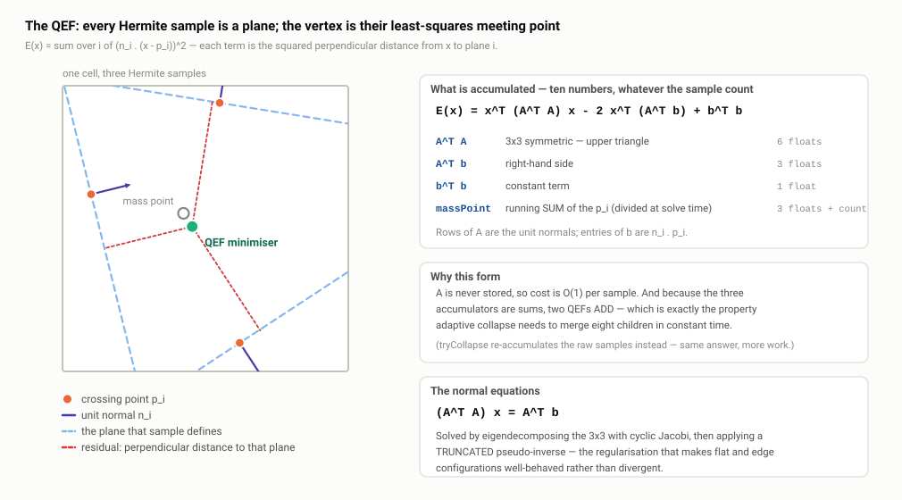
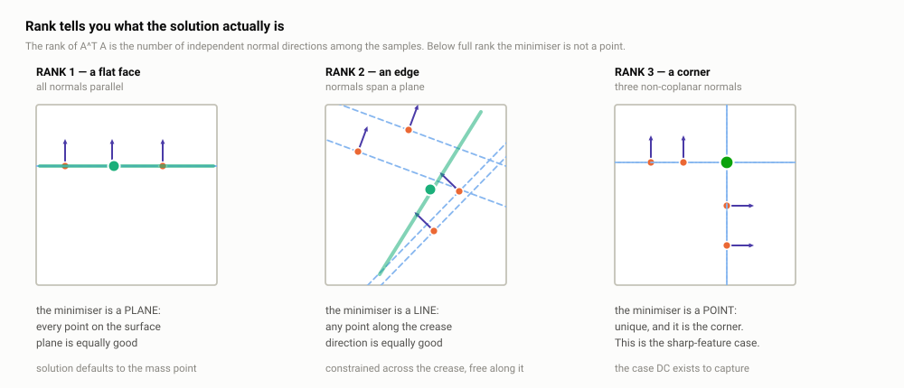
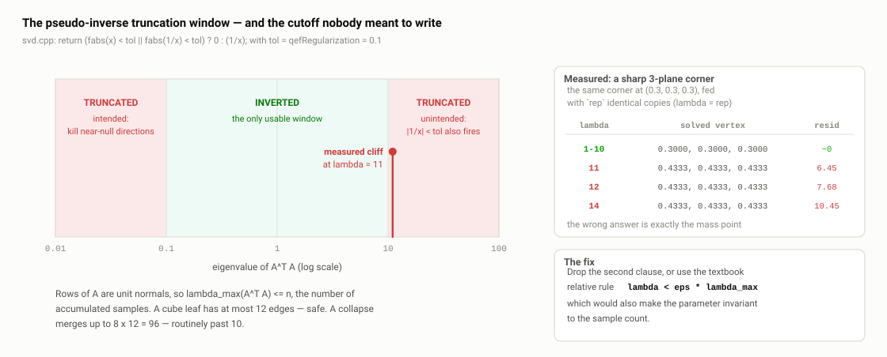
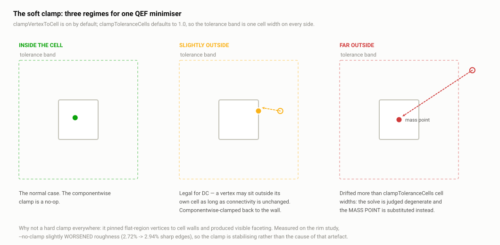

# A3 · The QEF: placing one vertex per cell

> **In one paragraph.** Dual contouring puts exactly one vertex inside each cell the surface passes through, and the Quadratic Error Function decides where. Every Hermite sample on the cell's edges — a point `pᵢ` plus a unit normal `nᵢ` — asserts that the surface locally *is* the plane `nᵢ · (x − pᵢ) = 0`, so the vertex should be the point that best satisfies all those plane equations at once: minimise `E(x) = Σᵢ (nᵢ · (x − pᵢ))²`. That is ordinary linear least squares, solved through the normal equations `AᵀA x = Aᵀb`, which is why only ten accumulated numbers per cell are needed instead of the sample list. The system is routinely singular — a flat cell constrains the vertex in one direction only — so the solver centres on the centroid of the samples (the "mass point") and inverts the eigendecomposition with a truncated pseudo-inverse, which makes the null space default to the centroid rather than the world origin. Two things here are worth knowing cold: the vendored `pinv` throws away *large* eigenvalues as well as small ones, and the value the solver returns is the normal-equation residual, not the geometric QEF energy.

**Read this after:** A1 · Why dual contouring, A2 · Sampling: octree, BVH and sign oracles   **Time:** 60 min

## 1. The question

After sampling (**A2**) every surface leaf holds two things: eight `bool` corner flags saying inside or outside, and, for each of the twelve cube edges whose endpoints disagree, one **Hermite sample** — a position on the surface and the surface normal there. Up to twelve per cell; typically three to six.

The corner signs decide *topology* — which quads get emitted and how they are wound (**A4**). The Hermite samples decide *geometry* — where this cell's one vertex sits. That separation is why dual contouring can reproduce a sharp corner and marching cubes cannot (**A1**): MC places vertices on grid edges, so the best it can do is the crossing points themselves; DC places a vertex anywhere inside the cell, so it can place it *off* the samples, at the point the samples imply.

Reformulate one sample. It says "the surface passes through `pᵢ`, and there it is perpendicular to `nᵢ`" — to first order, that the surface *is* the plane `nᵢ · (x − pᵢ) = 0` near `pᵢ`. So a cell with six samples hands you six plane equations in three unknowns, and "where does the vertex go" becomes "find the point best satisfying six planes at once". On a smooth patch they nearly coincide and any point on the common plane will do; at a cube corner three genuinely different planes meet at exactly one point, and that point is **not** one of the samples. Recovering it is the payoff.

One vertex per cell is the default; with Manifold DC on (shipped default, `include/dualc/contourer.h:28`) the crossing edges are first partitioned into surface components and each component gets its own independent QEF and vertex. See **A4 · The recursion, manifold DC and collapse**. Everything below applies unchanged to a single component.

## 2. The Quadratic Error Function

State it exactly:

```
E(x) = Σᵢ ( nᵢ · (x − pᵢ) )²
```

Each term is the **squared perpendicular distance from `x` to plane `i`** — that is the entire geometric content, and it is why the normals must be unit length. If `‖nᵢ‖ ≠ 1` the term is that squared distance scaled by `‖nᵢ‖²`, i.e. the sample silently gets a weight. `QefSolver::add` normalises every incoming normal before accumulating (`src/internal/qef.cpp:149`, the first thing the body does with the incoming normal), so every sample carries weight 1 and the objective really is "sum of squared distances to the sample planes".



*Each Hermite sample defines a plane through its crossing point; the minimiser is the point whose total squared perpendicular distance to those planes is smallest, and the mass point is the centroid of the crossing points.*

Now the algebra. Let `A` be the matrix whose `i`-th row is `nᵢᵀ` and `b` the vector whose `i`-th entry is `nᵢ · pᵢ`. Then `nᵢ · (x − pᵢ) = (Ax − b)ᵢ`, so `E(x) = ‖Ax − b‖²` — ordinary linear least squares — and the minimiser satisfies the **normal equations** `AᵀA x = Aᵀb`. `AᵀA` is 3×3 symmetric positive semi-definite however many samples there are. That is the fact the whole implementation is built around.

## 3. Why the normal equations and not a QR or SVD of `A` directly

Forming `AᵀA` squares the condition number, and a textbook least-squares routine would factor `A` itself. The reason not to here is that **you never need to store `A`**. Expand the objective:

```
E(x) = xᵀ(AᵀA)x − 2 xᵀ(Aᵀb) + bᵀb
```

All three terms are sums over samples, so all three can be **accumulated incrementally**. `QefSolver::add` (`src/internal/qef.cpp:149`) is exactly that:

```cpp
normalize(nx, ny, nz);
data.ata_00 += nx*nx; data.ata_01 += nx*ny; data.ata_02 += nx*nz;
data.ata_11 += ny*ny; data.ata_12 += ny*nz; data.ata_22 += nz*nz;
const float dot = nx*px + ny*py + nz*pz;
data.atb_x += dot*nx; data.atb_y += dot*ny; data.atb_z += dot*nz;
data.btb += dot*dot;
data.massPoint_x += px; /* y, z */ ++data.numPoints;
```

The state is the upper triangle of `AᵀA` (6 floats), `Aᵀb` (3), `bᵀb` (1), the running **sum** of sample positions (3, divided by `numPoints` only at solve time — `qef.cpp:236`), and the count. Ten numbers of objective, thirteen floats plus an int in total, **independent of how many samples you add**. A cell with 12 samples and a merged cell with 96 cost the same to store and the same to solve.

The second payoff matters architecturally: because the state is a sum, **QEFs are additively mergeable**. `QefData::add` (`src/internal/qef.cpp:59`) adds two accumulators field by field and yields the exact QEF of the union of the two sample sets. That is precisely the property adaptive collapse needs — merging eight children into a parent should be O(1).

Be honest about what the code does with that: `tryCollapse` does **not** use it. `accumulateLeafIntoQef` (`src/contourer.cpp:254`) walks every crossing edge of all eight children and re-adds the raw samples into a fresh solver — up to 96 `add` calls, each re-normalising an already-normalised normal. Numerically the same sum, so a missed simplification rather than a bug, but "the vendored type gives me O(1) merge and the collapse path re-accumulates instead" is worth volunteering. See **A4**.

## 4. Why the system is often singular, and what that means geometrically

`AᵀA = Σᵢ nᵢ nᵢᵀ` is a sum of rank-1 outer products, so its rank is the number of **independent normal directions** among the samples — a direct statement about the local shape of the surface.



*A flat face constrains the vertex in one direction (a plane of equally good answers), an edge in two (a line), a corner in three (a point).*

- **Rank 3 — a corner.** Three or more normals spanning ℝ³, as where three faces of a cube meet. `AᵀA` is invertible, the minimiser is unique, and it is the corner point, with `E = 0` if the planes really do meet. This is the sharp-feature case and the whole reason to run DC.
- **Rank 2 — an edge.** All normals lie in a plane, as along a crease. One zero eigenvalue; the set of minimisers is a **line** — the crease direction. Every point on it is equally good; the objective genuinely does not care.
- **Rank 1 — a flat face.** All normals parallel. Two zero eigenvalues; the set of minimisers is a **plane** — the surface plane itself.

Rank 1 and 2 are not exotic; on a smooth model they are the *overwhelming majority* of cells, because most of a mesh is locally flat.

A naive `x = (AᵀA)⁻¹ Aᵀb` blows up in both. In exact arithmetic the inverse does not exist; in floating point you get a huge number in an arbitrary direction and the vertex lands far outside its cell. This is the central numerical problem of dual contouring, and the next section is the answer.

## 5. The two regularisation devices

Both live in `QefSolver::solve` (`src/internal/qef.cpp:227`):

```cpp
massPoint.set(...); VecUtils::scale(massPoint, 1.0f / data.numPoints);
setAta(); setAtb();
Vec3 tmpv; MatUtils::vmul_symmetric(tmpv, ata, massPoint);
VecUtils::sub(atb, atb, tmpv);                    // atb -= ATA * massPoint
x.clear();
const float result = Svd::solveSymmetric(ata, atb, x, svd_tol, svd_sweeps, pinv_tol);
VecUtils::addScaled(x, 1, massPoint);             // x += massPoint
```

### The mass-point origin shift

The **mass point** is the centroid of the sample positions. The solver does not solve for `x`; it solves for the offset from the centroid and adds the centroid back — a change of variable `x = m + y` turning `AᵀA x = Aᵀb` into `AᵀA y = Aᵀb − AᵀA m`, exactly the `atb -= ATA * massPoint` line.

**Conditioning.** The RHS entries are `nᵢ · pᵢ`, whose magnitude scales with distance from the world origin; centring makes them scale with the cell instead. Verified by compiling the vendored translation units standalone: a plane at `z ≈ 1000` solves exactly. Without centring, in `float`, it would not.

**Null-space default.** This is the important one. In the directions the pseudo-inverse truncates the solver produces `y = 0`, hence `x = m`. So **in an unconstrained direction the answer defaults to the mass point, not the world origin**. A rank-1 cell gets a vertex at the centroid of its crossing points — on the surface, inside the cell — which is exactly right, and it arrives for free from the change of variable rather than from a special case. Without the shift, a rank-1 cell would put its vertex at the projection of the origin onto the plane, which for a part 300 mm from the origin is nowhere near the cell.

`getMassPoint()` (`src/internal/qef.h:84`) exposes the centroid for the clamp fallback in §8.

### The truncated pseudo-inverse

Instead of inverting `AᵀA`, eigendecompose it — `AᵀA = V diag(λ) Vᵀ`, cheap and exact-ish for a symmetric 3×3 — and build a **pseudo**-inverse that inverts only the directions with an eigenvalue above a threshold:

```
pinv(λ) = (|λ| < tol) ? 0 : 1/λ
```

then `x = V diag(pinv(λ)) Vᵀ · (Aᵀb)`. Zeroing an eigenvalue means "contribute nothing along this eigenvector" — combined with the centring, "do not move away from the mass point along this direction". So a flat cell's two unconstrained directions stay at the centroid and the one constrained direction is solved properly. That is the correct decomposition of the problem.

`ContourerParams::qefRegularization` (default `0.1`, `include/dualc/contourer.h:19`) is that threshold, passed through as `pinv_tol` (`src/contourer.cpp:111-114`). It is the only user-facing knob on the solver; the value is inherited from Nick Gildea's reference implementation.

## 6. The bug in `pinv`

Here is the real code, `src/internal/svd.cpp:427`:

```cpp
static float pinv(const float x, const float tol) {
    return (fabs(x) < tol || fabs(1 / x) < tol) ? 0 : (1 / x);
}
```

Read the condition again. There are **two** cutoffs, not one.

- `|λ| < tol` — the intended regularisation. With `tol = 0.1`, kill directions with eigenvalue below 0.1.
- `|1/λ| < tol` — i.e. `|λ| > 1/tol = 10`. **Large eigenvalues are zeroed too.**

The valid window is `[0.1, 10]`, and the upper edge is reachable. `A`'s rows are unit normals, so `trace(AᵀA) = n` and `λ_max(AᵀA) ≤ n`, with equality when all `n` normals are parallel. A QEF with more than about ten substantially-aligned samples therefore loses that direction entirely.



*Both ends of the eigenvalue range are truncated. The lower cut at 0.1 is the intended regularisation; the upper cut at 10 is not, and the measured cliff is at λ = 11.*

Measured by compiling `qef.cpp` and `svd.cpp` standalone and feeding `rep` identical copies of a sharp three-orthogonal-plane corner meeting at `(0.3, 0.3, 0.3)`, which gives `λ = rep` in each direction:

| `rep` (= λ) | solved vertex | residual |
| --- | --- | --- |
| 1 … 10 | `(0.3000, 0.3000, 0.3000)` — correct | ≈ 0 |
| **11** | `(0.4333, 0.4333, 0.4333)` — the mass point | 6.45 |
| 12 | `(0.4333, 0.4333, 0.4333)` | 7.68 |
| 14 | `(0.4333, 0.4333, 0.4333)` | 10.45 |

The cliff is exactly at `1/0.1 = 10`. Above it every direction truncates and the "solution" is just the centroid. The consequences, honestly — mostly benign:

**Per-leaf solves are essentially safe.** A cube has twelve edges, so `λ_max ≤ 12`, barely over the cliff and only reachable when all twelve normals are near-parallel. But that configuration is a *plane cutting the cell*, where the mass point lies on the plane anyway, so the fallback is correct — verified: twelve parallel samples on `z = 0.25` return `z = 0.25`. A real sharp corner splits its samples across three directions, so no single eigenvalue approaches 10.

**The collapse path is materially affected.** `tryCollapse` accumulates up to 8 × 12 = 96 samples into one QEF (`src/contourer.cpp:254`), so eigenvalues routinely exceed 10. Near-planar region: the truncated solve still lands on the plane, residual near zero, collapse accepted. Sharp or curved region: every direction truncates, the vertex becomes the mass point, the residual inflates, collapse is **rejected**. The emergent policy is "collapse only where near-planar" — defensible, but by accident of a stray `1/x` clause, and it means `--collapse` can never preserve a sharp feature at a coarser level even where the merged QEF would have placed it perfectly.

**The fixes.** One line: delete `|| fabs(1 / x) < tol`. Better, the textbook **relative** rule — truncate when `λ < ε · λ_max`. That is what a real pseudo-inverse does, it removes the upper cutoff as a side effect, and it makes `qefRegularization` scale-invariant; today the parameter's meaning depends on sample count and model units, which is why it cannot be tuned transferably.

## 7. The eigensolver

Be precise about what `src/internal/svd.cpp` is, because the filename oversells it. It is a **cyclic Jacobi eigensolver for a symmetric 3×3**, not a general SVD. The input is `AᵀA`, already symmetric positive semi-definite, so what comes out is an eigendecomposition; the quantities the code calls "singular values" are **eigenvalues of `AᵀA`**, equal to the *squared* singular values of `A`.

That matters for reading the threshold: `qefRegularization = 0.1` cuts on eigenvalues of `AᵀA`, which is `√0.1 ≈ 0.316` on singular values of `A`. Anyone who has met SVD-based least squares elsewhere will assume the latter.

The driver, `src/internal/svd.cpp:391`:

```cpp
void Svd::getSymmetricSvd(const SMat3 &a, SMat3 &vtav, Mat3 &v,
                          const float tol, const int max_sweeps) {
  vtav.setSymmetric(a);
  v.set(1,0,0, 0,1,0, 0,0,1);
  const float delta = tol * MatUtils::fnorm(vtav);
  for (int i = 0; i < max_sweeps && MatUtils::off(vtav) > delta; ++i) {
    rotate01(vtav, v); rotate02(vtav, v); rotate12(vtav, v);
  }
}
```

**One sweep = three off-diagonal annihilations**, `(0,1)`, `(0,2)`, `(1,2)`. Each is a Givens rotation chosen to zero that entry, applied from both sides and accumulated into `V` from the right. Zeroing `(0,1)` disturbs `(0,2)` and `(1,2)`, which is why you sweep — but Jacobi converges **quadratically** on a 3×3, so the off-diagonal mass falls away fast: three to six sweeps is typical.

The cap is `kQefSweepCount = 50` (`src/contourer.cpp:30`) with `kQefSvdTol = 1e-6f` (`:31`) — generous enough to never be hit. The stopping rule is `off(A) > tol · ‖A‖_F`, where `off(A) = sqrt(2·(m01² + m02² + m12²))` (`src/internal/svd.cpp:201`) and `delta` is computed **once from the initial matrix**, so it is absolute for the duration of the loop rather than adaptive. Standard practice.

The one real numerical trick is in the rotation coefficients, `src/internal/svd.cpp:312`:

```cpp
const float tau = (a_qq - a_pp) / (2 * a_pq);
const float stt = sqrt(1.0f + tau * tau);
const float tan = 1.0f / ((tau >= 0) ? (tau + stt) : (tau - stt));
c = 1.0f / sqrt(1.f + tan * tan);  s = tan * c;
```

This is the Rutishauser form. The rotation angle satisfies `tan² + 2·tau·tan − 1 = 0`, roots `−tau ± sqrt(1 + tau²)`. When `|tau|` is large — the common case, since it means the matrix is already nearly diagonal — the roots differ wildly in magnitude, and computing the smaller one as `−tau + sqrt(1+tau²)` subtracts two nearly equal numbers: **catastrophic cancellation**. The sign-dependent branch rewrites it as a reciprocal of the *sum*, which is exact. Picking the smaller root also makes the rotation the one closer to the identity, which keeps the iteration stable. This is the piece of the file worth explaining unprompted.

Two notes. `Schur2::rot01/02/12` (`:328-356`) write a literal `0` into the annihilated entry rather than trusting it to cancel. And the eigenvalues come out **unsorted**, `V`'s columns in matching arbitrary order — harmless, because `Svd::pseudoinverse` (`:432`) reassembles `V · diag(pinv(λ)) · Vᵀ` symmetrically and order-independently.

## 8. Vertex clamping

The minimiser can legitimately land outside its own cell — most obviously on a rank-2 cell, where the answer is a line and the solver picks a point far along it. The contourer applies a **soft clamp**, `src/contourer.cpp:119-133`:

```cpp
if (params.clampVertexToCell) {
  const Vector3 ext = node.bounds.extent();
  const Vector3 tol{ext.x * params.clampToleranceCells,
                    ext.y * params.clampToleranceCells,
                    ext.z * params.clampToleranceCells};
  if (isFarOutsideBox(v, node.bounds, tol)) {
    const auto& mp = q.getMassPoint();
    v = Vector3{(double)mp.x, (double)mp.y, (double)mp.z};
    v = clampToBox(v, node.bounds);
  } else {
    v = clampToBox(v, node.bounds);
  }
}
```

The two helpers are at `src/contourer.cpp:46` and `:52` — `clampToBox` is a componentwise `std::clamp` against the cell's AABB; `isFarOutsideBox` tests each axis against the box expanded by `tolerance`.



*Inside the cell: kept. Slightly outside, within one cell width: kept and clamped. Far outside: the solve is declared degenerate and the vertex is replaced by the mass point.*

The policy: if the minimiser drifted more than `clampToleranceCells` (default `1.0`, `include/dualc/contourer.h:22`) **cell widths** outside the cell, the solve is deemed degenerate and the vertex is replaced by the **mass point**, then clamped — a no-op, since the centroid of points lying on the cell's own edges is always inside it. Otherwise the vertex is simply clamped componentwise.

Why not a hard clamp? It was tried and it was wrong. The roadmap (`docs/roadmap/01-core-dual-contouring.md` §4.3) records that a plain componentwise clamp **pinned flat-region vertices to cell walls**, producing visible faceting: on a flat sheet the minimiser is any point of the surface plane, and clamping snaps a whole run of them onto the same cell boundary, quantising a smooth surface onto the grid. The soft version lets a vertex sit slightly outside its own cell, which is **legal for dual contouring**, because connectivity comes from the corner signs and the minimal-edge rule (**A4**), not from vertex positions. Nothing topological changes if a vertex drifts into a neighbour; only geometry moves, and the QEF says that is where it belongs. Only a genuinely blown-up solve gets overridden.

The empirical check is `docs/report-quality-inspection-contouring.md` Step 4: `--no-clamp` **slightly worsened** rim roughness — 2.72% to 2.94% sharp edges — and did **not** produce vertex blowout. So the clamp is stabilising rather than distorting, and the known rim saw-tooth artefact is neither caused nor fixed by it.

The honest gap: `clampVertexToCell` and `clampToleranceCells` have **no test at all** (**T · The test suite**), despite being the mechanism that stops near-degenerate QEFs spraying vertices across the model.

## 9. What the solver returns, and why that matters

`QefSolver::solve` returns whatever `Svd::solveSymmetric` returns, which is `calcError(AᵀA, x, Aᵀb)` = `‖Aᵀb − AᵀA·x‖²` **on the mass-point-centred system** — the **residual of the normal equations**, i.e. how far the computed `x` is from satisfying `AᵀA x = Aᵀb`. Units of length² (given unit normals), but the meaning is "how badly the linear solve failed".

The **geometric QEF energy** — `E(x) = xᵀAᵀAx − 2 x·Aᵀb + bᵀb`, the sum of squared distances to the sample planes, what you would call fit error — is computed by `QefSolver::getError()` (`src/internal/qef.cpp:187`, forwarding to `:196`). It is **dead code**: no caller anywhere in `src/`, `tests/` or `examples/`.

This matters because `ContourerParams::simplificationError` (`include/dualc/contourer.h:20`), the threshold deciding whether eight children may collapse into their parent, is compared against that *returned* value (`src/contourer.cpp:291-292`). So the collapse gate thresholds the wrong quantity. Not arbitrarily wrong: the two are strongly correlated, because a rank-truncated direction leaves a large residual, which is why collapse behaves conservatively and the measured results are clean (the roadmap's molde depth-7 `--collapse 100` run: 0 boundary edges, 0 non-manifold edges, χ = 2, ~10% fewer triangles). But correlated is not correct, and the consequence is that **the threshold is not portable across model scales** — the same number means different things on a 10 mm and a 1000 mm part, and it shifts with the merged QEF's sample count.

The fix is two lines: call `getError()` after `solve()` and threshold that. Adopting it raises the float question in §11, since `btb` is the one accumulator that is **not** recentred and grows as `(nᵢ·pᵢ)²`. Volunteer this unprompted — it shows you read the vendored code rather than trusting it, know the textbook criterion, can say why the shipped behaviour still passes its quality bars, and can name the fix and its second-order cost.

## 10. Per-vertex normals as a by-product

The QEF already has every sample normal in hand, so the contourer sums them while accumulating and normalises at the end (`src/contourer.cpp`, `solveOneComponent`):

```cpp
const double m = normalSum.norm();
out.normal = (m > 1e-12) ? (normalSum / m) : Vector3{0.0, 0.0, 0.0};
```

That unit vector is returned as the output mesh's **per-vertex normal** — `contourHermiteOctree` returns a `std::vector<Vector3>` index-aligned with the mesh's vertices (`include/dualc/contourer.h:43-52`). It costs three adds per sample, gives smooth shading with no second pass over the output mesh, and unlike a normal recomputed from the output triangles it reflects the *original* surface rather than the discretised one. The zero-length guard covers samples cancelling exactly: the vertex still exists, it just has no meaningful normal. The sum is unweighted — no area or angle weighting, since the samples are points, not faces.

## 11. The float/double seam

Everything above the solver is `double`: `dualc::Vector3` is geometry-central's double vector, `BBox` is `double`, the sampler's crossing positions and normals are `double`. Everything inside the solver is `float`: `SMat3`, `Mat3` and `Vec3` all hold `float` members (`src/internal/svd.h:38, 55, 75`), and `QefData`'s accumulators are `float` (`src/internal/qef.h:39-42`). `solveOneComponent` narrows on the way in (`src/contourer.cpp:95-99`) and widens on the way out (`:115-117`). That is the seam, and it is a fair line of attack.

**The defence.** `qef.cpp` and `svd.cpp` are **vendored verbatim** under the Unlicense and `THIRD_PARTY.md` commits to byte-identical vendoring — editing them means owning a fork of code the project deliberately chose not to own (**B5 · Build, vendoring and the C ABI**). The conditioning risk is largely neutralised by the mass-point centring of §5: the solve runs on offsets from the cell centroid, so magnitudes are cell-sized and `float`'s 24-bit mantissa is ample; a plane at `z ≈ 1000` solves exactly. The one accumulator that *does* grow with world position, `btb`, feeds only `getError()`, which is never called.

**The concession.** Templating the solver on the scalar type is the honest fix, and it becomes *required* rather than nice the moment `getError()` is adopted (§9), because `btb` is the term that is not recentred. Smaller wart: `svd.cpp` includes `<math.h>` and calls `sqrt`/`fabs` on `float`s, so every rotation promotes to `double` and narrows back — harmless, mildly wasteful, and ironic given the file is `float` for speed. **B3 · Memory, ownership and the numeric seam** covers where else this boundary surfaces.

## Key terms

| Term | Meaning |
| --- | --- |
| **Hermite sample** | A surface point plus the surface normal there — value and derivative. One per sign-changing cube edge. |
| **QEF** | Quadratic Error Function, `E(x) = Σᵢ (nᵢ·(x − pᵢ))²` — the sum of squared perpendicular distances from `x` to the sample planes. |
| **Normal equations** | `AᵀA x = Aᵀb`, the stationarity condition of `‖Ax − b‖²`. Lets the QEF be stored as 10 accumulated numbers. |
| **Mass point** | The centroid of the cell's crossing points. Used as the origin for the solve and as the fallback answer in every truncated direction. |
| **Rank of `AᵀA`** | Number of independent normal directions: 3 = corner (unique answer), 2 = edge (a line of answers), 1 = flat (a plane of answers). |
| **Truncated pseudo-inverse** | Invert only eigen-directions with `λ` above a threshold; zero the rest, so the solution stays at the mass point along them. |
| **`qefRegularization`** | That threshold. Default `0.1`, on eigenvalues of `AᵀA` (≈ 0.316 on singular values of `A`). `contourer.h:19`. |
| **Cyclic Jacobi** | The eigensolver: repeated 2×2 Givens rotations annihilating `(0,1)`, `(0,2)`, `(1,2)` in turn. Quadratic convergence on a 3×3. |
| **Soft clamp** | Clamp the vertex into its cell, but if it drifted more than `clampToleranceCells` cell widths out, replace it with the mass point instead. |
| **Normal-equation residual** | `‖Aᵀb − AᵀA·x‖²`, what `solve()` returns. Not the geometric QEF energy, which `getError()` computes and nothing calls. |

## If they ask…

**"Explain the QEF in one minute."**

Each cell the surface crosses gets one output vertex, and I have up to twelve Hermite samples on its edges — a surface point plus the normal there. Each sample says the surface locally is the plane `nᵢ·(x − pᵢ) = 0`, so I want the point best satisfying all of them at once: minimise the sum of squared perpendicular distances, `E(x) = Σ (nᵢ·(x − pᵢ))²`. Stack the unit normals as rows of `A` and the `nᵢ·pᵢ` as `b` and that is `‖Ax − b‖²` — plain linear least squares, solved via the normal equations `AᵀA x = Aᵀb`. `AᵀA` is 3×3 symmetric and accumulated incrementally in ten numbers, so cell cost doesn't depend on sample count. At a cube corner three independent normals give a unique minimum at the corner — the sharp feature marching cubes cannot represent.

**"Why does the system become singular, and how do you handle it?"**

`AᵀA` is a sum of outer products `nᵢnᵢᵀ`, so its rank is the number of independent normal directions: 1 on a flat cell, 2 on a crease, 3 only at a corner — and on a smooth model most cells are rank 1. Rank-deficient means the minimiser is a plane or a line rather than a point, so a naive inverse blows up. Two devices handle it. The solve is centred on the mass point, the centroid of the crossing points, so I solve for the offset and add the centroid back (`qef.cpp:227`). And the pseudo-inverse eigendecomposes `AᵀA` and inverts only directions with an eigenvalue above `qefRegularization`, default 0.1. Together the vertex is pinned exactly where the data constrains it and defaults to the centroid where it doesn't — which for a flat cell is a point on the surface, inside the cell.

**"What is the mass point for?"**

Two jobs. Conditioning: `b`'s entries are `nᵢ·pᵢ`, which scale with distance from the world origin, so centring keeps magnitudes cell-sized — that matters because the solver is `float`. The important one is the null-space default: the pseudo-inverse produces zero along every truncated direction, and because I solved for the offset from the centroid, zero offset means *the centroid*. So a flat cell's vertex lands on the centroid of its crossings — on the surface and inside the cell — instead of at the projection of the origin onto the plane, which for a part 300 mm out is nowhere near it. It is also the fallback in the vertex clamp (`contourer.cpp:126-129`).

**"Why is your solver in `float` when the rest of the library is `double`?"** *(attack)*

Because `qef.cpp` and `svd.cpp` are vendored verbatim under the Unlicense and `THIRD_PARTY.md` commits to byte-identical vendoring — editing them means owning a fork of code the project deliberately chose not to own. The narrowing is at `contourer.cpp:95-99`, the widening at `:115-117`. The risk is real but largely neutralised by the mass-point centring: the solve runs on offsets from the cell centroid, so magnitudes are cell-sized, and I verified a plane at `z ≈ 1000` solves exactly. What I concede: templating the solver on the scalar type is the honest fix, and it stops being optional the moment you adopt `getError()`, because `btb` is the one accumulator that is *not* recentred — it grows as `(nᵢ·pᵢ)²` and would cancel catastrophically in `float` far from the origin.

**"Your `pinv` throws away large eigenvalues too — is that intentional?"** *(attack)*

No, and I found it and measured it. `svd.cpp:427` is `return (fabs(x) < tol || fabs(1/x) < tol) ? 0 : (1/x);` — two cutoffs. The second means `|λ| > 1/tol = 10` is zeroed as well, so the valid window is `[0.1, 10]`. The rows of `A` are unit normals, so `trace(AᵀA) = n`, and any QEF with more than about ten aligned samples loses that direction. I compiled the two translation units standalone and confirmed the cliff: a sharp three-plane corner at `(0.3,0.3,0.3)` solves exactly up to `λ = 10` and jumps to the mass point at `λ = 11`, residual 6.45. The impact is bounded, though. A leaf has at most twelve edges, and reaching `λ = 12` needs twelve parallel normals — a plane cutting the cell, where the mass point is on the plane anyway, so the fallback is correct. Collapse is where it bites: up to 96 samples, so `λ` routinely exceeds 10, and the emergent behaviour becomes "collapse only where the region is near-planar" — defensible, but by accident. The one-line fix is dropping the second clause; the better fix is `λ < ε·λ_max`, the textbook relative rule, which removes the upper cutoff as a side effect and makes the parameter scale-invariant.

**"What does `qefRegularization` actually control, and how would you tune it?"**

It is the pseudo-inverse truncation threshold — the eigenvalue below which a direction is treated as unconstrained and left at the mass point (`contourer.h:19`, default 0.1, from Gildea's reference). Lower it and you trust more marginal directions, sharpening near-degenerate features but risking vertices shooting outside their cells; raise it and more cells fall back to the centroid, which smooths. Two things make it hard to tune honestly: it cuts on eigenvalues of `AᵀA`, so 0.1 is 0.316 on singular values of `A` — easy to misread — and it is absolute on a quantity that scales with sample count, so its meaning drifts with cell occupancy and model scale. That is exactly why I would switch to a relative rule against `λ_max`; the parameter would become a dimensionless condition-number tolerance that transfers between models. It is also never varied in the test suite, so there is no measured curve behind the default.

**"How is the QEF tested?"** *(short)*

Weakly directly, strongly indirectly. `tests/test_qef.cpp` is one case, self-described as a smoke test that mainly proves the vendored translation unit links: three coplanar samples at `z = 0.5`, rank 1. The real verification is `tests/test_contourer.cpp`, which drives the same solver through `internal::solveLeaf` on hand-built Hermite leaves with two **rank-3** configurations that have closed-form answers — the six-plane case must minimise at the centroid `(0,0,0)`, the two-component case at `(±0.3, ±0.3, ±0.3)`. Untested: any rank-2 configuration, `qefRegularization` (never varied, so the truncation cut-off is never exercised), and `clampVertexToCell` / `clampToleranceCells`, which have no test at all. See **T · The test suite**.

**"Isn't forming `AᵀA` numerically worse than factoring `A` directly?"**

It squares the condition number, yes, and for a general least-squares problem I would use QR. Here the win outweighs it: forming `AᵀA` means I never store `A`, so a cell's QEF is ten accumulated numbers regardless of sample count — and they are *additive*, which is what makes octree collapse an O(1) merge in principle (`qef.cpp:59`). The cost is contained because the matrix is 3×3, exactly symmetric PSD, and solved by a Jacobi eigensolver with a truncated pseudo-inverse. Ill-conditioning is *handled*, not avoided: a tiny eigenvalue is the signal that the cell is flat, not an error to dodge.

## One-minute recap

- `E(x) = Σᵢ (nᵢ·(x − pᵢ))²` = **squared perpendicular distance to each sample plane**. Unit normals matter or samples get silent weights; `QefSolver::add` normalises on entry (`qef.cpp:149`).
- `E(x) = ‖Ax − b‖²`, rows of `A` = unit normals, entries of `b` = `nᵢ·pᵢ`; minimiser solves `AᵀA x = Aᵀb`.
- State is **10 numbers** (6 + 3 + 1) plus the mass-point sum and count, **independent of sample count**. `QefData::add` (`qef.cpp:59`) makes QEFs additively mergeable; `tryCollapse` re-accumulates 96 raw samples instead.
- **Rank of `AᵀA` = number of independent normals.** 3 = corner (a point), 2 = crease (a line), 1 = flat (a plane). Most cells on a smooth model are rank 1.
- **Mass point** = centroid of crossings; the solve is centred on it (`qef.cpp:227`), so truncated directions default to the centroid, not the world origin. Conditioning is the secondary payoff.
- **Truncated pseudo-inverse**: eigendecompose, invert only `λ ≥ qefRegularization` (default 0.1, `contourer.h:19`).
- **`pinv` (`svd.cpp:427`) zeroes `|λ| > 10` too** — measured cliff at `λ = 11`, vertex collapses to the mass point, residual 6.45. Safe per-leaf (≤ 12 edges), material for collapse (≤ 96 samples). Fix: drop the clause, or go relative to `λ_max`.
- `svd.cpp` is a **cyclic Jacobi eigensolver for a symmetric 3×3**, not a general SVD; the "singular values" are eigenvalues of `AᵀA`, so 0.1 there ≈ **0.316 on singular values of `A`**. One sweep = three annihilations; 3–6 typical, cap 50 (`contourer.cpp:30`). The Rutishauser branch (`svd.cpp:312`) picks the smaller root to avoid cancellation.
- **Soft clamp** (`contourer.cpp:119-133`): clamp componentwise, but replace with the mass point if the vertex drifted over 1.0 cell widths out. Hard clamping caused faceting; a vertex slightly outside its cell is legal because connectivity comes from signs, not positions. `--no-clamp` made rim roughness slightly *worse* (2.72% → 2.94%).
- **`solve()` returns the normal-equation residual `‖Aᵀb − AᵀAx‖²`, not the QEF energy.** The energy is `getError()` (`qef.cpp:187`), dead code. So `simplificationError` thresholds "how badly the solve failed" — correlated, clean in practice, **not scale-portable**.
- Output per-vertex normals are the **normalised, unweighted sum of the QEF input normals** — free, and describing the original surface rather than the discretised one.
