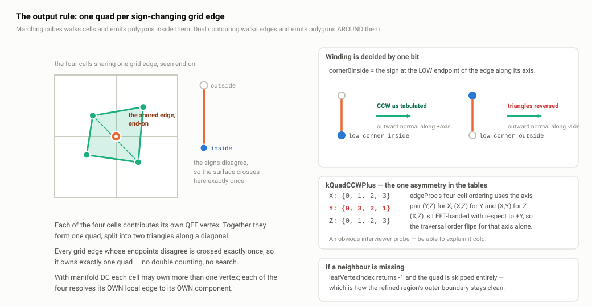
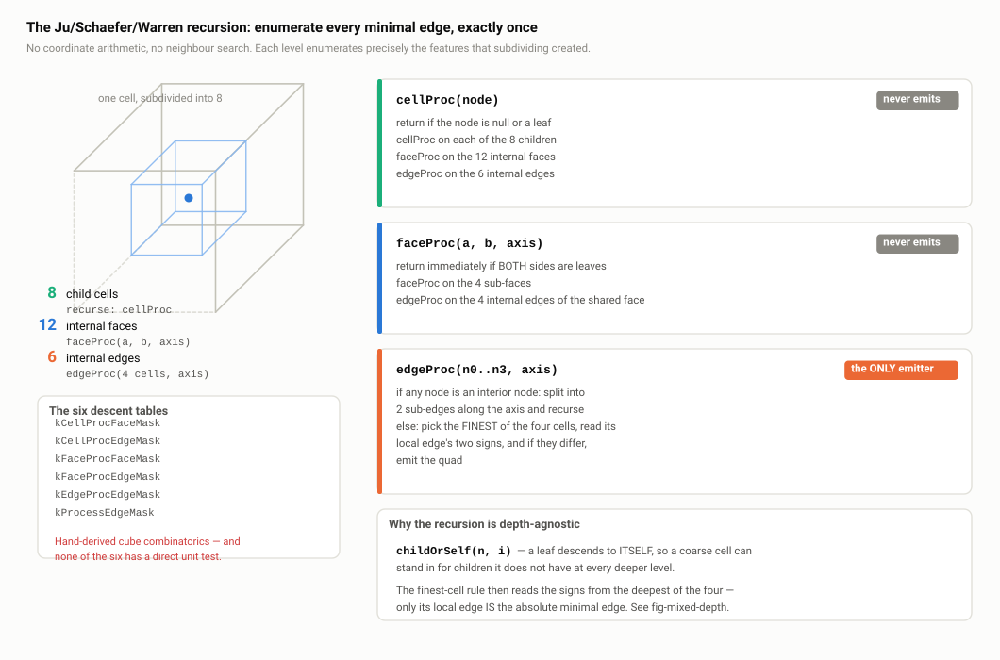
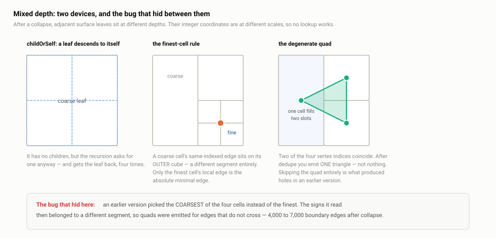
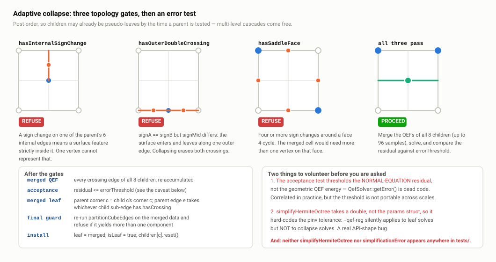

# A4 · The contouring recursion, manifold DC and adaptive collapse

> **In one paragraph.** The contourer turns the `HermiteOctree` back into triangles. Its whole output rule is one sentence: every grid edge whose two endpoints have opposite signs is crossed by the surface exactly once, exactly four cells touch that edge, each cell has a QEF vertex, so join those four vertices into a quad. The difficulty is *enumerating* those edges when neighbouring leaves sit at different depths — which is why DualC implements the Ju/Schaefer/Warren `cellProc`/`faceProc`/`edgeProc` recursion (`src/contourer.cpp:506-598`) rather than the flat coordinate-keyed scan `docs/ARCHITECTURE.md` still describes. On top sit two refinements: **Manifold DC**, which splits a cell's crossing edges into connected components so two surface sheets in one cell do not get welded into a non-manifold edge; and **adaptive collapse**, a post-order pass merging eight sibling leaves into one pseudo-leaf when three topology gates pass and the merged QEF residual is small. Both work; both have honest defects worth volunteering.

**Read this after:** A1 · Why dual contouring, A2 · Sampling: octree, BVH and sign oracles, A3 · The QEF   **Time:** 90 min

## 1. The job, and the key idea: minimal edges

By the time the contourer runs the geometry work is done. The octree holds, for every leaf the surface passes through, eight boolean corner flags and up to twelve Hermite samples (crossing point + normal). **A3 · The QEF** covers how a leaf turns its samples into one vertex; this document is about how those vertices get *connected*.

Take any edge of the grid — a segment between two adjacent corner sample points. If its endpoint flags **differ**, the surface separates them, so the surface crosses that edge; if they agree, the sign-based pipeline assumes it does not. An edge with differing endpoint signs, belonging to leaf cells rather than a coarser ancestor, is a **minimal edge**.

In 3D, an edge is shared by exactly **four** cells, arranged like four quadrants around an axis. All four touch the crossing, so all four have a dual vertex. Connect those four vertices in circular order: one **quad**, split into two triangles. That is the entire output rule.



*One edge, one crossing, four surrounding cells, four vertices, one quad. The sign at the low end of the edge decides which way the quad faces.*

This is what "dual" means. Marching cubes walks **cells** and emits polygons *inside* them, with vertices *on* cell edges. Dual contouring walks **edges** and emits polygons *around* them, with vertices *inside* cells — the two structures are graph duals. One practical consequence: DC needs no 256-entry case table. There is one case, "four cells around a sign-changing edge", where MC needs a lookup per corner configuration plus a decision on every ambiguous face.

### Winding

A triangle mesh is oriented: each face's front is determined by the cyclic order of its three vertices. Downstream consumers — booleans, slicers, FEA meshers, renderers doing backface culling — need the front to be the outside, and most solid-modelling code rejects an inside-out mesh.

DC decides winding from one bit. `emitQuadAtEdge` (`src/contourer.cpp:444`) takes `corner0Inside`, the sign at the **low** endpoint of the minimal edge along its own axis. Low end inside ⇒ the normal points along `+axis` ⇒ the tabulated counter-clockwise order is correct; otherwise the triangles are reversed:

```cpp
if (corner0Inside) {
  s.tris.push_back({u0, u1, u2});
  if (n == 4) s.tris.push_back({u0, u2, u3});
} else {
  s.tris.push_back({u0, u2, u1});
  if (n == 4) s.tris.push_back({u0, u3, u2});
}
```

Since "inside = negative" (see **A2**) and the gradient points from inside to outside, the emitted normal always tracks the field gradient. No per-triangle normal test is ever done. That `sa` is the low-end sign is a table property, stated at `src/contourer.cpp:580-584`: `kProcessEdgeMask` is chosen so endpoint 0 of every cell's local edge sits at the low end of the absolute edge.

## 2. Why a recursion is needed at all

If every surface leaf were at the same depth, none of this machinery would be needed. You could enumerate directly: for each leaf, for each of its twelve edges, canonicalise the edge to one owner cell, look up the three other cells by integer coordinate offset, emit. That is what an earlier DualC did, and what `docs/ARCHITECTURE.md` §4 still describes, complete with a `cellKey(ix,iy,iz)` hash and `kXNeighborOffsets` tables. **None of those identifiers exists in the code any more** (grep confirms; the only hash maps in the contourer are keyed by `const HermiteNode*`). Treat that section as historical.

The flat scheme breaks the moment two adjacent surface leaves sit at different depths: a depth-6 cell and a depth-8 cell have coordinates on different lattices, and no single key identifies both. Normalise to the finest depth and a coarse cell occupies many slots, so you must deduplicate and decide which fine edges along its face are real — at which point you have reimplemented the recursion badly.

Adaptive DC therefore uses the Ju/Schaefer/Warren traversal, whose defining property is that **it enumerates every minimal edge exactly once using only parent/child relationships — no coordinate arithmetic, no neighbour search.** Mixed depth is handled structurally rather than by a special case. It **is** implemented, at `src/contourer.cpp:506-598`, backed by six descent tables in `src/internal/dc_tables.cpp`. Say this plainly if asked: the design document understates the shipped code by two major features and claims a third (`simplificationError`) is ignored when it is not. `docs/roadmap/01-core-dual-contouring.md` §3.2/§3.3 is current.

## 3. The recursion

Three mutually recursive functions; only one emits.



*Work moves downward from cells to faces to edges and never back up. Triangles come out of the bottom row only.*

### `cellProc(node)` — `src/contourer.cpp:506`

```cpp
void cellProc(const HermiteNode* node, ContourState& s) {
  if (node == nullptr || node->isLeaf) return;
  for (int c = 0; c < 8; ++c) cellProc(node->children[c].get(), s);
  for (const auto& m : tables::kCellProcFaceMask)
    faceProc(node->children[m[0]].get(), node->children[m[1]].get(), m[2], s);
  for (const auto& m : tables::kCellProcEdgeMask)
    edgeProc(node->children[m[0]].get(), ..., m[4], s);
}
```

Recurse into the eight children — that covers everything strictly inside each child — then handle what subdividing newly created: the **12 internal faces** between sibling pairs (`kCellProcFaceMask`, `dc_tables.cpp:46`) and the **6 internal edges** shared by four siblings each (`kCellProcEdgeMask`, `dc_tables.cpp:62`).

### `faceProc(a, b, axis)` — `src/contourer.cpp:529`

```cpp
if (aLeaf && bLeaf) return;     // face emits no triangles directly
```

Faces never produce geometry; they exist only to reach edges. Both sides leaves ⇒ nothing left to subdivide ⇒ return. Otherwise descend into the **4 sub-faces** of the shared face (`kFaceProcFaceMask`) and its **4 internal edges** (`kFaceProcEdgeMask`). That last is the fiddliest table — a struct-of-arrays `FaceProcEdgeCall{childOf, childIdx, edgeAxis}` (`dc_tables.h:61`) — because the four cells around an edge on a shared face come from *both* nodes, and `childOf[k]` selects which.

### `edgeProc(n0, n1, n2, n3, axis)` — `src/contourer.cpp:552`

The only emitter. It receives the four cells around an edge in a fixed circular order. All four leaves ⇒ this is a minimal edge: read the signs, emit if they differ. Otherwise split the edge in half along its own axis and recurse on the two sub-edges (`kEdgeProcEdgeMask`, `:590-597`).

### Why this shape, and the counting argument

The invariant: **each recursion level enumerates exactly the shared features that subdividing created, and nothing else.** Cut a cube into eight octants and its features partition three ways:

- **Interior to one child** — the eight recursive `cellProc` calls.
- **On the 12 internal faces**, each shared by two children. Count: three mid-planes, each divided into 4 quadrants ⇒ 3 × 4 = **12**.
- **On the 6 internal edges**, each shared by four children. Count: the three mid-planes meet pairwise in three mid-lines, each split by the centre into 2 segments ⇒ 3 × 2 = **6**.

Anything on the parent's *outer* boundary is not the parent's business — some ancestor already created it as an internal feature. `faceProc` applies the same partition one dimension down (a face cut into 4 quadrants has 4 sub-faces and 4 internal edges); `edgeProc` one further (an edge cut in half has 2 sub-edges). Because each feature belongs to exactly one level, every minimal edge in the tree is visited exactly once — no coordinates, no hash map, no duplicate suppression. That is the whole justification for the algorithm's odd-looking shape.

## 4. Mixed depth: the two devices that make it work

Real octrees are unbalanced — the sampler prunes empty space, and collapse turns whole subtrees into single pseudo-leaves. Two devices make the traversal depth-agnostic.



*Left: a leaf that descends to itself. Middle: four cells at three depths around one fine edge — only the finest one's local edge is that edge. Right: two slots resolving to the same vertex, so the quad becomes one triangle.*

### `childOrSelf` — `src/contourer.cpp:523`

```cpp
inline const HermiteNode* childOrSelf(const HermiteNode* n, std::uint8_t childIdx) {
  if (n == nullptr) return nullptr;
  if (n->isLeaf) return n;
  return n->children[childIdx].get();
}
```

Ask a leaf for a child and you get the leaf. A coarse leaf therefore *stands in for children it does not have*, appearing repeatedly — in several slots of one call, and at several deeper levels. The fine side keeps descending while the coarse side repeats itself, until the fine side bottoms out.

### The finest-cell rule — `src/contourer.cpp:565`

At the terminal case the four leaves may be at four different depths. Which one's signs describe the edge?

```cpp
if (allLeaves) {
  int finestK = 0;
  for (int k = 1; k < 4; ++k) if (arr[k]->depth > arr[finestK]->depth) finestK = k;
  const HermiteNode* finest = arr[finestK];
  if (!finest->leaf) return;
  const std::uint8_t e = tables::kProcessEdgeMask[axis][finestK];
  const auto& endpoints = tables::kEdgeEndpoints[e];
  const bool sa = finest->leaf->cornerInside[endpoints[0]];
  const bool sb = finest->leaf->cornerInside[endpoints[1]];
  if (sa == sb) return;
  emitQuadAtEdge(arr, axis, /*corner0Inside=*/sa, s);
```

**The deepest cell wins**, and the reason is worth stating precisely. `kProcessEdgeMask[axis][k]` names cell `k`'s *own* cube edge touching the absolute edge. For the finest cell that cube edge **is** the absolute edge — same endpoints, same segment. For a coarser cell the same-indexed edge runs along its larger outer cube and spans a **longer, different** segment, whose endpoint signs say nothing about the fine edge in the middle.

This is not hypothetical. `docs/roadmap/01-core-dual-contouring.md` §4.4 records that the first adaptive-collapse attempt picked the **coarsest** cell and produced 4,000–7,000 boundary edges (holes) plus 13,000–14,000 non-manifold edges on the `molde` mesh. Switching to the finest cell was one of two fixes that made collapse produce a clean closed manifold — a one-line change with a catastrophic failure mode.

### The degenerate quad — `src/contourer.cpp:466-497`

When a coarse pseudo-leaf occupies two of the four slots, two vertex indices coincide. `emitQuadAtEdge` dedupes:

```cpp
int unique[4]; int n = 0;
for (int k = 0; k < 4; ++k) {
  bool dup = false;
  for (int j = 0; j < n; ++j) if (unique[j] == polygon[k]) { dup = true; break; }
  if (!dup) unique[n++] = polygon[k];
}
if (n < 3) return;   // genuine degenerate
```

`n == 3` emits **one triangle**; `n == 4`, two. The comment at `:467` records that the previous behaviour — skipping the degenerate case — is what produced holes; a triangle is genuinely needed to close the surface.

Two footnotes. The comment says "drop adjacent duplicates" but the code dedupes **globally**. I believe that is benign rather than provably so: a cube covering two *diagonally* opposite slots must cover all four (a cube touching an edge from two opposite quadrants contains the edge), giving `n == 1` and the early return. The case the argument does not obviously cover is a single pseudo-leaf filling all four slots with **two** components, yielding `[A, B, A, B]`, where global dedupe gives `n == 2` and the early return while adjacent dedupe would keep four. I have not found a configuration that reaches it, but I would not claim it is unreachable. The comment should still say what the code does. Second, under MDC two slots may be the same pseudo-leaf but *different components*; they then yield distinct indices and the quad correctly stays a quad, with no special branch.

## 5. The winding table asymmetry

```cpp
// src/contourer.cpp:438
constexpr int kQuadCCWPlus[3][4] = {
    {0, 1, 2, 3}, // X-axis edge
    {0, 3, 2, 1}, // Y-axis edge   <-- reversed
    {0, 1, 2, 3}, // Z-axis edge
};
```

One row is reversed. It is the single asymmetry in the tables, it looks like a bug, and you should be able to explain it cold.

`edgeProc`'s four cells are always ordered by position in the two axes **perpendicular** to the edge, in the fixed pattern `(P1=hi,P2=hi), (lo,hi), (lo,lo), (hi,lo)`. The perpendicular pair is taken in ascending axis order:

| Edge axis | `(P1, P2)` | Handedness about +axis |
| --- | --- | --- |
| X | (Y, Z) | right-handed ✓ |
| Y | (X, Z) | **left**-handed — the right-handed pair would be (Z, X) |
| Z | (X, Y) | right-handed ✓ |

Swapping two axes of a frame reverses orientation, so the same tabulated traversal that is counter-clockwise seen from +X and +Z is *clockwise* seen from +Y. Reversing the Y row undoes that. The alternative fix — reordering the Y rows of `kCellProcEdgeMask` and friends to use (Z,X) — is equally valid, but would make three tables irregular instead of one.

## 6. The six descent tables, and the test gap

The recursion is a dozen lines of control flow driving six hand-derived tables:

| Table | Location | What it enumerates |
| --- | --- | --- |
| `kCellProcFaceMask` | `dc_tables.cpp:46` | 12 internal faces — `(childA, childB, axis)` |
| `kCellProcEdgeMask` | `dc_tables.cpp:62` | 6 internal edges — `(c0..c3, axis)` in `edgeProc` order |
| `kFaceProcFaceMask` | `dc_tables.cpp:85` | 4 sub-faces of a shared face, per axis |
| `kFaceProcEdgeMask` | `dc_tables.cpp:119` | 4 internal edges of a shared face, with `childOf` selecting node A or B |
| `kEdgeProcEdgeMask` | `dc_tables.cpp:150` | 2 sub-edges of an edge, per axis |
| `kProcessEdgeMask` | `dc_tables.cpp:177` | each cell's local edge index for the absolute edge at the terminal case |

Pure cube combinatorics, transcribed by hand, and **the classic transcription-error hot spot in every DC implementation**. One wrong `uint8_t` produces a crack, a doubled quad or a flipped triangle somewhere in the output, with no local symptom.

Now the honest part. `dc_tables.h:16-17` states: *"All tables are derived from cube combinatorics; correctness is validated in `tests/test_dc_tables.cpp`."* **That claim is false.** That file is 70 lines and 5 `TEST_CASE`s covering only the four *basic* shape tables — `kCornerOffset`, `kEdgeEndpoints`, `kEdgeAxis`, `kFaceCorners`. None of the six descent tables is touched.

Their correctness rests entirely on **end-to-end topological invariants**: `tests/test_demo_meshes.cpp` checks Euler characteristic and zero boundary edges across eight meshes at depths 5–7, plus watertightness in the TPMS and lattice tests. Real evidence — a wrong entry almost always shows up as a crack or a doubled quad — but it localises terribly: a failing χ says something in a 700-line pipeline is wrong, not which of 51 hand-written table rows.

The fix is cheap and specific. Each table has a checkable structural property:

- `kCellProcFaceMask`: every entry satisfies `childA ^ childB == (1 << axis)`, with `childA` the one having that bit clear; all 12 distinct; each axis appearing 4 times.
- `kCellProcEdgeMask`: the four child indices agree on the edge-axis bit and take all four combinations of the other two, in the tabulated `(hi,hi),(lo,hi),(lo,lo),(hi,lo)` order.
- `kProcessEdgeMask`: every entry `e` satisfies `kEdgeAxis[e] == axis`; all four distinct per axis; the corner offsets of `kEdgeEndpoints[e]` place the edge in the quadrant implied by the slot index.
- `kEdgeProcEdgeMask` / `kFaceProcFaceMask` / `kFaceProcEdgeMask`: same style — assert the child chosen for slot `k` is the one adjacent to the shared feature, derived from `kCornerOffset`.

The key point is that these assertions **re-derive** the tables from the basic constants rather than restating them, so they are not a transcription of the transcription. Sixty to eighty lines guarding the riskiest data in the library.

## 7. Manifold dual contouring


*The left cube gets one vertex under plain DC and pinches; the right shows the two components the union-find finds, each with its own QEF vertex.*

### The problem

"One vertex per cell" assumes the surface passes through a cell as a **single connected sheet**. Usually it does. But consider a cell with two opposite corners inside and six outside — two corners of the solid poking into the same cube — or a wall thinner than a cell, so the surface enters and leaves twice. Two *disjoint* pieces of surface then occupy one cell and the single QEF vertex represents both. Quads from each sheet meet at that shared vertex, and along some edge you get **more than two faces sharing one edge**: a **non-manifold edge**.

Why that matters to a non-graphics interviewer: a manifold surface has exactly two faces per edge and a disc-like neighbourhood at every vertex, and almost every downstream algorithm assumes it. Booleans need a well-defined inside/outside, which a non-manifold edge destroys locally. FEA meshers reject the input. Some slicers silently drop the region. "3 non-manifold edges" is not cosmetic.

### The fix

Partition the cell's crossing edges into **connected components** and solve one QEF per component — `solveOneComponent` (`src/contourer.cpp:78`) accumulates only edges whose `componentOfEdge[e]` matches. One vertex per sheet, so the sheets never share a vertex and the pinch disappears. `MultiLeafSolve` (`src/internal/contourer_internals.h:23`) carries the partition plus `std::array<LeafSolve, 4> perComponent` — four because a cube has at most four surface components (asserted at `cube_components.cpp:129`).

### How the partition works — `partitionCubeEdges`, `src/internal/cube_components.cpp:47`

A **union-find over the 12 cube edges**, not over the corners — the mildly surprising choice, justified because edges carry crossings and crossings need grouping. `UF` (`cube_components.cpp:27`) is `std::array<std::int8_t,12> parent` with **path halving** in `find` — the source comment calls it path compression, which is the looser name for the family — and no union-by-rank (justified in the comment: a 12-element tree is trivially shallow). O(1), allocation-free, cache-line sized.

The connection rule walks the **6 faces**. For each, look at the crossings on its four boundary edges:

- **0 crossings** → nothing to connect.
- **2 crossings** → the surface crosses the face as one segment joining them: `uf.unite(eA, eB)`.
- **4 crossings** → the **saddle ambiguity**.

Roots are then compacted into 0-indexed IDs **in edge order** (`:114-127`), so IDs are deterministic but arbitrary — component 0 is whichever owns the lowest-numbered crossing edge. The tests are label-order agnostic and check both orderings (`tests/test_cube_components.cpp:100-110`).

### The saddle ambiguity, and the choice made

A face with four crossings has corners alternating in sign around the cycle. Two segments cross it, and there are **two topologically valid pairings**: either they separate the two inside corners from each other, or the two outside corners. Both give a legal surface; they differ in whether the solid is connected across that face or pinched.

DualC uses the **inside-pair rule** (`cube_components.cpp:104-110`):

```cpp
if (cornerInside[fc[0]]) { uf.unite(faceEdge[3], faceEdge[0]); uf.unite(faceEdge[1], faceEdge[2]); }
else                     { uf.unite(faceEdge[0], faceEdge[1]); uf.unite(faceEdge[2], faceEdge[3]); }
```

Pair the two crossings that share an **inside** corner — assume material is connected around each inside corner rather than pinched.

The principled alternative is **Schaefer's asymptotic decider**: fit a bilinear function to the face's four corner *values*, find its saddle point, let the sign there decide. Exact for a bilinear interpolant, and what most careful implementations do.

DualC cannot use it, for architectural rather than lazy reasons. `HermiteLeafData` stores `std::array<bool,8> cornerInside` — **signs only, no values**. That is the deliberate contract from **A1 · Why dual contouring**: because the contract is sign-based, the mesh path and the field path share the contourer verbatim. A mesh has no meaningful corner "value", only inside/outside from a winding-number or ray-parity oracle (**A2**), so requiring values would either fork the contourer or force the mesh path to fabricate them. The header says so honestly (`cube_components.h:24-27`).

Concede the cost: eight `double`s per leaf is 64 bytes, about 6 MB at the ~100k-leaf scale of a depth-7 model — not prohibitive. `docs/roadmap/01-core-dual-contouring.md` sizes the exact decider as a ≤80-LOC follow-up if a real saddle case ever demands it. None has yet.

### Component → vertex → quad

`leafVertexIndex` (`src/contourer.cpp:386`) turns a cell's local edge into a vertex index:

```cpp
std::int8_t comp = mls.parts.componentOfEdge[localEdgeIdx];
if (comp < 0) {
  if (mls.parts.numComponents != 1) return -1;   // multi-component: bail
  comp = 0;                                       // single-component: use the lone vertex
}
```

That fallback is **exactly what makes collapse and MDC compose**. A pseudo-leaf spans a large region, and the fine absolute edge the recursion is asking about may not correspond to any crossing edge in its coarse data. Strictly you would return −1 and leave a hole. But if the pseudo-leaf has exactly one component, its single QEF vertex is unambiguously the right connection target whatever fine edge is asking; with more than one there is no way to know which sheet is meant, so bailing is correct. `emitQuadAtEdge` resolves each of the four cells independently through its own `kProcessEdgeMask` edge, so two slots landing on the same pseudo-leaf but different components produce distinct vertices and the quad survives.

### Cost, default and measured effect

MDC is **on by default** (`include/dualc/contourer.h:28`). The opt-out path (`src/contourer.cpp:158-167`) puts every crossing in component 0, reproducing pre-MDC single-vertex DC **byte-identically** — so `--no-manifold` is a genuine A/B control, not a different code path.

Measured on `molde` at depth 7 (roadmap §5): `--no-manifold` leaves **3 non-manifold edges**; MDC gives **0**, at **+3 vertices** and an **identical face count**. Three pinch cells, each now emitting two vertices. The whole price is an O(1) union-find per leaf and three extra vertices.

## 8. Adaptive cell collapse



*Each rejected picture shows a feature one merged vertex could not represent; the accepted one is a near-planar region where one vertex is enough.*

### Why it exists

The sampler refines **every** surface-touching cell to `maxDepth` and never adapts to curvature (**A2**). A flat wall gets the same cell density as a sharp corner. Collapse is where the adaptivity actually happens: a bottom-up pass merging eight sibling leaves back into one wherever a single vertex suffices.

Doing it after sampling rather than during is a deliberate trade. During sampling you would have to predict the QEF error before you have the samples; afterwards the samples exist and the merged QEF is a cheap accumulation. The cost: you pay for the fine tree first, so collapse reduces output size, not peak memory. (The streaming tile path is the answer to peak memory; out of scope here.)

### Wiring

```cpp
// src/pipeline.cpp:19-21
HermiteOctree octree = sampleFieldToHermiteOctree(field, samplerParams);
if (contourerParams.simplificationError > 0.0) {
  simplifyHermiteOctree(octree, contourerParams.simplificationError);
}
return contourHermiteOctree(octree, contourerParams);
```

`simplificationError` defaults to `0.0` (`contourer.h:20`) — **collapse is off unless asked for**; the CLIs expose it as `--collapse`. `contourHermiteOctree` itself never simplifies (`contourer.h:46-48`), because collapse *mutates* and takes a non-const `HermiteOctree&`.

### The traversal

`simplifyRecursive` (`src/contourer.cpp:341`) is **post-order**: all eight children first, then `tryCollapse` on the node. That ordering makes multi-level cascades free — by the time a parent is tested its children may already be pseudo-leaves, so a subtree three levels deep can satisfy the parent's "all eight children are leaves" precondition. One pass produces arbitrarily deep collapses.

### `tryCollapse` — `src/contourer.cpp:269`

Not already a leaf; all eight children exist, are leaves and carry `HermiteLeafData` (`:273-276`); then three gates.

**`hasInternalSignChange`** (`:196`) walks the six internal edges via `kCellProcEdgeMask`, reading child `m[0]`'s local edge `kProcessEdgeMask[axis][0]`, and returns true if its endpoints disagree. *Prevents:* a surface feature strictly **inside** the parent. Those six edges exist only because the parent was subdivided, so such a feature has no representation in the parent's own 8 corners + 12 edges; collapsing would delete it silently.

**`hasOuterDoubleCrossing`** (`:237`) reads, for each of the 12 outer edges, `signA` (child A's corner A), `signMid` (the shared midpoint) and `signB`, rejecting when `signA == signB && signMid != signA`. *Prevents:* a **hidden double crossing** — at the parent's resolution the edge looks uncrossed, but the surface dips in and back out. Collapse would erase a feature and leave the parent claiming no surface there.

**`hasSaddleFace`** (`:216`) builds the parent's corner signs as `ps[c] = children[c]->leaf->cornerInside[c]` (child `c` occupies octant `c`, so its corner `c` is the parent's corner `c` — same world point), then counts sign changes around each of the six face 4-cycles from `kFaceCorners`; **≥ 4 ⇒ refuse**. *Prevents:* a saddle on an outer face — the surface crossing that face on four boundary edges means two separate segments, exactly what one vertex cannot represent and exactly the ambiguous pairing of §7.

**The merged QEF.** `accumulateLeafIntoQef` (`:254`) adds **every** crossing edge of **all eight children** — up to 8 × 12 = **96 samples** — into one `svd::QefSolver`. Note it re-accumulates raw Hermite samples rather than using `QefData::add(QefData)` (`qef.cpp:59`), the additive `ATA`/`ATb`/`btb` merge that would make this O(1). Same sums, more work — a fair low-risk answer if asked what you would change.

**Acceptance:**

```cpp
const float residual = q.solve(solved, kQefSvdTol, kQefSweepCount, kQefPinvDefault);
if (static_cast<double>(residual) > errorThreshold) return false;
```

**Merged leaf construction** (`:296-312`): parent corner `c` takes child `c`'s corner `c`; parent edge `e` takes whichever of the two child sub-edges (both at local index `e`) has `hasCrossing`. The invariant making this sound is **`hasCrossing[e] ⟺ the endpoint signs of `e` differ**, established in `populateLeaf` (`src/sampler.cpp:45-82`) including on the ray-miss fallback path, and preserved here: if the parent's endpoints differ, exactly one sub-edge crosses; if they agree, `hasOuterDoubleCrossing` already guaranteed the midpoint agrees, so neither crosses. A debug assert at the top of `partitionCubeEdges` would cost nothing and document it.

**Multi-component refusal** (`:322-330`):

```cpp
const internal::EdgeComponents mergedParts =
    internal::partitionCubeEdges(merged->cornerInside, mergedHasCrossing);
if (mergedParts.numComponents > 1) return false;
```

A pseudo-leaf carries one `HermiteLeafData`; if it splits into two sheets, collapse would either sum two disjoint sheets into one QEF (wrong vertex) or leave MDC unable to say which sheet an outer edge belongs to. The three gates catch most such configurations; this catches the residual non-saddle ones — opposite-inside-corners being canonical. A good illustration of MDC and collapse designed together rather than bolted on.

**Install:** `node.leaf = std::move(merged); node.isLeaf = true;` then eight `children[c].reset()` calls, freeing the whole subtree recursively (see **B3**).

### Two honest defects

**1. The acceptance test thresholds the wrong quantity.** `q.solve` returns `Svd::solveSymmetric`'s `‖ATb − ATA·x‖²` — the **normal-equation residual** on the mass-point-centred system. The geometric QEF energy `xᵀATAx − 2x·ATb + btb` is `QefSolver::getError()` (`qef.cpp:187`) and is **dead code**: no caller in `src/`, `tests/` or `examples/`. So `simplificationError` is compared against a number with units of length² but meaning "how badly the linear solve failed". The two correlate in the regime that matters, which is why collapse is conservative in practice, but the threshold does not port across model scales; switching is a two-line change. **A3 · The QEF** covers this and the related `pinv` upper cutoff; the upshot for collapse is that with up to 96 samples eigenvalues routinely exceed the cutoff of 10, so sharp regions truncate to the mass point, inflate the residual, and get refused. "Collapse only where near-planar" is defensible policy — it just happens by accident rather than design.

**2. Collapse silently ignores `qefRegularization`.** `tryCollapse:291` hard-codes `kQefPinvDefault` (0.1) because `simplifyHermiteOctree(HermiteOctree&, double)` receives only a `double`. Leaf solves honour `params.qefRegularization` (`src/contourer.cpp:111-113`); collapse solves do not, so `--qef-reg 0.01` changes half the pipeline. No good defence — it is an API-shape bug, and the signature should take `const ContourerParams&`.

### The measured result

`molde` at depth 7 with `--collapse 100` (roadmap §5): **34,328 V / 68,652 F, 0 boundary edges, 0 non-manifold edges, χ = 2** — a closed genus-0 manifold, ~10% fewer triangles. For a closed surface `V − E + F = 2 − 2g`, so χ = 2 with zero boundary edges means genuinely watertight and genus 0.

### The coverage hole

A grep across `tests/` finds **zero occurrences of `simplifyHermiteOctree`** and **zero of `simplificationError`**. The default is `0.0`, so nothing exercises collapse indirectly either. **The entire ~150-line subsystem — three topology gates, a merged QEF, a multi-component refusal and a mutating tree rewrite — is completely untested.** This is the largest single coverage gap in the project; raise it before anyone else does. It is easy to close, and the header's own contract (`contourer.h:31-41`) says what to assert: collapse at a large threshold and check triangle count drops, χ is preserved, no boundary edges appear; collapse at `0.0` and check the output is bit-identical to the uncollapsed run; hand-build the three gate configurations and check each is refused.

## 9. Vertex allocation, compaction and the empty-output fallback

**Lazy allocation.** Vertices are created not when a leaf is solved but on **first reference from a quad**, and then *all* of that leaf's components at once (`src/contourer.cpp:414-427`) into a `std::array<int,4> slots`. A component no quad references never becomes a vertex, and every later edge lookup in that leaf is one hash probe plus an array index. Because allocation happens inside the serial traversal, indices are assigned in deterministic order regardless of how many threads did the QEF pre-solve — which is what makes output bit-identical across thread counts (**B4**).

**Compaction.** `:646-669` builds a `used` bitmap and, if any position is unreferenced, remaps and rebuilds the position/normal arrays. The comment at `:643-645` admits this should never fire, precisely because allocation is lazy — it is defence-in-depth against a future change that allocates eagerly.

**The empty-output fallback** (`:673-681`):

```cpp
if (positions.empty() || tris.empty()) {
  positions = {Vector3{0,0,0}, Vector3{1,0,0}, Vector3{0,1,0}};
  normals   = {Vector3{0,0,1}, Vector3{0,0,1}, Vector3{0,0,1}};
  tris = {{0, 1, 2}};
}
```

It exists because `geometrycentral::surface::makeSurfaceMeshAndGeometry` rejects an empty polygon list — `SurfaceMesh` will not build with no faces. Rather than throw, the contourer synthesises one placeholder triangle, keeping the path non-throwing. Concede the cost: "the field had no surface here" becomes **indistinguishable** from "there was exactly one triangle of surface", and there is no error channel out of `contourHermiteOctree` at all. A `std::optional` return, an out-parameter flag, or at minimum documenting the sentinel would all be better. Note `tests/test_contourer.cpp:19-30` asserts `nVertices()==3, nFaces()==1` on an empty octree and calls it a "v0 stub" — the assertion is right, the comment stale.

## 10. `weldEdges` is dead

```cpp
bool weldEdges = true;   // post-pass weld of coincident triangle edges (v1).
```

`include/dualc/contourer.h:23`. Referenced **nowhere else** — not in `contourer.cpp`, `pipeline.cpp`, the examples or the tests. Setting it to `false` changes nothing.

It became unnecessary rather than being forgotten. A weld pass merges vertices that are geometrically coincident but topologically distinct — the symptom of a contourer that generates each polygon independently and stitches by position matching. DualC never does that: every vertex is created once per (leaf, component) pair and looked up by **node pointer identity** (`vertIdxByLeafComp`, keyed on `const HermiteNode*`), so the four cells around an edge reference the same integer index by construction. With the recursion visiting each minimal edge exactly once and MDC preventing sheet-merging, the output is already closed and manifold. (`docs/ARCHITECTURE.md` is right about this one parameter while wrong about the other four claims.)

The principle is the interesting part: **a public parameter that silently does nothing is worse than no parameter** — it is a documented promise the library does not keep, and a caller setting it either way gets no diagnostic. Delete it; if ABI forbids, mark it `[[deprecated]]`.

## Key terms

| Term | Meaning |
| --- | --- |
| **Minimal edge** | A leaf-level grid edge whose endpoint signs differ, so the surface crosses it once. One minimal edge → one quad. |
| **Dual** | DC's polygons surround edges and its vertices sit in cells; MC is the reverse. The two structures are graph duals. |
| **`cellProc`/`faceProc`/`edgeProc`** | The JSW recursion. Cells spawn faces and edges, faces spawn sub-faces and edges, edges spawn sub-edges. Only `edgeProc` emits. |
| **Descent table** | Hand-derived cube combinatorics telling the recursion which children to pass down. Six, in `dc_tables.cpp`. |
| **`childOrSelf`** | A leaf "descends to itself", letting a coarse cell stand in for children it does not have. |
| **Finest-cell rule** | At the terminal case, the deepest of the four cells supplies the sign data — only its local edge *is* the minimal edge. |
| **Pseudo-leaf** | An internal node turned into a leaf by collapse: merged `HermiteLeafData`, no children. |
| **Non-manifold edge** | An edge shared by more than two faces. Breaks booleans, FEA and some slicers. |
| **Manifold DC (MDC)** | One QEF vertex per *surface component* rather than per cell, so two sheets in one cell do not share a vertex. |
| **Saddle face** | A cube face whose four corners alternate in sign, so the surface crosses all four boundary edges — two segments, two valid pairings. |
| **Inside-pair rule** | DualC's saddle disambiguation: join the two crossings sharing an inside corner. |
| **Asymptotic decider** | Schaefer's exact saddle rule using corner *values*; unavailable here because the leaf stores signs only. |
| **Euler characteristic (χ)** | `V − E + F`; for a closed surface `2 − 2g`. χ = 2 with no boundary edges means watertight genus 0. |

## If they ask…

**Walk me through how a triangle gets emitted.**
The recursion bottoms out in `edgeProc` with four leaf cells around one grid edge (`src/contourer.cpp:565`). It picks the deepest of the four, reads that cell's local edge index from `kProcessEdgeMask`, and compares the two endpoint signs; equal means no crossing, so it returns. Otherwise it calls `emitQuadAtEdge` with the low-end sign. That asks each of the four cells for the vertex index of the component containing its own local edge (`leafVertexIndex`, `:386`), allocating the leaf's vertices lazily on first touch, orders the four indices by `kQuadCCWPlus[axis]`, dedupes, and pushes two triangles — or one if the dedupe left three unique vertices. The low-end sign chooses between the forward and reversed triangulation, which is the entire winding rule.

**How do you handle neighbouring cells at different resolutions?**
Two devices. `childOrSelf` (`:523`) returns a leaf when asked for its child, so a coarse cell stands in for children it lacks and can appear repeatedly at deeper levels while the fine side keeps descending. Then at the terminal case the **finest** of the four cells supplies the sign data (`:565`) — only its local edge is the actual minimal edge; a coarser cell's same-indexed edge runs along its own larger cube and is a different, longer segment. Picking the coarsest was a real bug: `docs/roadmap/01-core-dual-contouring.md` §4.4 records 4–7k boundary edges and 13–14k non-manifold edges on `molde` from exactly that. Finally, when a coarse cell fills two of the four slots the quad degenerates and `emitQuadAtEdge` emits a triangle rather than skipping — skipping is what left holes.

**What is a non-manifold edge and why do you care?**
An edge with more than two incident faces. It arises in plain DC when two disjoint sheets of surface pass through one cell — a thin wall, or two opposite corners inside — and the cell's single vertex bridges them. It matters because it destroys the local inside/outside relation: booleans become undefined, FEA meshers reject the input, some slicers silently drop the region. Manifold DC fixes it by union-finding the cell's crossing edges into connected components and solving one QEF per component (`partitionCubeEdges`, `src/internal/cube_components.cpp:47`), so each sheet gets its own vertex. On `molde` at depth 7 that takes 3 non-manifold edges to 0 for +3 vertices and no change in face count. On by default (`contourer.h:28`), with `--no-manifold` as a byte-identical pre-MDC control.

**(Attack) The saddle-face disambiguation looks arbitrary — justify it.**
It is one of two topologically valid choices, and yes, the exact answer is Schaefer's asymptotic decider. We cannot use it for architectural rather than lazy reasons: the decider needs corner **SDF values**, and `HermiteLeafData` deliberately stores only `std::array<bool,8> cornerInside`. That sign-only contract is what lets the mesh path and the field path share one contourer verbatim — a mesh has no meaningful corner value, only inside/outside from a winding-number or ray-parity oracle. The header states this explicitly (`cube_components.h:24-27`). Given signs only, the inside-pair rule (`cube_components.cpp:104-110`) is a consistent deterministic choice, and no test case has produced visibly wrong topology from it. The concession: 8 doubles per leaf, 64 bytes, buys the exact decider, and the roadmap sizes it under 80 lines.

**(Attack) How do you know the descent tables are right?**
Honestly: not directly. `dc_tables.h:16-17` claims they are validated in `tests/test_dc_tables.cpp`, and **that claim is false** — that file's five cases cover only `kCornerOffset`, `kEdgeEndpoints`, `kEdgeAxis` and `kFaceCorners`. The six descent tables are covered only transitively, by Euler-characteristic and zero-boundary-edge checks across eight demo meshes at depths 5–7. Real evidence, since a wrong entry usually shows up as a crack or a doubled quad, but it localises terribly. The test I would write asserts each table's structural property re-derived from the basic constants rather than restated: for `kCellProcFaceMask`, `childA ^ childB == (1 << axis)` with `childA` on the low side and each axis appearing four times; for `kProcessEdgeMask`, `kEdgeAxis[e] == axis` for every entry, all four distinct per axis, and the endpoints placing the edge in the quadrant implied by the slot; for `kCellProcEdgeMask`, the four children agreeing on the edge-axis bit and taking all four combinations of the other two in the tabulated order. Sixty to eighty lines guarding the riskiest data in the library.

**What does `--collapse` actually guarantee?**
The three topology gates, not a geometric error bound. `tryCollapse` (`:269`) refuses if any of the parent's six internal edges has a sign change, if any of the twelve outer edges has a hidden double crossing (`signA == signB && signMid != signA`), or if any face has four or more sign changes around its 4-cycle; then it re-runs the MDC partition on the merged data and refuses if it splits into more than one component. Only then is the residual checked against the threshold. What it does *not* guarantee is that the threshold means what its name suggests: the value compared is the normal-equation residual, not the geometric QEF energy — `QefSolver::getError()` computes that and is dead code. The two correlate, and the measured result is clean (`molde` depth 7, `--collapse 100`: 34,328 V / 68,652 F, 0 boundary, 0 non-manifold, χ = 2), but the threshold does not port across model scales. Two lines to fix.

**Which parameter in `ContourerParams` does nothing?**
`weldEdges` (`contourer.h:23`). Declared, defaulted to `true`, referenced nowhere in the library, examples or tests. It was reserved for a post-pass merging coincident-but-distinct vertices, and that became unnecessary: vertices here are shared by **pointer identity**, not position — the four cells around an edge look up the same leaf in `vertIdxByLeafComp` and get the same index — so the output is already closed, and MDC removes the remaining reason to weld. A public parameter that silently does nothing is worse than none, because it is a documented promise the library does not keep. It should be deleted.

**Why is only the QEF pre-solve parallel, and not the traversal?**
Determinism. `contourHermiteOctree` collects all leaves, solves every leaf's QEF across all hardware threads into `std::vector<MultiLeafSolve> solved` (`:625-629`), then moves them into a cache. `solveLeaf` is a pure function of the leaf, each worker writes only its own slot, and the `join()` supplies the happens-before edge. The traversal, vertex allocation and emission are then strictly serial, so indices are assigned in traversal order and the mesh is **bit-identical regardless of thread count**. Concessions: at very high depth the serial `cellProc` becomes the bottleneck, and `ContourerParams` has no thread knob — `resolveThreadCount(0)` is hard-coded at the call site. See **B4**.

## One-minute recap

- **The output rule is one sentence:** a grid edge with opposite endpoint signs is crossed once; the four cells around it each have a QEF vertex; join them into a quad. Winding comes from the sign at the **low** endpoint.
- **DC is dual to MC:** MC walks cells and puts vertices on edges; DC walks edges and puts vertices in cells. One case, no 256-entry table.
- **The JSW recursion is implemented** (`src/contourer.cpp:506-598`): `cellProc` → 8 children + 12 internal faces + 6 internal edges; `faceProc` → 4 sub-faces + 4 edges and never emits; `edgeProc` → 2 sub-edges and is the only emitter. Every minimal edge is visited exactly once with no coordinate arithmetic. `docs/ARCHITECTURE.md` still describes the deleted flat version.
- **Mixed depth = `childOrSelf` + the finest-cell rule.** A leaf descends to itself (`:523`); the deepest of the four cells supplies the signs (`:565`). Picking the coarsest was a real bug — 4–7k boundary edges (roadmap §4.4).
- **`kQuadCCWPlus`'s Y row is `{0,3,2,1}`** because `edgeProc` uses the perpendicular pair (X,Z) for a Y edge, which is left-handed about +Y. The single asymmetry in the tables.
- **MDC:** union-find over the **12 cube edges** (not corners), joining crossings pairwise across each face; 4 crossings on a face is a saddle, resolved by the inside-pair rule because the leaf stores signs, not values. `molde` depth 7: 3 non-manifold edges → 0, +3 vertices, same face count. Default on.
- **`leafVertexIndex`'s single-component fallback** is what makes collapse and MDC compose: a pseudo-leaf whose edge carries no crossing still connects via its lone vertex.
- **Collapse** is post-order (`:341`), gated by internal sign change / outer double crossing / saddle face, then a merged QEF over up to 96 samples, then a multi-component refusal. `molde` `--collapse 100`: 34,328 V / 68,652 F, 0 boundary, 0 non-manifold, χ = 2.
- **Two collapse defects to volunteer:** the acceptance test thresholds the normal-equation residual, not the QEF energy (`getError()` is dead code); and `simplifyHermiteOctree(HermiteOctree&, double)` hard-codes `kQefPinvDefault`, so `qefRegularization` applies to leaf solves but not collapse solves.
- **Two test gaps to raise first:** the six descent tables have no direct test despite `dc_tables.h:16-17` claiming they do; and `simplifyHermiteOctree`/`simplificationError` appear **nowhere** in the suite. Also: `weldEdges` (`contourer.h:23`) does nothing and should be deleted.
