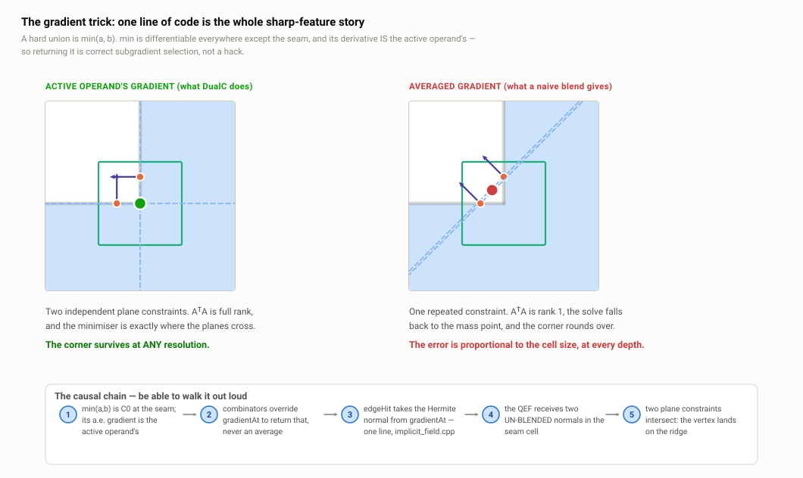
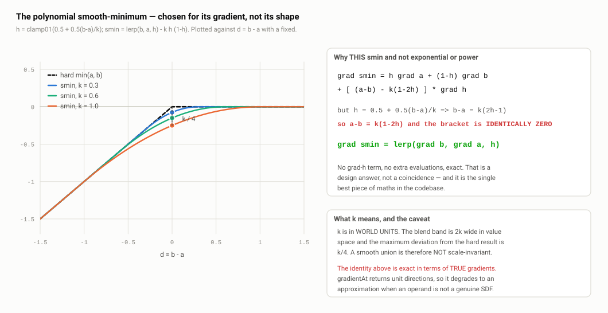
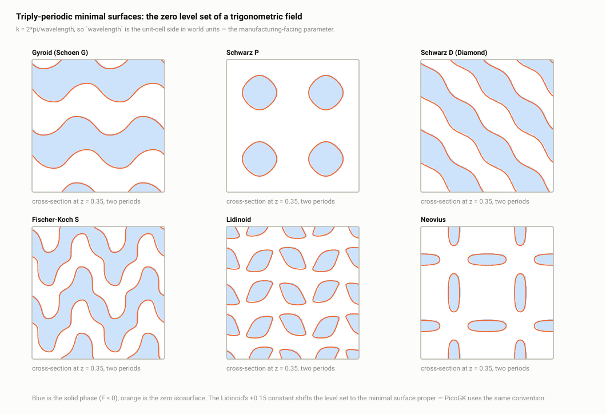

# A5 · The implicit field algebra

> **In one paragraph.** The v2 layer replaces "a triangle mesh" with "any function `f: R³ → R`" as the thing the sampler consumes, and gives you an algebra for building such functions: ~30 analytic primitives plus 6 triply-periodic minimal surfaces at the leaves, hard and smooth booleans, offset/shell/warp decorators, domain operators, and 2D profiles lifted into 3D. The most valuable property is that hard booleans return the *active operand's un-blended gradient* rather than an average, which is what lets the QEF land a vertex exactly on a CSG seam — sharp edges out of a smooth field, in one line of code, at any resolution. The second is that the polynomial smooth-min was chosen because its gradient provably reduces to a plain lerp of the operand gradients, the `∇h` term cancelling identically. The costs are real and worth volunteering: the whole refinement heuristic assumes the field is Lipschitz-1, the fields that violate that opt out by hand, the decorators were taught to forward the opt-out and the domain operators were not.

**Read this after:** A1 · Why dual contouring, A2 · Sampling, A3 · The QEF, A4 · The recursion   **Time:** 75 min

This document is about the *mathematics* of the field algebra. The C++ design of the same layer — the interface, `FieldPtr`, factories, virtual dispatch, ownership — belongs to **B2 · The ImplicitField interface**. `FieldPtr` appears here only as "the handle you compose with".

## 1. Signed distance functions

### 1.1 The definition, and the property that pays

A field is any real-valued function of position. DualC fixes the sign convention in one line (`src/implicit/implicit_field.cpp:19-21`, `isInside` is `valueAt(p) < 0.0`): `f(p) < 0` inside the solid, `> 0` outside, `= 0` on the surface. Zero counts as *outside*. The surface is the **zero level set**, and contouring it is the isosurface problem from **A1** — the sampler just calls `valueAt` where it used to ask a mesh.

A **signed distance function** is the special case where `|f(p)|` is the Euclidean distance to the nearest surface point. That extra requirement implies

```
|∇f| = 1   almost everywhere
```

(everywhere except the medial axis, where the nearest surface point is not unique). Moving one millimetre towards the surface decreases the value by exactly one millimetre. Three parts of the library are built on it:

- **Root-finding along an edge is nearly linear.** `edgeHit` seeds with the false-position estimate `t* = va/(va − vb)` and refines with six Illinois steps (`src/implicit/implicit_field.cpp:36-61`). The rationale comment at `:9-13` says it: *"An implicit field is (close to) a signed distance, so along a short cube edge its value is near-linear... ~6 valueAt calls instead of 50."* On a true SDF over an edge shorter than the local feature size the value **is** affine and the first guess is the answer. **A2** covers what the sampler does with it.
- **Offsetting is exact and free.** `offsetOf(f, r)` is `f(p) − r` (`decorators.cpp:27`). Under `|∇f| = 1` the level set `f = r` is exactly the points at distance `r` from the surface, so one subtraction is a metrically exact offset — the operation CAD kernels implement with surface-by-surface offsetting plus trimming.
- **Sphere tracing works.** March a ray by `f(p)` at each step and you never overshoot, because the field guarantees a clear ball of that radius. That is the basis of the GLSL raymarch previewer.

The refinement test in **A2** leans on a weaker version: a cell can be pruned when `|f(centre)|` exceeds the half-diagonal (`implicit_field.cpp:88-114`). That is valid whenever `f` is **Lipschitz-1** — `|f(p) − f(q)| ≤ |p − q|` — which every SDF satisfies and which is strictly weaker than being one.

### 1.2 The two ways real fields fall short

**Bounding distance functions.** `|f| ≤` the true distance, sign still correct. Still Lipschitz-1, so pruning stays valid — you refine a bit more than necessary and `edgeHit` converges slightly slower. Most inexact Quilez primitives are of this kind: `EllipsoidField` (`primitives_tierA.cpp:166`), `TriPrismField` (`primitives_tierB.cpp:206`), `ExtrudeField` inside the solid (`lift.cpp:64-68`). Compound fields join them: `max(a, −b)` underestimates near a carve seam even when `a` and `b` are exact.

**Non-metric fields.** Sign-correct, but the magnitude carries no distance information and the Lipschitz constant can be arbitrarily large. Two ship: **TPMS**, where `sin(kx)cos(ky) + ...` with `k = 2π/λ` gives `|∇f| ≈ 12.6` at `λ = 0.5 mm`, so a value of 0.4 means the surface may be 30 µm away rather than 400 µm; and **`WindingNumberField`**, whose `valueAt` returns `0.5 − w(p)` and whose header calls it *"a sign-correct pseudo-SDF -- its magnitude is NOT a metric distance"* (`implicit.h:120-131`).

Why the library must care: a non-Lipschitz field **breaks pruning**, so cells containing surface get discarded and geometry silently vanishes (section 8); and it **breaks metric offsets**, so `onionOf(gyroid, 0.3)` gives a wall of unpredictable thickness (section 9). Two independent problems, two independent fixes.

## 2. The primitive catalogue

~30 analytic 3D primitives plus 6 TPMS, in three tiers by how often you reach for them. Each is a public class in `include/dualc/primitives.h`; the base `PrimitiveField` supplies a central-difference gradient (`primitives.h:27-38`) so a new primitive is one function. Only `SphereField` (`primitives_tierA.cpp:46-50`) and `PlaneField` (`:90`) override it with a closed form — the other 28 pay six `valueAt` calls per gradient.

### 2.1 Tier A — the core eight

| Primitive | Formula as coded | Exact? |
| --- | --- | --- |
| `SphereField` (`tierA.cpp:42`) | `‖p − c‖ − r` | exact |
| `BoxField` (`:61`) | `q = \|p−c\| − h;  ‖max(q,0)‖ + min(maxc(q), 0)` | exact |
| `RoundBoxField` (`:74`) | `q = \|p−c\| − h + r;  min(maxc(q),0) + ‖max(q,0)‖ − r` | exact |
| `PlaneField` (`:86`) | `dot(p, n) + o` | exact; bounds infinite |
| `CapsuleField` (`:99`) | `h = clamp(dot(pa,ba)/dot(ba,ba), 0, 1);  ‖pa − ba·h‖ − r` | exact |
| `CappedCylinderField` (`:118`) | Quilez `baba`-scaled form, `sgn(d)·√\|d\| / baba` | exact, arbitrary axis |
| `TorusField` (`:150`) | `qx = √(dx² + dz²) − R;  √(qx² + dy²) − r` | exact, axis = y |
| `EllipsoidField` (`:166`) | `k0 = ‖d/rad‖;  k1 = ‖d/rad²‖;  k0(k0 − 1)/k1` | **not exact** — tight lower bound |

The box formula is worth reading once, because the trick recurs everywhere: `max(q,0)` keeps only the axes on which you are outside the slab and its norm is the exact exterior distance, while `min(maxc(q), 0)` is zero outside and the negative distance to the nearest face inside. One branch-free expression, both regimes.

Tiers B and C add box frame, cone, capped cone, round cone, infinite cylinder, hex prism, tri prism, octahedron, pyramid, solid angle (`primitives_tierB.cpp`), then capped torus, link, cut sphere, cut hollow sphere, death star, vesica segment, rhombus, vertical capsule, rounded cylinder, infinite cone, triangle and quad (`primitives_tierC.cpp`) — all exact Quilez forms except the two noted below.

### 2.2 The two inexactness cases worth explaining

**`EllipsoidField` is a bound, and there is no alternative.** Point-to-ellipsoid distance has no closed form: it needs a sextic root or a 1D Newton iteration on a Lagrange multiplier, so an "exact" ellipsoid SDF is a root-find per evaluation. Quilez's `k0(k0−1)/k1` is the first-order correction to the naive implicit `‖p/rad‖ − 1` and is a *tight lower bound* — sign-correct, Lipschitz-1, safe for both pruning and `edgeHit`. Saying "there is no closed form, so the choice is a bound or a root-find, and I took the bound" is far better than being caught calling it exact. Annotated at `primitives.h:136-137`; the centre singularity is guarded (`tierA.cpp:173-175`).

**`TriangleField` and `QuadField` are unsigned.** They return `√d2`, always non-negative (`primitives_tierC.cpp:253, 283`). A single triangle has no inside, so there is no sign to give — flagged loudly at `primitives.h:419-421`: *"it has no inside and cannot be dual-contoured into a closed mesh on its own."* They exist to be composed (offset into a slab, unioned into a shell, used as a control field). Feed one straight to the sampler and you get an empty octree, because no corner pair ever disagrees.

### 2.3 The annotation convention, and the hole in it

Exactness is annotated consistently, in header comments (`primitives.h:137, 237-238, 419-421`) and `.cpp` section headers (`"---- Triangular prism (bounded distance, axis = z) ----"`). But it is **prose only**: there is no `isExact()` and no `lipschitzConstant()` on the interface. The consequence surfaces in section 8 — a non-Lipschitz field can only announce itself by hand-overriding `cellOverlaps`, which every wrapper must then remember to forward. That missing accessor is the root cause of the whole bug class.

## 3. Hard booleans, and the gradient trick

### 3.1 The value side is trivial

```cpp
UnionField::valueAt        (combinators.cpp:54)  → min(a, b)
IntersectionField::valueAt (:80)                 → max(a, b)
DifferenceField::valueAt   (:108)                → max(a, −b)
XorField::valueAt          (:133)                → max(min(va,vb), −max(va,vb))
```

Union is `min` because a point is inside the union if it is inside either, and the smaller (more negative) value binds. Intersection is `max` for the mirror reason. Difference negates `b` to flip its inside and outside, then intersects. Standard R-function CSG, one comparison each. Note the metric effect: `min` of two exact SDFs is exact outside and a bound inside; `max` is exact inside and a bound outside. Both stay Lipschitz-1.

### 3.2 The gradient side is the product

Every hard combinator overrides `gradientAt` to return the **active operand's un-blended gradient** — the one attaining the min or max — never an average:

```cpp
// combinators.cpp:57-62 — UnionField
Vector3 gradientAt(const Vector3& p) const override {
  // Active operand = the one bounding the union here (smaller value). Its
  // un-blended gradient is what makes the seam come out sharp.
  return (a_->valueAt(p) <= b_->valueAt(p)) ? a_->gradientAt(p)
                                            : b_->gradientAt(p);
}
```

`IntersectionField` is the same with `>=` (`:83-86`). `DifferenceField` carries the one subtlety (`:111-116`):

```cpp
  // Carved surface (b's contribution) faces inward relative to b, so its
  // gradient is the negated b gradient.
  if (a_->valueAt(p) >= -b_->valueAt(p)) return a_->gradientAt(p);
  return b_->gradientAt(p) * -1.0;
```

On the wall of a drilled hole the outward normal of the *result* points into the material `b` removed — opposite to `b`'s own outward normal. Getting that sign wrong inverts the normal on every carved face, and the QEF then fits a mirrored plane. `XorField` (`:137-145`) applies both rules across four cases.

### 3.3 The causal chain, end to end

An interviewer will ask you to walk this. Four links:

1. **`min(a,b)` is the correct almost-everywhere gradient, not a hack.** `min` is differentiable everywhere except the seam `a = b`, and where it is differentiable its derivative *is* the active operand's. On the measure-zero seam the valid subgradients are the convex hull of `∇a` and `∇b`; picking an endpoint is proper subgradient selection. Picking the *midpoint* — what an averaging implementation or a finite difference of the compound field gives you — is also in the hull, and is exactly the choice that destroys the feature.
2. **`edgeHit` takes the Hermite normal from `gradientAt`** — `implicit_field.cpp:65`, `const Vector3 g = gradientAt(outP);`, normalised into `outN`. This line is what makes the override load-bearing rather than cosmetic.
3. **The sampler stores that normal per crossing edge** (`src/sampler.cpp:57-64`), as the Hermite contract of **A1** requires.
4. **The QEF minimises `Σ (nᵢ · (x − pᵢ))²`** (**A3**). Along a seam, one cell's twelve edges do not all cross the same operand's surface — some cross `a`'s, some `b`'s — so they carry *two different un-blended normals*, giving two independent plane constraints. A rank-2 QEF has a line of solutions, the ridge line, and the mass-point-centred pseudo-inverse picks the point on it nearest the sample centroid. The vertex lands **on the ridge**.



*At a hard union seam the active operand's un-blended normal is recorded on each crossing edge, so the cell's QEF sees two independent planes and its minimiser is their intersection; an averaged normal collapses both planes to one and rounds the edge off.*

### 3.4 The comparison that wins the point

Run the same field through SDF + marching cubes. MC places each vertex **on a grid edge**, at the parameter given by linearly interpolating the *value* between the two endpoints. No normal is used. So the reconstructed surface must pass through points lying on grid edges — and a sharp ridge crossing a cell diagonally passes through no grid edge except at its two ends. The ridge is unrepresentable, and halving the cell size halves the error without ever removing it. You get a chamfer that gets finer, never a corner.

DC plus the un-blended normal recovers the ridge exactly, at any resolution, because the vertex is free inside the cell and the normals say where to put it. That is the entire argument for this architecture, and on the field side it is one ternary expression (`combinators.cpp:60-61`).

## 4. Smooth booleans, and the derivation worth doing

### 4.1 The polynomial smin, exactly as coded

`combinators.cpp:163-171`:

```cpp
double smoothMinValue(double a, double b, double k, double& h) {
  h = clamp01(0.5 + 0.5 * (b - a) / k);
  return lerp(b, a, h) - k * h * (1.0 - h);
}
double smoothMaxValue(double a, double b, double k, double& h) {
  h = clamp01(0.5 - 0.5 * (b - a) / k);
  return lerp(b, a, h) + k * h * (1.0 - h);
}
```

`smoothUnionOf` is `smin(a, b, k)` (`:180`), `smoothIntersectionOf` is `smax(a, b, k)` (`:218`), `smoothDifferenceOf` is `smax(a, −b, k)` (`:245`).

**What `k` means.** World units, the same units as the value — millimetres, in the export convention. `h` ramps linearly as `b − a` sweeps `[−k, +k]`, so the **blend band is 2k wide in value space** and clamps to the hard result outside it. Maximum deviation from `min(a,b)` is the `k·h(1−h)` term at `h = 0.5`, i.e. **k/4**, and that constant is used consistently: `cellOverlaps` grows the cell by `0.25·k` before delegating (`:202, 229, 255`).

Volunteer this: **`k` is an absolute distance, so a smooth union is not scale-invariant.** Scale a part by 10 and the fillet stays the same physical size while everything grows around it; scale down and it swallows the part. A relative parameterisation would compose better at the cost of a less predictable physical fillet radius — which for a manufacturing kernel is arguably the wrong trade. Know the choice was made.



*The polynomial smin against hard `min` for several `k`, with the blend weight `h` underneath: `h` ramps linearly across a band 2k wide in value space, and the curve departs from `min` by at most k/4 at h = 0.5.*

### 4.2 The gradient, and why the polynomial form was chosen

The implementation is a plain lerp (`combinators.cpp:182-186`):

```cpp
Vector3 gradientAt(const Vector3& p) const override {
  double h;
  smoothMinValue(a_->valueAt(p), b_->valueAt(p), k_, h);
  return lerp(b_->gradientAt(p), a_->gradientAt(p), h);
}
```

The class comment (`:158-161`) undersells this as *"a genuine blend of the operand gradients."* It is **exact**, and the reason is a two-line cancellation. Differentiate `smin = mix(b, a, h) − k·h(1−h)` treating `h` as a function of position:

```
∇smin = h∇a + (1−h)∇b + [ ∂/∂h(mix(b,a,h)) − k(1−2h) ]·∇h
      = h∇a + (1−h)∇b + [ (a−b) − k(1−2h) ]·∇h

but   h = 0.5 + 0.5(b−a)/k   ⟹   b−a = k(2h−1)   ⟹   a−b = k(1−2h)

⟹ the bracket is identically zero
⟹ ∇smin = h·∇a + (1−h)·∇b  ≡  lerp(∇b, ∇a, h)
```

Exactly line 185. The same cancellation holds for `smax`: `h = 0.5 − 0.5(b−a)/k` gives `a−b = k(2h−1)`, and `∂/∂h[+k·h(1−h)] = k(1−2h)`, so the two again sum to zero. In the clamped regions `∇h = 0` and it is trivial.

State the conclusion as a design decision: **the polynomial smin was chosen over exponential (`−k·log(e^(−a/k) + e^(−b/k))`) or power smin precisely because its gradient reduces to the plain h-lerp of the operand gradients — no `∇h` term, no extra field evaluations, exact rather than approximate.** The exponential form is associative and smoother at higher order, but its gradient carries a live `∇h` you would have to evaluate: more `valueAt` calls per query in the hot loop. The polynomial buys the same C∞ blend for one comparison and a multiply.

**The honest caveat, before it is used against you.** The identity is exact in terms of the *true* gradients. The library's `gradientAt` returns already-normalised unit directions (see **B2**), so the lerp reproduces the true result only when both operands are genuine unit-gradient SDFs. Blend a sphere with a gyroid and the weighting is wrong by the ratio of the gradient magnitudes — the surface position is still right, because that comes from `valueAt`; only the normal tilts, and only inside the 2k band.

## 5. `mixOf` — and the honest warning

`mixOf` is not a boolean: it is `lerp(a, b, w)` with `w = clamp01((control − lo)/(hi − lo))` driven by a third field (`combinators.cpp:279-311`). A plane as control gives a gradient along an axis, a zero-radius sphere gives distance from a point, a mesh gives distance from a surface. A lerp of two distance functions is not a distance function, but it is a valid implicit for dual contouring — its sign changes bound a surface, which is all the sampler needs.

**The warning is the interesting part.** `implicit.h:236-243` carries a candid 20-line comment. Mixing blends *values*, not shapes. Two members of the same lattice family (`mix(bcc(r1), bcc(r2), ...)`) have struts in the same places, so the mid-band field is a strut of intermediate radius: one connected body with a graded thickness. Two **different** crystals (bcc into fcc) have struts in different places, so at `w = 0.5` the field is `0.5(A + B)` where each term is large and positive wherever the other has material — the mid-band is empty, struts taper to nothing at the transition plane, and *"the output SPLITS INTO TWO SEPARATE BODIES with a gap (inherent, not a bug)."* The comment then names the correct technique: graft the crystals by clipping each to an overlapping region and unioning, so struts physically cross and fuse.

Present this as a credibility asset. The code documents a mathematical limitation of the operation rather than hiding it, and tells the user what to do instead.

**`MixField::cellOverlaps` returns `true` unconditionally** (`:304`), so every cell inside the bounds refines to `maxDepth` and the octree stops being adaptive. The comment (`:295-303`) is a genuine impossibility argument, not laziness:

> *"a lerp surface floats FREE of both operands: `lerp(A,B,w)=0` wherever `A/B = -w/(1-w)`, which happens at points where A and B are both far from their own zero-sets... A cell there touches neither operand surface, so `a->cellOverlaps || b->...` returns false and silently drops the cap."*

That is right. Unlike `smin`, whose surface provably stays within `k/4` of an operand surface — which is why `a || b` on the grown cell is a tight never-miss test — the mix surface can appear where neither operand is near its own zero set. No cheap tight bound exists, so the code takes "slow and correct" over "fast and silently missing geometry", which is the right call for a kernel feeding a printer. The systemic answer to the cost is the tiled streaming export path, not a smarter overlap test.

## 6. Decorators

Decorators wrap one field and modify it without warping the domain (`src/implicit/decorators.cpp`).

| Op | `valueAt` | `gradientAt` | `bounds()` |
| --- | --- | --- | --- |
| offset / round | `child(p) − r` (`:27`) | child's, unchanged — a level-set shift leaves the gradient (`:30`); **exact** | `expand(child, max(r,0))` (`:33`); negative `r` does not shrink |
| onion | `\|child(p)\| − t` (`:49`) | `sign(f)·∇f` (`:52-55`); **exact** | `expand(child, max(t,0))` (`:58`) |
| gradedOnion | `\|base(p)\| − t(p)` (`:95`) | `sign(base)·∇base` — **drops `−∇t`** (`:98-99`) | `expand(base, maxThickness())` (`:105`) |
| gradedOffset | `base(p) − t(p)` (`:146`) | same, drops `−∇t` (`:149-151`) | `expand(base, maxThickness())` (`:157`) |
| elongate | `child(warp(p))`, `warp = p − clamp(p, −h, h)` (`:210-215`) | Jacobian chain rule: zero the pinned components (`:191-200`) | `child.min − h`, `child.max + h` (`:201-207`) |
| transform | `child(localFromWorld · p)` (`:231`) | `worldFromLocal.transformDirection(∇child)` (`:233-237`); **exact** for rigid | 8 child corners transformed, re-AABB'd (`:241-263`) |
| scale | `s · child(p/s)` (`:335`) | `child->gradientAt(p/s)` (`:338`); **exact**, since `∇[s·f(p/s)] = ∇f(p/s)` | `min·s`, `max·s` (`:343-349`) |
| normalize | `child(p) / max(\|∇child\|, 1e-9)` (`:286`) | re-normalised child direction (`:288-296`) | child's, unchanged (`:304`) |

Two deserve a proper explanation.

**Elongate's gradient is the correct Jacobian chain rule, not a fudge.** The warp inserts a slab of half-extent `h` per axis: `warp(p)ᵢ = pᵢ − clamp(pᵢ, −hᵢ, hᵢ)`, zero while `|pᵢ| < hᵢ` and tracking `pᵢ` beyond. So the Jacobian is `diag(0 or 1)` — zero on exactly the axes where the point sits inside the swept slab, because the composed field is *constant* along those directions there. The chain rule wants `Jᵀ∇child`, and with `J` diagonal 0/1 that is precisely "zero those components" (`:195-197`). The fallback at `:198` — if all three are zeroed, return the child's raw gradient — *is* a fudge: the true gradient there is zero. Defensible only because such a point is deep inside the solid, where the sampler takes no Hermite normal.

**`gradedOnion` and `gradedOffset` drop the `∇t` term.** The true gradient of `|base| − t(p)` is `sign(base)·∇base − ∇t`; the code returns only the first term. The class comment argues it (`:82-86`) and the argument is right: `t` varies slowly by construction (a clamped ramp over a control field spanning the part), `∇base` is high-magnitude by comparison, the term is *exactly* zero for uniform `t1 == t2`, and — the load-bearing clause — **`valueAt` carries the full `t(p)`, so contoured surface positions are exact; only the normal is approximate, and only inside the grading band.** Positions come from `edgeHit` bracketing on `valueAt`; normals come from `gradientAt`. Dropping a term from one does not move the surface, it tilts the plane the QEF fits. That distinction is the whole defence, and it is the same one that makes the smooth-boolean caveat mild.

## 7. Domain operators, and the sharp split

Domain operators warp the sampling domain before evaluating the child. The header states the taxonomy up front (`implicit.h:296-302`), and you should be able to repeat it:

> *"`mirrored` and `repeated`/`repeatedLimited` are piecewise isometries -- their tile/mirror seams stay sharp (the gradient is taken from the active copy, never an average). `twisted`/`bent`/`displaced` are non-Euclidean ("distorted") fields: their gradient is a finite difference of the warped field."*

A **piecewise isometry** preserves distance within each piece, so an SDF child stays an SDF and every seam behaves exactly like a boolean seam. A **distorted** warp changes distances, so the composed field is non-metric even if the child was, and there is no cheap exact Jacobian.

### 7.1 Mirror

The fold reflects the negative-normal half-space onto the positive one (`domain_ops.cpp:72-74`): `p − n·2·min(dot(p,n), 0)`. The gradient (`:47-53`):

```cpp
if (dot(p, n_) < 0.0) {
  const Vector3 g = child_->gradientAt(fold(p));
  return g - n_ * (2.0 * dot(g, n_));      // Householder reflection
}
return child_->gradientAt(p);
```

The Jacobian of a reflection is the Householder matrix `H = I − 2nnᵀ`, which is both symmetric and orthogonal. The chain rule wants `Jᵀ∇`, and `Hᵀ = H`, so `Jᵀ∇ = H∇` — exactly what is coded. Distances are preserved, so an SDF child stays an SDF and the mirror seam is as sharp as a union seam.

### 7.2 Repeat versus repeat-limited — a real inconsistency

`RepeatField` folds each axis with the naive Quilez single-tile map `v − s·round(v/s)` (`:100-105`) and evaluates the child once. That is only valid **when the child fits inside one tile**: if it pokes past a tile boundary the fold hands the child a point in the wrong tile and the value is wrong near the seam, because the correct answer is the min over neighbouring copies.

`RepeatLimitedField` uses the **corrected** version (`:146-173`): loop the 2×2×2 nearest-neighbour tile ids, clamp each into `[0, count−1]`, keep the minimum, remember which copy won. Its `gradientAt` (`:123-127`) re-runs the evaluation and calls `child_->gradientAt(bestLocal)` — the active copy's gradient, the hard-union trick applied to tiles, so tile seams stay sharp. Cost: 8 child `valueAt` per value, 8 more per gradient.

So the finite version is correct and the infinite version is not, in the same file, with the same author's comment explaining the correct technique on the one that has it. Name this before it is named at you. The fix is mechanical (the infinite case has no clamp, so it is strictly simpler), or document the "child must fit in one tile" precondition.

### 7.3 `fdGradient` — correct, and honestly assessed

```cpp
// domain_ops.cpp:15-26
Vector3 fdGradient(const ImplicitField& f, const Vector3& p) {
  constexpr double e = 1e-4;
  const double dx = f.valueAt({p.x+e,p.y,p.z}) - f.valueAt({p.x-e,p.y,p.z});
  ... return (n > 1e-12) ? g * (1.0/n) : Vector3{0.0,0.0,1.0};
}
```

Used by `TwistField::gradientAt` (`:195-197`), `BendField` (`:242-244`) and `DisplaceField` (`:288-290`).

**It is correct.** Central differences are accurate to `O(e²)`, and — the part people miss — it differentiates `*this`, the *warped* field, not the child. So the chain rule through the warp is taken numerically and the result is the true world-space gradient direction. This is **not** the cheap-and-wrong alternative, which would be `child_->gradientAt(warp(p))`: that is the gradient in the child's local frame, off by the warp's rotation, and would tilt every normal on a twisted part.

**The honest assessment.** `twisted`'s warp is a rotation by `k·p[axis]` in the perpendicular plane (`:216-225`); its Jacobian is that rotation plus one extra column `∂q/∂p_a = (1, −k(s·p_u + c·p_v), k(c·p_u − s·p_v))` — closed-form, about ten lines. Same for `bent` (`:262-271`). So finite differences there are **simplicity chosen over 6× cost**, not necessity. Only `displaced` genuinely forces it: its bump is an opaque `std::function<double(const Vector3&)>` (`:282-283`) with no derivative available. The design generalised the one necessary case to two unnecessary ones. And the cost compounds — each `fdGradient` is 6 evaluations of the whole subtree beneath it, so nested distorted operators give **`6ⁿ`** evaluations of the leaf, with no memoisation to stop it.

### 7.4 The epsilon

`e = 1e-4` is **absolute and hard-coded in five files**: `primitives.h:28`, `implicit2d.h:50`, `decorators.cpp:313`, `domain_ops.cpp:17`, `lift.cpp:14`. In a library that documents `1 world unit = 1 mm` for 3MF export, a part authored at micron scale gets a difference step *larger than its features* — the difference straddles the whole feature and the gradient is meaningless. At metre scale you avoid cancellation but throw away precision. Scale-relative (derived from the root bounds diagonal, or the cell size at the sampling depth) is the fix; the awkward part is that the step lives in five places rather than one.

## 8. The Lipschitz opt-out chain — the strongest latent bug

Raise this yourself. It is the best thing to volunteer in this document.

**The chain.** The default `cellOverlaps` (`implicit_field.cpp:88-114`) is two-stage: corner-sign disagreement, *or* `|valueAt(centre)| ≤ halfDiagonal`. The second stage is conservative **only if the field is Lipschitz-1** (**A2**), and its own comment concedes: *"For non-Lipschitz fields this can under-refine."* Fields that violate it can only say so by hand-overriding `cellOverlaps`. All six TPMS do (`primitives_tpms.cpp:54, 70, 93, 113, 143, 162`), returning `true` unconditionally.

**The decorators forward it, carefully.** `OnionField` (`decorators.cpp:68-70`), `NormalizedField` (`:301-303`), `GradedOnionField` (`:109-111`), `GradedOffsetField` (`:161-163`) each delegate to the child on a suitably grown cell, each with a comment saying why. `NormalizedField`'s is clearest:

> *"Forwarding this is essential: the base Lipschitz-1 default under-refines high-frequency children (TPMS report always-overlap), which would silently drop surface cells here."*

That reads like post-bug hardening, and the tests confirm it: `test_tpms.cpp:224-254` is a named regression whose comment says *"Pre-fix this test fails (boundary edges present)"*.

**Not one domain operator forwards it.** `MirrorField`, `RepeatField`, `RepeatLimitedField`, `TwistField`, `BendField`, `DisplaceField` (`domain_ops.cpp:39-296`) all inherit the Lipschitz-1 default, as do `TransformField`, `ScaleField` and `ElongateField`. So `twisted(normalizedOf(gyroid(λ)), ...)` or `mirrored(gyroid(λ), n)` **loses the always-overlap signal**: where no corner sign flips and `|F| > halfDiag`, the cell is pruned and the surface silently disappears. Booleans are safe because every combinator ORs its children's answers (`combinators.cpp:68, 96, 122, 151`) — it is specifically the warps that break the chain.

**The honest defence.** (a) It is mitigated in practice: the corner-sign half of the test still fires, and at cell sizes well below the TPMS wavelength — the regime the depth guidance puts you in — it catches essentially everything. (b) Forwarding is genuinely harder for a warp than a decorator: `OnionField` grows the cell by `t` and passes it down, still an axis-aligned box in the child's frame, whereas a warp maps an AABB to a *curved* region — a twisted box is not a box — and `mirrored`/`repeated` fold a straddling cell into two disjoint pieces. (c) The root cause is the missing accessor from section 2.3: "am I Lipschitz-1?" is prose in a header comment instead of a queryable property, so it can only be expressed by overriding a method that ten classes must remember to forward.

**The fix to propose.** Add `virtual double lipschitzBound() const { return 1.0; }`. TPMS and `WindingNumberField` return infinity; the default `cellOverlaps` consults it (`|f(centre)| ≤ L · halfDiag`) and every wrapper forwards it, which for a warp is one line rather than a cell-warping exercise. One virtual replaces ten hand-written overrides, closes the class, and makes the property machine-checkable. Proposing this is a much better answer than defending the status quo.

## 9. TPMS

### 9.1 What they are and why manufacturing cares

A **triply-periodic minimal surface** is periodic in all three directions and has zero mean curvature everywhere — a soap film that fills space, dividing it into two interpenetrating, congruent, connected labyrinths. The exact surfaces have no closed form; the low-order Fourier approximations used here are within about a percent and are what every AM tool uses.

Additive manufacturing cares for four concrete reasons: **self-supporting** (zero mean curvature means no flat overhangs, so no support structures — the dominant cost in lattice printing); **high surface-area-to-volume ratio** (heat exchangers, catalyst supports, bone scaffolds); **tunable, near-isotropic stiffness** (wavelength and wall thickness give two independent knobs over relative density, unlike strut lattices which are stiff along their struts); and **no stress concentrations**, since curvature is smooth everywhere rather than sharp at nodes.

### 9.2 The six, exactly as coded

All share a parameterisation baked once in the constructor (`primitives_tpms.cpp:21-26, 41-42`): `k = 2π/wavelength`, arguments shifted by `center`. So **`wavelength` is the unit-cell side in world units** — the manufacturing-facing parameter, the thing you actually specify. (No guard against `wavelength == 0`, which yields `k = inf`.)

| Surface | Line | `F(p)`, with `kx = k(x−cx)` etc. |
| --- | --- | --- |
| Gyroid (Schoen G) | `:44-50` | `sin(kx)cos(ky) + sin(ky)cos(kz) + sin(kz)cos(kx)` |
| Schwarz P | `:62-66` | `cos(kx) + cos(ky) + cos(kz)` |
| Schwarz D (Diamond) | `:79-89` | `sx·sy·sz + sx·cy·cz + cx·sy·cz + cx·cy·sz` |
| Fischer-Koch S | `:103-109` | `cos(2kx)sin(ky)cos(kz) + cos(kx)cos(2ky)sin(kz) + sin(kx)cos(ky)cos(2kz)` |
| Lidinoid | `:127-139` | `½[s2x·cy·sz + s2y·cz·sx + s2z·cx·sy] − ½[c2x·c2y + c2y·c2z + c2z·c2x] + 0.15` |
| Neovius | `:151-158` | `3(cx + cy + cz) + 4·cx·cy·cz` |

**The Lidinoid's `+ 0.15`.** Unlike the others, the Lidinoid's trigonometric approximation does not have its minimal surface at the zero level set — the unshifted zero set is a different member of the family. The constant shifts it onto the Lidinoid proper. The comment says so (`:119-122`) and notes *"PicoGK uses the same convention"*, which matters for interoperability: a wall thickness specified against one convention is meaningless against the other.

**Provenance hygiene.** The file header (`:10-12`) cites Schoen (1970, NASA TN D-5541) and Gandy et al. (2001), then: *"conventions cross-checked against PicoGK's TPMS module (Apache-2.0, LEAP 71 -- reference only, no code copied)."* Exactly what the vendoring policy demands (**B5**) — formulas from the primary literature, an Apache-2.0 implementation consulted for convention only, and the file says which.



*Cross-sections of the six families at their zero level set, plus what `onion` and `normalize` do to the wall: without normalisation the wall thickness varies with position, because the raw trigonometric value is not a metric distance.*

### 9.3 Two independent mechanisms — keep them distinct

TPMS break both halves of section 1.2, and the library fixes each separately. Conflating them is the easiest mistake when explaining this.

**(a) `cellOverlaps → true` is a correctness fix for refinement** (`primitives_tpms.cpp:29-34, 54`):

```cpp
// TPMS surfaces are periodic and densely fill space -- the 0-isosurface
// almost always passes through any cell whose side is on the order of the
// wavelength or larger. The default cellOverlaps (Lipschitz-1 conservative
// test on the field value) under-refines, missing cells where the surface
// passes through without dragging any corner to the opposite sign.
constexpr bool kAlwaysOverlap = true;
```

It prevents dropped cells, and costs a fully dense octree inside the root box — the adaptivity of **A2** is gone by design, because for a space-filling surface it was never available.

**(b) `normalizedOf` is a metric fix for offsets.** `f / max(|∇f|, 1e-9)` (`decorators.cpp:286`), with the magnitude recovered by central differences on the child's *value* (`trueGradMag`, `:312-321`) — because `gradientAt` returns a unit direction and dividing by it would be a no-op, as `:307-311` explains. This does not move the surface at all (dividing by a positive scalar preserves the zero set); it makes the *level-set spacing* approximately metric near the surface, so a subsequent `onionOf(·, t)` gives a wall of roughly thickness `t` millimetres. The header is precise (`implicit.h:287-292`): *"Not a true SDF (only first-order accurate at the surface), but uniform enough that metric-thickness offsets behave intuitively."*

One is about which cells get sampled; the other about what the values mean. Neither substitutes for the other.

### 9.4 The cost of the flagship recipe

`onionOf(normalizedOf(gyroid(λ)), t)` per `valueAt`: 1 gyroid for the value, 6 more for `trueGradMag` = **7 gyroid evaluations**, each about 6 transcendentals, so **≈42 `sin`/`cos` per sample point** — over a *fully dense* octree, because of mechanism (a). At depth 7 that is tens of millions of samples. That is the real performance profile of the flagship feature, and precisely why `bakeToGrid` (`implicit.h:198-209`, collapsing any subtree to an O(1) trilinear lookup) and the GLSL raymarcher exist. Do not defend the cost — point at the two escapes the architecture ships for it.

## 10. 2D fields and lifts

`ImplicitField2D` (`implicit2d.h:35-41`) has **only three pure virtuals** — `valueAt`, `gradientAt`, `bounds` — and no `isInside`, `edgeHit` or `cellOverlaps`. That is correct, not an omission: a 2D field is never sampled by the octree, it only feeds a lift, and the lift is a 3D field carrying the full interface. Four primitives ship: `Circle2D` (exact, closed-form gradient), `Box2D`, `Segment2D` (a 2D capsule) and `Polygon2D` (per-edge closest point plus a crossing-count sign, so the winding need not be consistent — `implicit2d.h:100-101`).

**`RevolveField`** (`lift.cpp:39-42`) maps profile-x to `(radial distance from the y-axis) − axisOffset`, profile-y to world y:

```cpp
const double r = std::hypot(p.x, p.z);
return profile_->valueAt(Vector2{r - offset_, p.y});
```

**Exact** for a solid of revolution, and the reason is one sentence: the nearest surface point to `p` lies in the meridian half-plane containing `p`, so the 3D distance equals the 2D distance measured there. Revolving a `Circle2D` therefore reproduces the exact torus SDF, which the tests check at 1e-9 (`test_lift.cpp:65-79`).

**`ExtrudeField`** (`:64-68`) is Quilez's `opExtrusion`: combine the profile distance `d` with the slab distance `wy = |z| − h` as `min(max(d, wy), 0) + ‖max((d, wy), 0)‖`. Exact outside; a bound inside, because the `max` of two interior distances underestimates the distance to the nearer boundary. Both lifts use `fdGradient` (`:44-46, 70-72`), though revolve has an easy closed form.

**Two warts to volunteer.** The axis conventions are inconsistent — revolve spins about **y**, extrude sweeps along **z**, and extrude reads the profile from the xy-plane while revolve maps profile-y to world y (documented at `implicit2d.h:114-115, 129-130`, but you will get it wrong once). And there are **no 2D combinators at all**: no union, no difference. The only composite profile is `Polygon2D`. For a layer the header calls *"the cross-section authoring primitive"* (`implicit2d.h:11-16`), that is thin — a sketch-based CAD story wants "circle minus rectangle, extruded", and you cannot express it. Adding the four hard booleans in 2D is perhaps 60 lines and no new concepts.

## 11. Bounds propagation

`bounds()` is used for **exactly one thing**: fitting the sampler's root box when the caller has not supplied one (`sampler.cpp:164-171`). That single use makes it decisive — too small and geometry is silently truncated, too large and you waste refinement.

Two special states. `BBox::infinite()` (`types.h:42-44`) is the sentinel for unbounded fields (`PlaneField`, infinite cylinder and cone, all six TPMS, `RepeatField` with any positive period); the sampler **throws** on it (`sampler.cpp:166`, naming the fix: set `rootBounds`). An *invalid* box silently degrades to the unit cube (`:171`). Fail-loud on infinite, fail-silent on invalid.

| Node | `bounds()` | Note |
| --- | --- | --- |
| union / xor | `bboxUnion` (`combinators.cpp:63, 146`) | tight; infinite-absorbing |
| intersection | componentwise max/min (`:88`) | invalid when disjoint — deliberate |
| **difference** | **`a_->bounds()`** (`:117`) | correct: `a \ b ⊆ a`; `b`'s extent is irrelevant |
| **smoothUnion** | union **padded by `k`** (`:187-196`) | over-pads 4×; the comment says the bulge is k/4 |
| **smoothIntersection** | plain intersection, **no padding** (`:225-227`) | correct — see below |
| smoothDifference | `a_->bounds()` (`:253`) | correct, same argument |
| mixOf | `bboxUnion(a, b)`, control excluded (`:291-293`) | genuine proof sketch at `:287-290` |
| onion / offset / graded | child expanded by the thickness | conservative |
| transform | 8 corners transformed, re-AABB'd (`decorators.cpp:241-263`) | AABB of a rotated AABB |
| repeated | infinite if **any** period > 0 (`domain_ops.cpp:93-96`) | over-conservative on the other two axes |
| repeatedLimited | child box swept by `s·(count−1)` (`:128-141`) | tight |
| **displaced** | **child's, unchanged** (`:291`) | **known-wrong if the bump pushes outward** |

**Why smoothUnion pads and smoothIntersection does not** — be able to derive this on the spot. `smin(a,b) ≤ min(a,b)` everywhere, so the value is lower, so the negative region is *larger*: the solid grows and the box must grow with it. `smax(a,b) ≥ max(a,b)`, so the smooth intersection's solid *shrinks* and the un-padded intersection box stays conservative. Both correct. The blemish is that the union pads by `k` while its own comment (`:188`) and its own `cellOverlaps` (`:202`) both say the bulge is `k/4` — a 4× over-pad, harmless but internally inconsistent.

**`displaced` is documented rather than fixed.** It returns the child's bounds, wrong whenever the bump is positive on the surface; the header says so (`implicit.h:325-327`). The defence: the bump is an opaque `std::function` with no bound available. The counter: the factory could take an optional amplitude and pad by it.

**The `BBox{}` hazard.** `BBox` default-initialises to `min = max = {0,0,0}` (`types.h:32-33`), and `isValid()` requires only that all six components are finite and `max ≥ min` componentwise (`hermite_octree.cpp:28-33`) — so **a default-constructed box is "valid"**, a degenerate point box at the origin. Consequences: `bboxUnion`'s guard `if (!a.isValid()) return b;` (`combinators.cpp:21-22`) never fires for it, so unioning with an "empty" field silently drags **the origin** into the bounds; and `RevolveField::bounds` returns exactly such a box for an invalid profile (`lift.cpp:50`). The fix is the standard convention — an empty box is `min = +inf, max = −inf`, which fails `max ≥ min` and makes `isValid()` mean what the union code already assumes.

## 12. The field graph

Fields compose into an **immutable expression DAG**: primitives at the leaves, combinators, decorators and domain operators above, each node holding its children by shared handle and never mutating after construction. Cycles are structurally impossible (children are captured in the constructor, there is no setter), so no `weak_ptr` and no leak risk. The C++ mechanics are **B2**'s topic.


*The same graph that the JSON front end builds, the sampler walks and the GLSL backend compiles — primitives at the leaves, operators above, with sub-nodes shared by more than one parent.*

The point to carry away is that **one graph feeds three backends**: the JSON schema and the `--expr` shorthand of `dualc_field` lower onto these node types, `sampleFieldToHermiteOctree` walks the graph, and `examples/field_glsl.cpp` compiles it to a generated `sceneSDF()`.

And one real inconsistency between two of them. **The CPU path has no memoisation**: `UnionField::valueAt` calls both children unconditionally (`combinators.cpp:55`), so a diamond DAG re-evaluates the shared subtree once per reference — cost is O(number of root-to-leaf *paths*), not O(nodes). **The GLSL backend does dedupe**, by structural equality: *"nodes are keyed by structural equality (op + params + children), so a duplicated subtree emits one `fN` / one uniform set"* (`examples/field_glsl.h:36-38`), and the tests check it by counting `sdGyroid(` occurrences in the generated source (`test_field_glsl.cpp:107-108`). So the GPU path is a true DAG and the CPU path is a tree by evaluation. Hash-consing at build time or a per-sample memo cache fixes it, and it is a ready-made "what would you do next".

## Key terms

| Term | Meaning |
| --- | --- |
| Implicit field | Any `f: R³ → R`; the solid is `{f < 0}`, the surface `{f = 0}` |
| SDF | `\|f\|` is the Euclidean distance to the surface, so `\|∇f\| = 1` a.e. |
| Bounding distance function | `\|f\| ≤` true distance, sign correct; still Lipschitz-1, so still safe for pruning |
| Non-metric field | Sign-correct but the magnitude carries no distance; TPMS, generalized winding number |
| Lipschitz-1 | `\|f(p) − f(q)\| ≤ \|p − q\|`; the precondition of the default `cellOverlaps` prune test |
| Active operand | In a hard boolean, the one attaining the min or max at `p`; its gradient is returned un-blended |
| Subgradient selection | Choosing one element of the gradient set where `min`/`max` is non-differentiable; the endpoint keeps the ridge, the midpoint destroys it |
| `k` (blend radius) | Absolute world-unit parameter of the smooth booleans; band 2k wide, deviation ≤ k/4 |
| `h` (blend weight) | `clamp01(0.5 ± 0.5(b−a)/k)`; the lerp parameter whose `∇h` term cancels identically |
| Onion | `\|f\| − t`; a hollow shell of wall thickness t centred on the surface |
| Piecewise isometry | A warp preserving distance within each piece (mirror, repeat) — seams stay sharp |
| Distorted field | A warp that changes distance (twist, bend, displace) — gradient by finite differences |
| TPMS | Triply-periodic minimal surface; zero mean curvature, periodic in all three axes |
| `wavelength` | The TPMS unit-cell side in world units; `k = 2π/λ` |
| `normalizedOf` | `f / max(\|∇f\|, 1e-9)`; makes level-set spacing approximately metric without moving the surface |
| Lift | A 2D profile turned into a 3D field by revolution or extrusion |

## If they ask…

**"How do you get sharp edges out of a smooth field?"**

You do not need the field to be smooth — you need it to tell you the right normal. A hard union is `min(a, b)`, differentiable everywhere except the seam, and where it is differentiable its gradient is exactly the active operand's. So `UnionField::gradientAt` returns the gradient of whichever operand attains the min, un-blended, never an average (`src/implicit/combinators.cpp:57-62`). That normal flows into `edgeHit`, which takes the Hermite normal from `gradientAt(outP)` (`src/implicit/implicit_field.cpp:65`); the sampler stores it per crossing edge; the QEF minimises squared distance to the sample planes. Along a seam one cell's edges cross *both* operands' surfaces, so the cell gets two genuinely different normals — two independent plane constraints — and the minimiser lies on their intersection line, the ridge. Marching cubes cannot do this at any resolution, because it pins vertices onto grid edges by interpolating the value and never looks at a normal, so a ridge crossing a cell diagonally is unrepresentable. The field-side change is one ternary expression.

**"Why polynomial smooth-min and not exponential?"**

Because the polynomial form's gradient is free and exact. With `h = 0.5 + 0.5(b−a)/k` and `smin = mix(b,a,h) − k·h(1−h)`, differentiating gives `h∇a + (1−h)∇b + [(a−b) − k(1−2h)]·∇h`. But the definition of `h` says `b−a = k(2h−1)`, so `a−b = k(1−2h)` and the bracket is identically zero. The `∇h` term cancels and `∇smin` is exactly `lerp(∇b, ∇a, h)` — precisely what `combinators.cpp:182-186` computes, with no extra field evaluations. The same cancellation holds for `smax`, and in the clamped regions `∇h` is zero anyway. Exponential smin is associative and smoother at higher order, but its gradient carries a live `∇h` you would have to evaluate — extra `valueAt` calls in the hot loop. So the choice was made for the gradient, not the value. The caveat I would state before you do: the cancellation is exact in the true gradients, and `gradientAt` returns unit directions, so it degrades to an approximation when an operand is not a genuine SDF — a TPMS, say. Surface position is unaffected because that comes from `valueAt`; only the normal tilts, and only inside the 2k band.

**"What is a TPMS and why would anyone want one?"**

A triply-periodic minimal surface is periodic in all three directions with zero mean curvature everywhere — a soap film filling space, dividing it into two interpenetrating labyrinths. Six ship as analytic trigonometric level sets (`src/implicit/primitives_tpms.cpp`), parameterised by `wavelength`, the unit-cell side in world units, with `k = 2π/λ`. Additive manufacturing wants them because zero mean curvature means no flat overhangs, so they print self-supporting with no support structure — the dominant cost in lattice printing — and because they give a very high surface-area-to-volume ratio, near-isotropic tunable stiffness, and no stress concentration at nodes the way strut lattices do. The catch is that the trigonometric value is not a distance: its gradient magnitude scales with `k`, so a raw `onion` gives a wall of unpredictable thickness. That is what `normalizedOf` is for.

**"Your gradients are finite differences in places — isn't that inaccurate and slow?"**

Inaccurate, no: central differences are correct to `O(e²)`, and `fdGradient` differentiates the *warped* field rather than the child (`src/implicit/domain_ops.cpp:15-26`), so the chain rule through the warp is taken numerically and the result is the true world-space direction. The cheap-and-wrong alternative would be returning the child's gradient at the warped point, off by the warp's rotation; that is not what happens. Slow, yes, and I would concede the avoidable parts. `twisted` and `bent` have closed-form Jacobians — a rotation plus one extra column, about ten lines each — so finite differences there are simplicity chosen over a 6× cost. Only `displaced` genuinely forces it, because its bump is an opaque `std::function` with no derivative. The cost also compounds: nested distorted operators give `6ⁿ` evaluations of the leaf, with no memoisation. And I would fix the step — `e = 1e-4` is absolute and hard-coded in five files, in a library that documents one world unit as one millimetre, so a micron-scale part gets a difference step larger than its features.

**"What breaks if a field isn't a true distance function?"**

Two separate things, fixed separately. First, refinement: the default `cellOverlaps` prunes a cell when `|f(centre)|` exceeds the half-diagonal (`src/implicit/implicit_field.cpp:88-114`), which is only conservative under Lipschitz-1. A TPMS has gradient magnitude around `2π/λ`, so the test under-refines and cells containing surface get silently discarded; all six TPMS opt out by overriding `cellOverlaps` to `true` (`src/implicit/primitives_tpms.cpp:54`). Second, metrics: `onionOf(f, t)` gives a wall of thickness `t` only if `|∇f| = 1`, which is what `normalizedOf` approximately restores. Now the defect I would raise myself: the decorators that wrap a TPMS carefully *forward* the opt-out — `OnionField` (`decorators.cpp:68-70`), `NormalizedField` (`:301-303`), the two graded ones — each with a comment saying that not forwarding drops surface cells. **Not one domain operator forwards it**, nor do transform, scale or elongate. So `mirrored(gyroid(λ), n)` can silently drop geometry. Booleans are safe because they OR their children's answers. It is mitigated by the corner-sign half of the test at usable cell sizes, and forwarding really is harder for a warp — a warped AABB is not an AABB. But the root cause is that "am I Lipschitz-1?" is prose in a header comment rather than a queryable property, and the fix I would make is `virtual double lipschitzBound() const { return 1.0; }`, TPMS returning infinity, the default test consulting it and every wrapper forwarding it. One virtual replaces ten hand-written overrides and closes the class.

**"How do you know the SDF formulas are right?"**

Three independent strategies; **T** has the detail. Analytic ground truth at topological landmarks: `TorusField` is checked at the tube core, outer rim, *inner* rim and hole centre (`test_primitives.cpp:114-121`) — the last two are exactly where a naive torus SDF goes wrong — and every TPMS has its closed-form value at the origin asserted with the arithmetic spelled out, including the Lidinoid's −1.35, which pins the `+0.15` convention. Cross-implementation equivalence: revolving a `Circle2D` must equal `TorusField` to 1e-9 at five probe points including an off-axis one (`test_lift.cpp:65-79`), and extruding a `Box2D` must equal `BoxField` including the corner region. Invariants: `checkPeriodic` applies translation invariance to all six TPMS at 1e-10 (`test_tpms.cpp:29-39`), and smooth union is checked against the Quilez oracle *plus* the inequality `smin ≤ min`. The gap I would name is that the GPU-side duplicate of every formula is guarded only by an opt-in, un-CI'd parity binary.

**"Why is `mixOf` allowed to ship if it can split a part in two?"**

Because the alternative is worse and the header says so. `mixOf` blends values, not shapes, so two lattice families whose struts sit in different places produce an empty mid-band and two disconnected bodies — inherent to the operation, not a bug. The 20-line header comment (`implicit.h:236-243`) documents exactly when it happens and names the correct technique instead (graft the crystals by clipping and unioning so struts cross and fuse). Its `cellOverlaps` also returns `true` unconditionally, which kills adaptivity, and the comment at `combinators.cpp:295-303` is a genuine impossibility argument: a lerp surface floats free of both operands, so `a || b` would prune the cell and silently drop the cap. Slow and correct over fast and silently missing geometry is the right call for a kernel feeding a printer.

## One-minute recap

- **Sign convention:** `f < 0` inside, `> 0` outside, zero counts as outside (`implicit_field.cpp:19-21`). A true SDF has `|∇f| = 1` a.e., which buys near-linear edge root-finding, exact metric offsets and sphere tracing.
- **Hard booleans** are `min` / `max` / `max(a,−b)` on the value and — the whole product — the **active operand's un-blended gradient** (`combinators.cpp:57-62`). `DifferenceField` negates `b`'s gradient on the carved surface.
- **The chain:** correct a.e. subgradient → `edgeHit` takes the normal from `gradientAt` (`implicit_field.cpp:65`) → sampler stores it per edge → QEF gets two independent planes at a seam → vertex on the ridge. MC cannot do this at any resolution.
- **Polynomial smin** was chosen because `∇smin = lerp(∇b, ∇a, h)` exactly: the `[(a−b) − k(1−2h)]·∇h` bracket vanishes because `h`'s definition gives `a−b = k(1−2h)`. `k` is absolute world units; band 2k wide, deviation ≤ k/4; **not scale-invariant**.
- **`mixOf`** is a value lerp, not a boolean; its header admits mixing two crystals splits the body ("inherent, not a bug"), and its unconditional `cellOverlaps` rests on a real impossibility argument (`combinators.cpp:295-303`).
- **`gradedOnion`/`gradedOffset` drop `∇t`**, defensibly: `valueAt` carries the full `t(p)`, so **surface positions are exact, only normals are approximate**, inside the grading band.
- **Domain ops split**: mirror/repeat are piecewise isometries with analytic Jacobians (Householder `H = I − 2nnᵀ`, symmetric so `Jᵀ∇ = H∇`); twist/bend/displace are distorted and use 6-call finite differences of the *warped* field. `RepeatField` uses the naive single-tile fold while `RepeatLimitedField` uses the corrected 8-neighbour min.
- **The Lipschitz chain is the latent bug**: TPMS opt out of the prune test, four decorators forward it, **no domain operator does**. Fix: `virtual double lipschitzBound()`.
- **TPMS**: `k = 2π/λ`, `wavelength` = unit-cell side; the Lidinoid's `+0.15` shifts the zero set onto the minimal surface (PicoGK convention); `cellOverlaps → true` is the correctness fix, `normalizedOf` the metric one. `onionOf(normalizedOf(gyroid), t)` = 7 gyroid evals ≈ 42 transcendentals per sample over a dense octree — which is why `bakeToGrid` and the GLSL path exist.
- **Bounds** feed exactly one thing, the auto-fit root box. `difference` returns `a`'s; `smoothUnion` pads by `k` and `smoothIntersection` does not (both correct: `smin ≤ min` grows, `smax ≥ max` shrinks); `displaced` is known-wrong and documented. A default `BBox{}` is "valid", defeating the `!isValid()` guards — it should be `min = +inf, max = −inf`.
- **One graph, three backends**, but the CPU path has **no memoisation** while the GLSL backend dedupes by structural equality — O(paths) versus O(nodes) on a diamond DAG.
