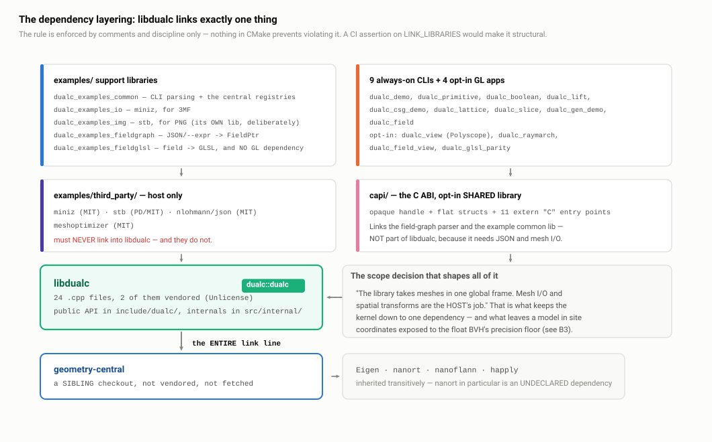

# B1 · Architecture and module boundaries

> **In one paragraph.** DualC is a four-layer stack with one hard rule at the bottom: the geometry kernel `libdualc` links exactly one library, geometry-central, and nothing else — no I/O, no JSON, no image writers, no GL. Everything a host needs and a kernel does not (OBJ/STL/3MF writers, PNG output, the JSON field-graph parser, GLSL codegen, GPU viewers, the C ABI) lives above that line in `examples/` and `capi/`, each in its own static library. Inside the kernel, two decoupled stages — an adaptive octree sampler and a dual contourer — meet at one data structure, the `HermiteOctree`, and the mesh input path is deliberately a strict subset of the field input path, so there is one refinement algorithm to reason about and a new input type never touches the contourer. The composability the product actually sells (compose a field graph once, then contour it, raymarch it, stream it in tiles or hand it across a C ABI) all hangs off one runtime graph representation — the field graph is the keystone. The honest defect to raise before anyone finds it: `dualContourMesh` silently drops `SamplerParams::signMethod`, and no test catches it because every sign-method test goes through the other entry point.

**Read this after:** A1 · Why dual contouring   **Time:** 45 min

## 1. The shape of the thing



*Look at the direction of every arrow: nothing above the line is reachable from below it.*

Four layers, each with a rule about what it may depend on.

**(a) `libdualc` — the geometry kernel.** A static library, `dualc::dualc`, built from 24 translation units (`CMakeLists.txt:55-82`) of which exactly 2 are vendored (`src/internal/qef.cpp`, `src/internal/svd.cpp`, both Unlicense). Its *entire* link line is one line: `target_link_libraries(dualc PUBLIC geometry-central)` (`CMakeLists.txt:95`). That single dependency transitively supplies Eigen, nanort, nanoflann and happly, which is documented at `CMakeLists.txt:92-94` so nobody is surprised. The public API is nine headers in `include/dualc/` (1,360 lines total), declaring about 50 classes — 30 analytic 3D primitives, 6 TPMS, the `PrimitiveField` base, 3 mesh/grid sources, `ImplicitField`, `HermiteOctree`, and the 2D layer's 8 (4 primitives, 2 lifts, the base and `PrimitiveField2D`) — concentrated in three of those headers (`primitives.h`, `implicit.h`, `implicit2d.h`). A further 23 classes exist and are deliberately **not** public: the 8 combinators, 9 decorators and 6 domain operators live in anonymous namespaces behind free factory functions (**B2** §3).

**(b) `examples/` — host-side glue.** Nine always-on CLI executables plus the shared static libraries they are built from: `dualc_examples_common` (argument parsing, OBJ/STL/3MF writers, and the central registries), `dualc_examples_io` (miniz, for 3MF), `dualc_examples_img` (stb, for PNG), `dualc_examples_fieldgraph` (nlohmann/json → `FieldPtr`), `dualc_examples_fieldglsl` (field graph → GLSL, deliberately GL-free), `dualc_demo_meshes`. The rule for this layer is: it may depend on the kernel and on host-only third-party code; the kernel may not depend on it.

**(c) Opt-in GL viewers.** `dualc_view` (Polyscope), `dualc_raymarch`, `dualc_field_view`, and the parity harness `dualc_glsl_parity`, all off by default (`CMakeLists.txt:6-17`) and all sharing `dualc_examples_gl` (`raymarch_gl.cpp`) for window/compile/snapshot plumbing. The rule: adding a viewer adds no dependency to `libdualc`, which is why they can be gated behind flags at all.

**(d) The C ABI.** `capi/` builds `dualc_capi` as a **shared** library — eleven `extern "C"` entry points over an opaque `DualcFieldHandle`, no exceptions escaping. Note where it sits: it links `field_graph` and `example_common`, i.e. it is a *host-layer* artefact, not part of the kernel. It hard-requires `DUALC_BUILD_EXAMPLES` and says so with a `FATAL_ERROR` explaining why (`CMakeLists.txt:125-132`).

The interesting property of this layering is that the layers are separated by *link lines*, not by folders. You can verify layer (a)'s purity mechanically by looking at one CMake property. Section 5 is about the fact that nobody does.

## 2. The two-stage core and its single contract

The kernel is two stages joined by one data structure. **Stage 1, the sampler** (`src/sampler.cpp`) walks an adaptive octree over the input, storing per-corner inside/outside signs and, on every edge whose two corners disagree, the position *and normal* of the surface crossing. **Stage 2, the contourer** (`src/contourer.cpp`) reads only that octree, places one vertex per cell (or per surface component) by solving a small least-squares problem, and emits quads. The data structure between them is the `HermiteOctree`, and it is the entire contract: the contourer never sees a mesh, a field, a BVH or a sign oracle. See **A1 · Why dual contouring** for why Hermite data is the right contract and **A2 · Sampling** for how the octree is built.

The engineering argument for that split is stronger than the usual "separation of concerns" claim, because of what the mesh path turns out to be. `sampleMeshToHermiteOctree` is three lines (`src/sampler.cpp:194-201`):

```cpp
HermiteOctree sampleMeshToHermiteOctree(SurfaceMesh& mesh,
                                        VertexPositionGeometry& geometry,
                                        const SamplerParams& params) {
  MeshSource source(mesh, geometry, params.interpolateNormals,
                    params.signMethod);
  return sampleFieldToHermiteOctree(source, params);
}
```

A mesh is not a second kind of input with its own refinement code. It is an `ImplicitField` — a signed-distance field backed by a BVH — and the mesh path is a *strict subset* of the field path. There is one refinement algorithm in the library, one set of prune/refine decisions, one edge-crossing capture routine. One thing to reason about, one thing to test, one thing to make thread-safe. Adding a new input type (a voxel grid, a point cloud, a NURBS evaluator) means implementing three virtuals and nothing else; the contourer is not recompiled, not re-tested, not even read. **B2 · API and type design** covers the interface that makes this work.

### The counterweight: `dualContourMesh` silently drops `signMethod`

`src/pipeline.cpp:34` constructs the same `MeshSource` with **three** arguments where `src/sampler.cpp:198` passes **four**:

```cpp
  MeshSource source(mesh, geometry, samplerParams.interpolateNormals);
  return dualContourField(source, samplerParams, contourerParams);
```

The fourth parameter defaults to `SignMethod::WINDING_NUMBER` (`include/dualc/implicit.h:86-89`), which despite its name is a **3-ray majority parity vote**, not a winding number — `types.h:21-24` documents this explicitly ("NOT a winding number despite the name — kept for backwards compatibility"). So `samplerParams.signMethod` is read, carried through the whole call, and never used.

The consequence is specific and bad. A user with non-watertight input — an open shell, triangle soup, a self-intersecting scan — sets `SamplerParams::signMethod = GENERALIZED_WINDING_NUMBER` precisely because it is the one oracle that tolerates their input (**A2** has the three oracles and their failure modes). Going through `dualContourMesh`, they silently get ray parity instead: the one method that *cannot* handle their input. No warning, no error, just a wrong solid. `PSEUDONORMAL` is equally silently ignored.

No test catches it because every sign-method test goes through `sampleMeshToHermiteOctree`, the *other* entry point — the one that is correct. The pipeline tests exercise `dualContourMesh` but not with a non-default `signMethod`. This is the shape of the bug worth internalising: it is not a logic error, it is a **duplicated construction site**. Two entry points build the same object from the same parameter struct, and one of them drifted when the fourth parameter was added.

The fix is structural, not a one-line patch, and there are two options. Either make `dualContourMesh` call `sampleMeshToHermiteOctree` (deleting the duplicated construction entirely, at the cost of losing the `simplifyHermiteOctree` step's placement — trivially rearranged), or change `MeshSource`'s constructor to take the `SamplerParams` struct so there is exactly one mapping from parameters to source. Either way the class of bug disappears. Add one test that asserts the two entry points produce identical octrees for every `SignMethod`, and it cannot come back.

This is the highest-severity defect in the library and you should volunteer it.

## 3. Public versus internal

`include/dualc/` is the installed API surface. `src/internal/` is private: the octree structure, the vendored QEF solver and 3×3 SVD, the mesh BVH wrapper, the sign oracles, the DC descent tables, the union-find used by Manifold DC, and two header-only helpers (`distance_grid.h`, `parallel.h`).

| Layer | Contents | Rule |
| --- | --- | --- |
| `include/dualc/` | `types.h`, `hermite_octree.h`, `sampler.h`, `contourer.h`, `pipeline.h`, `implicit.h`, `implicit2d.h`, `primitives.h`, `dualc.h` (umbrella) | Installed; changes are ABI changes |
| `src/internal/` | `octree`, `qef`, `svd`, `mesh_bvh`, `sign_oracle`, `dc_tables`, `cube_components`, `contourer_internals.h`, `distance_grid.h`, `parallel.h` | Private; no consumer may include these |

The mechanism is one CMake line: `src/` is `PRIVATE` on the `dualc` target (`CMakeLists.txt:88-91`), so no consumer can `#include "internal/qef.h"`. The only exception is deliberate — the test target adds `${CMAKE_SOURCE_DIR}/src` to its own include path, which buys white-box tests of the QEF solver, the DC tables and the BVH without widening the public interface by a single symbol. That is the right trade: testability paid for in the test target's build settings rather than in the API. **T · The testing approach** has what this buys.

The line is drawn where it should be. Nothing about *how* a vertex is placed, *how* signs are decided, or *how* the octree is stored is public. What is public is the vocabulary a caller needs: the field algebra, the two parameter structs, the octree as a value type, and four free functions.

### The geometry-central leak

The public surface does not re-export geometry-central wholesale — the headers forward-declare `SurfaceMesh` and `VertexPositionGeometry` rather than including them. But `types.h:9` does this:

```cpp
using geometrycentral::Vector3;
```

So `dualc::Vector3` **is** `geometrycentral::Vector3`, and with it come `dot`, `cross`, `componentwiseMin`, `Vector3::constant`, `unit()` and `operator[]`, none of which DualC defines.

The defence is decent. geometry-central is already a hard, non-optional, `PUBLIC` dependency (`CMakeLists.txt:95`) — you cannot use DualC without it in any configuration, so an alias hides nothing that was not already exposed. And a wrapper type would put a conversion in the hottest loop in the library: `valueAt` takes a `const Vector3&` and is called on the order of 10⁴ times per octree leaf (**B2** §6 has the count). A thin wrapper that is layout-compatible would be a `reinterpret_cast` in disguise; a real one would cost a copy per call.

The attack is also real, and it lands. It makes `dualc` unusable without geometry-central's headers *even for a pure-analytic field graph that touches no mesh at all* — `sphere ∪ box`, contoured and written to STL, needs a full geometry-central checkout because `Vector3` came from there. That is exactly the friction the C ABI had to paper over: `dualc_c.h` exposes flat `double[3]` arrays and an opaque handle precisely so a consumer does not inherit a C++ mesh library's headers. A small header-only `dualc::Vec3` with an implicit conversion, used only in the *public* signatures, would have been ~40 lines and would have made the analytic half of the library standalone.

## 4. The scope decision that shapes everything

The project states it in one sentence (`CLAUDE.md`): *"the library takes meshes in one global frame. Mesh I/O and spatial transforms are the host's job."*

Read that as three refusals. The library will not parse a file. It will not decide what "up" is. It will not re-centre your model.

What it buys is the whole layering in §1. No format zoo means no zlib, no XML, no ASCII/binary STL heuristics and no unit conventions inside the kernel; those live in `example_common.cpp` where a host can replace them. One global frame means no transform stack, no scene graph, no "which space is this point in" bugs threaded through the sampler. The result is a kernel with one dependency, embeddable in a CAD host that already has its own mesh classes, I/O and coordinate system — which is exactly what happened when the Rhino/Grasshopper client moved to a separate project and consumed DualC through the C ABI.

What it costs is precision, unwarned. A model in site coordinates — a component at (450000, 5300000, 12) in a national grid — is handed to the sampler as-is. The BVH is `float`-backed, so at that magnitude the representable spacing is around 0.03 units and a millimetre-scale feature is below the noise floor. Nothing re-centres, nothing checks the magnitude of `bounds()`, nothing emits a diagnostic; the user gets a mesh that is subtly wrong in ways that look like a contourer bug. **B3 · Ownership, RAII and the float/double seam** owns this; the fix is small (re-centre on the root box's centroid, or at minimum warn when `|bounds().center()|` dwarfs `extent()`), and the reason it has not been done is that under the stated scope it is a *host* responsibility — a consistent answer, not a good one.

## 5. The layering rule for third-party code

The rule (`CLAUDE.md`): *"Host-only deps stay in `examples/third_party/` (miniz for 3MF, stb for PNG) — they must never be linked into `libdualc`."* In practice that folder holds miniz (MIT, ZIP/deflate for 3MF), `stb_image_write.h` (public domain, PNG for `dualc_slice`), and nlohmann/json (MIT, the field-graph parser); meshoptimizer (MIT) backs `dualc_examples_decimate`. The rule is restated at three separate points in `examples/CMakeLists.txt` (`:8-19`, `:32-34`, `:78-85`), and it **holds** — `libdualc`'s only link is geometry-central.

The target graph encodes a real linker war story rather than just tidiness. `dualc_examples_img` (stb) is a *separate* library from `dualc_examples_io` (miniz) for one documented reason (`examples/CMakeLists.txt:14-19`): stb is used only by `dualc_slice`, so keeping it out of `dualc_examples_common` prevents `dualc_view` from linking both this stb and Polyscope's vendored stb and multiply-defining `stbi_write_*` (LNK2005).

The honest attack: the rule is enforced by **comments and discipline only**. Nothing in CMake stops someone writing `target_link_libraries(dualc PRIVATE dualc_examples_io)` — it would configure, build and pass every test, and the kernel would silently acquire a ZIP library. The fix is cheap: assert at configure time on `dualc`'s own `LINK_LIBRARIES` property and `FATAL_ERROR` if it is anything other than `geometry-central`. Ten lines, no CI infrastructure. A weaker variant costing nothing at all: do not *define* the host libraries when `DUALC_BUILD_EXAMPLES` is off, so a violation fails to configure. **B5 · Build, vendoring and the C ABI** carries the rest of the build-system critique.

## 6. Where the composability actually lives

Four consumers sit above the kernel, and the point is that they consume the *same* thing.

**The field-graph front end** (`examples/field_graph.{h,cpp}`, library `dualc_examples_fieldgraph`) lowers canonical JSON — or the `--expr` text shorthand — to a `FieldPtr`. Critically, it contains no field construction code of its own: it dispatches through the primitive/recipe/boolean/post-op registries in `examples/example_common.cpp`, the single source of truth shared by every CLI and the viewer. One name per concept, used by the C++ class, the CLI flag, the JSON schema and the shader.

**The GLSL codegen** (`examples/field_glsl.{h,cpp}`) walks the same graph and emits straight-line `float fN(vec3 p)` functions plus a uniform binding table — no recursion, no dispatch. It deliberately carries **no GL dependency** (`examples/CMakeLists.txt:97-102`) so codegen regressions are caught in a GL-less build, and it dedupes by structural equality, which the CPU path does not (**B2** §5).

**Streaming tiled export** contours the same graph in uniform grid-aligned tiles and streams the mesh out (`--tile-depth D`, or `--mem BUDGET` to pick `D`), roughly 49× lower peak RAM with byte-identical STL. It is a driver over the same `dualContourField` call, not a second contourer. **The C ABI** (`capi/`) takes a JSON graph or an `--expr` string across a flat boundary and returns an opaque handle, reusing `field_graph` verbatim.

That is the architectural claim worth making out loud: **the field graph is the keystone.** Four very different back ends — a CPU contourer, a GPU shader compiler, a streaming tiler and a C boundary — consume one runtime graph representation, and none needed a parallel copy of the field vocabulary. It is also why "why virtual dispatch?" has the answer it does (**B2** §6): the graph is built at runtime, from text, so the node set cannot be known at compile time.

## 7. What you would restructure

A short, honest list, in order of severity.

1. **The `dualContourMesh` `signMethod` bug** (`src/pipeline.cpp:34` vs `src/sampler.cpp:198`). Fix structurally: one construction site, plus a test asserting the two entry points agree for every `SignMethod`. §2.
2. **`implicit.h` does four jobs in 329 lines** — the base interface, three concrete pimpl'd sources (`MeshSource`, `WindingNumberField`, `GridField`), ~25 free-function declarations, and a large amount of user-facing prose (the `mixOf` warning alone runs 8 lines). Splitting into `field.h` / `sources.h` / `ops.h` costs nothing and makes the interface — the part that matters — readable on one screen.
3. **`primitives.h` exposes 36 classes' private data members in 555 lines.** Any layout change recompiles every consumer and breaks ABI; no primitive can gain a member without a break. Meanwhile the combinators are invisible behind factories in anonymous namespaces, free to change. The inconsistency is worth naming even though each half is defensible on its own — see **B2** §3 for the argument on both sides.
4. **The same maths helpers, copy-pasted five times.** `clampd`, `sgn`, `vabs`, `vmax0`, `len2max0` and `boxMinMax` appear in `src/implicit/primitives_tierA.cpp:10-33`, `primitives_tierB.cpp:11-37`, `primitives_tierC.cpp:10-40`, partly in `field2d.cpp:11-28`, and individually again in `domain_ops.cpp:28` (`sgn`) and `lift.cpp:26` (`len2max0`). One internal header. This is the easiest concrete improvement in the codebase and it is a five-minute change.
5. **Make the layering rule structural**, not documentary (§5).

Two more that belong to other documents but that you should know are on the list: the Lipschitz opt-out is not forwarded by any domain operator (**A5**), and the GLSL parity gate that guards the duplicated formulas is opt-in and un-CI'd (**B5**).

## Key terms

| Term | Meaning |
| --- | --- |
| Hermite data | Per-cell corner signs plus the position *and* normal of each surface crossing on a sign-changing edge. The sole contract between sampler and contourer. |
| `HermiteOctree` | The value type carrying that data. The contourer's only input. |
| Sampler | Stage 1: adaptive octree walk over a mesh or field, producing Hermite data. |
| Contourer | Stage 2: octree → triangle mesh, one QEF-placed vertex per cell/component. |
| `ImplicitField` | The abstract base every input reduces to. A mesh becomes one via `MeshSource`. |
| `MeshSource` | An `ImplicitField` backed by a BVH: sign from a chosen oracle, magnitude from a closest-point query. |
| Sign oracle | The inside/outside test: ray parity, angle-weighted pseudonormal, or generalized winding number. See **A2**. |
| Field graph | The runtime DAG of `FieldPtr` nodes built from JSON/`--expr`; the shared representation all four back ends consume. |
| Kernel / host split | The kernel does geometry in one global frame; I/O, transforms and formats are the host's job. |
| Sibling checkout | geometry-central is expected at `../geometry-central`, not vendored or fetched. See **B5**. |

## If they ask…

**Why two modules and not one?**

Because they have different inputs and different failure modes, and the contract between them is small enough to be a data structure. The sampler answers "where is the surface and which way does it face"; the contourer answers "given that, where does the vertex go". The `HermiteOctree` is the whole interface — the contourer never sees a mesh, a field, a BVH or a sign oracle. The payoff is concrete: adding the entire v2 implicit-field layer — around 70 classes across the public headers and the anonymous namespaces — changed the contourer by zero lines, and the octree can be inspected, serialised or tested in isolation. It also means the two halves are tested independently, which is why the QEF has white-box tests that never build an octree.

**How would you add a new input type?**

Implement three pure virtuals — `valueAt`, `gradientAt`, `bounds` (`include/dualc/implicit.h:31-39`) — and you are done; the sampler will refine against it and the contourer never learns it exists. Optionally override up to four more (`isInside`, `edgeHit`, `cellOverlaps`, `closestSurfacePoint`) when you have a faster closed form, which is exactly what `MeshSource` does because it has a BVH. That is not a hypothetical: the mesh path itself is that pattern — `sampleMeshToHermiteOctree` is three lines that wrap the mesh in a `MeshSource` and call the field path (`src/sampler.cpp:194-201`). The mesh input is a strict subset of the field input, so there is one refinement algorithm in the library rather than two.

**What is the public API surface and how do you keep it small?**

Nine headers in `include/dualc/`, 1,360 lines: two parameter structs, the octree type, four free functions, and the field algebra. Everything about *how* — the QEF solver, the SVD, the BVH, the sign oracles, the DC descent tables, the union-find for Manifold DC — is in `src/internal/`, which is `PRIVATE` on the target (`CMakeLists.txt:88-91`) so no consumer can include it. The one deliberate exception is the test target, which adds `src/` to its own include path to get white-box tests without widening the interface by a single symbol. The place the discipline is weakest is `primitives.h`, which publishes 36 classes' private data members — I would move those behind factories like the combinators already are.

**You expose geometry-central's `Vector3` in your public headers — why?**

`types.h:9` is `using geometrycentral::Vector3;`, so `dualc::Vector3` *is* their type. The defence is that geometry-central is already a hard, non-optional `PUBLIC` dependency (`CMakeLists.txt:95`), so the alias exposes nothing that was not already required, and a wrapper would add a conversion in `valueAt`, the hottest function in the library — roughly 10⁴ calls per octree leaf. The attack is fair and I would concede it: it makes DualC unusable without geometry-central's headers even for a pure-analytic graph that never touches a mesh, and that is precisely the friction the C ABI had to paper over with flat `double[3]` arrays. A ~40-line header-only `Vec3` used only in public signatures would have made the analytic half standalone.

**Your library links exactly one thing. Is that discipline or luck?**

Discipline, but only partly enforced. The scope decision — the kernel takes meshes in one global frame, I/O and transforms are the host's job — is what makes the single link line possible, and the target graph reflects it carefully: stb lives in its own library specifically so `dualc_view` does not multiply-define `stbi_write_*` against Polyscope's vendored copy (`examples/CMakeLists.txt:14-19`). But nothing in CMake *prevents* someone linking miniz into `dualc`; the rule is comments in three places. The fix I would make is a configure-time assertion on the target's `LINK_LIBRARIES` property, which is about ten lines and makes the invariant mechanical instead of cultural.

**Is there a bug you know about that you haven't fixed?**

Yes, and it is the one I would raise first. `dualContourMesh` at `src/pipeline.cpp:34` constructs `MeshSource(mesh, geometry, samplerParams.interpolateNormals)` with three arguments, while `src/sampler.cpp:198` passes four. The fourth is `signMethod`, so the convenience entry point silently drops it and defaults to ray parity. A user with triangle soup who asks for the generalized winding number — the one oracle that handles their input — gets the one that cannot, with no warning. No test catches it because every sign-method test goes through `sampleMeshToHermiteOctree`, the other entry point. The lesson is structural rather than local: two entry points constructing the same object from the same parameter struct is a copy-paste hazard by design. I would fix it by having `dualContourMesh` call `sampleMeshToHermiteOctree` — deleting the duplicate construction — or by making `MeshSource` take the params struct, and add a test asserting the two paths produce identical octrees for every `SignMethod`.

**Your own `docs/ARCHITECTURE.md` contradicts the code in five places. Why should I trust anything you say about it?**

You should not trust the stale summaries and I would not defend them: it claims the contourer is a flat canonical-edge enumeration at uniform depth, that `simplificationError` is ignored, that Manifold DC is not implemented, that `PSEUDONORMAL` is a no-op and that `edgeHit` bisects. All five are wrong against the shipped code — the contourer is the full Ju/Schaefer/Warren `cellProc`/`faceProc`/`edgeProc` recursion with `manifoldDC = true` by default, and `edgeHit` is Illinois-modified regula falsi. What *is* accurate is the local documentation: the class-level rationale comments were written alongside the code. A summary that contradicts the code is worse than no summary — which is why the more dangerous instance of the same class, a GPU copy of every SDF formula guarded only by an opt-in un-CI'd parity binary, is the one I would fix first.

## One-minute recap

- **Four layers.** `libdualc` (24 TUs, 2 vendored) links **only** geometry-central (`CMakeLists.txt:95`); `examples/` adds I/O, registries, the field-graph parser and GLSL codegen; GL viewers are opt-in; `capi/` is a host-layer shared library.
- **Two stages, one contract.** Sampler → `HermiteOctree` → contourer. The contourer never sees a mesh, a field or a BVH.
- **The mesh path is a subset of the field path.** `sampleMeshToHermiteOctree` is three lines wrapping a `MeshSource` (`src/sampler.cpp:194-201`) — one refinement algorithm, and a new input type never touches the contourer.
- **The bug to volunteer:** `src/pipeline.cpp:34` builds `MeshSource` with three arguments where `src/sampler.cpp:198` passes four, silently dropping `SamplerParams::signMethod`. Untested because sign-method tests use the other entry point. Fix is structural.
- **Public vs internal** is enforced by one CMake line (`src/` is `PRIVATE`, `CMakeLists.txt:88-91`); the test target opts in to white-box access without widening the API.
- **`types.h:9` aliases geometry-central's `Vector3`.** Defence: already a hard dependency, and a wrapper costs a conversion in the hottest loop. Attack: no standalone analytic use, and it is the friction the C ABI works around.
- **Scope:** one global frame, no I/O, no transforms. Buys a one-dependency embeddable kernel; costs precision on site-coordinate models, unwarned (**B3**).
- **Third-party layering** (miniz, stb, nlohmann/json, meshoptimizer in `examples/third_party/`) **holds** but is enforced by comments only; fix is a CMake assertion on `LINK_LIBRARIES`.
- **The field graph is the keystone**: contourer, GLSL codegen, tiled streaming export and the C ABI are four consumers of one runtime graph, with the CLI registries as the single source of truth for node names.
- **Restructure list:** the `signMethod` bug; split `implicit.h`'s four jobs; hide `primitives.h`'s 36 layouts; de-duplicate `clampd`/`sgn`/`vabs`/`vmax0`/`boxMinMax` across five files.
