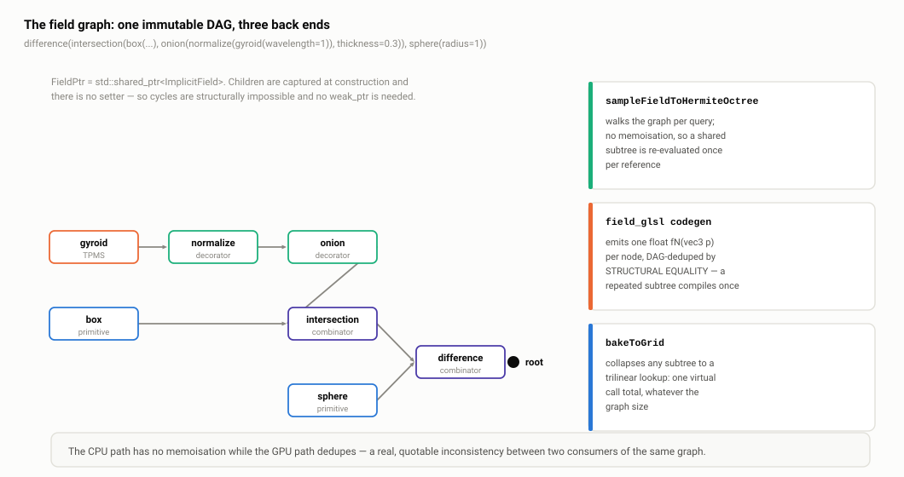

# B2 · API and type design

> **In one paragraph.** The whole v2 layer hangs off one abstract class with seven virtual functions: three pure (`valueAt`, `gradientAt`, `bounds`) and four defaulted (`isInside`, `edgeHit`, `cellOverlaps`, `closestSurfacePoint`). The split is not speculative — the four defaulted ones are exactly and only what the octree sampler calls, so the virtual set is the sampler's call graph reified, and each default is correct-but-slow while each override is equivalent-but-faster. Composition is `shared_ptr<ImplicitField>` moved into immutable nodes at construction time, which means one atomic increment per operand at graph-build time and **zero atomics thereafter**, because the sampler takes `const ImplicitField&` and nodes dereference rather than copy. The polymorphism cost is real — tens of millions of indirect calls on a dense build — but it is dominated by the leaves' arithmetic, and the architecture's answer is not "virtual isn't slow" but "here are two compilers that remove it": `bakeToGrid` collapses any subtree to a trilinear lookup, and the GLSL codegen flattens the whole graph to branchless straight-line code. The defects worth volunteering: the interface conflates performance fast paths with correctness opt-outs, `FieldPtr` is not `shared_ptr<const>` despite the header calling the tree immutable, `gradientAt` returns a unit direction while the contract says "gradient", and nothing validates anything.

**Read this after:** B1 · Architecture and module boundaries, A5 · The implicit field algebra   **Time:** 60 min

This document is about the C++ design. The *mathematics* of the same layer — the SDF formulas, the gradient trick, smooth minima, TPMS, domain warps — belongs to **A5 · The implicit field algebra**, and is not repeated here.

## 1. The `ImplicitField` interface, exactly

`include/dualc/implicit.h:26-65`. Eight virtual functions including the destructor:

| # | Signature | Line | Kind |
| --- | --- | --- | --- |
| 0 | `virtual ~ImplicitField() = default;` | 28 | virtual dtor, public |
| 1 | `virtual double valueAt(const Vector3& p) const = 0;` | 31 | **pure** |
| 2 | `virtual Vector3 gradientAt(const Vector3& p) const = 0;` | 35 | **pure** |
| 3 | `virtual BBox bounds() const = 0;` | 39 | **pure** |
| 4 | `virtual bool isInside(const Vector3& p) const;` | 44 | defaulted |
| 5 | `virtual bool edgeHit(const Vector3& a, const Vector3& b, Vector3& outP, Vector3& outN) const;` | 50-51 | defaulted |
| 6 | `virtual bool cellOverlaps(const BBox& cell) const;` | 55 | defaulted |
| 7 | `virtual bool closestSurfacePoint(const Vector3& q, Vector3& outP, Vector3& outN) const;` | 63-64 | defaulted |

It is **3 + 4**, not the "3 + 3" that the class's own summary comment advertises (`implicit.h:22-25` names only `isInside`, `edgeHit` and `cellOverlaps`) and not the 3 + 3 sketch still in `docs/ARCHITECTURE.md:263-281`. `closestSurfacePoint` was added later, as the sampler's fallback when `edgeHit` misses a crossing that the corner signs promised (`src/sampler.cpp:66-80`) — a real robustness path, not decoration — and it never made it into either summary. Know this before someone else finds it; it is a small instance of the documentation drift **B1** §7 and **A5** both flag.

The defaults live in `src/implicit/implicit_field.cpp`:

- `isInside` (`:19-21`) is `return valueAt(p) < 0.0;` — one line, and the sign convention itself. Zero counts as outside.
- `edgeHit` (`:23-69`) is **not** bisection despite what `implicit.h:48-49` says: it is a linear-seeded, Illinois-modified regula falsi with a six-step budget (`kEdgeHitRefineSteps = 6`, `:13`). The rationale comment is the defensible part — along a short cube edge a near-SDF is near-linear, so false position converges in ~6 `valueAt` calls instead of ~50 bisections. Its last line matters more than anything else in the class: the Hermite normal comes from `gradientAt(outP)` (`:65`), which is why the field algebra's gradient choices decide sharp versus smooth (**A5**).
- `cellOverlaps` (`:88-114`) is two-stage: eight corner signs, return true on any disagreement; then a conservative centre test `|valueAt(centre)| <= halfDiag`. That second stage assumes the field is **Lipschitz-1**, and says so honestly in a comment.
- `closestSurfacePoint` (`:71-86`) is one Newton step: `outP = q - g*(f/|g|)`, then re-query the gradient there.

## 2. Why that split is the strongest design argument in the library

Three claims, in order.

**(a) Every field reduces to `valueAt`.** A new primitive is one function plus a `bounds()`. `PrimitiveField` (`primitives.h:25-38`) even supplies a central-difference `gradientAt` so a subclass with no closed-form derivative implements literally one method. That is why 29 analytic primitives fit in three translation units at ~10-15 lines each.

**(b) The four derived queries are exactly and only what the sampler calls.** Not "queries a field might plausibly want" — the sampler's call sites are enumerable: `isInside` for corner signs (`src/sampler.cpp:95`), `cellOverlaps` for the refine/prune decision (`:103`, `:136`), `edgeHit` for the Hermite data (`:57-58`), `closestSurfacePoint` as the miss fallback (`:66-80`). The virtual set is the sampler's call graph reified. This is the difference between an interface designed and an interface guessed: there is no method on `ImplicitField` that nothing calls.

**(c) Each default is correct-but-slow; each override is equivalent-but-faster.** `MeshSource` overrides all four (`implicit.h:98-103`) because it has a BVH: `cellOverlaps` becomes an AABB-tree descent instead of nine signed-distance queries; `closestSurfacePoint` becomes a direct closest-point query instead of a Newton step; `edgeHit` becomes a segment first-hit. Implementing none of them is *correct*, just slower — so a third-party field author cannot get a wrong answer by doing nothing.

That last sentence is where the honest attack goes, and you should raise it yourself.

### The attack: one virtual, two unrelated concerns

`cellOverlaps` is simultaneously a **performance fast path** (MeshSource's BVH descent) and a **correctness opt-out**. All six TPMS override it to `return true` (`src/implicit/primitives_tpms.cpp:34,54,70,93,113,143`) not because the default is slow but because the default is *wrong for them*: a gyroid has gradient magnitude around `2π/λ`, so the Lipschitz-1 centre test prunes cells that contain surface. That override is the only mechanism by which a field can say "the default refinement heuristic does not apply to me", and it is spelled the same way as "I have a faster test".

The consequence: a field author who forgets the override gets **silently dropped geometry**, not a compile error. And the chain is only half-connected — the decorators that wrap a TPMS carefully forward the child's answer, each with a comment explaining why (`decorators.cpp:61-70`, `:298-303`, `:107-111`, `:159-163`), while **no domain operator forwards it at all**. `mirrored(gyroid(λ), n)` loses the opt-out. **A5** owns that bug and the fix: replace ten hand-written overrides with `virtual double lipschitzBound() const { return 1.0; }`, have TPMS return infinity, and make the *default* `cellOverlaps` consult it and every wrapper forward it. One virtual closes the class. Proposing that is a much better answer than defending the current state.

## 3. `FieldPtr` and composition

```cpp
// include/dualc/implicit.h:69
using FieldPtr = std::shared_ptr<ImplicitField>;
```

It is **not** `shared_ptr<const ImplicitField>`, even though the comment two lines above (`:67-68`) says nodes compose "forming an immutable expression tree". Immutability is real — every method in the hierarchy is `const`, there is no setter anywhere, no `mutable`, no cache — but it is enforced by the *absence* of mutators, not by the type system. Changing the alias to `shared_ptr<const ImplicitField>` compiles unchanged, because every call site already uses only const members. It is a free win and you should say you would take it.

### The deliberate asymmetry

There is no `dualc::sphere(...)`. The API splits in two:

| Category | How it is exposed | Where |
| --- | --- | --- |
| 30 analytic primitives + 6 TPMS | **Public classes**, constructed directly: `std::make_shared<SphereField>(c, r)` | `include/dualc/primitives.h`, private members visible |
| 8 combinators | Free functions returning `FieldPtr`; classes in an anonymous namespace | `combinators.cpp:319-352` |
| 9 decorators | ditto | `decorators.cpp:358-396` |
| 6 domain operators | ditto | `domain_ops.cpp:300-323` |
| Sources / bakes | Free functions or member factories | `implicit.h:112,156,204,208` |

The header states its own justification (`primitives.h:8-11`): *"Unlike the boolean combinators (which are hidden behind builder functions), primitives are the leaves of the expression tree and the user names them explicitly."* The defence is genuine — users need to name "a sphere"; nobody needs to name a `UnionField`. Hiding the composite classes means their layout, their `cellOverlaps` heuristics and even their existence are free to change, and they *have* changed: the `cellOverlaps` forwarding comments at `decorators.cpp:61-67` and `:298-303` read exactly like post-bug hardening, and that hardening cost zero API churn precisely because nobody could name the class.

The attack is that the asymmetry is inconsistent in the expensive direction. `primitives.h` publishes 36 classes' private data members across 555 lines, so adding a field to `SphereField` recompiles every consumer and breaks ABI, while `UnionField` can be rewritten freely. A uniform factory surface — `dualc::sphere(c, r)` returning `FieldPtr` — would have cost nothing at the call site, kept the names, and bought pimpl freedom everywhere. The one thing lost would be the header's use as a browsable catalogue, which a docs page solves.

There are also **no operator overloads**. The only `operator` declarations in `include/dualc/` are `Mat4::operator*` (`types.h:83`), `HermiteOctree`'s move-assignment (`hermite_octree.h:41`) and four deleted copy-assignments (`implicit.h:93`, `:140`, `:179`, `hermite_octree.h:44`) — no `a | b`, `a & b`, `a - b` CSG DSL. That is a good call, not an omission: a `-` meaning "subtract solid B" sitting next to `Vector3 operator-` meaning arithmetic is a precedence-and-readability trap in a CAD codebase, and the *actual* user-facing DSL is the text front end (`--expr "difference(intersection(box(...), onion(normalize(gyroid(wavelength=1)), thickness=0.3)), sphere(radius=1))"`). Ergonomics was spent where non-C++ users are.

## 4. Move semantics through the graph

Every factory takes `FieldPtr` **by value** and `std::move`s into the node (`combinators.cpp:319-321`):

```cpp
FieldPtr unionOf(FieldPtr a, FieldPtr b) {
  return std::make_shared<UnionField>(std::move(a), std::move(b));
}
```

and the constructor moves again (`:52`): `UnionField(FieldPtr a, FieldPtr b) : a_(std::move(a)), b_(std::move(b))`.

State the consequence precisely, because this is the single best rebuttal in the whole C++ section:

- Factories take by value and move — **one atomic increment per operand**, at graph-construction time, once.
- Nodes call through the pointer: `a_->valueAt(p)` is a **dereference, not a copy**. No `shared_ptr` copy exists anywhere in the evaluation path.
- The sampler takes `const ImplicitField&`, not a `FieldPtr` (`sampleFieldToHermiteOctree` in `include/dualc/sampler.h`; likewise `dualContourField` in `pipeline.h`). The smart pointer never crosses into the hot loop, and never crosses a thread boundary.

Net: **zero atomic operations during sampling, on any thread count.** The "shared_ptr is slow" attack simply does not land here, and the answer is fifteen seconds long. The secondary cost that *is* real — `make_shared` puts a control block next to each node, and a pointer-chasing graph has poor locality — is irrelevant next to a gyroid leaf's six transcendentals.

## 5. DAG, cycles and lifetime



*Look at the node with two parents: it is genuinely shared by refcount, and on the CPU path it is evaluated twice per query.*

**The structure is a DAG by capability and a tree by evaluation.** Nothing stops you passing one `FieldPtr` to two combinators; the node is genuinely shared and refcounted.

**Cycles are structurally impossible.** Children are captured at construction and there is no setter, so a node can never be made to point at an ancestor. Hence there is no `weak_ptr` anywhere in the library and no leak risk. That is worth stating explicitly, because "shared_ptr graph" usually invites the cycle question — and here the answer is a clean consequence of immutability rather than a convention someone has to maintain.

Two honest holes.

**(a) No memoisation on the CPU path.** `UnionField::valueAt` calls `a_->valueAt(p)` and `b_->valueAt(p)` unconditionally. A diamond-shaped graph re-evaluates the shared subtree once per *reference*, so cost is O(number of root-to-leaf paths), not O(nodes) — exponential for a pathological DAG. Meanwhile the **GLSL backend does dedupe**, by structural equality: nodes are keyed by op + params + children, so a duplicated subtree emits one `fN` and one uniform set, and a duplicated `mesh` bakes once (`examples/field_glsl.h:39-43`). So the GPU path is a true DAG and the CPU path is not. That is a quotable inconsistency and a ready-made "what would you do next": hash-cons at build time, or a per-sample memo keyed on node identity.

**(b) A documented non-owning reference that the code does not actually hold.** `MeshSource`'s class comment warns that it *"Holds non-owning references into the caller's SurfaceMesh / VertexPositionGeometry — they must outlive the MeshSource"* (`implicit.h:73-74`), and `WindingNumberField` says the same (`:129-131`). The constructors do take `&` (`:86-89`, `:134-136`) — but neither class stores one. Both `Impl`s hold an `internal::MeshBVH` **by value** (`src/implicit/mesh_source.cpp:44-47`, `src/implicit/winding_field.cpp:44-57`), and `MeshBVH` copies the mesh into packed float arrays at construction and documents exactly that: *"The BVH owns its own data; the input mesh / geometry are not referenced after construction"* (`src/internal/mesh_bvh.h:32-34`). So a constructed `FieldPtr` **is** self-contained, and the documented lifetime constraint is *over*-restrictive rather than under-stated — a doc/code mismatch in the opposite direction to `docs/ARCHITECTURE.md`'s, and one that costs users a real capability (they could destroy the input mesh immediately). **B3** §1 owns this.

The defence is documented and reasonable as far as it goes: both class comments say the mesh "must outlive" the field; geometry-central's mesh types are large, non-copyable, caller-managed objects, and taking them by `shared_ptr` would force one ownership model on every host; and the library's stated scope (**B1** §4) keeps mesh lifetime a host concern. The three heavyweight sources do at least delete copy explicitly — `MeshSource` (`implicit.h:92-93`), `WindingNumberField` (`:139-140`), `GridField` (`:178-179`) — each holding a `unique_ptr<Impl>` pimpl.

But the mitigation that actually shipped is the better answer: the C ABI's **in-memory mesh-source resolver** (v0.3.0, 2026-06-19) exists precisely because this hazard is unmanageable across a plugin boundary, where the mesh lives in Rhino's heap and the field lives in DualC's. Saying that shows the problem was recognised and solved where it actually bit, rather than defended in the abstract. **B3 · Ownership, RAII and the float/double seam** owns the full ownership map.

## 6. The polymorphism trade-off, argued properly

State the exposure honestly first. One `valueAt` on a graph of N nodes is N non-inlinable indirect calls. Per octree leaf the sampler does 8 `isInside` (`sampler.cpp:95`) plus up to 12 `edgeHit` at ~8 `valueAt` each (`implicit_field.cpp:13`) — roughly **104 field evaluations per leaf** — plus one `cellOverlaps` per interior node. At depth 7 over a dense TPMS that is tens of millions of virtual calls, and each of them multiplies by the graph's node count.

The defence, in order of strength.

**(i) The graph is built at runtime, so the boundary has to be dynamic somewhere.** `dualc_field` parses JSON; `--expr` parses text; the C ABI hands a graph across a flat boundary. The node types are not known at compile time in the product's actual use case. Any static-polymorphism scheme therefore ends at a runtime-dispatched boundary anyway — virtual is that boundary, placed once, at the natural place.

**(ii) The architecture's answer to "virtual dispatch is slow" is not "it isn't", it is "here are two compilers that remove it."** `bakeToGrid()` (`implicit.h:198-209`) samples an expensive field — "notably a MeshSource, or a whole tree of them" — once into a grid; `GridField::valueAt` is then a trilinear lookup, one virtual call total regardless of the original graph's size, and `MeshSource::bakeToGrid` (`:112-113`) adds a narrow-band variant that only computes exact distance near the surface. The **GLSL codegen** (`examples/field_glsl.h:12-20`) compiles the entire graph to straight-line `float fN(vec3 p)` functions with no recursion and no dispatch — the same graph, zero indirection, on a GPU. When dispatch is genuinely the bottleneck, the library removes it rather than arguing about it.

**(iii) The cost is dominated by the leaves.** A gyroid leaf is six transcendentals, on the order of 100+ cycles. A `MeshSource` leaf is a BVH descent — pointer chasing and triangle tests. An indirect call whose branch-target buffer entry is hot is 2-5 cycles. For exactly the fields people build, dispatch is in the noise.

**(iv) Immutability makes the parallel build free.** `src/sampler.cpp:177-188` forks at depth 3 and runs disjoint subtrees on all cores against one `const ImplicitField&`, with the documented and tested guarantee that the octree is bit-identical regardless of thread count. An immutable virtual hierarchy gives that for nothing — no locks, no thread-local caches, no `mutable` members to reason about. **B4 · Parallelism and determinism** has the detail.

**The honest concession.** Composite nodes are where dispatch actually hurts, because they add calls without adding maths. Worse, `UnionField::gradientAt` (`combinators.cpp:60-61`) evaluates **both** subtrees' `valueAt` to decide which is active, then one subtree's `gradientAt` — so a gradient through a depth-D boolean chain costs about 2D extra subtree evaluations. The same pattern is at `:84-85` and `:114-115`. Caching the two operand values within the call is a three-line fix. Related and also fixable: the sampler recomputes corner values inside `edgeHit` that the corner-sign pass already had (`sampler.cpp:95` then `implicit_field.cpp:25-26`) — 24 redundant `valueAt` per leaf, removable by widening `edgeHit` to accept the known endpoint values.

## 7. Why not CRTP, expression templates or `std::variant`?

**CRTP and expression templates** require the composition to be known at compile time. It is not: `dualc_field` parses JSON at runtime and the C ABI hands graphs across a flat boundary. Dead on arrival for the actual product. Say, though, that they would work *beautifully* for a different product — a header-only library where users write `union_(sphere(c, r), box(b))` in C++ and the compiler inlines the whole expression into one function. That library would be faster and need no vtable. It also could not have a JSON front end, a C ABI or a plugin extension point, which is where this project's value is.

**`std::variant` + `std::visit`** is the genuinely serious alternative. Its real advantages: no vtable, nodes stored as values rather than heap-allocated pointers, much better locality, and a visit over a closed set that compiles to a jump table a compiler can sometimes see through entirely. Four counter-arguments, in order:

1. **It closes the hierarchy.** `MeshSource`, `WindingNumberField` and `GridField` are pimpl'd around a BVH and a mesh reference. Putting them in a variant makes every node as large as the largest alternative — unless you box them, at which point you are back to indirection for exactly the nodes where it is most expensive.
2. **A ~50-alternative variant is a compile-time and error-message disaster.** Every `std::visit` instantiates the visitor for every alternative.
3. **A recursive variant needs indirection anyway.** A variant cannot hold itself, so children are `unique_ptr`/index-into-a-pool regardless; the pointer chase comes straight back.
4. **It kills the C-ABI extension point.** A closed set means a plugin cannot add a node type without rebuilding the library.

**Be fair about it.** For the ~15 pure-arithmetic node types a variant *would* be measurably faster, especially flattened into a contiguous array evaluated bottom-up with an explicit stack — which also gets you the memoisation §5 lacks. And nobody measured. "We measured and it did not matter" is a much stronger answer than "we reasoned it would not"; a micro-benchmark of `unionOf(sphere, box)` against a hand-written variant equivalent is an hour well spent. The strongest counter to the whole line of questioning remains (ii): the library already ships two answers that beat any dispatch micro-optimisation by orders of magnitude.

## 8. Parameter structs

`SamplerParams` (`include/dualc/sampler.h:19-35`) and `ContourerParams` (`include/dualc/contourer.h:18-29`) are plain aggregates with in-class default member initialisers — no builder, no named-argument emulation, no options object with setters.

| Struct | Fields |
| --- | --- |
| `SamplerParams` | `maxDepth = 7`, `minDepth = 3`, `rootBounds` (`std::optional<BBox>`, unset ⇒ auto-fit), `padFraction = 0.05`, `signMethod = WINDING_NUMBER`, `seed = 0`, `interpolateNormals = true`, `numThreads = 0` |
| `ContourerParams` | `qefRegularization = 0.1`, `simplificationError = 0.0`, `clampVertexToCell = true`, `clampToleranceCells = 1.0`, `weldEdges = true`, `manifoldDC = true` |

The defence is solid. This is C++17, so a caller writes `SamplerParams p; p.maxDepth = 8; p.signMethod = SignMethod::GENERALIZED_WINDING_NUMBER;` and every field they did not touch has a sane, documented default. Adding a field is source-compatible for every existing caller. For a source-tree dependency (**B1** §1: DualC ships as `add_subdirectory`, not as an installed binary) it is ABI-stable enough. And it is self-documenting at the call site in a way positional arguments are not — the `dualContourField(field, samplerParams, contourerParams)` signature would otherwise be eight loose parameters.

Three attacks, and the third is the one that stings.

**No validation, anywhere** — not in the parameter structs and not in any field constructor. `SphereField(c, -5)` silently makes an inside-out sphere; `scaled(f, 0)` divides by zero (`decorators.cpp:334`); `GyroidField(c, 0)` sets `k_ = 2π/0 = inf`; `transformed(f, M)` with a scale or shear silently uses a wrong `inverseRigid()`, documented as rigid-only at `types.h:109-120` and enforced nowhere; `repeatedLimited` with `count = 0` clamps to zero (`domain_ops.cpp:175-178`), undocumented.

**Dead fields shipped in the public API.** `SamplerParams::seed` is consumed by `(void)params.seed;` at `src/sampler.cpp:190` — an explicit acknowledgement that it does nothing. `ContourerParams::weldEdges` appears in the public header (`contourer.h:23`) and nowhere else in `src/`. Both promise behaviour the library does not deliver, which is worse than being absent.

**The concession.** Debug-only contract checks cost literally nothing in release and would have caught every one of these. The nominal defence — that `field_graph.cpp` is the designed validation boundary and the constructors sit on a hot construction path — is true for the parser and irrelevant for a consumer calling the C++ API directly. For a kernel whose output becomes a physical part, `throw std::invalid_argument` on `radius <= 0` is cheap insurance, and the library already throws in exactly one place (`sampler.cpp:166`), so there is no "we never throw" policy to defend.

## 9. The `gradientAt` contract wart

The declared contract (`implicit.h:34-35`) reads: *"Field gradient at p. Normalized, this is the outward surface normal where valueAt == 0."* Read as English, that says "I return the true gradient; normalise it yourself."

The implementations return an **already-normalised direction**. `PrimitiveField::gradientAt` divides by the norm (`primitives.h:37`); `SphereField` returns `d/|d|`; `PlaneField` returns the stored unit normal; the finite-difference helpers in `domain_ops.cpp:25` and `lift.cpp:22` normalise. So the method is neither a gradient nor documented as not being one.

The library **knows** this and works around it in exactly one place. `NormalizedField` needs `|∇f|` to divide by, and cannot get it from its child, so `trueGradMag` recomputes the magnitude by central differences on `valueAt` (`decorators.cpp:310-321`), with a comment saying so directly: the child's `gradientAt()` returns a unit direction "and so cannot supply the magnitude this normalisation needs — dividing by it would be a no-op." Six extra child evaluations per query, to recover information the interface threw away.

The defence: the *only* consumer of `gradientAt` in the pipeline is `edgeHit`, which normalises anyway (`implicit_field.cpp:65-67`) before storing the Hermite normal. Magnitude is therefore contractually dead, and returning a unit vector saves the caller a `sqrt` in the hot loop. Under that reading the code is right and only the comment is wrong.

The fix, and there are two grades of it. Cheap: rename to `normalAt` and change the doc to "returns the unit outward normal direction" — a one-word doc change plus a rename, and every call site already treats it that way. Proper: return the true gradient and normalise at the two call sites, roughly ten lines, which would make `NormalizedField` free and would also make `SmoothUnionField::gradientAt`'s lerp exact rather than approximate (it currently lerps two *unit* vectors, which equals the true gradient only under the SDF assumption — see **A5** for the derivation).

## 10. Small things a reviewer will notice

**No `final` anywhere.** Not on a single class or override. For the primitives that is a free devirtualisation opportunity when the static type is known (`SphereField s; s.valueAt(p);` can be a direct call), though it would not help the sampler, which only ever holds `const ImplicitField&`. Cheap, free, absent.

**`noexcept` used exactly twice in the entire public API**, both on `HermiteOctree`'s move operations (`hermite_octree.h:40-41`). Not one field method is marked, though `SphereField::valueAt` obviously is. The practical consequence is mild — fields are never stored by value in a `vector`, so there is no move-versus-copy reallocation decision to influence — but a reviewer will notice the blanket absence.

**Copy/move on the base.** The user-declared destructor (`implicit.h:28`) suppresses the implicit *move* operations while copy construction and copy-assignment are still implicitly generated. The base is abstract so it cannot be sliced directly, but the derived combinator classes are all implicitly copyable; in practice they are only ever `make_shared`'d (`combinators.cpp:319-352`), so this is latent rather than live. A rigorous reviewer would want Rule-of-Five with `protected` copy/move, or `= delete` on the base. The three heavyweight sources do get it right explicitly (`implicit.h:92-93`, `:139-140`, `:178-179`) because their pimpls force the issue.

**Exception safety is strong by construction, weak by validation.** All state is RAII (`shared_ptr` nodes, `unique_ptr` pimpls) and all nodes are immutable, so there is no partially-constructed state to unwind: the basic guarantee is free and the strong guarantee is vacuous. What is missing is §8's preconditions, not exception handling. **Const-correctness is complete** — no non-const member function anywhere in `src/implicit/`, no `mutable`, no `thread_local`, no caching, which is what makes §6(iv) true.

## Key terms

| Term | Meaning |
| --- | --- |
| `ImplicitField` | The abstract base: 3 pure virtuals + 4 defaulted, plus a virtual destructor. |
| `FieldPtr` | `std::shared_ptr<ImplicitField>` (`implicit.h:69`) — the composition handle. Not `<const>`, though it should be. |
| Pure vs defaulted virtual | `valueAt`/`gradientAt`/`bounds` must be written; `isInside`/`edgeHit`/`cellOverlaps`/`closestSurfacePoint` have correct-but-slow defaults. |
| Correctness opt-out | Overriding `cellOverlaps` to `true` to disable the Lipschitz-1 prune test — same virtual as the performance fast path. |
| `bakeToGrid` | Sample any subtree once into a grid; the result is a `GridField` whose `valueAt` is one trilinear lookup. The first devirtualiser. |
| GLSL codegen | Compile the same graph to straight-line shader code — no recursion, no dispatch. The second devirtualiser, and it dedupes by structural equality. |
| Hash-consing / memoisation | What the CPU path lacks: a diamond DAG costs O(paths), not O(nodes). |
| Documented non-owning reference | The headers require the caller's mesh to outlive `MeshSource`/`WindingNumberField`; the code copies everything into the BVH at construction, so the documented constraint is stricter than the implementation needs. |
| pimpl | `unique_ptr<Impl>` in the three heavyweight sources; forces explicit copy deletion. |
| Aggregate params | `SamplerParams`/`ContourerParams` — plain structs with defaults, no builder, no validation. |

## If they ask…

**Why virtual dispatch in your innermost loop?**

Because the boundary has to be dynamic somewhere: the graph is built at runtime from JSON, from `--expr` text or across a C ABI, so the node types are genuinely not known at compile time. Any static-polymorphism scheme still ends at a runtime-dispatched boundary; virtual is that boundary, placed once. On cost: it is about 104 field evaluations per octree leaf, so tens of millions of indirect calls at depth 7, but it is dominated by the leaves — a gyroid leaf is six transcendentals, a `MeshSource` leaf is a BVH descent, and an indirect call with a hot branch-target buffer is 2-5 cycles. And when dispatch genuinely is the bottleneck, the architecture removes it rather than arguing: `bakeToGrid` collapses any subtree to a trilinear lookup (`implicit.h:198-209`), and the GLSL codegen flattens the whole graph to branchless straight-line code. What I would concede is that composite nodes add calls without adding maths, and `UnionField::gradientAt` (`combinators.cpp:60-61`) evaluates both operands' values redundantly — a three-line caching fix.

**`shared_ptr` everywhere — what about the atomic refcount cost?**

There isn't one during evaluation. Factories take `FieldPtr` by value and `std::move` into the node (`combinators.cpp:319-321`), and the constructors move again, so it is one atomic increment per operand at graph-construction time. After that, nodes call through the pointer — `a_->valueAt(p)` is a dereference, not a copy — and the sampler takes `const ImplicitField&`, not a `FieldPtr`, so the smart pointer never crosses into the hot loop or a thread boundary. Zero atomics during sampling, on any thread count. The only residual cost is the control block's effect on locality, which is noise next to a gyroid's six transcendentals.

**Why not `std::variant` and `std::visit`?**

It is the serious alternative and I would not dismiss it — no vtable, values instead of pointers, better locality, and a jump-table visit. Four reasons it does not fit here. It closes the hierarchy, which kills the C-ABI extension point. The pimpl'd sources — `MeshSource` around a BVH, `GridField` around a lattice — would make every node as large as the largest alternative unless you box them, and then you are back to indirection where it costs most. A recursive variant needs an indirection anyway, since a variant cannot hold itself. And ~50 alternatives is a compile-time and error-message disaster. But I would be fair: for the ~15 pure-arithmetic node types a variant, especially flattened into a contiguous array evaluated bottom-up, would be measurably faster and would give me the memoisation the CPU path currently lacks. Nobody measured, and "we measured and it did not matter" would be a stronger answer than the one I have.

**How would a user add their own primitive?**

Derive from `PrimitiveField` and write `valueAt` and `bounds` — two functions, because `PrimitiveField` supplies a central-difference `gradientAt` (`primitives.h:27-38`). If you have a closed-form gradient, override it and you have saved six `valueAt` calls per query. If your field is not Lipschitz-1 — a trigonometric lattice, say — you must also override `cellOverlaps` to `return true`, which is what all six TPMS do (`primitives_tpms.cpp:34`). Everything downstream then works unchanged: the sampler refines against it, the contourer never learns it exists. The thing I would change is that last requirement, because forgetting it is silent rather than a compile error — see the next question.

**Your interface has four optional virtuals — what happens if I don't override them?**

Usually nothing bad: the defaults are correct, just slower. `isInside` is `valueAt(p) < 0`, `edgeHit` is Illinois regula falsi over `valueAt`, `closestSurfacePoint` is one Newton step. That is deliberate — you cannot get a wrong answer by doing nothing. **Except for `cellOverlaps`**, and this is the design flaw I would raise myself: it is simultaneously a performance fast path (`MeshSource` uses its BVH) and a *correctness opt-out*. Its default assumes the field is Lipschitz-1, so a field that isn't — every TPMS — must override it to `true` or the sampler silently prunes cells containing surface. Two unrelated concerns behind one virtual, and forgetting it gives you dropped geometry rather than a compile error. The fix is `virtual double lipschitzBound() const { return 1.0; }`, TPMS returning infinity, and the default `cellOverlaps` consulting it — one virtual replacing ten hand-written overrides, and it also closes the related bug where the decorators forward the opt-out and the domain operators do not.

**You validate nothing. Is that defensible?**

Not really, and I would concede it. `SphereField(c, -5)` makes an inside-out sphere; `scaled(f, 0)` divides by zero (`decorators.cpp:334`); `GyroidField(c, 0)` gives an infinite wavenumber; `transformed(f, M)` with a shear silently uses a wrong inverse, documented at `types.h:109-120` and enforced nowhere. The nominal defence is that the JSON parser in `field_graph.cpp` is the designed validation boundary and the library trusts its callers the way a maths kernel does — which is true for the CLI path and irrelevant for anyone using the C++ API directly. Debug-only contract checks cost nothing in release and would have caught every one of these, and for a kernel whose output becomes a physical part, throwing on `radius <= 0` is cheap insurance. There is also no "we never throw" policy to protect: `sampler.cpp:166` already throws `std::invalid_argument` on infinite bounds. And I would delete the two dead fields in the public API while I was there — `SamplerParams::seed`, which is `(void)`-ed at `sampler.cpp:190`, and `ContourerParams::weldEdges`, which appears in the header and nowhere in `src/`.

**Your header calls it an immutable expression tree, but `FieldPtr` is `shared_ptr<ImplicitField>`. Which is it?**

Immutable in fact, not in type. Every method in the hierarchy is `const`, there is no setter, no `mutable` and no cache anywhere in `src/implicit/`, and the invariant is load-bearing: the sampler forks at depth 3 and runs disjoint subtrees on all cores against one `const ImplicitField&` with a bit-identical result (`sampler.cpp:177-188`). So the const-ness that *matters* is enforced where it is consumed. But the comment at `implicit.h:67-68` promises more than the type does, and I would take the free fix: `using FieldPtr = std::shared_ptr<const ImplicitField>` compiles unchanged, because every call site already uses only const members, and it makes the invariant a type error to violate rather than a convention. A related consequence worth stating: because children are captured at construction with no setter, cycles are structurally impossible — hence no `weak_ptr` anywhere and no leak risk.

**Does a `FieldPtr` own everything it needs to evaluate?**

In practice yes, and the headers are more pessimistic than the code. `MeshSource` (`implicit.h:73-74`) and `WindingNumberField` (`:129-131`) both *document* non-owning references to the caller's `SurfaceMesh` and `VertexPositionGeometry`, and their constructors do take `&`. But neither stores one: both `Impl`s hold `internal::MeshBVH` by value (`mesh_source.cpp:44-47`, `winding_field.cpp:44-57`), and `MeshBVH` copies the mesh into packed float buffers at construction — its own header says so (`src/internal/mesh_bvh.h:32-34`). So once the field is built, the caller can destroy the mesh; the documented constraint is over-restrictive. I would fix the comment rather than the code. The genuinely interesting version of this question is what happens across a plugin boundary, where the mesh lives in a host's heap and neither convention helps — and that is exactly why the C ABI shipped an in-memory mesh-source resolver.

## One-minute recap

- **The interface is 3 + 4**, not the 3 + 3 the class comment (`implicit.h:22-25`) and `ARCHITECTURE.md` both claim — `closestSurfacePoint` (`:63-64`) was added as the sampler's miss fallback (`sampler.cpp:66-80`) and never reached the summaries.
- **The four defaulted virtuals are exactly the sampler's call sites** (`sampler.cpp:95`, `:103`, `:136`, `:57-58`, `:66-80`) — the virtual set is a call graph reified, not a speculative interface. Each default is correct-but-slow; `MeshSource` overrides all four because it has a BVH.
- **The flaw in that split:** `cellOverlaps` is both a performance fast path and a correctness opt-out (TPMS return `true`, `primitives_tpms.cpp:34`). Forgetting it drops geometry silently. Fix: `virtual double lipschitzBound()`.
- **Zero atomics in the hot loop.** Factories take `FieldPtr` by value and move (`combinators.cpp:319-321`); nodes dereference; the sampler takes `const ImplicitField&`. One increment per operand at build time, none thereafter, on any thread count.
- **`FieldPtr` is not `shared_ptr<const>`** despite `implicit.h:67-68` calling the tree immutable. Free fix, compiles unchanged.
- **Cycles are structurally impossible** (children captured at construction, no setters) — no `weak_ptr`, no leak risk. But **no CPU memoisation**: a diamond DAG costs O(paths); the GLSL backend dedupes by structural equality (`field_glsl.h:39-43`) and the CPU path does not.
- **Primitives are public classes with visible members (555 lines, 36 classes with visible layouts); combinators/decorators/domain ops are hidden behind free factories.** Defensible each way, inconsistent together — the primitives' layouts are baked into the ABI, the combinators' are free.
- **The answer to "virtual is slow" is `bakeToGrid` and the GLSL codegen** — two compilers that remove dispatch entirely. The concession is `UnionField::gradientAt` evaluating both operands' values redundantly (`combinators.cpp:60-61`): ~2D extra subtree evaluations through a depth-D chain, a three-line fix.
- **`std::variant` is the serious alternative** and would win for the ~15 arithmetic node types; it loses on the pimpl'd sources, recursion, compile times and the C-ABI extension point. Concede that nobody measured.
- **`gradientAt` returns a unit direction while its contract says "gradient"** (`implicit.h:34-35`); `NormalizedField::trueGradMag` recomputes the magnitude by central differences and says so (`decorators.cpp:310-321`). Rename to `normalAt`, or return the true gradient and normalise at the two call sites.
- **No validation anywhere**, plus two dead public fields (`SamplerParams::seed`, `(void)`-ed at `sampler.cpp:190`; `ContourerParams::weldEdges`). No `final`, `noexcept` twice in the whole API, implicit copy left live on the base. No CSG operator overloads — deliberate, because `--expr` is the real DSL.
