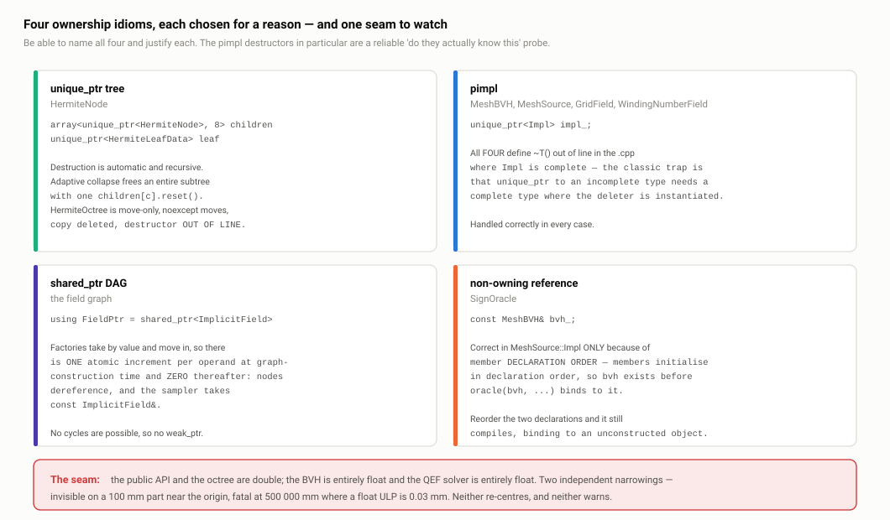

# B3 · Memory, ownership and performance

> **In one paragraph.** DualC uses four distinct ownership idioms, each deliberately: a `unique_ptr` octree where destruction is recursive and a collapse frees a subtree with one `reset()`; pimpl behind `unique_ptr<Impl>` for the four heavyweight sources, with every destructor correctly defined out-of-line where `Impl` is complete; `shared_ptr` for the field graph, because a DAG cannot be expressed with unique ownership; and one genuine non-owning reference, `SignOracle`'s `const MeshBVH&`, whose lifetime is correct only because of member declaration order. The performance story is honest rather than flattering: the octree is a pointer-chased tree of ~10⁶ individually-`new`ed nodes costing roughly a gigabyte at depth 9, the contourer performs one heap allocation per emitted triangle, and every BVH traversal heap-allocates its own stack. None of these is defended as optimal — the peak-memory problem was solved one layer up, in the streaming tiled export path, and the rest are named, ranked and costed. The seam that matters most for correctness is not memory at all: the API and the octree are `double`, the BVH is `float` and the QEF solver is `float`, two independent narrowings that are invisible on a part near the origin and fatal on a part in site coordinates.

**Read this after:** B1 · Architecture and module boundaries, B2 · The field interface   **Time:** 60 min

## 1. The ownership map

There are exactly four ownership idioms in the library, and each one is the right answer to a different question. You should be able to name all four and justify each in a sentence.



*Four idioms — the `unique_ptr` octree, the pimpl'd sources, the `shared_ptr` field DAG and the one non-owning reference — plus the two points where `double` narrows to `float`.*

### The `unique_ptr` tree — strict ownership, recursive destruction

`HermiteNode` owns everything below it (`include/dualc/hermite_octree.h:26-32`):

```cpp
struct HermiteNode {
  BBox bounds{};
  int  depth  = 0;
  bool isLeaf = true;
  std::unique_ptr<HermiteLeafData> leaf{};
  std::array<std::unique_ptr<HermiteNode>, 8> children{};
};
```

The payload and the children are both owned by value-semantics smart pointers, so there is no destructor to write, no ownership question to answer at any call site, and no leak path. The payoff shows up in the adaptive-collapse code: `tryCollapse` (`src/contourer.cpp:269`) turns an internal node into a leaf by calling `children[c].reset()` eight times, and each of those frees an entire subtree of unknown depth in one statement. Writing that with raw pointers means writing — and getting right — a recursive delete, in a function that is already doing three topology tests.

`HermiteOctree` itself is move-only with `noexcept` moves and copy explicitly deleted (`include/dualc/hermite_octree.h:40-44`). The `noexcept` is not decoration: it is what lets `std::vector<HermiteOctree>` move rather than copy on reallocation, and since copy is deleted, without `noexcept` the vector would not compile at all for a growing container. The tiled export path stores octrees in containers, so this matters in practice.

The destructor is declared in the header and **defined out-of-line in `src/hermite_octree.cpp:61`**. That is the same discipline as the pimpl case below and for the same reason — see the next subsection.

One honest criticism: the destructor is recursive, so a pathologically deep tree could exhaust the stack. In practice depth is bounded around 21 by the addressable cell count, and the shipped default `maxDepth` is 7, so this is theoretical. Say so rather than pretending it was designed against.

### Pimpl with `unique_ptr<Impl>` — and the destructor trap

Four classes hide their implementation behind a pointer to an incomplete type: `MeshBVH` (`src/internal/mesh_bvh.h:112-113`), `MeshSource` (`include/dualc/implicit.h:116-117`), `GridField` and `WindingNumberField`. All four hold `std::unique_ptr<Impl>` where `struct Impl;` is only forward-declared in the header.

The reason for pimpl here is specific and defensible: `MeshBVH::Impl` contains nanort types, and nanort arrives transitively through geometry-central. Without pimpl, every consumer of `dualc/implicit.h` would need nanort's headers on its include path to compile a `MeshSource`. Pimpl keeps a private, transitive dependency out of the public compile surface. That is exactly what the idiom is for, and it is the argument to give — not "it improves compile times", which is a side effect.

**The trap, and this is the part interviewers actually probe.** `std::unique_ptr<T>`'s default deleter calls `delete p`, and `delete` on an incomplete type is undefined behaviour that the standard library detects with a `static_assert`. The deleter is instantiated wherever the destructor of the owning class is instantiated. If you let the compiler generate `~MeshSource()` implicitly, it gets generated in every translation unit that destroys a `MeshSource` — where `Impl` is incomplete — and the build fails, or worse, fails only in some configurations.

All four classes handle it correctly by declaring the destructor in the header and defining it in the `.cpp` after `Impl` is complete:

```cpp
MeshSource::~MeshSource() = default;   // src/implicit/mesh_source.cpp:67
```

with the same pattern at `src/internal/mesh_bvh.cpp:393`, `src/implicit/grid_field.cpp:77` and `src/implicit/winding_field.cpp:64`. Note that `= default` is still written — the compiler generates the body, but it generates it *here*, where the type is complete.

This is a reliable "do they actually know this" question, and four out of four is the right answer to be able to give. The follow-up is worth pre-empting too: the same applies to any implicitly generated move operations, which is one reason all four also `= delete` their copy operations explicitly rather than relying on `unique_ptr` to suppress them silently.

### `shared_ptr` DAG — the field graph

`using FieldPtr = std::shared_ptr<ImplicitField>` (`include/dualc/implicit.h:69`). A composed field is a DAG, not a tree — the same sub-field is routinely referenced by two combinators — and `unique_ptr` cannot express shared structure. The full argument, including why the atomic refcount never enters the hot loop, belongs to **B2 · The field interface**; do not re-derive it here. The one-line version for this document: refcounts are touched at graph-construction time only, because factories take `FieldPtr` by value and `std::move` into the node, nodes dereference rather than copy, and the sampler's signature is `const ImplicitField&`.

### Non-owning references — one, and it is order-dependent

`SignOracle` holds `const MeshBVH&` (`src/internal/sign_oracle.h:17`). That is a genuine non-owning reference and it is the right call — the oracle is a thin policy object over a BVH that something else owns, and copying a BVH to feed it would be absurd.

Its lifetime is correct inside `MeshSource::Impl`, but only for a reason worth stating out loud (`src/implicit/mesh_source.cpp:44-46`):

```cpp
struct MeshSource::Impl {
  internal::MeshBVH    bvh;
  internal::SignOracle oracle;
  BBox                 aabb;
  Impl(...) : bvh(mesh, geometry, ...), oracle(bvh, signMethod), aabb(...) {}
};
```

Members are initialised in **declaration order**, not in mem-initialiser-list order. `bvh` is declared first, so it is fully constructed before `oracle(bvh, ...)` binds a reference to it. Swap the two declarations and this still compiles, still passes `-Wall`, and produces a reference to an object that has not been constructed. `-Wreorder` catches a mismatch between the two orders but not this hazard, because here the two orders agree. This is real, quiet fragility. A one-line comment on the declaration would be the whole fix; it is not there.

### The documentation inversion — `MeshSource` is more capable than its header admits

`include/dualc/implicit.h:73-74` warns:

> *"Holds non-owning references into the caller's SurfaceMesh / VertexPositionGeometry — they must outlive the MeshSource."*

That is not what the code does. `MeshBVH`'s constructor **copies everything it needs into packed arrays**, and its own header says so (`src/internal/mesh_bvh.h:32-34`: *"The BVH owns its own data; the input mesh / geometry are not referenced after construction"*). And `MeshSource::Impl` holds a `MeshBVH` **by value**, not a reference. So a constructed `MeshSource` is fully self-contained; the caller's mesh could be destroyed on the next line.

Two things follow. First, the header's lifetime warning is *over*-restrictive — harmless in the sense that obeying it is always safe, but it costs users a real capability, since a host that loads a mesh, builds a field and frees the mesh is doing something legal that the documentation forbids. Second, it is a doc/code mismatch in the **opposite** direction from the more famous one: `docs/ARCHITECTURE.md` is stale in the direction of *understating* the code (it claims Manifold DC is unimplemented, `simplificationError` ignored, `PSEUDONORMAL` a no-op — all false). One doc oversells the constraints, the other undersells the features. Volunteer both; being the person who catalogued the drift is a much better position than being informed of it.

## 2. The sink-parameter idiom

`GridField`'s constructor takes its sample buffer **by value** and moves it into place (`src/implicit/grid_field.cpp:50`, `:66`):

```cpp
GridField::GridField(const BBox& region, const Vector3i& resolution,
                     std::vector<float> samples)
...
  impl_->v = std::move(samples);
```

A caller with a temporary — which is the normal case, since the buffer comes straight out of a bake — pays one move and zero copies. A caller with a named buffer it wants to keep pays exactly one copy, at the call site, visibly. Taking `const std::vector<float>&` would force a copy on both; taking `std::vector<float>&&` would refuse the second caller entirely. By-value-and-move is the textbook answer for a parameter the callee stores, and it is worth being able to name as "the sink parameter idiom" rather than describing it.

Note that the two validation throws (`grid_field.cpp:53`, `:61`) happen **before** the move, so a rejected construction leaves the caller's buffer untouched. That ordering is correct and is not accidental.

## 3. What the octree actually costs

Give the numbers before anyone asks for them. From `include/dualc/hermite_octree.h:13-32`, with `Vector3` being three `double`s (24 B):

| Type | Composition | Size |
| --- | --- | --- |
| `HermiteEdge` | `Vector3` + `Vector3` + `bool` + padding | **56 B** |
| `HermiteLeafData` | `array<bool,8>` + 12 × `HermiteEdge` | **680 B** |
| `HermiteNode` | `BBox`(48) + `int` + `bool` + pad + `unique_ptr`(8) + `array<unique_ptr,8>`(64) | **≈ 128 B** |

Each child is allocated with its own `std::make_unique<HermiteNode>()` (`src/sampler.cpp:113-119`) and each leaf payload with a separate `std::make_unique<HermiteLeafData>()` (`src/sampler.cpp:42`). So:

- a populated surface leaf costs ~808 B **plus two malloc headers**;
- an internal node costs 128 B plus one.

At `maxDepth = 9` on a moderately complex part — order 10⁶ surface leaves — that is **roughly 1 GB in about 2 × 10⁶ separate allocations**, every one of them reached by a dependent load during traversal.

**This is the strongest efficiency criticism of the data structure.** Do not wait to be shown it. The defence has three parts and all three are true:

1. **It is the clearest possible expression of the structure and exception-safe by construction.** Every intermediate state during a build is destructible; a throw halfway through refinement leaks nothing. The collapse code is one `reset()` per child rather than a hand-written recursive free. For a structure whose invariants are subtle — mixed depth, per-leaf payloads that may or may not exist — that clarity has real value.
2. **The peak-memory problem is already solved, one layer up.** The streaming tiled export path (`dualc_field --tile-depth D`, and the `--mem BUDGET` auto-picker) contours in uniform grid-aligned tiles and streams the mesh out, with a documented **~49× reduction in peak RAM** and byte-identical output. That is the right layer to solve it at, because it also bounds the *contourer's* output — a flat arena for the octree would still leave you holding a 20.9M-face mesh in memory. Fixing the container without fixing the pipeline solves the smaller half of the problem.
3. **The library-level fix is known and costed.** Arena-allocate nodes into a `std::deque<HermiteNode>` and hold raw pointers (the deque never invalidates references on push-back), or go further to a Morton-keyed flat hash of leaves. Either removes the per-node allocator round-trip, gives contiguous traversal, and makes `HermiteLeafData` storable inline. Expect 2–3× on both memory and traversal speed. **This is the largest untaken performance win in the core**, and saying so is a stronger position than defending the current layout as optimal.

## 4. Allocation hot spots, ranked

### 4.1 One heap allocation per emitted triangle

`src/contourer.cpp:362` declares the output as `std::vector<std::vector<std::size_t>> tris`, and emission at `src/contourer.cpp:486` is `s.tris.push_back({u0, u1, u2})`. Every triangle constructs an inner `std::vector` — one allocation of 24 bytes of payload, plus the vector header, plus allocator overhead. At the documented depth-9 result of **20.9 million faces** that is 20.9 million tiny allocations, and the resulting index data is scattered across the heap rather than contiguous.

This is the single most attackable line in `contourer.cpp`, so lead with it when asked about allocation.

**Defence.** The shape is dictated by the consumer. `geometrycentral::surface::makeSurfaceMeshAndGeometry(polygons, positions)` takes a nested-polygon container, because DC emits *polygons* of varying arity — the minimal-edge rule produces quads, which collapse to triangles when two of the four dual vertices coincide at a mixed-depth boundary (**A4 · The recursion**). A fixed-arity container is not what the API accepts.

**Concession, and give it unprompted.** A flat `std::vector<std::size_t>` of indices with a per-face offset array, or `std::vector<std::array<std::size_t,3>>` if the template accepts it, is a drop-in win: one allocation total, contiguous, cache-friendly on the geometry-central side too. The nested container is a convenience that costs 20.9M allocations, and nothing about the algorithm requires it.

### 4.2 A malloc/free pair per BVH query

Every hand-rolled BVH traversal opens with `stack.reserve(64)` on a function-local `std::vector<unsigned int>`: `findClosest` (`src/internal/mesh_bvh.cpp:615`), `cellOverlapsAABB` (`:507`), `windingNumberFast` (`:730`), and the tree build (`:297`). That is one allocator round-trip on entry and one on exit, **per query**.

The scale matters. A `MeshSource::bakeToGrid` at moderate resolution runs on the order of 10⁷ closest-point queries; that is 10⁷ malloc/free pairs whose payload is 256 bytes and whose lifetime is microseconds. Under a threaded bake they also contend on the allocator across cores.

The fix is trivial and complete: `std::array<unsigned, 64>` plus an integer depth, or a `thread_local` scratch vector reused across calls. 64 is already the assumed bound, so the fixed array changes nothing about the algorithm. This is the most easily-fixed performance criticism in the codebase, which is exactly why you should raise it yourself.

### 4.3 Two full-size temporaries in the contourer's pre-solve

`src/contourer.cpp:625-632` builds `std::vector<const HermiteNode*> leaves`, then `std::vector<internal::MultiLeafSolve> solved(leaves.size())`, then moves each element into `state.leafSolveCache`. At ~240 B per `MultiLeafSolve` and 10⁵–10⁶ leaves that is two large transient buffers alive simultaneously with the map. The moves themselves are correct (`std::move(solved[i])`) and the `reserve()` on the map is right. But a flat `std::vector<MultiLeafSolve>` indexed by a leaf ordinal — with the map holding an `int` index rather than the payload — would remove one temporary, improve locality on every lookup, and shrink the map's node size to a pointer plus an int.

### 4.4 A 14-field struct returned by value to read one `int`

`src/contourer.cpp:288` calls `q.getData().numPoints`. `QefData` is fourteen fields and `getData()` is non-const and returns it **by value**; the caller wants a single `int`. It is vendored code under the Unlicense and `THIRD_PARTY.md` commits to byte-identical vendoring, so the honest answer is "I would not patch it for this", but it is a visible smell and it is better to have noticed it.

## 5. Cache behaviour, both sides

Be even-handed here; the codebase genuinely does some of this well and some of it badly, and a balanced answer is more credible than a defensive one.

**What is good.**

- **Matched grid layout.** `GridField` and the internal distance-grid helpers both use x-fastest indexing, so the eight corners of a trilinear stencil include four pairs of adjacent floats, and the parallel bake writes contiguous slabs rather than striding.
- **Structure-of-arrays float buffers in the BVH.** `positions`, `indices` and `vertexNormals` are three flat `std::vector<float>` / `<unsigned>` buffers at a 12-byte stride handed explicitly to nanort (`src/internal/mesh_bvh.cpp:371`). No AoS vertex struct, no padding, no wasted lines.
- **The flood fill uses a grow-only vector with a head index**, not `std::queue`. One contiguous allocation that only grows, sequential reads, and none of `std::deque`'s block churn — and because it never pops, the visited set and the frontier are the same buffer.
- **Hash maps reserved from computed sizes.** The edge map in the pseudonormal topology build is `em.reserve(numTris * 2)` (`src/internal/mesh_bvh.cpp:201`), which is the Euler-characteristic ratio for a closed triangle mesh (E ≈ 1.5 F) rounded up — a computed estimate rather than a guess. `leafSolveCache.reserve(leaves.size())` is the same discipline.

**What is bad.**

- **The pointer-chased octree** (§3). Every descent is a dependent load chain with essentially zero spatial locality, because sibling nodes were allocated at different times and land wherever the allocator put them.
- **The closest-point kernel gathers through double indirection.** `vertOf` (`src/internal/mesh_bvh.cpp:603-607`) reads `indices` to get a vertex id and then `positions` to get its coordinates. Because nanort permutes triangles during the SAH build, consecutive triangles inside a leaf are not consecutive in `indices`, and their vertices are scattered. **Pre-flattening to 9 floats per triangle in BVH leaf order** — 36 B, one cache line, zero indirection — would roughly triple leaf throughput at about 3× the position memory. For a query-dominated structure that is clearly the right trade, and it is the second-largest untaken win after the octree arena.
- **`Vector3` is 24 B**, so `HermiteEdge` is 56 B and the twelve edges of one leaf straddle eleven cache lines. Reading all twelve — which every QEF solve does — touches essentially the whole payload. Nothing about this is wrong, but it is the direct consequence of `double` positions plus `double` normals in the octree, and it is worth knowing the number.

## 6. Data-structure choices worth defending

**The pointer-keyed side maps, and why they exist.** The contourer stores per-leaf solve results in `std::unordered_map<const HermiteNode*, MultiLeafSolve>` and vertex indices in `std::unordered_map<const HermiteNode*, std::array<int,4>>`. The obvious question is "why not cache the result on the node?" — and the answer is a design decision, not an oversight: `contourHermiteOctree` takes a `const HermiteOctree&`. It is a genuinely const consumer of the octree, which means the same octree can be contoured twice with different parameters, shared across threads, or reused after a partial run.

Present that as a **trade**: API cleanliness bought at the price of a pointer-keyed hash lookup on every edge query, of which there are several per emitted quad. It is defensible, and it is measurable — an `int` index stored on a mutable node would be faster. The reason to present it as a trade rather than as an obvious win is that it *is* one, and interviewers respond much better to "here is what it cost" than to "this is correct".

**Allocation-free small structures.** `EdgeComponents::componentOfEdge` is `std::array<std::int8_t,12>` with `-1` as the sentinel; the union-find parent array in `src/internal/cube_components.cpp` is another `std::array<std::int8_t,12>`. Twelve edges is a compile-time bound, so neither needs the heap, and both fit inside one cache line. For an algorithm that runs once per leaf, that is the difference between a union-find that costs nothing and one that costs an allocation.

**The lazy vertex allocator.** `src/contourer.cpp:414-427` allocates indices for *all* of a leaf's components on first touch, rather than one at a time. The quad-emission path needs four leaves' vertex indices per quad; allocating per component would mean four hash probes plus per-component logic, whereas allocating the whole leaf turns it into one probe plus an array index. It is a small decision with a clear rationale, and it is the reason the later compaction pass (`:646-669`) is dead code that the comment itself admits should never fire.

**`extern const` tables.** The DC descent tables are `std::array<std::array<std::uint8_t, …>, …>` declared `extern const` in `src/internal/dc_tables.h` and defined once in `src/internal/dc_tables.cpp`. One definition, no per-TU copies, no ODR risk, no static-initialisation order dependency because they are constant-initialised. The alternative — `constexpr` in the header — would duplicate them into every TU that includes it, which for six tables is not free.

## 7. The float/double seam — two independent narrowings

This is the most important section in the document, and it is the one where craft is most visible. The public API and the octree are `double`. **Two subsystems are entirely `float`**, and neither narrowing is documented as a precision contract.

**Narrowing 1: the BVH.** Every nanort type is instantiated on `float` (`src/internal/mesh_bvh.cpp:20-23`) — the mesh adapter, the SAH build predicate, the intersector, the accelerator. That is not a choice DualC made freely; nanort is a float library. Narrowing happens in `packMesh` (`src/internal/mesh_bvh.cpp:106-108`) and at every ray setup (`:407-412`, `:463-467`); widening happens on the way out (`:428`, `:783-785`).

**Narrowing 2: the QEF and SVD.** The vendored solver is `float` throughout. `src/contourer.cpp:97-99` narrows the Hermite crossing positions and normals to `float` before feeding them to `QefSolver::add`, and widens the solution back afterwards.

### The consequences, in order

**(a) About seven significant decimal digits of geometry.** On a 100 mm part in a local frame that is ~6 nm of positional noise — several orders of magnitude below any manufacturing tolerance and far below the octree cell size at any depth you would use. Invisible.

**(b) On a part in a site coordinate frame it is fatal.** A CAD model placed at 500 000 mm from the origin — an ordinary situation for a building component in a Rhino site model — has a float ULP of roughly 0.03 mm. A 0.1 mm feature is then within a factor of three of the noise floor, and sub-0.1 mm features disappear entirely into rounding. Combined with the locked scope decision that the library takes meshes in one global frame and spatial transforms are the host's job (**B1 · Architecture and module boundaries**), DualC neither re-centres the input nor warns about it. The proviso "provided the model is near the origin" is load-bearing and undocumented, which is the actual defect — not the use of `float`.

**The fix is cheap and complete, so name it immediately.** Subtract the AABB centre in `packMesh` and add it back in `triVertex`, `segmentFirstHit` and `findClosest`. That is one `Vector3` of extra state on `Impl` and one add/subtract on the query boundary — nothing in the hot loop, nothing in the traversal. It makes the float choice **unconditionally** safe rather than conditionally safe, which is the difference between a defensible engineering trade and a latent integration hazard.

**(c) The two oracles can disagree, and the design anticipated it.** Corner signs are computed in `double`, from `double` corner positions, through `isInside`. Edge crossings are found in `float`, by a BVH ray query. So it is possible for the sign test to say "this edge crosses the surface" while the ray query returns "no hit" — a grazing intersection near an edge or a vertex is exactly the configuration that produces it.

That disagreement **is** the sampler's miss path (`src/sampler.cpp:66-80`), whose comment says so explicitly: *"segmentFirstHit missed a known crossing."* The fallback substitutes `closestSurfacePoint(midpoint)`, keeping the topology (which comes from the signs) intact while degrading the geometry (which comes from the planes) for that one edge. See **A2 · Sampling: octree, BVH and sign oracles** for the full fallback ladder.

This is the answer worth rehearsing, because it lets you trace one design decision end to end: a vendored library's scalar type forces a narrowing, the narrowing creates a disagreement between two oracles, and the sampler's two-tier "topology from signs, geometry from planes" split absorbs the disagreement without producing a hole. That is not luck; the fallback exists because the seam exists.

### The QEF narrowing specifically

**Defence.** `src/internal/qef.cpp` and `src/internal/svd.cpp` are vendored verbatim under the Unlicense, and `THIRD_PARTY.md` commits to byte-identical vendoring — editing them means owning a fork of code the project deliberately chose not to own. The conditioning risk is largely neutralised by the mass-point centring: the solve runs on offsets from the cell centroid, so the magnitudes going into the eigensolver are cell-sized regardless of where the cell is in world space (**A3 · The QEF**).

**Concession.** Templating the solver on the scalar type is the honest fix, and it stops being optional the moment `getError()` is adopted for the collapse criterion, because `btb` is the one accumulator that is *not* recentred — it grows as `(nᵢ·pᵢ)²` and would cancel catastrophically in `float` far from the origin.

## 8. Const-correctness and the mutation surface

Const-correctness is one of the genuinely strong parts of the codebase, and it is worth describing in terms of what it *guarantees* rather than what it *is*.

- **Every query method on every field and on `MeshBVH` is `const`.** The entire `ImplicitField` virtual interface is `const`. There is no non-const member function anywhere in the field hierarchy, and no setter.
- **`findClosest` is a `static` member taking `const Impl&`** (`src/internal/mesh_bvh.cpp:591`). That is strictly stronger than `const`: a `const` member function could still mutate a `mutable` field or a static; a static function that receives the state by const reference **cannot touch mutable object state at all**, because there is no `this`. The re-entrancy guarantee is therefore compile-enforced rather than established by inspection. Say it that way — it converts an assertion into a proof.
- **Mutation is confined to constructors and two `static` builders** that take `Impl&` explicitly (`src/internal/mesh_bvh.h:130`, `:136`). Because the mutating parameter is in the signature, the mutating surface of the class is visible from the header rather than discovered by reading bodies.
- **No `mutable`, no `thread_local`, no caching anywhere in the field hierarchy.** This was verified by grep across `src/implicit/` and `src/internal/`. It is what makes the concurrency argument in **B4 · Concurrency and determinism** hold by construction rather than by convention.

The one thing missing: `FieldPtr` is `shared_ptr<ImplicitField>`, not `shared_ptr<const ImplicitField>`. The immutability the header claims is a convention rather than a type-system property. It compiles unchanged with `const` added; take the free win when asked.

## 9. Exception use and error handling

Exceptions in DualC's own code are used sparsely and for exactly one category: **programmer error in arguments** — five sites, all `std::invalid_argument` with an actionable message. The vendored solver adds two more that the project did not write and does not reach in normal operation: `src/internal/qef.cpp:231` throws `std::invalid_argument("...")` on `numPoints == 0` (kept unreachable by `solveOneComponent`'s `n == 0` early return at `src/contourer.cpp:103` and by `tryCollapse`'s guard), and `src/internal/qef.cpp:190` throws `std::runtime_error("illegal state")` from `getError()`, which is never called.

| Site | Condition |
| --- | --- |
| `src/sampler.cpp:166` | field has no finite bounds and no explicit `rootBounds` — the message names the likely causes and the fix |
| `src/implicit/grid_field.cpp:53` | resolution < 2 on any axis |
| `src/implicit/grid_field.cpp:61` | `samples.size() != res.x*y*z` |
| `src/implicit/grid_field.cpp:156`, `src/implicit/mesh_source.cpp:127` | bake resolution < 2 |

**Nothing throws from a query path.** `valueAt`, `gradientAt`, `isInside`, `cellOverlaps`, `edgeHit`, and every BVH query are effectively non-throwing, though none is marked `noexcept`. The only `noexcept` in the public API is on the two `HermiteOctree` move operations. Exception safety is strong by construction rather than by effort: all state is RAII, all field nodes are immutable, so there is no partially-constructed state to unwind.

Three gaps, and all three are worth volunteering:

1. **The `parallelFor` termination hole.** An exception escaping the loop body calls `std::terminate` — see **B4 · Concurrency and determinism** for the two paths and the ten-line fix. It undermines everything above the moment `numThreads > 1`.
2. **Invalid bounds degrade silently instead of throwing.** *Infinite* bounds throw (`sampler.cpp:166`); *invalid* bounds — an empty mesh, a default-constructed `BBox` — silently become `BBox::unit()` (`sampler.cpp:171`). So an empty input produces empty output with no signal, which is exactly the case a caller wants to be told about.
3. **`minDepth` and `maxDepth` are not validated at all.** Negative values are accepted. `maxDepth = 20` will exhaust memory rather than fail fast, and given §3's numbers it will do so spectacularly.

## 10. The pattern of silent failure — and the one change worth proposing

Collect them in one place, because the pattern matters more than any individual case:

| Failure | Behaviour | Site |
| --- | --- | --- |
| Invalid root bounds | silently becomes the unit cube | `src/sampler.cpp:171` |
| `windingNumberFast` with no tree built | returns `0.0` — "everything is outside" | `src/internal/mesh_bvh.cpp:720` |
| Grid probe outside the baked region | clamped to the nearest face; geometry silently clipped | `src/implicit/grid_field.cpp:41` |
| `countRayHits` hits its 4096 cap | parity is garbage, no diagnostic | `src/internal/mesh_bvh.cpp:480` |
| Non-manifold edge in the pseudonormal LUT | falls back to the face normal, with a wrong sign in the wedge | `src/internal/mesh_bvh.cpp:697-702` |
| `SamplerParams::seed` | accepted and ignored | `src/sampler.cpp:190` |

The second row is the worst of them: a wiring mistake — building a `MeshSource` without requesting the winding tree, then selecting `GENERALIZED_WINDING_NUMBER` — produces a **completely empty mesh** and no error at all.

**The defence is real.** Degrade rather than crash is the right instinct for a library embedded in a CAD host, where an escaping exception may take down the user's modelling session and lose unsaved work. Each row is individually justifiable on those grounds, and several are the conservative choice.

**But here is the observation that makes this a good answer rather than an apology: the library already knows these things and throws the knowledge away.** `buildPseudoNormalTopology` (`src/internal/mesh_bvh.cpp:190-271`) computes the per-edge incident-face count for every edge in the mesh — that is precisely the watertightness test — and discards it after building the LUT. The ray-hit cap is a counter that already exists. The bounds clamp is a comparison that already happens.

So the proposal is:

```cpp
struct Diagnostics {
  bool watertight;
  bool oriented;
  int  rayCapHits;
  bool boundsClipped;
};
```

returned alongside the octree, or hung off `SamplerParams` as an optional out-parameter. It costs one struct, four assignments, and no measurable time — the counts are already being computed — and it turns six silent failures into reportable ones without changing a single failure *behaviour*. Nothing crashes that did not crash before; the host simply gets told.

**This is the single highest-value change to propose across the whole surface**, and it is the right thing to lead with when asked "what would you change". It is small, it is concrete, it costs nothing, and it addresses a class of problem rather than an instance.

## Key terms

| Term | Meaning |
| --- | --- |
| **Pimpl** | Pointer-to-implementation: a class holds `unique_ptr<Impl>` to an incomplete type, keeping members and their dependencies out of the header. Requires an out-of-line destructor. |
| **Sink parameter** | A parameter the callee stores, taken by value and `std::move`d in — zero copies from a temporary, exactly one from an lvalue. |
| **Out-of-line destructor** | `~T();` declared in the header, `T::~T() = default;` defined in the `.cpp` where `Impl` is complete, so the `unique_ptr` deleter is instantiated against a complete type. |
| **Arena / pool allocation** | Allocating many same-typed objects from one contiguous block (here: a `std::deque<HermiteNode>`), trading pointer stability rules for locality and one allocation instead of 10⁶. |
| **ULP** | Unit in the last place: the gap between adjacent representable floats at a given magnitude. ~0.03 mm at 5 × 10⁵ mm in `float`. |
| **Mass point** | The centroid of a cell's Hermite crossing points; the QEF is solved as an offset from it, which keeps `float` magnitudes cell-sized. See **A3**. |
| **Structure of arrays (SoA)** | Parallel flat arrays per attribute (`positions`, `indices`, `vertexNormals`) rather than an array of vertex structs. |
| **Dependent load chain** | A sequence of loads where each address comes from the previous load's result, so latency cannot be hidden by the out-of-order window — the cost model of a pointer-chased tree. |

## If they ask…

**"Walk me through ownership in this codebase."**

Four idioms, each for a reason. The octree is a `unique_ptr` tree — `HermiteNode` owns its payload and its eight children by `unique_ptr` (`include/dualc/hermite_octree.h:26-32`), so destruction is recursive and free, and adaptive collapse discards a whole subtree with `children[c].reset()`. The four heavyweight sources — `MeshBVH`, `MeshSource`, `GridField`, `WindingNumberField` — are pimpl'd behind `unique_ptr<Impl>`, primarily to keep nanort out of the public compile surface, and all four define the destructor out-of-line where `Impl` is complete. The field graph is `shared_ptr`, because it is a DAG and shared sub-nodes are the point. And there is exactly one genuine non-owning reference, `SignOracle`'s `const MeshBVH&`. `HermiteOctree` is move-only with `noexcept` moves and copy deleted; the three sources delete copy explicitly because a pimpl demands it.

**"Why is the octree a tree of individually-allocated nodes?"** *(attack)*

It is the honest weak point, so take it head on with numbers first: 128 B per node, 680 B per leaf payload, two allocations per populated leaf, so about a gigabyte in two million allocations at depth 9 on a 10⁶-leaf part, all pointer-chased. What I would defend is that it is the clearest expression of the structure and exception-safe by construction — a throw mid-refinement leaks nothing and collapse is one `reset()`. What I would concede immediately is that the *peak memory* problem was not solved in the container, it was solved a layer up: the tiled streaming export contours grid-aligned tiles and streams the mesh, ~49× lower peak RAM with byte-identical output, and that is the correct layer because it also bounds the contourer's 20.9M-face output, which an arena would not. The library-level fix is an arena — nodes in a `std::deque<HermiteNode>` with raw pointers, or a Morton-keyed flat hash of leaves — worth 2–3× on memory and traversal. It is the largest untaken performance win in the core and I would rank it first.

**"You mix `float` and `double` — where and why?"**

Two independent narrowings, neither documented as a precision contract, and I would front-run both. The public API and the octree are `double`. The BVH is entirely `float` because nanort is a float library — every type is instantiated on `float` (`src/internal/mesh_bvh.cpp:20-23`), narrowing at `packMesh` (`:106-108`) and at every ray setup, widening on the way out. The QEF and SVD are entirely `float` because they are vendored verbatim under the Unlicense and `THIRD_PARTY.md` commits to byte-identical vendoring; `src/contourer.cpp:97-99` narrows the Hermite data before the solve. The consequence is about seven significant digits — 6 nm on a 100 mm part, invisible — but at 500 000 mm in a site frame a float ULP is 0.03 mm and a 0.1 mm feature is below the noise floor. The library neither re-centres nor warns, and that undocumented proviso is the real defect rather than the `float` itself. The fix is one `Vector3` of state: subtract the AABB centre when packing, add it back on query. And there is a second-order consequence worth knowing: signs are computed in `double` and crossings in `float`, so the two oracles can disagree — which is exactly why the sampler has a miss path at `src/sampler.cpp:66-80` that keeps the topology from the signs while degrading only the geometry for that edge.

**"What's your worst allocation hot spot?"**

`std::vector<std::vector<std::size_t>> tris` in the contourer (`src/contourer.cpp:362`), emitted with `push_back({u0,u1,u2})` at `:486` — one heap allocation per triangle, so 20.9 million of them on the depth-9 result. The defence is that the shape is dictated by the consumer: `makeSurfaceMeshAndGeometry(polygons, positions)` takes a nested-polygon container because DC emits polygons of varying arity — quads that degenerate to triangles at mixed-depth boundaries. The concession is that a flat index array with per-face offsets, or `std::vector<std::array<size_t,3>>`, is a drop-in win and nothing about the algorithm requires the nesting. Second on the list is `stack.reserve(64)` in every BVH traversal (`src/internal/mesh_bvh.cpp:615`, `:507`, `:730`) — a malloc/free pair per query, so 10⁷ of them in a bake, removable with a `std::array<unsigned,64>` and an integer depth.

**"How would you make this 2× faster?"**

Ranked, and none of it speculative. One: arena-allocate the octree into a `std::deque<HermiteNode>` with raw pointers — kills 2 × 10⁶ allocations and makes traversal contiguous. Two: order the BVH children by distance in `findClosest` — compute `aabbDist2` for both and push the farther first, two lines, typically 1.5–3× fewer nodes visited because the `bestD2` bound gets established early. Three: pre-flatten triangle vertices to 9 floats in BVH leaf order (`src/internal/mesh_bvh.cpp:603-607` currently gathers through double indirection in permuted order) — about 3× leaf throughput at 3× position memory. Four: replace the per-query `std::vector` traversal stack with a fixed array. Five: cache operand values in the boolean gradients — `UnionField::gradientAt` evaluates both subtrees' `valueAt` and then one `gradientAt`, so a depth-`D` chain costs ~2D redundant subtree evaluations, and it is a three-line fix. Below that, the sampler recomputes all eight corner signs per leaf with no sharing between adjacent cells, which is up to 8× redundant on the dominant cost of a parity-sign build.

**"What happens if I pass in a mesh in site coordinates?"**

You lose sub-0.1 mm features silently. The BVH is `float`, so at 500 000 mm from the origin one ULP is roughly 0.03 mm and everything smaller disappears into rounding; the octree corner signs are still computed in `double`, so you also widen the window where the sign oracle and the ray query disagree and the sampler falls back to a closest-point plane. The library will not warn you, because the locked scope decision is that spatial transforms are the host's job — which is defensible for transforms and indefensible for precision. Today the answer is "translate to the origin before you call us, and translate back", which works. The proper fix is one `Vector3` of state inside `MeshBVH`: subtract the AABB centre in `packMesh`, add it back in `triVertex` and the query exits. Nothing in the hot loop changes and the `float` choice becomes unconditionally safe.

**"Is the pimpl done correctly?"**

Yes, in all four classes, and the specific thing to check is the destructor. `unique_ptr<Impl>` instantiates its deleter wherever the owning destructor is instantiated, and `delete` on an incomplete type is UB the library catches with a `static_assert`. So the destructor must be declared in the header and defined in the `.cpp` after `Impl` is complete: `src/implicit/mesh_source.cpp:67`, `src/internal/mesh_bvh.cpp:393`, `src/implicit/grid_field.cpp:77`, `src/implicit/winding_field.cpp:64`, all `= default` at the definition. All four also delete copy explicitly rather than relying on the `unique_ptr` member to suppress it silently, which keeps the intent in the header.

**"Is `MeshSource` safe to keep after the caller's mesh is destroyed?"** *(a doc trap)*

In fact yes, but the header says no — and that is worth flagging as a documentation defect in the opposite direction from the usual one. `include/dualc/implicit.h:73-74` warns that it holds non-owning references that must outlive it. But `MeshBVH` copies everything into packed arrays at construction and says so in its own header (`src/internal/mesh_bvh.h:32-34`), and `MeshSource::Impl` holds the BVH **by value**. So the object is fully self-contained after construction. The warning is over-restrictive and it costs users a real capability. Contrast that with `docs/ARCHITECTURE.md`, which is stale in the other direction — it claims Manifold DC is unimplemented, `simplificationError` ignored and `PSEUDONORMAL` a no-op, all three false against the shipped code.

## One-minute recap

- **Four ownership idioms:** `unique_ptr` octree (recursive destruction, collapse = `reset()`); `unique_ptr<Impl>` pimpl on the four heavyweight sources; `shared_ptr` for the field DAG; one non-owning `const MeshBVH&` in `SignOracle`.
- **All four pimpl destructors are out-of-line** where `Impl` is complete (`mesh_source.cpp:67`, `mesh_bvh.cpp:393`, `grid_field.cpp:77`, `winding_field.cpp:64`). This is the classic trap and the classic interview question.
- **`SignOracle`'s reference is correct only by member declaration order** (`src/implicit/mesh_source.cpp:44-46`). Reordering compiles and binds to an unconstructed object.
- **`MeshSource` is self-contained** despite its header's lifetime warning — the BVH copies everything and is held by value. Documentation drift in the *opposite* direction to `ARCHITECTURE.md`.
- **Octree cost:** `HermiteNode` ≈ 128 B, `HermiteEdge` = 56 B, `HermiteLeafData` = 680 B. A populated leaf is ~808 B plus **two** malloc headers. Depth 9, 10⁶ leaves ≈ **1 GB in 2 × 10⁶ allocations**, pointer-chased.
- **Peak memory was solved one layer up**, not in the container: tiled streaming export, `--tile-depth` / `--mem BUDGET`, ~49× reduction, byte-identical output. The arena is the untaken library-level win, worth 2–3×.
- **Worst allocation:** one heap allocation per triangle, `src/contourer.cpp:362` / `:486`, 20.9M at depth 9 — forced by geometry-central's nested-polygon input, fixable with a flat index array. Second: `stack.reserve(64)` per BVH query.
- **Two float narrowings:** the BVH (nanort is float, `mesh_bvh.cpp:106-108`) and the QEF/SVD (vendored, `contourer.cpp:97-99`). ~7 digits: 6 nm on a 100 mm part, **0.03 mm at site scale**. Fix = subtract the AABB centre on pack, add back on query.
- **Signs in `double`, crossings in `float` ⇒ the oracles can disagree**, which is exactly the sampler's miss path (`src/sampler.cpp:66-80`) — topology from signs survives, geometry degrades locally.
- **Const-correctness is compile-enforced, not asserted:** `findClosest` is `static` on `const Impl&`, so it cannot touch mutable state; no `mutable`, no `thread_local`, no caching in the field hierarchy.
- **Exceptions = argument validation only** in DualC's own code — five sites, all `std::invalid_argument`; nothing throws from a query path. The vendored `qef.cpp` adds two unreachable throws. Gaps: the `parallelFor` terminate hole, invalid bounds → unit cube, no depth validation.
- **The one change to propose:** a `Diagnostics` struct returned with the octree. The watertightness test is already computed in `buildPseudoNormalTopology` and thrown away; six silent failures become reportable for four assignments.
