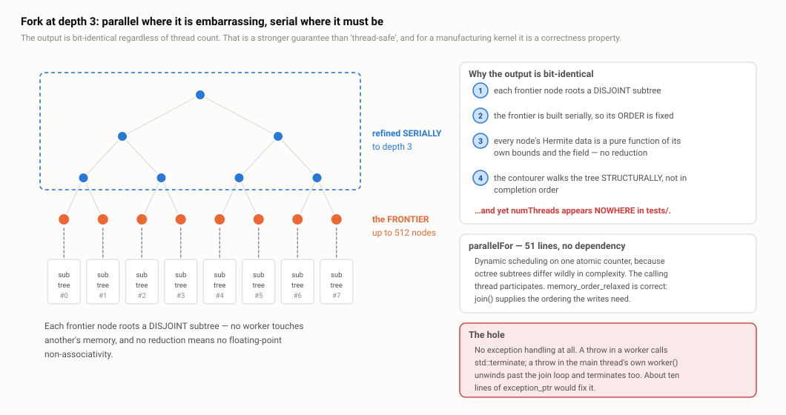

# B4 · Concurrency and determinism

> **In one paragraph.** All of DualC's threading is fifty-one lines in one header: `resolveThreadCount` and a `parallelFor` that hands out indices from a single relaxed atomic counter, spawns `N−1` threads, runs the loop body on the calling thread too, and joins. No thread pool, no TBB, no OpenMP, no configuration. It is used in exactly five places across four subsystems — the sampler's octree build over a depth-3 frontier, the contourer's per-leaf QEF pre-solve, the two phases of the narrow-band mesh bake, and the generic grid bake — and everything else, including the whole contouring traversal, is deliberately serial. That serialisation is what buys the property the library actually cares about: the octree and the mesh it contours to are **bit-identical regardless of thread count**, which for a manufacturing kernel is a correctness requirement rather than a nicety. The three real defects are that the guarantee is a comment with no test behind it, that `parallelFor` converts any escaping exception into `std::terminate`, and that the thread-safety contract imposed on user-derived `ImplicitField`s is documented nowhere.

**Read this after:** B3 · Memory, ownership and performance   **Time:** 40 min

## 1. Fifty-one lines of threading, and no dependency

`src/internal/parallel.h` in full, minus comments:

```cpp
inline unsigned resolveThreadCount(unsigned requested) {          // :12
  if (requested != 0) return requested;
  const unsigned hc = std::thread::hardware_concurrency();
  return hc == 0 ? 1u : hc;
}

template <typename Fn>
void parallelFor(std::size_t n, unsigned threads, Fn fn) {        // :26
  threads = resolveThreadCount(threads);
  if (threads <= 1 || n <= 1) { for (std::size_t i = 0; i < n; ++i) fn(i); return; }
  if (static_cast<std::size_t>(threads) > n) threads = static_cast<unsigned>(n);

  std::atomic<std::size_t> next{0};
  auto worker = [&]() {
    for (;;) {
      const std::size_t i = next.fetch_add(1, std::memory_order_relaxed);
      if (i >= n) break;
      fn(i);
    }
  };
  std::vector<std::thread> pool;
  pool.reserve(threads - 1);
  for (unsigned t = 1; t < threads; ++t) pool.emplace_back(worker);
  worker();                                    // calling thread participates
  for (auto& th : pool) th.join();
}
```

That is the entire concurrency surface of the library. Five decisions in it are worth defending individually.

**Dynamic scheduling from one atomic counter, not static chunking.** Each worker claims one index at a time with `fetch_add`. The alternative — give thread `t` the range `[t·n/T, (t+1)·n/T)` — is cheaper per item but only balances if the items cost the same. They do not: the units of work here are **octree subtrees**, and a subtree containing a dense feature can cost a hundred times what an empty one costs. Under static chunking the thread that drew the dense range finishes last and everyone else idles. The header comment states exactly this rationale at `src/internal/parallel.h:20-22`. This is the correct call, and knowing *why* — variance in per-item cost, not raw item count — is the substance of the answer.

**The calling thread participates.** `worker()` is invoked directly at `src/internal/parallel.h:46` before the join loop, so `threads` threads do work with only `threads − 1` spawns. Free, and it means `parallelFor(n, 2, …)` really does use both cores rather than blocking one to supervise the other.

**`memory_order_relaxed` on the counter is correct, and you should be able to explain why cold.** Relaxed ordering guarantees atomicity — no two workers ever receive the same `i` — but establishes no happens-before edge with anything else. That is sufficient here because **the counter carries no data dependency**: nothing reads memory whose visibility depends on having seen a particular counter value. The only ordering that has to hold is that the writes performed by `fn(i)` on every worker are visible to the caller after `parallelFor` returns, and that edge is supplied by `std::thread::join()`, which synchronises-with the completion of the thread's function. If instead the counter were an index into a buffer that another thread published, relaxed would be wrong and you would need release/acquire. It is not, so it is not.

**Threads are spawned and joined per call.** No pool, no reuse. For five call sites each doing seconds of work, roughly 50 µs of spawn cost per thread is noise, and the payoff is zero dependencies and zero configuration — no TBB in the build graph, no OpenMP flags per compiler, nothing for a host application to initialise. Say plainly that this would be the **wrong** trade in a per-frame loop, where the spawn cost would dominate: naming the case where the decision inverts is what shows it was a judgement rather than laziness.

**The degenerate guards.** `threads <= 1 || n <= 1` runs the loop inline with no atomics and no threads at all; `threads > n` clamps, so `parallelFor(3, 64, …)` spawns two threads rather than sixty-three that would immediately fall out of the loop. Small, but it means the serial path through the function is genuinely serial — which matters for the determinism argument below, and for debugging.

## 2. Where it is used — exactly five call sites, across four subsystems

| Call site | Unit of work | Count |
| --- | --- | --- |
| `src/sampler.cpp:184` | build one independent octree subtree from a depth-3 frontier node | ≤ 512 |
| `src/contourer.cpp:625-629` | `solveLeaf` — the QEF pre-solve for one leaf | one per leaf |
| `src/implicit/mesh_source.cpp:145` | narrow-band bake, phase 1 — band detection | one **z-slab** per task (`rz` tasks) |
| `src/implicit/mesh_source.cpp:173` | narrow-band bake, phase 2 — exact SDF inside the band | one per band index |
| `src/implicit/grid_field.cpp:171` | generic `bakeToGrid` — evaluate the field over one **z-slab** | one z-slab per task (`rz` tasks) |

Nothing else in the library is parallel. In particular the contourer's traversal, its vertex allocation and its triangle emission are all single-threaded, and §10 explains why that is on purpose.

## 3. The sampler's fork-at-depth-3 strategy

`src/sampler.cpp:177-188`:

```cpp
const int stopDepth = std::min(params.maxDepth, 3);
std::vector<HermiteNode*> frontier;
collectFrontier(*octree.root(), 0, params.minDepth, params.maxDepth,
                stopDepth, field, frontier);
internal::parallelFor(frontier.size(), params.numThreads, [&](std::size_t i) {
  HermiteNode* n = frontier[i];
  buildNode(*n, n->depth, params.minDepth, params.maxDepth, field);
});
```

Refine serially down to depth 3; collect the surviving nodes into a frontier; then build each subtree on a worker. Because the octree is a strict tree, a frontier node's subtree is **disjoint** from every other frontier node's subtree — no worker can reach memory another worker owns, so no locking is required anywhere.



*Serial refinement produces the frontier; each frontier node roots a disjoint subtree built independently; the frontier's order is fixed before any thread starts, which is why the result does not depend on thread count.*

**The maintenance hazard, which the code itself acknowledges.** `collectFrontier` (`src/sampler.cpp:127-154`) has to make the same prune/refine decision `buildNode` makes — the same `forceRefine` test, the same `cellOverlaps` call, the same `leaf.reset()` — so the two functions contain the same rule written twice. The comment at `src/sampler.cpp:126` says so: *"Mirrors buildNode's prune/refine decision exactly."* That is a genuine hazard: change the refinement rule in one place and the parallel and serial builds diverge, silently, in a way that only shows up as a geometry difference at depth ≥ 3. The fix is a single `refineDecision(node, depth, …)` helper called from both. Raise this yourself rather than waiting for it — an acknowledged duplication with a named fix reads as engineering discipline; the same duplication discovered by the interviewer reads as a bug.

**A scalability limit worth knowing.** `stopDepth = min(maxDepth, 3)` caps the frontier at 8³ = 512 tasks. With the default `minDepth = 3` no pruning can occur above depth 3, so the frontier is *exactly* 512 nodes — good load balance up to roughly 64 cores. But with `minDepth = 0` and a small object inside a large box, pruning fires at depth 1–2 and the frontier may be ten or twenty nodes, leaving a 64-core machine at about 25% utilisation. The fix is to keep splitting until `frontier.size() >= k × threads`; as written, the depth is hard-coded with no reference to the thread count at all.

## 4. The determinism guarantee

This is the strongest thing in this document, and the claim is explicit in the public header (`include/dualc/sampler.h:32-35`):

> *"Worker threads for the octree build. 0 => use all hardware threads. The build is split into independent subtrees, so the octree (and the mesh it contours to) is bit-identical regardless of this value."*

**Why it holds, in four steps.** Give them in this order; each one closes a different way non-determinism gets in.

1. **Disjointness.** Each frontier node roots a subtree that shares no memory with any other. There is no write that two workers could race on, so there is no interleaving to depend on.
2. **A fixed task order.** The frontier is built by a serial recursive walk before any thread is created, so `frontier[i]` is the same node for the same input on every run and at every thread count. Dynamic scheduling changes *which thread* processes index `i`, never *what* index `i` is.
3. **No reduction, hence no floating-point non-associativity.** Every node's Hermite data — its eight corner signs and up to twelve crossings — is a pure function of that node's own bounds and the field. Nothing is accumulated across tasks. This is the step people skip, and it is the one that actually matters: floating-point addition is not associative, so *any* parallel sum whose order varies with scheduling produces bit-different results. There is no such sum here.
4. **Structural, not completion-ordered, consumption.** The contourer walks the finished tree by recursion over children in fixed index order (**A4 · The recursion, manifold DC and collapse**). It never observes the order in which subtrees finished.

**The same four-step argument covers the contourer's pre-solve** (`src/contourer.cpp:625-632`). `solveLeaf` is a pure function of one leaf's `HermiteLeafData` and the parameters; worker `i` writes only `solved[i]`; and the vertex *indices* — the thing that would obviously be scheduling-dependent — are not assigned here at all. They are assigned later, during the serial `cellProc` traversal, in deterministic order. So even the numbering of vertices in the output mesh is fixed.

**Why this is worth more than "thread-safe".** Thread-safety says the program will not corrupt itself. Determinism says that if you contour a part today on a 4-core laptop and again next year on a 64-core build machine, you get the same triangles in the same order with the same indices. For a manufacturing kernel that is a **correctness property**: it is what makes a regression diff meaningful, what makes a golden-file test possible at all, and what lets you certify that the STL that was inspected is the STL that was printed. The tiled export path's byte-identity claim (**B3 · Memory, ownership and performance**) rests directly on it.

**Now the honest gap, and it is a real one.** *This is a comment pretending to be a guarantee.* `numThreads` never appears anywhere in the test suite — the whole determinism claim is unexercised. The test that should exist is three lines: contour the same field at `numThreads = 1`, `2` and `0`, then compare vertex count, face count and every position bit-for-bit. It costs a few seconds of CTest time and it converts a documented intention into a checked invariant. Offer it as the first test you would write, before anyone asks what the coverage gaps are (**T · The test suite**).

## 5. The thread-safety contract that is nowhere written down

`parallelFor` calls `field.cellOverlaps`, `field.isInside` and `field.edgeHit` concurrently from N threads through a single `const ImplicitField&`. So the library **requires** that every field satisfy: all const methods are safe to call concurrently on the same object.

The library's own fields satisfy this **by construction**, and the evidence is mechanical rather than anecdotal: there is no `mutable` member, no `thread_local`, and no mutable file-scope static anywhere in `src/implicit/` or `src/internal/`. Every field's state is written once in its constructor and read-only thereafter; there is not a single setter in the hierarchy. `GridField`'s header even states it (`include/dualc/implicit.h:167-168`: *"Queries are const and thread-safe"*).

**But `ImplicitField` is a public, user-derivable virtual interface** (`include/dualc/implicit.h:26-65`), and **none of its virtual methods documents a thread-safety requirement**. Consider what a user does first with an expensive custom field: memoise it. A `std::unordered_map` cache behind a `mutable` member is the single most obvious thing to write, it compiles, it passes every single-threaded test — and under the default `numThreads = 0` it produces a data race on the map's buckets. The observable symptom is not a crash, it is *a different mesh each run*, which is the hardest possible failure to attribute.

Say plainly that this is a **real API defect, not a nitpick**. It is also the cheapest fix in the entire library: one sentence on the base class.

> *"All methods must be safe to call concurrently on the same object from multiple threads; the sampler parallelises over them. Do not cache in a `mutable` member without synchronisation — or, if you must, bake to a grid instead."*

The parenthetical matters, because `bakeToGrid` (`include/dualc/implicit.h:198-209`) exists precisely to solve the expensive-field problem, and it solves it without a cache. So the documentation fix comes with a supported alternative rather than a prohibition.

## 6. Re-entrancy of the BVH, and how you would prove it

`MeshBVH` is queried concurrently from every threaded call site. Three concrete arguments, in increasing strength:

1. **Fresh intersector per call.** `segmentFirstHit` and `countRayHits` construct a new `nanort::TriangleIntersector<float>` on each invocation (`src/internal/mesh_bvh.cpp:417-418`, `:472-473`). All mutable traversal state — the hit record, the barycentrics, the primitive id — lives inside that object, which lives on the caller's stack. The BVH's `Traverse` is const and takes the intersector by reference.
2. **The hand-rolled traversals are entirely function-local.** `cellOverlapsAABB`, `findClosest` and `windingNumberFast` keep every piece of state, including the `std::vector` traversal stack, in local variables. Nothing is hoisted to a member for reuse — which is the same decision that costs a malloc per query (**B3**), so the allocation criticism and the re-entrancy guarantee are two faces of one choice. Worth saying: the fixed-array fix removes the allocation *without* weakening the guarantee, whereas a `thread_local` scratch buffer removes it while keeping the guarantee only under a subtler argument.
3. **`findClosest` is a `static` member taking `const Impl&`** (`src/internal/mesh_bvh.cpp:591`). There is no `this`, so it cannot touch mutable object state even through a `mutable` member — the guarantee is **compile-enforced**, not established by inspection. This is the argument to lead with, because it is the only one that does not require the reviewer to trust a code reading.

Underneath all three: nothing in `Impl` is written after construction.

## 7. The exception hole

`parallelFor` has **no exception handling whatsoever** — no `try`, no `catch`, no `exception_ptr`. Trace both paths, because they fail for different reasons and naming both shows you actually traced it:

- **A throw inside a spawned worker.** The exception propagates out of the lambda, out of `std::thread`'s entry function, and there is nowhere for it to go — the standard specifies `std::terminate`.
- **A throw inside the main thread's own `worker()` call** at `src/internal/parallel.h:46`. The stack unwinds *past* the join loop at `:47`, so `pool`'s destructor runs while its `std::thread` objects are still joinable — and `~thread` on a joinable thread also calls `std::terminate`. So even the "safe" thread is unsafe.

This matters because the library throws `std::invalid_argument` from several places and, more importantly, calls **user-supplied** `valueAt` / `gradientAt` from inside `parallelFor`. The moment `numThreads > 1`, a recoverable error becomes a process abort.

**The honest assessment.** Today it is only reachable through a user field, because the library's own throws are argument validation that runs *before* any `parallelFor` — `sampler.cpp:166` fires while computing the root box, `grid_field.cpp:53`/`:61` in a constructor. The one internal candidate, `QefSolver::solve` throwing on `numPoints == 0`, is guarded unreachable by `solveOneComponent`'s early return. So the hole is latent rather than live. **But "only reachable through a user field" is exactly the case that matters for a plugin SDK**, where the field may be a C# delegate crossing the C ABI and a null dereference on the managed side becomes a hard abort of the host CAD application with unsaved work in it. That framing is the reason to fix it rather than document it.

**The fix is about ten lines**, and you should be able to sketch it: a `std::exception_ptr first` plus a `std::atomic_flag captured`; wrap `fn(i)` in `try`/`catch(...)` and, on the first catch per `parallelFor` call, `test_and_set` the flag and store `std::current_exception()`; break the worker loop; join **unconditionally** (this is the part people get wrong — the joins must happen even on the failure path, or you have replaced one `terminate` with another); then `std::rethrow_exception(first)` after the joins if the flag is set. First-exception-wins is the right policy; collecting all of them is more code for less value.

## 8. False sharing, and how to answer a question about it well

Because scheduling is per-index, **consecutive indices land on different threads**. In the narrow-band bake's second phase (`src/implicit/mesh_source.cpp:173-186`) each task writes `value[i]` and `bandAbs[i]`, which are `float`s at adjacent addresses. Sixteen consecutive indices share a 64-byte cache line, so with N threads pulling indices in round-robin the line is written by several cores in turn and ping-pongs between them in the coherence protocol. That is textbook false sharing, and it is a fair question.

**The ratio argument.** Each task is a BVH closest-point query plus a three-ray sign query — order 1–10 µs of work. A cache-line transfer between cores is order 100 ns. So the coherence traffic is well under 1% of the work, and the same argument covers the `fetch_add` contention: one atomic increment per 1–10 µs task is nothing.

**The thing that makes this a good answer instead of a complacent one.** The fix is trivial: chunk the work list, or hand out blocks of 64 indices per `fetch_add` instead of one. That is a handful of lines, it removes the false sharing entirely *and* cuts the atomic traffic by 64×. When the fix is that cheap, "it is fine" is not a satisfying answer — **"we measured it and it did not matter"** would be, and *that measurement has not been done*. Concede that. Volunteering the missing measurement is stronger than defending the reasoning, because the reasoning is only an estimate and everyone in the room knows it.

Note that the block-scheduling fix does **not** disturb determinism, since which thread runs which index was never observable (§4). That is worth adding — it shows you checked that the optimisation is free rather than assuming it.

## 9. One genuinely good concurrency decision worth leading with

The band array in the narrow-band bake is declared `std::vector<char> band` (`src/implicit/mesh_source.cpp:144`) and written concurrently at distinct indices from multiple threads (`:158`). The same reasoning produces `std::vector<signed char> farSign` in `src/implicit/mesh_source.cpp:189`.

**`std::vector<bool>` there would be a data race and undefined behaviour.** It is not a container of `bool`; it is a bit-packed specialisation whose `operator[]` returns a proxy object. Eight "elements" share a byte and sixty-four share a word, so two threads writing `band[0]` and `band[1]` are performing read-modify-write on the *same* memory location without synchronisation. That is a race by the standard's definition, and the practical symptom is torn writes: some flags silently lost, so band cells never get their exact SDF, so the mesh has quiet geometry errors that vary run to run.

This is precisely the case the standard carves out: distinct elements of a container may be written concurrently without synchronisation — but `vector<bool>`'s "elements" are not distinct objects. Choosing `char` is exactly right, and it costs 8× the memory on a buffer that is transient and small relative to the grid of floats it accompanies.

Knowing *why* `vector<bool>` is unusable in a parallel fill is a strong signal, and it is a short, concrete, correct thing to say — a good candidate for the first substantive point you make when concurrency comes up.

## 10. What is not parallel, and why that is deliberate

The contourer's `cellProc` / `faceProc` / `edgeProc` traversal, its vertex-index allocation and its triangle emission are **strictly serial**. Only the QEF pre-solve is threaded.

That is not an omission; it is the price paid for §4. Vertex indices are allocated on first touch during the traversal, so parallelising the traversal would make index assignment depend on completion order, and the output mesh would differ between runs even though it described the same surface. Every downstream property that depends on byte-identity — the tiled export's guarantee, golden-file regression tests, reproducible manufacturing output — would go with it.

**The concession.** At very high depth the serial traversal does become the bottleneck: the pre-solve parallelises the expensive part, but the walk over 20.9M faces is one thread's work. The standard fix is per-subtree emission into thread-local buffers followed by a **deterministic merge** — concatenate the buffers in fixed subtree order and renumber vertices with a fixed offset per buffer, which preserves bit-identity because the merge order is structural rather than temporal. What it costs is a second pass over the index data plus the peak memory of all the thread-local buffers alive at once, and it needs care at subtree boundaries where a quad's four cells straddle two buffers. Real work, well understood, not yet done.

**And a small wart worth flagging first.** The contourer hard-codes `internal::resolveThreadCount(0)` at its call site (`src/contourer.cpp:626`) because `ContourerParams` has no thread knob, while `SamplerParams::numThreads` exists (`include/dualc/sampler.h:35`). So a caller who deliberately restricts the sampler to two threads — because it is running inside a host that owns the rest of the machine — silently gets all hardware threads in the contourer. It is a one-field fix and an obvious inconsistency in the parameter structs.

## Key terms

| Term | Meaning |
| --- | --- |
| **Dynamic scheduling** | Work items claimed one at a time from a shared counter, so threads that draw cheap items come back for more. Correct when per-item cost varies; static chunking is cheaper when it does not. |
| **`memory_order_relaxed`** | Atomicity without ordering. Legal when the atomic carries no data dependency — nothing else's visibility hinges on which value you read. |
| **Happens-before / synchronises-with** | The C++ memory model's ordering relations. `thread::join()` synchronises-with the end of that thread's function, which is what makes the workers' writes visible to the caller here. |
| **Bit-identical output** | Byte-for-byte the same result — same counts, same order, same floating-point values — not merely geometrically equivalent. |
| **False sharing** | Distinct variables on one cache line written by different cores, forcing the line to migrate between caches even though there is no logical sharing. |
| **Re-entrancy** | A function callable concurrently on the same object because all its mutable state is on the caller's stack. |
| **`vector<bool>`** | A bit-packed specialisation returning proxy references. Neighbouring "elements" share a word, so concurrent writes to different indices are a data race. |
| **`std::exception_ptr`** | A copyable handle to a captured exception, usable to move an exception across a thread boundary and rethrow it after the join. |

## If they ask…

**"How is this parallelised?"**

One 51-line header, `src/internal/parallel.h`, with a `parallelFor` that hands out indices from a single atomic counter, spawns N−1 threads, runs the body on the calling thread as well, and joins. Dynamic scheduling rather than static chunking, because the work items are octree subtrees whose cost varies by orders of magnitude and static ranges would leave threads idle — the rationale is in the comment at `:20-22`. It is used in four places: the sampler's octree build over a serially-collected depth-3 frontier (`src/sampler.cpp:184`), the contourer's per-leaf QEF pre-solve (`src/contourer.cpp:625-629`), the two phases of the narrow-band mesh bake, and the generic grid bake. Everything else — including the entire contouring traversal — is deliberately serial. No thread pool, no TBB, no OpenMP, and nothing for a host to configure.

**"Is the output deterministic? Prove it."**

Yes, bit-identically, and the header claims it at `include/dualc/sampler.h:32-35`. Four steps. One: each frontier node roots a disjoint subtree, so no worker can touch another's memory and there is no interleaving to depend on. Two: the frontier is collected by a serial walk before any thread starts, so index `i` is the same node on every run — dynamic scheduling changes which thread runs an index, never what the index is. Three: every node's Hermite data is a pure function of its own bounds and the field, so there is no reduction anywhere, and therefore no floating-point non-associativity, which is the usual way parallel numerics goes non-deterministic. Four: the contourer consumes the tree structurally, by recursion over children in fixed order, not in completion order. The same argument covers the pre-solve — `solveLeaf` is pure, each worker writes only its own slot, and vertex indices are assigned later during the serial traversal. Where I would criticise it: `numThreads` appears nowhere in the test suite, so it is a comment rather than a checked invariant. The three-line test — contour at 1, 2 and 0 threads and compare counts and positions — is the first test I would add.

**"Why `memory_order_relaxed`?"**

Because the counter carries no data dependency. Relaxed still guarantees atomicity, so no two workers ever get the same index — that is all the counter is for. It establishes no happens-before edge, but none is needed: nothing reads memory whose visibility depends on having observed a particular counter value. The ordering that actually matters is that the workers' writes are visible to the caller when `parallelFor` returns, and `std::thread::join()` supplies that edge. If the counter were instead an index into a buffer that one thread filled and another consumed, relaxed would be wrong and you would need release on the store and acquire on the load. Using `seq_cst` here would just add a fence per item for nothing.

**"Why no thread pool?"**

Threads are spawned and joined per call, and for these call sites that is the right trade. There are five of them and each does seconds of work, so roughly 50 µs of spawn cost per thread is unmeasurable; what you buy is zero dependencies — no TBB in the build graph, no OpenMP flags to get right across MSVC and GCC — and zero configuration for a host embedding the library. I would say clearly that this would be the wrong choice in a per-frame render loop, where spawn cost would dominate and a pool is mandatory. The decision is scoped to the workload, not a general preference.

**"What happens if my custom field throws inside a parallel region?"** *(attack)*

The process aborts, and I would concede that immediately. `parallelFor` has no exception handling at all. A throw in a spawned worker escapes `std::thread`'s entry function and hits `std::terminate`; a throw in the main thread's own `worker()` call at `parallel.h:46` unwinds past the join loop at `:47`, so `~thread` runs on a joinable thread and terminates too — both paths, for different reasons. The mitigating fact is that the library's own throws are all argument validation that happens before any `parallelFor` runs, so today it is only reachable through a user-supplied field — but that is precisely the case that matters for a plugin SDK, where the field may be a managed callback and the host is a CAD application with unsaved work. The fix is about ten lines: an `exception_ptr` plus an atomic flag, capture the first exception per worker, break the loop, join unconditionally — that part is essential, or you have swapped one terminate for another — and rethrow after the joins.

**"Is your library thread-safe?"**

Precisely: queries are `const` and re-entrant, and the field tree is immutable, so concurrent sampling against one `const ImplicitField&` is safe — that is exactly what the sampler does. The BVH holds no mutable state after construction, constructs a fresh nanort intersector per call so all traversal state is on the caller's stack, and `findClosest` is a `static` member taking `const Impl&`, so the re-entrancy is compile-enforced rather than by inspection. I verified there is no `mutable`, no `thread_local` and no mutable static anywhere in `src/implicit/` or `src/internal/`. **What is not safe is the contract.** `ImplicitField` is a public, user-derivable interface and none of its virtuals documents a thread-safety requirement, so a user who adds a memoisation cache — the most obvious thing to do with an expensive field — gets silent races and a different mesh every run. That is a real API defect, and the fix is one sentence in the base class documentation pointing at `bakeToGrid` as the supported alternative.

**"Where would false sharing hurt you?"**

The bake's second phase (`src/implicit/mesh_source.cpp:173-186`): scheduling is per-index, so consecutive indices land on different threads, and `value[i]` and `bandAbs[i]` are adjacent floats — sixteen per cache line, guaranteed ping-pong. The ratio argument says it does not matter: each task is a BVH closest-point plus a three-ray sign query at 1–10 µs against ~100 ns of coherence traffic, so under 1%, and the same covers the atomic increment. But I would not stop there, because the fix is trivial — hand out blocks of 64 indices per `fetch_add`, which removes the false sharing and cuts atomic traffic 64× — and it does not disturb determinism, since which thread runs which index was never observable. When the fix is that cheap, "we measured it and it did not matter" is the answer you want, and that measurement has not been done.

## One-minute recap

- **All threading is `src/internal/parallel.h`, 51 lines**: `resolveThreadCount` (with the `hardware_concurrency() == 0 ⇒ 1` guard) and `parallelFor`. No pool, no TBB, no OpenMP.
- **Dynamic scheduling from one atomic counter**, because octree subtrees vary by orders of magnitude in cost; static chunking would idle threads. The **calling thread participates** (`:46`), so N threads, N−1 spawns.
- **`memory_order_relaxed` is correct** because the counter carries no data dependency; the only ordering needed comes from `join()`.
- **Four call sites:** sampler frontier (`sampler.cpp:184`), contourer pre-solve (`contourer.cpp:625-629`), bake phases 1 and 2 (`mesh_source.cpp:145`, `:173`), generic bake (`grid_field.cpp:171`).
- **Fork at depth 3**, frontier ≤ 512 nodes. With default `minDepth = 3` it is exactly 512; with `minDepth = 0` and a small object it can collapse to ~20, wasting a large machine.
- **`collectFrontier` duplicates `buildNode`'s refine rule** (`sampler.cpp:126-154`) — a real maintenance hazard the comment admits; fix is one shared `refineDecision` helper.
- **Determinism in four steps:** disjoint subtrees; serially fixed frontier order; per-node pure functions so no reduction and no FP non-associativity; structural (not completion-ordered) consumption. Vertex indices are assigned in the **serial** traversal.
- **The determinism test does not exist.** `numThreads` appears nowhere in the suite. Three lines: contour at 1, 2, 0 threads; compare counts and positions.
- **The user-field thread-safety contract is undocumented** — a `mutable` memoisation cache in a custom field races silently. One-sentence fix; `bakeToGrid` is the supported alternative.
- **`parallelFor` ⇒ `std::terminate` on any throw**, by two distinct paths. ~10 lines to fix: `exception_ptr` + atomic flag, join unconditionally, rethrow.
- **`std::vector<char>`, not `vector<bool>`, for the concurrently-written band** (`mesh_source.cpp:144`) — `vector<bool>` is bit-packed, so neighbouring writes tear. Same reasoning for `vector<signed char> farSign`.
- **The contourer traversal is serial on purpose** — that is what buys bit-identity. It also hard-codes `resolveThreadCount(0)` because `ContourerParams` has no thread knob, unlike `SamplerParams`.
