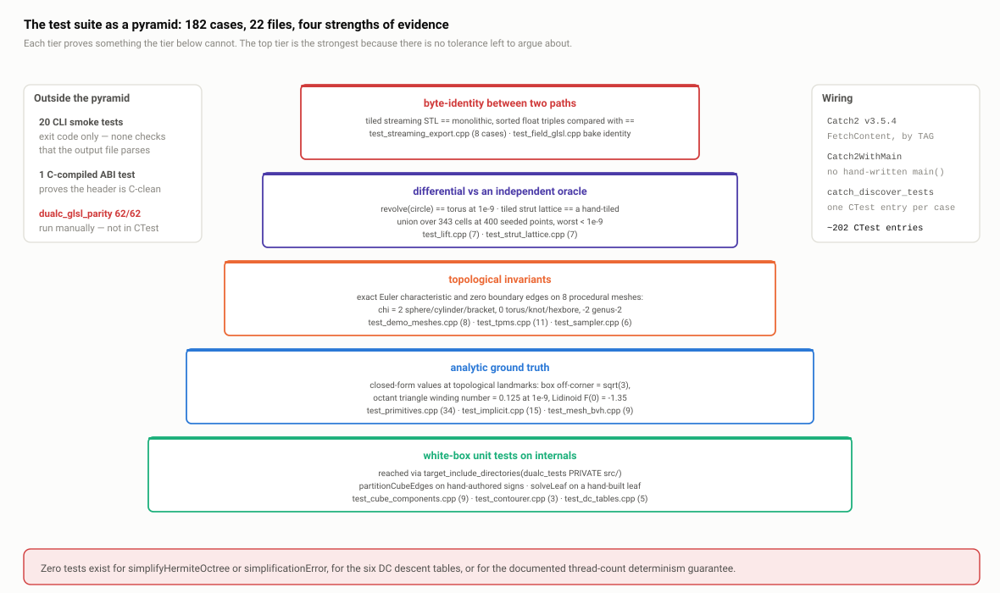

# T · The testing approach

> **In one paragraph.** The hard problem in testing a geometry library is that the correct answer is a mesh nobody can write down by hand, so DualC never tries to. Instead the suite climbs four ladders of increasing strength: analytic ground truth wherever a closed form exists (a box's distance to its off-corner is exactly √3; a triangle subtending one octant from the origin has winding number exactly 0.125); exact integer topological invariants where the geometry is fuzzy but the topology is not (eight procedural meshes contoured end-to-end, each asserting zero boundary edges and an exact Euler characteristic); differential testing against an independently written oracle (the production single-tile lattice fold against a hand-tiled explicit union over 343 cells at 400 seeded-random points, agreeing to 1e-9); and byte-identity between two code paths that must agree (the tiled streaming STL exporter against the monolithic one, compared as sorted `std::array<float,9>` with `==`). That is 182 `TEST_CASE`s in one Catch2 v3.5.4 binary plus 20 exit-code CLI smoke tests, ≈203 when the C ABI is enabled (202 otherwise — the C-compiled ABI demo only exists under `DUALC_BUILD_C_ABI=ON`, which defaults off) CTest entries. The suite's most defensible quality is that its comments explain *why* each expected value is what it is, so the tests double as documentation of the geometry; its most indefensible gaps are adaptive collapse (zero tests), the six DC descent tables (zero direct tests, and the header falsely claims otherwise) and threading determinism (a documented guarantee that is never asserted).

**Read this after:** A1–A5, B1–B5 (it stands alone if needed)   **Time:** 90 min

## 1. The central difficulty

Ask a senior C++ developer to unit-test a hash map and they write `insert("a", 1); REQUIRE(get("a") == 1)`. The expected output is small, writable and unambiguous. Now ask them to unit-test `dualContourMesh(icosphere, depth 5)`. The correct output is roughly 5,000 vertices and 10,000 triangles positioned by a least-squares solve over adaptive octree cells. Nobody can write that down, and nobody can eyeball it: two meshes that look identical on screen can differ in every vertex.

That is the whole problem, and every technique in this suite answers it. There are four, in increasing strength.

**(i) Analytic ground truth.** Where the code computes something with a closed form, compare against the closed form. This works for the SDF primitive catalogue — the distance to a box, a torus, a cone is a formula you can write in the test — and for anything with an exact geometric answer, like the solid angle a triangle subtends. It stops working the moment you compose or discretise.

**(ii) Topological invariants.** Where the geometry is fuzzy, the topology is not. You cannot say where the vertices of a contoured torus should be, but you can say the result must be closed (zero boundary edges) and must have Euler characteristic χ = V − E + F = 0, because χ = 2 − 2·genus. That is an *integer*: you cannot accidentally pass it by getting close.

**(iii) Differential testing against an independent oracle.** Where neither a closed form nor an invariant is available, write the same quantity a second time by a deliberately different route and require agreement. The second implementation can be stupid and slow — that is the point, because stupid and slow is easy to get right.

**(iv) Byte-identity between two code paths.** The strongest. Where two paths in the *same* codebase must by contract produce the same output — a streaming tiled exporter and a monolithic one — do not compare with a tolerance. Compare with `==`. No "is 1e-6 tight enough" conversation, no slow drift as someone loosens the margin to make a test pass. Either the bytes match or they do not.

That last point inverts the usual instinct, which is worth saying out loud. Most people's reflex on floating-point tests is "never use `==`". The correct rule is narrower: never use `==` when the two sides came from *different arithmetic*. When two paths perform *identical* arithmetic on *identical* inputs, `==` is not merely acceptable — it is the only assertion that tests the contract. §4.4 spells out the argument that licenses it here.

## 2. The numbers and the wiring

| Quantity | Value |
| --- | --- |
| `TEST_CASE`s | 182, in one binary `dualc_tests` |
| `SECTION`s | 8 |
| Assertion lines | ~676 across 21 files (4,065 lines) |
| Effective assertions | far higher — many sit inside loops (1,331 lattice points, 400×4 oracle probes, ~30 primitives) |
| CLI smoke tests | 20, exit-code only, registered from `examples/CMakeLists.txt:236-338` |
| C-ABI demo test | 1, C-compiled, in `capi/` |
| Total CTest entries | ≈203 when the C ABI is enabled (202 otherwise — the C-compiled ABI demo only exists under `DUALC_BUILD_C_ABI=ON`, which defaults off) |
| Framework | Catch2 v3.5.4 via `FetchContent`, pinned by tag |

### Acquisition

`tests/CMakeLists.txt:1-10`:

```cmake
FetchContent_Declare(
  Catch2
  GIT_REPOSITORY https://github.com/catchorg/Catch2.git
  GIT_TAG        v3.5.4
)
FetchContent_MakeAvailable(Catch2)
list(APPEND CMAKE_MODULE_PATH ${catch2_SOURCE_DIR}/extras)
```

The target links `Catch2::Catch2WithMain` (`tests/CMakeLists.txt:51`), so there is no hand-written `main()`. `tests/test_main.cpp` is a two-line placeholder whose comment says it is *"reserved translation unit for shared fixtures"* — fixtures that were never written, which §6 returns to.

Registration is `catch_discover_tests(dualc_tests)` (`tests/CMakeLists.txt:78-80`), so every `TEST_CASE` becomes its own CTest entry named by its string. A failure names itself in `ctest` output without anyone reading a log.

### Three wiring decisions worth defending

**(a) Catch2 is the only fetched dependency.** geometry-central is a *sibling checkout* with a hard `FATAL_ERROR` if missing (`CMakeLists.txt:27-34`) — a locked decision recorded in `CLAUDE.md`: "no FetchContent, no submodule for it". The asymmetry is defensible: Catch2 is test-only, small and pinned, so fetching it means `cmake -B build && ctest` works on a clean checkout with no package manager, while geometry-central is heavy and likely being edited in parallel, so fetching it would fight the developer's workflow and hide which copy is built. The cost: configure-time network access is mandatory, there is no `FIND_PACKAGE_ARGS` fallback to a system Catch2, no `GIT_SHALLOW`, and `v3.5.4` is a *mutable tag* rather than a commit SHA. Pinning the SHA is a one-line change. See **B5 · Build, vendoring and the C ABI**.

**(b) The test binary compiles the host-side example sources directly in** rather than linking the example libraries (`tests/CMakeLists.txt:36-48`):

```cmake
${CMAKE_SOURCE_DIR}/examples/demo_meshes.cpp    # procedural mesh generators
${CMAKE_SOURCE_DIR}/examples/field_graph.cpp    # JSON/shorthand parser+builder
${CMAKE_SOURCE_DIR}/examples/field_glsl.cpp     # field->GLSL codegen (GL-free)
${CMAKE_SOURCE_DIR}/examples/example_common.cpp # registries + writers
${CMAKE_SOURCE_DIR}/examples/third_party/miniz.c
```

Two payoffs. Tests stay orthogonal to `DUALC_BUILD_EXAMPLES` — the full suite builds and runs with examples off. And tests get direct access to the **registries** in `example_common.cpp` that are the single source of truth for every CLI, which is what makes the combinatorial sweeps in §4.9 possible. The cost is compile time and a small conceptual smear: `libdualc` unit tests now compile host-layer code. The alternative — linking the example libs — would make the test target depend on an option that is meant to be independent.

**(c) White-box access is granted explicitly:** `target_include_directories(dualc_tests PRIVATE ${CMAKE_SOURCE_DIR}/src ...)` (`tests/CMakeLists.txt:54-61`), under a comment saying *"Tests need access to the internal headers under src/ for white-box checks"*. Tests can `#include "internal/mesh_bvh.h"` without any of that appearing in `include/dualc/`, so the public surface stays as narrow as it should be (**B1 · Module boundaries**) while the internals stay testable. The cost is that tests couple to private headers, so an internal refactor breaks tests — the correct trade for a library whose hardest logic is all private. Warnings on the vendored amalgamations are suppressed per-source with `/W0`/`-w` (`:63-76`), so `/W4 /permissive-` stays meaningful for project code.

### The honest costs of `catch_discover_tests`

- **Hostile to cross-compilation.** Discovery runs `dualc_tests --list-tests` in a POST_BUILD step, so the binary must execute on the *build* host.
- **182 process launches.** Each case is a separate process; most do microseconds of real work, so on Windows startup dominates the wall clock.
- **No per-test working directory.** All 182 share `CMAKE_CURRENT_BINARY_DIR`, which matters for the streaming tests that write hard-coded relative names (§6).

None is fatal, and the alternative — one `add_test` for the whole binary — loses per-case naming, which is worth more.

### The non-Catch2 tier

20 CLI tests registered from `examples/CMakeLists.txt:236-338`, gated on `if(DUALC_BUILD_TESTS)`, **exit-code only**, each with an explicit `WORKING_DIRECTORY $<TARGET_FILE_DIR:...>` so demo meshes resolve by bare filename. They cover the post-op chain, infinite bounds with explicit `--bounds`, smooth booleans, lifts, TPMS infill through all three export formats, the field-graph JSON and `--expr` paths, `--dump-json`, the streaming path (`--depth 6 --tile-depth 4`), and three mesh→mesh demos including `--sharp`.

Four executables are registered nowhere — `dualc_view`, `dualc_raymarch`, `dualc_field_view`, `dualc_glsl_parity` — because all four need a GL context. The last is the numerical GPU parity gate, and its absence from CTest is the single biggest wiring caveat in the project (§5).

## 3. The shape of the suite



*Read bottom-up: the wide base is white-box unit tests on pure internal functions, the middle is analytic and property assertions on the field layer, the narrow top is end-to-end invariants and cross-path identity, with CLI smoke tests as a thin outer shell.*

| File | Cases | Tier | What it can prove — and cannot |
| --- | ---: | --- | --- |
| `test_dc_tables.cpp` | 5 | white-box, pure data | The four *shape* tables are combinatorially consistent. Says nothing about the six *descent* tables. |
| `test_octree.cpp` | 4 | white-box | `childBounds` partitions correctly and the `(z<<2\|y<<1\|x)` convention holds. Not sampling, not refinement. |
| `test_cube_components.cpp` | 9 | white-box, pure function | Manifold-DC edge labelling on 9 hand-picked sign configurations, set-exact. Not the other 247. |
| `test_qef.cpp` | 1 | white-box, smoke | That the vendored SVD TU links and solves a rank-1 case. Explicitly self-described as a smoke test. |
| `test_contourer.cpp` | 3 | white-box via `contourer_internals.h` | Per-component QEF placement on a hand-built leaf, with closed-form answers. Not the recursion. |
| `test_mesh_bvh.cpp` | 9 | white-box | Closest point, angle-weighted pseudonormal, exact and fast winding numbers. The best-verified component. |
| `test_grid_field.cpp` | 11 | white-box + property | Bake accuracy tied to cell size, narrow-band monotonicity, `floodFarSign`/`chamferGrow` on a 5³ toy grid. |
| `test_primitives.cpp` | 34 | analytic | ~30 primitives at topological landmarks against closed forms, plus FD gradient cross-checks. |
| `test_implicit.cpp` | 15 | analytic + cross-oracle | Base-class `edgeHit` root finding, `MeshSource` signed distance, sign-method agreement on 7 probes. |
| `test_combinators.cpp` | 15 | analytic + metamorphic | Boolean algebra, the sharp-gradient contract, `smin` against a reference, degeneracy collapse. |
| `test_domain_ops.cpp` | 7 | property | Mirror symmetry, translation invariance, finite/infinite bounds, twist fixed points. |
| `test_lift.cpp` | 7 | differential | `Revolve(Circle2D)` ≡ `TorusField`, `Extrude(Box2D)` ≡ `BoxField`, at 1e-9. |
| `test_tpms.cpp` | 11 | analytic + property + e2e | Six TPMS values at the origin with derivations, periodicity at 1e-10, watertight end-to-end. |
| `test_strut_lattice.cpp` | 7 | differential | The single-tile fold against a 343-tile explicit union, 400 seeded points, worst < 1e-9. |
| `test_demo_meshes.cpp` | 8 | e2e topological invariant | Exact χ and zero boundary edges on eight meshes. The strongest invariant file. |
| `test_sampler.cpp` | 6 | e2e + fixture design | GWN sealing of open shells, including two disjoint shells that jointly bound a volume. |
| `test_field_graph.cpp` | 11 | parser + round-trip | Located errors with JSON-pointer diagnostics, canonical-serialisation equality, resolver caching. |
| `test_field_glsl.cpp` | 10 | structural + one bit-identity | *What* the codegen emitted, plus one bitwise bake comparison. Never evaluates GLSL. |
| `test_streaming_export.cpp` | 8 | byte-identity | Tiled vs monolithic STL/3MF exactly equal; the welded 3MF's topology equals the monolithic baseline. |
| `test_pipeline.cpp` | 1 | e2e structural | Only that the composition runs and the normals vector is index-aligned. Thinnest file. |
| `test_main.cpp` | 0 | placeholder | Nothing. Reserved for shared fixtures that were never written. |

Two things to notice. The pyramid is *not* the classic wide-base-of-unit-tests shape: the white-box tier is thin (four files, 21 cases) because most of the library's hard logic is either pure data tables or deeply recursive. And the top of the pyramid is unusually strong — end-to-end tests here assert exact integers and byte-identity, not "it didn't crash".

## 4. The strategies, with named examples

### 4.1 Analytic ground truth

Roughly half of all assertions. The pattern is: pick points at *topological landmarks* — the centre, a face, an off-face point, an off-corner point, a rim, an apex, a hole centre, the far field — where the closed form is trivially derivable, and assert against it.

`"BoxField is a signed distance to a box"` (`tests/test_primitives.cpp:55-71`) probes four: centre −1, on-face 0, off-face 2, and off-corner `Approx(std::sqrt(3.0))`. The off-corner is the interesting one — it is where a naive box SDF that clamps per-axis without recombining goes wrong, since outside a corner the distance is the Euclidean norm of the three per-axis excesses, not their max. The same case cross-checks `gradientAt` against a central finite difference at `margin(1e-3)`.

`"MeshBVH::windingNumber is exact on known configurations"` (`tests/test_mesh_bvh.cpp:172-188`) uses `makeOctantTriangle` (`:62-68`), a triangle positioned so that from the origin it subtends exactly one octant — solid angle π/2 out of 4π, a winding number of exactly `0.125`, asserted at `margin(1e-9)`. That is a closed-form solid angle validating the code's formula at machine precision. The companion case (`:190-199`) drops one cube face and requires `5.0/6.0` — five faces each subtending 4π/6.

`test_tpms.cpp` gives each of six triply-periodic minimal surfaces a value at the origin with the arithmetic spelled out in the comment: gyroid 0 (`:47`), Schwarz-P 3.0 (`:59`) and 0 at the quarter period (`:61`), Lidinoid **−1.35** from *"t2=1.5; the constant 0.15 shifts → F(0) = 0 − 1.5 + 0.15 = −1.35"* (`:90-93`), Neovius **13.0** from `3*(1+1+1) + 4*1*1*1` (`:103`). Hand-evaluated trigonometric identities, catching the two most likely TPMS bugs: a swapped sin/cos and a wrong constant term.

The sharpest QEF assertion is analytic too. `"MDC opt-out: same leaf collapses to a single mid-cube vertex"` (`tests/test_contourer.cpp:113-129`) hands the solver six planes forming three orthogonal pairs symmetric about the origin; the least-squares minimum is provably the centroid `(0,0,0)`, and the test asserts it. See **A3 · The QEF**.

### 4.2 Topological invariants

`tests/test_demo_meshes.cpp` is the strongest invariant file and the easiest to explain to a non-graphics reviewer. A single helper (`:26-42`) contours a procedurally generated mesh through the full `dualContourMesh` pipeline and returns `{boundaryEdges, chi}` where `chi = V − E + F`. Every one of the eight cases asserts **both**:

| Test | Depth | χ asserted | Genus |
| --- | ---: | ---: | ---: |
| Icosphere | 5 | 2 | 0 |
| UV-sphere | 5 | 2 | 0 |
| Torus | 6 | 0 | 1 |
| Trefoil knot | 7 | 0 | 1 |
| Genus-2 double torus | 6 | −2 | 2 |
| Cylinder | 6 | 2 | 0 |
| L-bracket | 5 | 2 | 0 |
| Hex prism + bore | 6 | 0 | 1 |

Why an exact integer invariant is such a strong bar, stated the way you would say it out loud: **you cannot accidentally pass it.** A tolerance-based geometric test can be passed by a mesh that is 99% right and has one crack; χ cannot. Any change that merges a thin neck, splits a thin wall, leaks a hole, duplicates a quad or drops a boundary quad moves χ and the assertion fires. And because each mesh is a separate `TEST_CASE`, the failure *names the offending shape*.

The trefoil case documents its resolution argument explicitly (`tests/test_demo_meshes.cpp:71-72`): *"tubeR 0.35 on the (2,3) knot: depth 7 separates the near-approaching strands. A coarser octree merges them and changes the genus."* That comment is load-bearing — without it, the natural response to a failure is to lower the depth until it passes, which silently deletes the test's entire value.

Weaker forms of the same idea appear elsewhere: `boundaryEdges == 0` alone (watertightness without genus) in `tests/test_sampler.cpp:159-179` and `:181-202`, `tests/test_tpms.cpp:150-181` and `:224-254`, and `tests/test_strut_lattice.cpp:207-234`. And a stronger form — the full edge-incidence *distribution* — appears in the welded-3MF test (§4.4).

### 4.3 Differential testing against an independent oracle

Three examples, increasing in ambition.

**Lifts against 3D primitives.** `"RevolveField of a circle reproduces a torus"` (`tests/test_lift.cpp:65-79`) revolves a `Circle2D(r=0.5)` at major radius 2 and requires it to equal `TorusField(2.0, 0.5)` at **1e-9** across five probe points including the off-axis `(1.3, 0.4, −1.1)`. `"ExtrudeField of a box reproduces a box"` (`:81-95`) does the same for `ExtrudeField(Box2D)` versus `BoxField`, including the corner point `(2.0, 1.5, 1.75)` where the 2D-distance-plus-half-height combination must reproduce the 3D corner distance exactly. These convert a vague question — "does the lift work?" — into a precise one: "does the lift agree with an independently implemented 3D primitive to machine precision?"

**The smooth-min reference.** `tests/test_combinators.cpp:39-42` defines `smoothMinRef`, a local reimplementation of the Quilez polynomial smooth minimum; `"Smooth union matches the Quilez polynomial and never exceeds min"` (`:117-132`) requires agreement at 1e-9 *plus* the inequality `smin ≤ min`. Value and property in one case.

**The strut lattice oracle — the best one in the suite.** `tests/test_strut_lattice.cpp:32-51` defines `oracleValue`, computing the true infinite union of capsules by manually tiling the unit-cell segments over ±3 cells in each direction — 343 tiles — and taking an exact `min`. It is deliberately independent of the production `repeated` fold, which evaluates only the nearest tile. The comment states the failure mode being hunted (`:25-31`):

```
// This is deliberately independent of makeStrutLattice's `repeated` tiling
// (which only evaluates the single nearest tile) -- if that single-tile fold
// drops a strut that crosses a cell boundary (the fcc/octet failure mode),
// the oracle min is strictly smaller here and the comparison below catches it.
```

`"Tiled strut lattice equals the explicit infinite union"` (`:143-161`) then runs 400 seeded-random points × 4 crystals and requires `worst < 1e-9`, with an `INFO` line naming the crystal and the worst error for diagnosis. A companion case (`:166-186`) does the same for the tapered round-cone variant.

The line to quote is the header comment above `:137-142`, saying why this test must exist *in addition to* the watertightness test: *"The manifold end-to-end test below CANNOT catch that (each capsule is independently closed, so a sparser lattice is still watertight), which is exactly why this value-level oracle exists."* A lattice that silently drops one strut per cell is still perfectly manifold, still passes χ, still looks plausible in a viewer, and is wrong. This is a suite that knows what its own tests do not prove.

### 4.4 Byte-identity between paths

`tests/test_streaming_export.cpp` writes real binary STL and real ZIP-compressed 3MF, then parses them back with two hand-written readers — `readStlTris` (`:34-59`) returning per-triangle floats plus the header count and file size, and `read3mfTris` (`:67-120`) which opens the archive with miniz, extracts `3D/3dmodel.model`, resolves per-object local vertex indices to world space, and sorts vertices within each triangle so winding differences do not matter.

The correctness bar is stated at the top of the file (`:1-9`): *"tiling must produce the SAME mesh as the monolithic path. On a dyadic-aligned grid (integer box + power-of-2 depth) with a surface strictly interior to the box, the per-tile octrees reproduce the global cell grid bit-for-bit, so the streamed triangle set must equal the monolithic one exactly."*

`"tiled streaming STL equals the monolithic mesh"` (`:276-326`) contours a sphere in `[0,12]³` at depth 5, sorts both triangle lists as `std::vector<std::array<float,9>>` and compares with `==` — no tolerance, at tile depths 4 and 3, plus the degenerate `tileDepth >= depth` collapse. It also checks the file against itself with `CHECK(szm == nm * 50 + 84)`, the STL header's facet count against the file's record area, validating the `seekp(80)` count-patch the streaming writer performs after the fact. A companion case (`:328-366`) does the harder variant where the surface lies *on* the global bounds faces, exercising the tile ghost ring and boundary ownership, with `REQUIRE(nm > 1000)` guarding against a vacuous pass.

**Why exact float equality is legitimate here.** Both paths contour the same field on the same cell grid. On a dyadic box with a power-of-two depth, the tile subdivision chain and the global subdivision chain arrive at each cell corner through arithmetic producing *the same double* — not a nearby double, the same one. Identical doubles into identical code give identical floats out. `==` is not a lucky accident; it is the contract, and anything weaker would let a genuine seam bug through as "within tolerance".

**The residual risk.** That argument holds for a fixed compiler and flags. It is sensitive to `-ffast-math`, to FMA contraction (which turns `a*b+c` from two roundings into one), and to x87 excess precision on 32-bit targets, and nothing in the build pins `/fp:precise` or `-ffp-contract=off`. Fine on the MSVC/x64 target; unproven as a portability claim. The fix would be a flag, not a tolerance.

The second byte-identity example is in the GLSL codegen. `"GLSL codegen bakes a winding node via the generic field bake"` (`tests/test_field_glsl.cpp:131-153`) lets the codegen bake a winding field to a texture, then independently calls `dualc::bakeToGrid` on the same field over the same region at the same resolution:

```cpp
dualc::FieldPtr gp = dualc::bakeToGrid(*wf, region, res);
auto* grid = dynamic_cast<dualc::GridField*>(gp.get());
CHECK(s.meshes[0].values == grid->values());
```

One `==` on a `std::vector<float>` gates four things at once: that the codegen wired the right *field*, *region*, *resolution* and *sign mode*. If any is wrong the vectors differ. A lot of coverage per assertion, and no GPU needed.

### 4.5 Metamorphic tests and degeneracy collapse

Metamorphic testing asserts a *relation* between two runs rather than an absolute output — the natural fit when a parameter, at a specific value, must reduce a feature to a simpler one you already trust.

- `gradedOffsetOf(base, ctl, T, T)` with equal thresholds must equal `offsetOf(base, T)` exactly (`tests/test_combinators.cpp:157-194`, which also probes three ramp regimes against a locally written reference).
- `mixOf` with `lo == hi` (`:228-233`) must become a hard step — a divide-by-zero guard expressed as a property rather than a code inspection.
- `tileDepth >= depth` (`tests/test_streaming_export.cpp:313-323`, `:164-174`) collapses the tiled writer to one pass, and the output must *still* equal the monolithic mesh — the degenerate branch held to the same bar as the general case.
- Omitting `nodeRadius` (`tests/test_strut_lattice.cpp:201-204`) must reproduce the plain capsule lattice; `nodeRadius == radius` (`tests/test_field_glsl.cpp:207-212`) must keep emitting `sdCapsule` and zero `sdRoundCone`.
- Algebraic identity: `"A \ A is empty at the field level"` (`tests/test_combinators.cpp:88-97`) — difference is `max(v, −v) = |v| ≥ 0` everywhere.
- Round-trip idempotence: `dumpJson(g) == dumpJson(parseJson(dumpJson(g)))` (`tests/test_field_graph.cpp:230`), plus the cross-syntax version at `:186` where a JSON graph and its shorthand equivalent must canonicalise to the same *string* — structural equality without writing a graph comparator.

And the **anti-metamorphic** pattern, rarer and worth naming: asserting two things must **differ**. `tests/test_tpms.cpp:124` requires `REQUIRE(a.valueAt(p) != Approx(b.valueAt(p)).margin(1e-3));` for two TPMS fields at different wavelengths. Without it, an implementation that ignored the wavelength entirely would pass every periodicity test — a field with the wrong period is still periodic. The same shape appears in `"GLSL codegen does not over-collapse distinct nodes"` (`tests/test_field_glsl.cpp:281-302`): DAG dedup that collapses too eagerly is as wrong as dedup that fails. Whenever you assert that two things merge, assert that two others do not.

### 4.6 Property, symmetry and monotonicity

Where you cannot predict an absolute output, assert a structural relation the output must satisfy.

**Symmetry.** `"mirrored reflects the field across a plane"` (`tests/test_domain_ops.cpp:18-34`) requires `m->valueAt({1.5,0.3,0}) == Approx(m->valueAt({-1.5,0.3,0}))`. `tests/test_cube_components.cpp:161-179` asserts that inverting all eight corner signs preserves the edge partition — and the comment notes it deliberately picks a *non-saddle* configuration, because the inside-corner rule is not sign-symmetric in general. That restraint matters: the test asserts the symmetry that actually holds, not the tidier one.

**Translation invariance.** `tests/test_tpms.cpp:29-39` defines a templated `checkPeriodic` helper applied to all six TPMS families at `margin(1e-10)` — a pure trigonometric round-trip, so anything looser would be hiding something. `tests/test_domain_ops.cpp:36-46` checks `repeated` at tiles 0, +1 and −2, plus the anti-case at `(2,0,0)` between tiles. `"repeatedLimited tiles a finite number of copies"` (`:48-64`) is both-sided: tiles 0/1/2 exist, tiles 3 and −1 do **not**, and bounds are exactly `[−1, 9]` on x.

**Monotonicity.** `"narrow-band bake is monotone leaving the surface"` (`tests/test_grid_field.cpp:158-174`):

```cpp
for (double x = 0.6; x <= 2.4; x += 0.1) {
  const double v = grid->valueAt(Vector3{x, 0, 0});
  REQUIRE(v > 0.0);
  REQUIRE(v >= prev - 1e-6);   // never decreases
  prev = v;
}
```

The comment says what it is for: *"no spurious zero crossing at the band boundary"*. The narrow-band bake computes exact SDF inside a band and a chamfer approximation outside it, and the classic bug is a discontinuity where the two stitch — producing a phantom surface in the contoured output. A value-comparison test would not catch it, because the stitched values are individually plausible.

`"mem-budget picks a tile-depth that delegates to the tiled path"` (`tests/test_streaming_export.cpp:400-460`) asserts `CHECK(d >= prev)` across five increasing budgets, plus saturation at 256 GiB, clamping to `[2, maxDepth-1]`, and `-1` for an unbounded field. **Why monotonicity is the right property for a heuristic:** `chooseTileDepthForBudget` sits on top of a conservative RAM estimate. Nobody can say what tile depth a 4 GiB budget *should* produce — that depends on the field, the depth and the estimator's model. But everyone can say a larger budget must never produce a *smaller* tile depth. That is what the caller relies on and it is falsifiable. Asserting an absolute value would pin the estimator's current arithmetic into a test, turning every legitimate improvement into a failure.

**Unit-length invariants** recur throughout: `n.norm() == Approx(1.0).margin(1e-6)` at `tests/test_implicit.cpp:58, 72, 198, 247` and `tests/test_grid_field.cpp:83`.

**Structural invariants of hand-written data.** All of `tests/test_dc_tables.cpp`. The best case, `"Each cube edge connects two corners that differ in exactly one bit"` (`:21-37`), does not compare the table against a second hand-typed table — it *derives* the expected value:

```cpp
const std::uint8_t diff = a ^ b;
REQUIRE((diff == 1 || diff == 2 || diff == 4));
const std::uint8_t expectedAxis = (diff == 1) ? 0u : (diff == 2) ? 1u : 2u;
REQUIRE(kEdgeAxis[e] == expectedAxis);
REQUIRE(a < b);   // endpoint convention: low coord first
```

Two cube corners are joined by an edge exactly when their index bit patterns differ in one bit, and which bit tells you the axis — so `kEdgeAxis` is cross-checked against a quantity recomputed from `kEdgeEndpoints`. Companion cases assert the 12 edges are distinct and cover all 12 (`std::set` cardinality), that each axis owns exactly 4, and that each face is a 4-cycle on a constant-axis plane.

### 4.7 Gradient verification by finite differences

Gradients are a second independent output of every field and are what makes DC sharp (**A5 · The implicit layer**), so they get their own oracle. `tests/test_primitives.cpp:22-30` defines `fdGradient`, a central difference, used at `:66-70` to cross-check `BoxField`'s analytic gradient at `margin(1e-3)` — loose, because central differences are only second-order accurate, but sufficient to catch a sign error or a swapped component.

The sharper use is `"normalizedOf divides by the true gradient magnitude, not a unit one"` (`tests/test_tpms.cpp:199-222`), an explicitly labelled regression test with the bug in the comment: *"PrimitiveField::gradientAt returns a unit direction, so a normalisation that divided by `child->gradientAt().norm()` was a no-op."* It computes the true |∇f| by finite differences and asserts three things:

```cpp
REQUIRE(gmag > 5.0);                                                    // precondition
REQUIRE(norm->valueAt(p) == Approx(raw->valueAt(p) / gmag).epsilon(1e-6));
REQUIRE(std::abs(norm->valueAt(p)) < 0.5 * std::abs(raw->valueAt(p)));  // guards the no-op
```

The third assertion is the mutation-killer: the first two would pass for the identity implementation if `gmag` happened to be near 1, and the third fails specifically for it. Targeting an assertion at the *specific wrong implementation you already shipped once* is exactly what a regression test should do.

### 4.8 White-box tests reaching into internals

Enabled by the `src/` include directory (§2c). The consumers:

| Internal | Tested by |
| --- | --- |
| `internal/octree.h` → `childBounds` | `tests/test_octree.cpp:3, 32` |
| `internal/cube_components.h` → `partitionCubeEdges` | all of `tests/test_cube_components.cpp` |
| `internal/dc_tables.h` → the constant tables | `tests/test_dc_tables.cpp`, and reused as a *derivation source* in `tests/test_cube_components.cpp:15` |
| `internal/mesh_bvh.h` → `MeshBVH` | `tests/test_mesh_bvh.cpp` |
| `internal/distance_grid.h` → `gridIndex`, `floodFarSign`, `chamferGrow` | `tests/test_grid_field.cpp:4, 202-253` |
| `internal/qef.h`, `internal/svd.h` → `svd::QefSolver` | `tests/test_qef.cpp:5-6` |
| `internal/contourer_internals.h` → `solveLeaf` | `tests/test_contourer.cpp:4` |

The last is the standout artefact, worth showing a reviewer deliberately rather than letting them find it. `src/internal/contourer_internals.h` exists *solely* so the test suite can drive the multi-vertex QEF path. Its own comment says so (`:28-32`):

```cpp
// Solve a leaf's per-component QEFs. See contourer.cpp for the implementation.
// Exposed here so the test suite can exercise the multi-vertex path on
// hand-built HermiteLeafData without depending on the recursive contour
// traversal (which only allocates vertices when triangles emit).
MultiLeafSolve solveLeaf(const HermiteNode& node, const ContourerParams& params);
```

The problem is concrete: the recursion only allocates a cell's vertices when a triangle actually emits, so you cannot reach the per-component QEF solve by feeding a mesh in one end and looking at the other. The header lifts one function out of `contourer.cpp`'s anonymous namespace into `dualc::internal` so a test can call it on a hand-authored leaf.

Frame this as a *good* thing with a *named, bounded* cost. Testability was designed in: rather than leaving the hardest branch untestable or bloating the public API, one private header was widened by one function and one struct, inside `src/internal/` where nothing outside the library can reach it. The cost is that `solveLeaf` is now an internal API contract, so refactoring it breaks a test. That is the right trade, and the comment documents it instead of hiding it.

What it buys: `makeDoubleCornerLeaf()` (`tests/test_contourer.cpp:39-64`) hand-fabricates a Hermite leaf on the unit box with corners 0 and 7 inside and six edge crossings at exact axis-aligned positions. `"MDC: opposite-corner leaf yields two well-separated vertices"` (`:81-111`) then asserts `parts.numComponents == 2` and that both components land on their analytically known three-plane intersections `(−0.3,−0.3,−0.3)` and `(0.3,0.3,0.3)` at 1e-4, checked in both label orderings with `CAPTURE` for diagnosis. The paired case at `:113-129` flips `manifoldDC = false` on *the same leaf* and requires the single six-plane solve to land on the centroid. One input, one flag, two provably different correct answers.

### 4.9 Combinatorial sweeps over registries

Because the test binary compiles `example_common.cpp` in (§2b), tests can iterate the *registries* rather than a hand-maintained list.

`"GLSL codegen emits every registered primitive"` (`tests/test_field_glsl.cpp:155-169`) walks `dce::primitiveCatalogue()` and requires each to produce a codegen branch, with `INFO("primitive: " << e.name)` so a failure names the culprit. The consequence is structural: **a new primitive added to the registry without a GLSL branch fails automatically.** That is the difference between a test that checks the code and a test that enforces an invariant on future code.

`"GLSL codegen emits every strut crystal"` (`:171-188`) sweeps `dce::strutKinds()` and asserts exact capsule counts per crystal — `{sc,3}, {bcc,8}, {fcc,24}, {octet,36}` — plus `dcRoundTA == 3` for the three axes. The same four numbers are asserted independently on the CPU side in `tests/test_strut_lattice.cpp:122-130`:

```cpp
// sc: 3 axis rods; bcc: 8 body diagonals; fcc: 6 faces x 4 corners = 24;
// octet: fcc 24 + 12 octahedral edges = 36.
REQUIRE(dce::strutCellSegments("sc", 1.0).size() == 3u);
```

One geometric fact — how many struts a unit cell of each crystal contains — pinned in two places on two independent code paths, with the derivation written out. If the GPU and CPU lattices ever diverge, one of the two fires. The instinct is right: when two subsystems must agree on a constant, assert it in both rather than sharing a symbol, because a shared symbol makes them agree by construction even when one is wrong.

Other sweeps: all 8 corners, all 12 edges, all 6 faces (`tests/test_dc_tables.cpp:13, 22, 40, 57`); all 8 octants (`tests/test_octree.cpp:31`); a 7-case domain-operator table (`tests/test_field_glsl.cpp:223-231`); and a 12-case `parseMemBudget` table (`tests/test_streaming_export.cpp:385-397`) with 7 positive cases (`4G`, `512M`, `2048K`, `1.5G`, `256MiB`, bare bytes, whitespace-padded) and 5 negative (`""`, `bogus`, `-4G`, `0`, `4Z`) — both-sided, the mark of a parser test that will actually catch something.

The sweep that does **not** exist is `partitionCubeEdges` over all 256 sign configurations. See §7.4.

### 4.10 Deterministic randomisation

`tests/test_strut_lattice.cpp:81-94`:

```cpp
// Deterministic pseudo-random points in [-1.1, 1.1]^3 (a small LCG so the test
// is reproducible without <random> plumbing).
std::vector<Vector3> samplePoints(int n) {
  std::vector<Vector3> pts;
  std::uint64_t state = 0x9e3779b97f4a7c15ULL;
  auto next = [&]() {
    state = state * 6364136223846793005ULL + 1442695040888963407ULL;
    return static_cast<double>((state >> 11) & 0x1FFFFF) / 2097152.0;  // [0,1)
  };
  ...
```

A hand-rolled linear congruential generator with the Knuth/MMIX constants and a compile-time constant seed.

**Why hand-rolled beats `<random>` here.** The standard specifies the *engines* — `std::mt19937` produces a defined sequence — but **not the distributions**. `std::uniform_real_distribution` may consume a different number of engine outputs and produce different values on libstdc++, libc++ and MSVC, so a fixed-seed test drawing through it produces *different points on different standard libraries*: a failure that reproduces on your machine and not on CI. Sixteen lines of LCG remove the whole class of problem — the sequence is defined by the test file, byte-for-byte, everywhere. The LCG's statistical quality is mediocre, which does not matter: the points need to be spread out and not cherry-picked, not to pass a spectral test.

The same instinct without randomness appears in `"MeshBVH::windingNumberFast matches exact windingNumber"` (`tests/test_mesh_bvh.cpp:201-223`). It walks an 11×11×11 lattice from −1.85 with a stride of 0.37 — deliberately irrational-ish so no probe lands on the cube's ±0.5 faces, where the winding number is genuinely discontinuous and a comparison would be meaningless. The comment explains the coverage: *"Near probes descend to exact triangle sums; far probes exercise the multipole expansion."* The assertions are the right pair:

```cpp
REQUIRE((fast > 0.5) == (exact > 0.5));   // sign relative to the 0.5 threshold
...
REQUIRE(maxErr < 1e-2);
```

The numeric bound is secondary. The *contract* the caller depends on is that the fast approximation never disagrees with the exact computation about which side of the 0.5 inside/outside threshold a point falls on. Asserting the decision-relevant invariant, not just the numeric one, is the mature move.

Note that `SamplerParams::seed` exists (`include/dualc/sampler.h:34`) and **no test ever sets it**.

### 4.11 Fixture construction styles

**Procedural in-test meshes.** `makeUnitCube` / `makeBox(c, half)` / `makeUnitTetrahedron` via `geometrycentral::surface::makeSurfaceMeshAndGeometry`, in eight files. Cheap, readable, no file I/O, no fixture data to keep in sync — but *duplicated* across those eight files with the same vertex list and winding (§6).

**Purpose-built pathological meshes.** `makeOpenTetrahedron` (`tests/test_sampler.cpp:35`, one face dropped), `makeOpenCube` (`tests/test_mesh_bvh.cpp:43`), `makeOctantTriangle` (`tests/test_mesh_bvh.cpp:62`, chosen for its exact π/2 solid angle), and the standout, `makeJointlyClosedBox` (`tests/test_sampler.cpp:57-72`) — an open five-face box **plus a topologically separate lid built from four duplicated vertices**, so the two shells share no vertex, each is individually open, and yet together they bound a volume. It isolates one specific GWN property: solid angle is *additive over disconnected components*, so the winding number reads "inside" for the enclosed region even though neither component encloses anything alone. `"WindingNumberField seals two disconnected open shells that jointly bound a volume"` (`:181-202`) then asserts zero boundary edges on the contoured output. No naturally occurring mesh isolates that; it had to be built backwards from the property under test.

**Hand-built Hermite leaves.** `makeDoubleCornerLeaf()` (§4.8) — the only place the octree data structure is *authored* rather than *sampled*, so the expected QEF answer is derivable on paper.

**Dependency injection.** `FixedResolver : MeshResolver` (`tests/test_field_graph.cpp:49-60`, again at `tests/test_field_glsl.cpp:52`) is a counting test double. It removes file I/O from parser tests and turns caching into something assertable: `REQUIRE(meshes.calls == 0)` proves an all-analytic graph never touches the resolver (`:87-92`), and `resolver.calls == 2` in the GLSL test proves the same mesh path with two different sign modes correctly bakes twice rather than wrongly deduplicating. `"FileMeshResolver caches by path"` (`:119-134`) goes the other way — write a real OBJ, resolve twice, assert **pointer identity** `h1.mesh == h2.mesh`.

**Library-supplied procedural meshes.** The eight `dce::make*` generators from `examples/demo_meshes.cpp`, compiled into the test binary (`tests/CMakeLists.txt:36`). The generator is version-controlled; the `.obj` files are gitignored — no binary fixtures in git, no drift between fixture and generator.

## 5. How the hardest parts are verified — an honest ledger

| Component | Verdict | Where |
| --- | --- | --- |
| QEF solver | Weakly direct, strongly indirect | `test_qef.cpp` (1 rank-1 smoke), `test_contourer.cpp` (2 rank-3, closed-form) |
| DC descent tables (6) | **Not directly verified**; header falsely claims otherwise | nothing; transitively via `test_demo_meshes.cpp` |
| DC shape tables (4) | Verified, derived not transcribed | `test_dc_tables.cpp` |
| Manifold-DC component labelling | Well verified for 9 of 256 configurations | `test_cube_components.cpp` |
| Adaptive collapse | **Entirely unverified — zero tests** | nowhere |
| MeshBVH | Best-verified component in the library | `test_mesh_bvh.cpp` |
| GPU/CPU GLSL parity | Structural tier in CTest; numerical tier outside it | `test_field_glsl.cpp` + manual `dualc_glsl_parity` |

**QEF solver.** Directly: one test (`tests/test_qef.cpp:12-29`), whose own header comment calls it a *"smoke test … confirms that the translation unit links and the solver produces a sensible result on a single-plane Hermite configuration"*. Rank-1 only. Indirectly the verification is strong: `tests/test_contourer.cpp:113-129` drives the same solver through `solveLeaf` with a **rank-3** configuration and asserts the minimum is exactly the centroid; `:81-111` asserts two separate rank-3 solves land on their three-plane intersections — real correctness assertions with closed-form answers. *Not* verified: the pseudo-inverse cut-off (`qefRegularization = 0.1`, `include/dualc/contourer.h:19`) is never varied; no rank-deficient configuration is tested; and `clampVertexToCell`/`clampToleranceCells` (`:21-22`) — the mechanism that stops DC spraying vertices outside their cells on near-degenerate QEFs — have **no test at all**. The mathematics is verified; the robustness parameters are not. See **A3 · The QEF**.

**DC descent tables.** `tests/test_dc_tables.cpp` validates `kCornerOffset`, `kEdgeEndpoints`, `kEdgeAxis` and `kFaceCorners`. It does not touch `kCellProcFaceMask`, `kCellProcEdgeMask`, `kFaceProcFaceMask`, `kFaceProcEdgeMask`, `kEdgeProcEdgeMask` or `kProcessEdgeMask` (declared `src/internal/dc_tables.h:34-82`). And `src/internal/dc_tables.h:15-18` states: *"All tables are derived from cube combinatorics; correctness is validated in tests/test_dc_tables.cpp."* **That claim is false as written** — a header asserting coverage that does not exist is worse than no comment, because it stops the next person looking. These six are hand-transcribed `std::uint8_t` data; the `kFaceProcEdgeMask` entries are four-element `childOf`/`childIdx` arrays plus an axis, the classic transcription-error hot spot in every DC implementation (**A4 · The recursion**). Their correctness rests only on the χ assertions in `test_demo_meshes.cpp` — real evidence, since a wrong entry usually shows up as a crack or a duplicated quad, but end-to-end evidence that localises terribly.

**Manifold-DC component labelling.** Nine cases cover empty (both polarities), one component, adjacency merge, body-diagonal two-component, the face-diagonal saddle, flat one-component, the maximal four-component independent set `{0,3,5,6}`, and partial sign symmetry. Comparisons are set-exact and label-order agnostic (`tests/test_cube_components.cpp:78-97`). The saddle case (`:99-119`) tests a *documented topological choice* — the inside-corner pairing rule — with the derivation in the comment, which is right: that rule is a decision, not a consequence, and deserves a test that names it. Well verified for what it tests; 9 of 256 configurations, and the documented `numComponents ∈ [0,4]` (`src/internal/cube_components.h:12`) is never asserted as a universal.

**Adaptive collapse — entirely unverified.** `simplifyHermiteOctree(HermiteOctree&, double errorThreshold)` is declared at `include/dualc/contourer.h:31-41` with a three-part contract: collapse permitted only when the merged QEF residual is at most `errorThreshold` **and** the topology-safe test passes (no sign change on any of the parent's 6 internal edges, no hidden double-crossing on any of the 12 outer edges). A grep across `tests/` finds **zero occurrences of `simplifyHermiteOctree`** and **zero of `simplificationError`**. The default is `0.0`, disabling it, so nothing exercises it incidentally either. The largest coverage hole in the library, and the contract is cheaply testable (§8).

**MeshBVH — the best-verified component.** Closed-form checks at all three Voronoi region types: face; edge (`(1,1,0)/√2` at 1e-6, `tests/test_mesh_bvh.cpp:104-123`); corner (`(1,1,1)/√3`, `:125-146`, with the fan-triangulation angle argument in the comment — the subtlety that makes *angle*-weighted rather than naive-average pseudonormals necessary). Exact solid angles — 0.125, 1.0 and 0.0 at `margin(1e-9)` (`tests/test_mesh_bvh.cpp:177-186`), and 5/6 on the open cube at `margin(1e-6)` (`:196`). An internal-consistency check that `closestPoint` and `closestPointWithPseudoNormal` agree at 1e-12 across five probes — correct tolerance, since they share the BVH walk. And the 1,331-point approximate-vs-exact fast-winding comparison (§4.10). The only untested surface is construction under degenerate input: zero-area triangles, empty mesh, single vertex.

**GPU/CPU GLSL parity — two tiers.** Tier one, `tests/test_field_glsl.cpp`, is in CTest and deliberately GL-free (`examples/CMakeLists.txt:97-102`: the codegen library *"carries no GL dependency … so it always builds, catching codegen regressions even in a GL-less configuration"*). It verifies emission *structure* — dedup counts, node counts, uniform-binding coherence, per-primitive and per-crystal emission — plus the one bit-identity bake check (§4.4). It does not evaluate a single GLSL expression. Tier two is `dualc_glsl_parity` (`examples/CMakeLists.txt:182-190`): *"the field->GLSL acceptance gate: per slice node it renders sceneSDF over a lattice on the GPU and compares to the C++ field. Needs a GL context (a hidden window), so — like the viewers — no CTest; run manually."* `CLAUDE.md` records **62/62** as of 2026-06-24. Verdict: the numerical gate is real and passing, but it is a manually-run, point-in-time result, not a regression barrier. **Nothing in `ctest` catches a GLSL numerical regression.** The automated tier catches "you forgot to emit a branch" and "you broke the DAG dedup"; only the manual tier catches "the emitted math is wrong".

## 6. Test quality: an honest self-assessment

### Speed

Mostly fast, with a handful of genuinely heavy cases:

| Heavy test | Why |
| --- | --- |
| `tests/test_strut_lattice.cpp:143` and `:166` | 400 points × 4 crystals × 343 tiles × up to 36 segments ≈ 20M+ capsule evaluations per test, twice |
| `tests/test_demo_meshes.cpp:70` (trefoil, depth 7) | deepest octree in the suite |
| `tests/test_streaming_export.cpp:400` | the busiest-tile probe five times at depth 6 on a dense gyroid, then two full tiled exports |
| `tests/test_streaming_export.cpp:124, 194, 276, 328` | each writes and re-parses multi-thousand-triangle STL/3MF, some 3–4 times per case |
| `tests/test_grid_field.cpp:40, 75` | 129³ = 2.1M-voxel bakes, twice |

There is no `BENCHMARK`, no timeouts, no `ctest` cost data or labels for scheduling, and no fast/slow split. Combined with 182 process launches, `ctest` wall time is dominated by startup on Windows and by those five cases on Linux.

### Determinism

Good, and mostly by construction. The only randomness in 4,065 lines of test code is the seeded LCG (§4.10). No time, no `rand()`, no environment dependence, no network at test time.

The interesting observation is about threading. `SamplerParams::numThreads` defaults to 0, "all hardware threads" (`include/dualc/sampler.h:35`), so **the parallel octree build runs by default in nearly every end-to-end test**. The exact-integer χ assertions and the bit-identity streaming assertions would fail immediately if that build were nondeterministic. So bit-identical determinism *is* being exercised continuously — but implicitly, and only at the CI machine's core count. It is never asserted. `contourHermiteOctree` likewise hard-codes `resolveThreadCount(0)` for the per-leaf QEF pre-solve, justified in-code (*"solveLeaf is a pure deterministic function of the leaf, so the cached results are bit-identical to solving lazily"*). Sound reasoning; untested. See **B4 · Parallelism and determinism**.

### Flakiness risks

1. **No per-test working directory — the suite is parallel-safe by luck, not by construction.** `catch_discover_tests` sets no `WORKING_DIRECTORY`, so all 182 cases share `CMAKE_CURRENT_BINARY_DIR`, and `test_streaming_export.cpp` writes hard-coded relative paths. Today nothing actually collides: every written name is unique per case (`stream_*`, `weld_*`, `bstream_*`, `mem_*`), and the two rejection tests (`:179-192`, `:368-381`) never create a file at all — both assert the documented return code `2` on a wrong extension, and each removes only its own name (`std::remove("nope.3mf")` at `:191`, `std::remove("nope.stl")` at `:380`). But that is a property of the current filenames rather than of the harness: one careless reuse makes `ctest -j` unsafe, with no mechanism to catch it. The fix is a per-test `WORKING_DIRECTORY`, or `std::filesystem::temp_directory_path()` with a unique stem.
2. **Fixed temp filename.** `tests/test_field_graph.cpp:119-134` writes `temp_directory_path() / "dualc_fg_box.obj"` — two concurrent CI jobs on one machine collide.
3. **Float bit-identity across build configurations** (§4.4) — correct on the target, unpinned as a portability claim.
4. **Resolution-cliff sensitivity.** `tests/test_tpms.cpp:224`, `tests/test_strut_lattice.cpp:207` and the trefoil depth sit deliberately just above a cell-size threshold, so any change to the refinement heuristic flips them. Arguably the point — but the failures look alarming and need those comments to interpret.

### Tolerance discipline

Better than average, and mostly justified from the mathematics rather than from whatever made the test pass.

**Well-justified:**

- `margin(1e-9)` where the two sides are algebraically identical — `tests/test_combinators.cpp:56, 85, 129, 141, 153, 177, 187, 219`; `tests/test_lift.cpp:73, 89`; `tests/test_strut_lattice.cpp:159, 185`.
- `margin(0.05)` in `tests/test_grid_field.cpp:55`, with `// cell ~= 0.031` immediately above — tolerance tied to the discretisation.
- `margin(1e-10)` for TPMS periodicity (`tests/test_tpms.cpp:37`) — a pure trigonometric round-trip.
- `maxErr < 1e-2` for the multipole winding approximation, paired with the exact threshold-agreement assertion (`tests/test_mesh_bvh.cpp:222`).
- `margin(1e-12)` for `closestPoint` vs `closestPointWithPseudoNormal` (`tests/test_mesh_bvh.cpp:166-168`) — correct, because they share the BVH walk and should be bit-identical.

**Unexplained:** `< 1e-4f` in `tests/test_qef.cpp:27-28` with no derivation; the `eps = 1e-5` default of `bool near(...)` at `tests/test_contourer.cpp:75`; the `1e-6` monotonicity slack at `tests/test_grid_field.cpp:171`.

**The criticism a senior reviewer will make, and you should make first.** The suite uses Catch2's legacy `Approx` throughout, and the v3 matchers `WithinAbs` / `WithinRel` / `WithinULP` appear **zero times**. Worse, there is a long list of `== Approx(0.0)` comparisons *without* `.margin()` — **36 in total**: 29 in `tests/test_primitives.cpp` (`:43, 59, 78, 100, 109-110, 118-119, 197, 206-208, 215-216, 224, 234, 249, 253, 261, 281, 289, 297, 312, 322, 329-330, 339, 348-349`), plus `tests/test_lift.cpp:28, 39, 49`, `tests/test_mesh_bvh.cpp:229` and `tests/test_octree.cpp:44-46`, e.g.

```cpp
REQUIRE(cone.valueAt({0,-2,0}) == Approx(0.0));
```

`Approx`'s default epsilon is **relative** — roughly `1e-8 · |expected|` — which is *zero* when the expected value is zero, so `Approx(0.0)` degenerates into exact equality in disguise. These pass today only because the arithmetic returns exactly `0.0` at those landmarks; any refactor introducing a 1e-17 offset breaks them with a baffling message. What makes it worse rather than better is that *some* sites in the same files get it right (`tests/test_primitives.cpp:127-128, 358, 368`; `tests/test_tpms.cpp:47`), so the inconsistency is not a considered policy. The answer when asked: yes, those should be `.margin(1e-12)`, it is mechanical, and the matcher migration should ride along.

### Catch2 feature usage

**Used well:** a coherent, filterable tag taxonomy (`[octree]`, `[qef]`, `[dc_tables]`, `[cube_components]`, `[sampler][sign][gwn]`, `[grid]`, `[mesh_bvh][pseudonormal]`, `[tpms][normalize][pipeline]`, `[demo]`, `[field_graph]`, `[field_glsl]`, `[streaming][mem]`, `[strut][pipeline]`, `[primitives]`). The `REQUIRE` vs `CHECK` discipline is genuinely correct: `REQUIRE` for preconditions whose failure would make everything after meaningless (`REQUIRE(field)`, `REQUIRE(nm > 1000)`), `CHECK` for independent comparisons so one failure does not hide the rest. `test_streaming_export.cpp` is a model of this. `CAPTURE` and `INFO` appear where diagnosis needs context.

**Not used at all:** `GENERATE` (several table-driven loops would read better as `GENERATE(table<...>)` and report each row separately); `Catch::Matchers` in any form; `BENCHMARK`; `TEMPLATE_TEST_CASE`; `SCENARIO`/`GIVEN`/`WHEN`; test fixture classes — `test_main.cpp` exists to host shared fixtures and is empty; and every `catch_discover_tests` option.

**`SECTION` is under-used**: 8 across 182 cases. `tests/test_streaming_export.cpp:400-460` bundles clamping, monotonicity, saturation, delegation and the unbounded failure mode into one case; five `SECTION`s would report five results.

### The standout quality

Assertion density is ~3.7 lines per case, and far higher in effect because so many sit inside loops. But the genuine strength is **readability**: the comments explain *why* a value is expected. Three worth quoting verbatim:

- The Lidinoid arithmetic (`tests/test_tpms.cpp:90-93`): *"t2=1.5; the constant 0.15 shifts → F(0) = 0 − 1.5 + 0.15 = −1.35"*. Someone who has never seen a Lidinoid can check that.
- The fan-triangulation corner-angle argument (`tests/test_mesh_bvh.cpp:130-135`): *"the fan-triangulation splits the square's corner into two adjacent sub-angles that sum to 90deg"* — one sentence explaining why the pseudonormal must be angle-weighted.
- The non-dyadic weld rationale (`tests/test_streaming_export.cpp:195-200`): *"adjacent tiles compute the same seam vertex via different subdivision chains and so may differ in low mantissa bits — an exact-double weld key would crack here; the snap-to-grid key must not."* Fixture, bug class and production design, in three lines.

**The tests document the geometry.** For a library where the domain knowledge is the hard part, that is the most defensible quality attribute the suite has.

**The cleanup a reviewer will name:** `makeUnitCube`/`makeBox` is reimplemented in eight files with the same vertex list and winding, while `test_main.cpp` sits empty with a comment saying it is reserved for exactly that. Also one stale comment (`tests/test_contourer.cpp:26` calls the empty-output fallback a "v0 stub"; `src/contourer.cpp:671` shows it is a deliberate placeholder-triangle fallback for geometry-central's `SurfaceMesh` constructor) and one imprecise one (`tests/test_sampler.cpp:139-141` claims every leaf's `cornerInside` pattern matches, but only leaf *counts* are compared).

## 7. Coverage gaps, ranked by how fast a reviewer will find them

1. **The six DC descent tables have no direct tests** — and `src/internal/dc_tables.h:17-18` claims they do. *The test:* assert `childA ^ childB == (1 << axis)` for all 12 `kCellProcFaceMask` entries; distinctness and axis-bit consistency for `kCellProcEdgeMask`; that every `kProcessEdgeMask` entry's four local edges all have `kEdgeAxis[e] == axis` and are exactly `{0,1,3,2}`/`{4,5,7,6}`/`{8,9,11,10}` as the header claims; index bounds and side-consistency for the rest. ~60 lines.
2. **Adaptive collapse has no tests at all.** Zero references to `simplifyHermiteOctree` or `simplificationError` in `tests/`. *The test:* see §8.
3. **Threading determinism is documented as a guarantee and never tested.** `include/dualc/sampler.h:33-35` states the octree and its mesh are bit-identical regardless of `numThreads`; `numThreads` appears nowhere in the suite. *The test:* contour one field at `numThreads` 1, 2 and 0; assert identical vertex counts, face counts and positions. Three lines.
4. **No 256-configuration sweep for `partitionCubeEdges`.** 9 of 256, and the function is pure, O(1) and allocation-free, so there is no cost argument. *The test:* iterate all 256; assert `numComponents ∈ [0,4]`, `componentOfEdge[e] >= 0` iff the edge's endpoints disagree, component IDs contiguous from 0 with no gaps, no empty component. ~15 lines.
5. **Error and exception paths are almost entirely untested.** Exactly **one** `REQUIRE_THROWS_AS` outside the field-graph parser (`tests/test_primitives.cpp:166`, infinite bounds without `rootBounds` → `std::invalid_argument`), plus four inside it. *The tests:* empty/zero-face mesh into `MeshSource`, `MeshBVH` and the sampler; zero-area triangles; invalid `SamplerParams` (`maxDepth < minDepth`, negative `padFraction`); NaN/Inf in a field value or gradient; `Polygon2D` with fewer than 3 points; unwritable output path.
6. **No refinement-convergence test.** Nothing asserts that increasing `maxDepth` reduces error against an analytic surface — the core value proposition of adaptive DC. *The test:* contour `SphereField(r=1)` at depths 4, 5, 6 and assert `max |‖v‖ − 1|` decreases monotonically.
7. **Four of five `ContourerParams` knobs are never varied.** Only `manifoldDC` is toggled (`tests/test_contourer.cpp:85, 117`). `weldEdges`, `clampVertexToCell`, `clampToleranceCells` and `qefRegularization` are single-configuration-only. *The test:* a near-degenerate leaf whose unclamped QEF minimum lands far outside the cell — assert clamping replaces it with the mass point, and that disabling clamping lets it escape.
8. **`interpolateNormals`' sharp/smooth claim is never unit-tested.** `include/dualc/sampler.h:31` documents that disabling it *"preserves sharp 90deg corners on CAD-style inputs (the cube comes out perfectly axis-aligned)"*; only an exit-code CLI smoke test touches it. *The test:* contour a cube with `interpolateNormals = false` and assert every output vertex lies on an axis-aligned plane.
9. **Output normals are never checked for content.** `tests/test_pipeline.cpp:32` checks only `outNormals.size() == outMesh->nVertices()`. *The test:* on a contoured sphere, assert every normal is unit length and `dot(n, normalize(v)) > 0.9`.
10. **GLSL numerical parity is outside CI** (§5.6). *The test:* a software-rasteriser (llvmpipe / SwiftShader) CI job that runs `dualc_glsl_parity` headless and registers it with CTest.
11. **No sanitizers.** No ASan/UBSan/MSan configuration, no Valgrind target, no `-fsanitize` option in either `CMakeLists.txt`. For a library built on raw `unique_ptr` octree nodes, hand-written BVH traversal and a vendored float SVD, **UBSan is high-value and near-free**.
12. **No coverage measurement.** No `--coverage` / `gcov` / `llvm-cov` / OpenCppCoverage wiring. Nothing quantifies what fraction of `src/contourer.cpp` — the most complex TU in the library — is exercised.
13. **CLI smoke tests assert exit code only.** All 20 check `$? == 0`; none checks that the output file exists, is non-empty or parses. `examples/CMakeLists.txt:236-237` is candid about this. `cli_slice` writing a corrupt PNG would pass.
14. **No performance regression guard.** The tiling feature is sold on "~49× lower peak RAM", but `chooseTileDepthForBudget`'s *estimate accuracy* is never validated against measured RSS — only its monotonicity and clamping. Nothing would detect a 10× slowdown.

## 8. What I would do first

A five-item plan, in order, that you can state in about thirty seconds.

**1. Threading determinism.** Three lines, and it is currently a comment pretending to be a guarantee. Contour one field at `numThreads` = 1, 2 and 0; assert identical vertex counts, face counts and vertex positions. The parallel path already runs by default in nearly every end-to-end test, so if it were nondeterministic the Euler-characteristic assertions would be intermittently failing — but "we would probably notice" is not a test, and the header makes a promise the suite does not check.

**2. Adaptive collapse.** Three cases, from the documented contract at `include/dualc/contourer.h:31-41`:

- `errorThreshold == 0` must be a **bitwise no-op** — same vertex count, same face count, same positions as no collapse at all. This is the byte-identity ladder (§1 iv) applied to a feature that currently has nothing.
- A large threshold on a sphere must **reduce triangle count** while preserving χ = 2 and zero boundary edges. Simplification that breaks topology is worse than no simplification.
- A topology-critical case — a thin neck, or a cell with an internal sign change — must **refuse** to collapse. That is the half of the contract that is easy to get wrong and impossible to notice, because an over-eager collapse produces a mesh that still looks fine.

**3. The six descent tables.** ~60 lines of pure combinatorics (§7.1), and fix the false claim in `src/internal/dc_tables.h:17-18` in the same commit. This converts the worst failure mode in the library — "the trefoil knot has the wrong genus" — into "row 3 of `kFaceProcEdgeMask` is wrong".

**4. The 256-case sweep for `partitionCubeEdges`.** ~15 lines asserting the universal properties (§7.4). Keep all nine hand-picked cases, because those encode the *specific* interesting topology — the body-diagonal split, the maximal four-component set, and above all the face-diagonal saddle, where the marching-cubes ambiguity lives and where the code makes a documented choice. A property sweep would never test that the choice is the *right* one.

**5. UBSan in CI, and a software-rasteriser job for the parity gate.** UBSan is a build flag and would exercise the vendored SVD and the BVH traversal on every run. The llvmpipe job turns `dualc_glsl_parity`'s 62/62 from a point-in-time result into an actual regression barrier.

Everything else on the §7 list is worth doing; those five are the ones where the ratio of risk removed to lines written is highest.

## Key terms

| Term | Meaning |
| --- | --- |
| Analytic ground truth | Comparing against a closed-form expected value derivable by hand (e.g. a box's off-corner distance is √3). |
| Topological invariant | An integer property of a mesh unchanged by geometry — here `boundaryEdges` and χ = V − E + F = 2 − 2·genus. |
| Euler characteristic (χ) | V − E + F. 2 for a sphere, 0 for a torus, −2 for a genus-2 surface. Exact and unforgeable. |
| Differential testing | Comparing the production path against a second, independently written implementation of the same quantity. |
| Oracle | The independent reference implementation in a differential test — deliberately slow and obvious. |
| Byte-identity | Asserting two code paths produce bitwise-equal output with `==`, no tolerance. Legitimate only when both perform identical arithmetic on identical inputs. |
| Metamorphic test | Asserting a relation between two runs (parameter collapse, round-trip, algebraic identity) rather than an absolute output. |
| Anti-metamorphic | Asserting two things must **differ** — catches implementations that ignore a parameter or over-collapse a DAG. |
| Property test | Asserting a structural relation (symmetry, monotonicity, periodicity, unit length) rather than a value. |
| Mutation killer | An assertion targeted so that a specific plausible wrong implementation fails it — e.g. the `< 0.5 * |raw|` guard against a no-op `normalizedOf`. |
| White-box test | A test that reaches into private headers under `src/internal/` rather than going through the public API. |
| Dependency injection | Substituting a test double (here `FixedResolver`) so the test controls I/O and can assert on call counts. |
| `catch_discover_tests` | Catch2's CMake helper that registers each `TEST_CASE` as its own CTest entry by running `--list-tests` at build time. |
| `Approx` vs matchers | Catch2 v2's legacy float comparator (relative epsilon by default) vs v3's `WithinAbs`/`WithinRel`/`WithinULP`. |
| Hermite leaf | An octree cell holding 8 corner signs plus per-edge crossing points and normals — the contract between sampler and contourer (**A1**). |
| GWN | Generalized winding number — a real-valued inside/outside measure that works on open meshes and sums over disconnected components (**A2**). |

## If they ask…

**"How do you test a geometry library where the correct output is a mesh you can't write down?"**

> Four ladders, in increasing strength. Analytic ground truth wherever a closed form exists — every SDF primitive is probed at topological landmarks, so a box's off-corner distance must be exactly √3, and a triangle subtending one octant from the origin must have winding number exactly 0.125 at 1e-9. Topological invariants where the geometry is fuzzy but the topology is not — eight procedural meshes contoured end-to-end, each asserting zero boundary edges and an exact Euler characteristic: 2 for spheres, 0 for the torus and trefoil knot, −2 for the genus-2 double torus. Differential testing against an independent implementation — `RevolveField(Circle2D)` must equal `TorusField` at 1e-9, and the production strut-lattice fold must equal a hand-tiled explicit union over 343 cells at 400 seeded-random points. And byte-identity between two paths that must agree — the tiled streaming STL exporter versus the monolithic one, compared with `==` on sorted triangle arrays. That last one is the strongest bar in the suite, because there's no tolerance left to argue about.

**"Show me the test you're proudest of."**

> `"welded streaming 3MF is a single manifold object"`, `tests/test_streaming_export.cpp:194-274`. The interesting part is the fixture design: it deliberately picks a **non-dyadic** sampling box, `[-1.3, 2.7]³`, because on a dyadic box the tile subdivision chains produce bitwise-identical seam vertices and the test proves nothing. On a non-dyadic box, adjacent tiles reach the same seam vertex through different arithmetic and can differ in the low mantissa bits — so an exact-double weld key cracks there and a snap-to-grid key must not. Then it asserts six things: one `<object>` welded versus many per-tile; the welded vertex count strictly below the per-tile count, so seams actually collapsed, and exactly equal to the monolithic count; sorted triangle sets identical; and the full edge-incidence histogram of both meshes equal, `distW == distM`, with `distW.count(1) == 0` — no edge bordered by a single face, i.e. no crack.
>
> What I'd defend hardest is what it *doesn't* assert. It doesn't demand pure 2-manifoldness, because this DC output legitimately has 4-valent edges that the monolithic mesh has too. It compares the welded topology against the monolithic *baseline* rather than an idealised standard — welding must reproduce that baseline, not improve on it. "Assert 2-manifold" there would have been a test that was either permanently failing or quietly weakened until it passed.

**"Are these unit tests or integration tests?"**

> Both, deliberately layered, and I can point at the seam. The unit layer is white-box and reaches into `src/internal/`: `partitionCubeEdges` on hand-authored corner signs, `childBounds`, the `MeshBVH` queries, `floodFarSign` and `chamferGrow` on a 5³ toy grid, and `internal::solveLeaf` on a hand-built Hermite leaf. There's a header, `src/internal/contourer_internals.h`, that exists *only* so the tests can reach the multi-vertex QEF path — its comment says exactly that: "Exposed here so the test suite can exercise the multi-vertex path on hand-built HermiteLeafData without depending on the recursive contour traversal." Testability was designed in, at a named cost to encapsulation, inside a private header. The integration layer is `dualContourMesh`/`dualContourField` end-to-end with topological assertions, and there's a third layer of 20 exit-code CLI smoke tests on the actual binaries.
>
> The thing I'd change: `catch_discover_tests` gives one flat namespace. Tagging is good, but there's no fast/slow split, so you can't run "just the unit tests" in a pre-commit hook without already knowing the tags.

**"How do you handle floating-point comparison?"**

> Three regimes, and I try to justify the tolerance from the mathematics rather than from what made the test pass. Where two sides are algebraically identical — `unionOf(a,b)` versus `std::min`, or `Revolve(circle)` versus `TorusField` — `margin(1e-9)`, meaning "exact modulo an ulp or two". Where a discretisation is involved, the tolerance is tied to it: the grid bake uses `margin(0.05)` with `// cell ~= 0.031` written next to it. Where an approximation is involved — the multipole fast winding number — I assert both an error bound, `maxErr < 1e-2`, and more importantly the property the caller actually depends on: `(fast > 0.5) == (exact > 0.5)`, the sign classification never disagrees. That's the real contract; the numeric bound is secondary. And where two paths must perform *identical* arithmetic, I use `==` deliberately, because a tolerance there would let a genuine seam bug through.
>
> Where I'd take criticism: the suite uses legacy `Approx` throughout rather than the Catch2 v3 `WithinAbs`/`WithinRel` matchers, and there's a long list of `== Approx(0.0)` comparisons without `.margin()` — for example `REQUIRE(cone.valueAt({0,-2,0}) == Approx(0.0));` at `tests/test_primitives.cpp:197`. `Approx`'s default epsilon is *relative*, so it degenerates to exact equality at zero. Those pass only because the arithmetic returns exactly 0.0 at those landmarks today. Some sites in the same file get it right, which makes it an inconsistency rather than a policy. They should all be `.margin(1e-12)`; it's mechanical and it's on my list.

**"Which parts are under-tested? Be honest."**

> Three, in order. First, **adaptive cell collapse**: `simplifyHermiteOctree` has a documented three-part contract — merged QEF residual under threshold, no sign change on the parent's 6 internal edges, no hidden double-crossing on its 12 outer edges — and there is not one test. `simplificationError` defaults to 0, which disables it, so nothing exercises it incidentally either. Zero occurrences of either symbol anywhere in `tests/`.
>
> Second, **the six DC descent tables**. `test_dc_tables.cpp` validates the four shape tables nicely — it recomputes each edge's axis from the XOR of its endpoint indices and checks that against the declared table. But `kCellProcFaceMask`, `kCellProcEdgeMask`, the two `kFaceProc*` tables, `kEdgeProcEdgeMask` and `kProcessEdgeMask` have no direct assertions, and `dc_tables.h:17-18` *claims* they're validated there. That comment is wrong and I'd fix it in the same commit as the tests. Right now their correctness rests on the end-to-end χ tests, which is real evidence but localises terribly — a bad entry shows up as "the trefoil has the wrong genus", not "row 3 is wrong".
>
> Third, **the QEF solver's robustness parameters**. The mathematics is verified indirectly and well — two rank-3 configurations in `test_contourer.cpp` land on provable closed-form minima. But `qefRegularization`, `clampVertexToCell` and `clampToleranceCells` are never varied, and those are exactly what keeps DC from spraying vertices outside their cells on near-degenerate input.
>
> Beyond those: threading determinism is a header comment and not a test; error paths are essentially untested outside the parser; and there's no sanitizer or coverage configuration.

**"You test 9 of 256 cube configurations — why not all?"**

> No good reason; it should be exhaustive. `partitionCubeEdges` takes eight booleans, it's O(1), it allocates nothing, and 256 iterations is microseconds. What I'd add is a property sweep over all 256: `numComponents` in [0,4] as `cube_components.h:12` documents; `componentOfEdge[e] >= 0` if and only if the edge's two endpoints disagree; component IDs contiguous from 0 with no gaps; no empty component.
>
> But I'd keep all nine hand-picked cases, because they encode the *specific* answers, and those are where the interesting topology is — the body-diagonal split into `{0,4,8}` and `{3,7,11}`, the maximal four-component independent set `{0,3,5,6}`, and above all the face-diagonal saddle, which is where the marching-cubes ambiguity lives and where the code makes a documented choice: the inside-pair rule, chosen because the Hermite leaf doesn't store corner SDF values, so Schaefer's asymptotic decider isn't available. A property sweep can prove the output is *well-formed*; it can't prove the disambiguation choice is the one we meant.

**"You have GPU codegen tests but no GPU in CI — what are you actually testing?"**

> Two clearly separated tiers, and I'd rather be explicit about the boundary than blur it. The CTested tier, `tests/test_field_glsl.cpp`, is deliberately GL-free — the codegen library carries no GL dependency by design, so it builds and tests headless. It asserts *structure*: that a duplicated subtree collapses to one emitted function and one shared uniform, `nodeCount == 2` versus 3 and one `sdGyroid(` versus two; that structurally distinct nodes do **not** collapse; that a mesh referenced twice with different sign modes bakes twice and hits the resolver twice; that every crystal emits exactly 3, 8, 24 or 36 capsules — the same counts the CPU-side strut test independently asserts. There's one genuinely numeric assertion: for a winding node, the baked texture values must be bitwise equal to a fresh `bakeToGrid` over the same region and resolution, which gates the field, region, resolution and sign in a single `==`.
>
> What it does *not* do is evaluate one line of GLSL. Numerical parity lives in `dualc_glsl_parity`, which renders `sceneSDF` over a lattice on the GPU and compares per node. It passes 62/62 — but it needs a GL context, so it's not registered with CTest and runs manually. That's the honest gap: the automated tier catches "you forgot to emit a branch" and "you broke DAG dedup"; only the manual tier catches "the emitted math is wrong". The fix is an llvmpipe or SwiftShader CI job so the parity harness runs headless and becomes a real barrier.

**"How do you keep tests from being flaky?"**

> By removing nondeterminism rather than by retrying. The only randomness in 4,065 lines of test code is a hand-rolled LCG seeded with a compile-time constant, `0x9e3779b97f4a7c15`, drawing 400 points for the strut-lattice oracle. Hand-rolled rather than `<random>` on purpose: the standard specifies the engines but not the *distributions*, so `uniform_real_distribution` produces different values on libstdc++, libc++ and MSVC from the same seed — a failure that reproduces on one machine and not another. Sixteen lines of LCG make the sequence identical everywhere. Where I want "many points, no cherry-picking" without randomness, I use a deliberately awkward lattice: the fast-winding test walks an 11³ grid from −1.85 in steps of 0.37, chosen so no probe lands on the cube faces where the winding number is discontinuous.
>
> Two risks I'd flag rather than defend. `catch_discover_tests` sets no working directory, so all 182 tests share one CWD and the streaming tests write hard-coded relative names. Nothing collides today — I checked — but that is luck rather than design, and `tests/test_field_graph.cpp:122` does write a fixed name into the shared temp directory, which two concurrent CI jobs on one machine would fight over. And the bit-identity assertions are correct by construction on a dyadic grid but sensitive to fast-math, FMA contraction and x87 excess precision, none of which the build pins. Fine on the MSVC/x64 target; unproven as a portability claim.

**"Why Catch2 and why FetchContent?"**

> Catch2 v3 because `Catch2::Catch2WithMain` means no hand-written `main()`, and `catch_discover_tests` gives per-`TEST_CASE` CTest granularity for free, so a failure names itself in the `ctest` output. Tags give a filter axis — `[streaming]`, `[mesh_bvh]`, `[qef]` — without a directory split.
>
> FetchContent for Catch2 *and only* Catch2 is a deliberate asymmetry. Catch2 is test-only, small and pinned, so fetching it means `cmake -B build && ctest` works on a clean checkout with no package manager. geometry-central is a sibling checkout with a hard `FATAL_ERROR` if it's missing — it's a heavy dependency the developer is likely editing in parallel, and fetching or vendoring it would fight that workflow and hide which copy is being built. That asymmetry is a locked project decision recorded in `CLAUDE.md`.
>
> The criticism I'd accept: `GIT_TAG v3.5.4` is a mutable tag, not a commit SHA, there's no `FIND_PACKAGE_ARGS` fallback to a system Catch2, and no offline mirror — so configuring needs network access and isn't strictly reproducible against a re-tagged upstream. Pinning the SHA is a one-line fix.

**"What's the first test you'd write tomorrow?"**

> The threading determinism test, because it's three lines and it's currently a comment pretending to be a guarantee. `SamplerParams::numThreads` documents that "the octree (and the mesh it contours to) is bit-identical regardless of this value", and `numThreads` appears nowhere in the test suite. Contour one field at 1, 2 and 0 threads; assert identical vertex counts, face counts and positions. The parallel path runs by default in essentially every end-to-end test, so if it were nondeterministic the Euler-characteristic assertions would be failing intermittently — but "we'd probably notice" isn't a test.
>
> Then adaptive collapse: threshold-0 must be a bitwise no-op, a large threshold on a sphere must cut triangles while preserving χ = 2 and zero boundary edges, and a thin neck must refuse to collapse. Then the six descent tables, then the 256-case sweep. Then UBSan in CI, which is a build flag and would exercise the vendored SVD and the BVH traversal on every run.

## One-minute recap

- **The framing:** four ladders — analytic ground truth, topological invariants, differential testing against an independent oracle, byte-identity between paths. Byte-identity is strongest because there is no tolerance left to argue about.
- **182 `TEST_CASE`s** in one binary, ~676 assertion lines across 22 files, plus 20 exit-code CLI smoke tests and one C-ABI test — **≈203 when the C ABI is enabled (202 otherwise — the C-compiled ABI demo only exists under `DUALC_BUILD_C_ABI=ON`, which defaults off) CTest entries**. Catch2 **v3.5.4** via `FetchContent`, `Catch2WithMain`, `catch_discover_tests`.
- **Three wiring decisions:** Catch2 is the only fetched dep (geometry-central is a sibling with a hard `FATAL_ERROR`); the test binary compiles example sources in rather than linking them, so it's independent of `DUALC_BUILD_EXAMPLES` and can sweep the registries; `target_include_directories(... src)` gives white-box access without widening the public API.
- **The invariant file to name:** `tests/test_demo_meshes.cpp` — eight meshes, each asserting `boundaryEdges == 0` **and** exact χ (2 sphere, 0 torus/trefoil, −2 genus-2, 0 hex-prism-with-bore). Exact integers cannot be accidentally passed, and a failure names the shape.
- **The oracle to name:** `tests/test_strut_lattice.cpp` — production single-tile fold versus a hand-tiled explicit union over ±3 cells (343 tiles), 400 seeded-LCG points, `worst < 1e-9`. Its comment says the manifoldness test *cannot* catch a dropped strut, which is why the value-level oracle exists.
- **The proudest test:** `"welded streaming 3MF is a single manifold object"` (`tests/test_streaming_export.cpp:194-274`) — non-dyadic box on purpose; asserts edge-incidence *distribution* equality against the monolithic baseline, and deliberately does **not** demand 2-manifoldness.
- **`src/internal/contourer_internals.h` exists solely for the tests** — its comment says so. Testability designed in, at a named, bounded cost to encapsulation.
- **The three big holes:** adaptive collapse (zero tests, zero occurrences of `simplifyHermiteOctree` or `simplificationError`); the six DC descent tables (zero direct tests, and `dc_tables.h:17-18` falsely claims coverage); threading determinism (documented guarantee, never asserted).
- **The float-comparison criticism to volunteer:** heavy use of legacy `Approx`, zero use of the v3 matchers, and a long list of `== Approx(0.0)` without `.margin()` — the default epsilon is relative and degenerates at zero.
- **The flakiness admission:** no `WORKING_DIRECTORY`, so parallel safety rests on filenames happening not to collide; plus a fixed temp filename at `tests/test_field_graph.cpp:122`, and unpinned FP contraction under the byte-identity assertions.
- **The GPU boundary:** `test_field_glsl.cpp` is in CTest and GL-free (structure only); `dualc_glsl_parity` at 62/62 is the numerical gate and is **not** in CTest. Nothing automated catches a GLSL numerical regression.
- **Fix order:** threading determinism → adaptive collapse → descent tables → 256-case sweep → UBSan + a software-rasteriser parity job.
